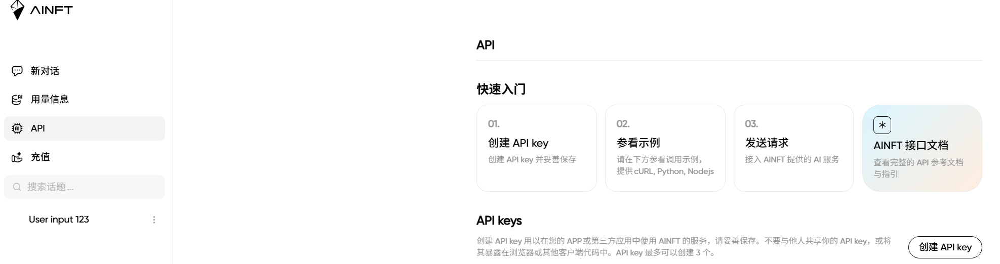
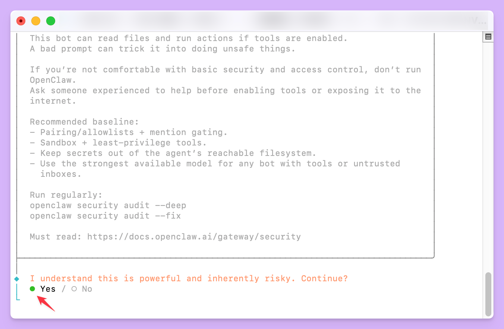
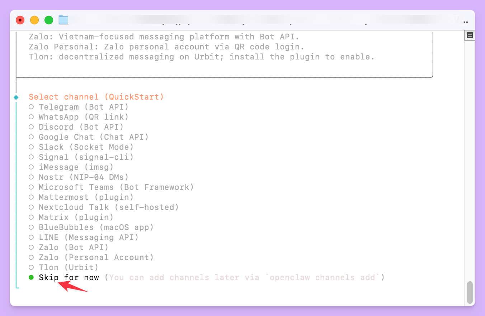
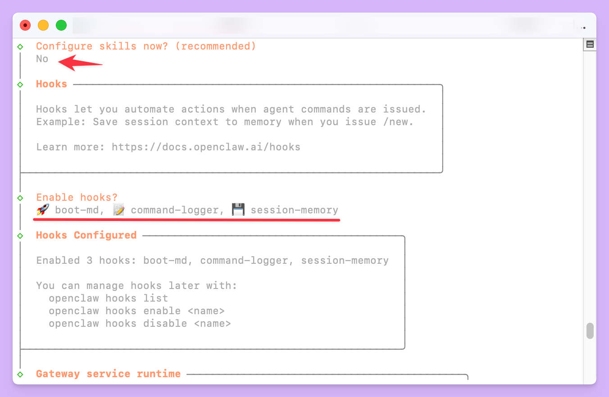
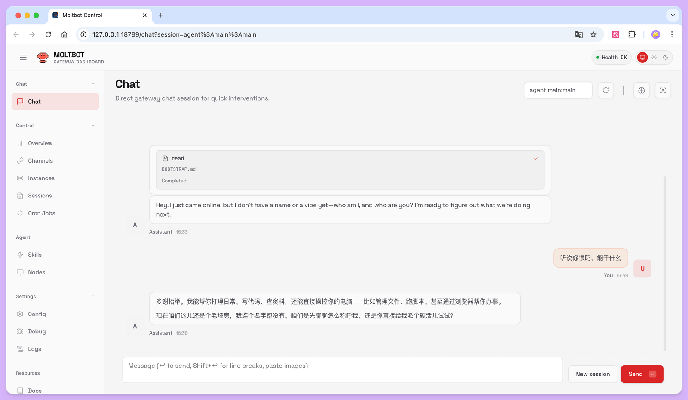
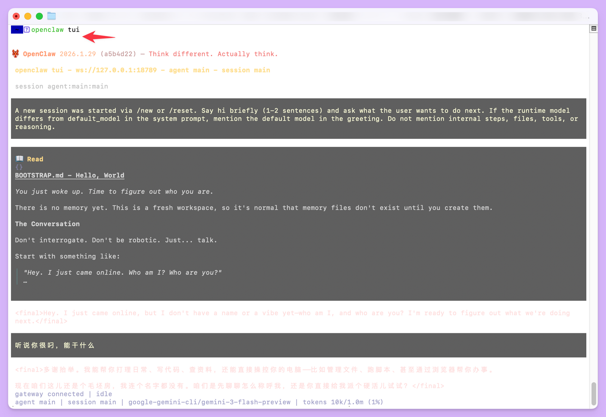

# OpenClaw 接入 AINFT 保姆级使用教程

---

OpenClaw（曾用名 **ClawdBot** 或 **Moltbot**）是一个开源的个人 AI 助理项目。它并非运行在云端的 SaaS 服务，而是部署在你自己的计算机上，让你能够**完全掌控自己的数据与工作流**。通过 WhatsApp、Telegram、飞书、钉钉等日常聊天工具，你就可以与它交互，让它处理邮件、管理日历、编写代码，甚至控制你的智能家居。

这个项目的核心理念在于，它不仅仅是一个能对话的聊天机器人，更是一个能**实际执行任务的「行动者」**。它拥有持久的记忆，可以访问你的文件系统和网络，并通过不断学习和扩展「技能」（Skills）来变得更强大。

由于其开源和可本地部署的特性，OpenClaw 吸引了大量开发者和技术爱好者，社区中涌现出许多富有创造力的用法，从自动化公司运营到管理个人生活，展现了个人 AI 助理的巨大潜力。

> 本篇教程将从零开始，详细介绍如何下载、安装并开始使用 OpenClaw，接入 AINFT 平台 API，帮助你搭建属于自己的第一个 AI 助理。

---

## 目录

- [申请 API Key](#申请-api-key)
- [安装前的准备](#安装前的准备)
- [开始安装 OpenClaw](#开始安装-openclaw)
- [初始化与配置](#初始化与配置)
- [编辑配置文件](#编辑配置文件)
- [调试](#调试)
- [访问与使用 OpenClaw](#访问与使用-openclaw)

---

## 申请 API Key

1. 登录 [AINFT 聊天平台](https://chat.ainft.com/)
2. 在 [API Key 管理页面](https://chat.ainft.com/key) 申请你的 `api_key`



---

## 安装前的准备

在开始安装之前，需要确保你的系统满足以下基本要求。OpenClaw 主要为类 Unix 环境设计，但在 Windows 上可以通过 **WSL2**（Windows Subsystem for Linux 2）完美运行。

### 系统要求

| 项目          | 要求说明                                |
|-------------|-------------------------------------|
| **Node.js** | 版本 ≥ 22，作为 OpenClaw 的运行环境           |
| **操作系统**    | macOS、Linux，或 Windows（通过 WSL2）      |
| **包管理器**    | 从源码编译需安装 pnpm；推荐使用随 Node.js 安装的 npm |

确认环境最简单的方式是打开终端，输入以下命令检查 Node.js 版本：

```bash
node -v
```

---

## 开始安装 OpenClaw

OpenClaw 提供了多种安装方式，以适应不同用户的需求。对于初学者，**官方推荐使用一键安装脚本**，它能自动处理大部分环境配置。

### 快速安装（推荐）

这是最简单、最快捷的安装方式，会自动检测你的操作系统，安装必要依赖，并将 `openclaw` 命令部署到全局。

在 **macOS** 或 **Linux** 终端中执行：

```bash
curl -fsSL https://openclaw.bot/install.sh | bash
```

---

## 初始化与配置
- 安装完成后，下一步是进行初始化配置，让 OpenClaw 连接到AINFT的大语言模型 (LLM) 并设置好通信渠道。
- onboard 向导是完成初始配置最简单的方式。它会一步步引导你设置所有必需的选项。

执行安装命令后，等待几分钟后会出现 **Onboarding 向导**：



> 如果中途关闭向导还可以使用命令，重新启动向导
```
openclaw onboard --install-daemon
```

向导会询问你以下关键信息：

- **AI 模型配置**：需要提供大语言模型服务的 API Key（如 Anthropic Claude、OpenAI GPT 或其它兼容服务）。  
  → 这一步先选择 **Skip for now** 跳过，后面再手动配置。

  

- **通信渠道**：设置希望通过哪个聊天软件与 OpenClaw 交流（如 Telegram、WhatsApp）。目前多为国外软件，可先跳过，后续可参考集成飞书、钉钉等软件的教程。

- **Skills**：建议选择 **Yes**（先按空格键再按 Enter），或直接跳过。

  

完成后会启动 UI 界面，在浏览器中访问并进行对话即可。

---

## 编辑配置文件

完成 Onboarding 后，需要手动将 AINFT 配置写入 OpenClaw，并设为默认模型。

### 打开配置文件

配置文件路径：`~/.openclaw/openclaw.json`，OpenClaw 启动时会自动读取。

```bash
nano ~/.openclaw/openclaw.json
# 也可使用其他编辑器，如：vim ~/.openclaw/openclaw.json
```

### 添加 AINFT 提供商配置

将下面内容合并到配置文件的 **models** 相关区域，并把 `{AINFT_API_KEY}` 替换为你在 [API Key 管理页面](https://chat.ainft.com/key) 申请的 Key：

```json
{
  "models": {
    "mode": "merge",
    "providers": {
      "ainft": {
        "baseUrl": "https://chat.ainft.com/webapi/",
        "apiKey": "{AINFT_API_KEY}",
        "api": "openai-completions",
        "models": [
          { "id": "gpt-5-nano", "name": "gpt-5-nano" },
          { "id": "gpt-5-mini", "name": "gpt-5-mini" },
          { "id": "qwen/qwen3-30b-a3b", "name": "qwen/qwen3-30b-a3b" },
          { "id": "gemini-3-flash-preview", "name": "gemini-3-flash-preview" },
          { "id": "claude-haiku-4-5-20251001", "name": "claude-haiku-4-5-20251001" }
        ]
      }
    }
  }
}
```

### 设置默认模型

在 `openclaw.json` 的 **agents** 部分中，将默认模型设为 `ainft/gpt-5-nano`，例如：

```json
{
  "agents": {
    "defaults": {
      "model": {
        "primary": "ainft/gpt-5-nano"
      }
    }
  }
}
```

### 重启 OpenClaw

修改配置后需要重启网关使配置生效：

```bash
openclaw gateway restart
```

### 验证：尝试调用模型

在终端中发送一条测试消息：

```bash
openclaw agent --agent main --message "你好"
```

若返回正常回复，说明 AINFT 已成功接入。

---

## 调试

配置或运行遇到问题时，可先了解 Gateway 的作用，再用自带的诊断命令排查。

### Gateway 核心服务

在配置过程中，你会频繁遇到一个概念：**Gateway**。

- **Gateway** 是 OpenClaw 的核心进程，相当于「心脏」，常驻后台运行。
- 它负责：与大语言模型的连接、与 WhatsApp / Telegram 等聊天工具的会话维护、以及所有事件与指令的处理。
- 你通过聊天工具发的每条消息都会先到 Gateway，由 Gateway 调用 AI 模型并返回结果或执行操作。
- 将 Gateway 安装为系统服务后，就相当于拥有一个**永不离线的数字助理**。

### Gateway 常用命令

| 操作            | 命令                           |
|---------------|------------------------------|
| 安装 Gateway    | `openclaw gateway install`   |
| 启动 Gateway    | `openclaw gateway start`（若不可用可试 `openclaw gateway`） |
| 停止 Gateway    | `openclaw gateway stop`      |
| 重启 Gateway    | `openclaw gateway restart`   |
| 卸载 Gateway    | `openclaw gateway uninstall` |
| 查看 Gateway 状态 | `openclaw gateway status`    |

### 检查运行状态

完成 Onboarding 和配置文件修改后，建议用以下命令确认安装与配置是否正常：

| 命令                        | 说明                                        |
|---------------------------|-------------------------------------------|
| `openclaw doctor`         | 对系统环境和配置文件做全面健康检查，并给出修复建议；**遇到问题时应优先使用**。 |
| `openclaw gateway status` | 查看 Gateway 运行状态。                          |

示例：

```bash
openclaw doctor
```

根据输出中的提示逐项排查即可。`openclaw gateway status`（或 `openclaw status`）可查看 Gateway 是否在线、连接了哪些聊天会话等实时状态；若一切正常，会显示 Gateway 正在运行且相关服务状态良好。

---

## 访问与使用 OpenClaw

配置完成后，可通过 **Web 控制台**或**终端界面（TUI）**与 AI 助理交互。

### 使用 Web 控制台（Dashboard）

OpenClaw 自带的 Web 控制台称为 **Dashboard**（或 Control UI），是管理和使用 OpenClaw 最直观的方式。

先确保 Gateway 已启动，在终端执行：

```bash
openclaw dashboard
```

命令会生成带临时登录令牌的 URL，并尝试用默认浏览器打开。地址一般为 `http://127.0.0.1:18789`，端口可能因配置而异。



在 Dashboard 中你可以：

- 直接与 AI 助理聊天
- 管理和配置各种「技能」（Skills）
- 设置定时任务（Cron Jobs），让助理在指定时间自动执行操作
- 查看实时日志，便于排查问题
- 编辑 OpenClaw 的配置文件
- 安装和更新 OpenClaw 自身

### 使用终端界面（TUI）

习惯在终端操作的用户可使用 OpenClaw 的纯文本终端界面 **TUI**。

确保 Gateway 已运行后执行：

```bash
openclaw tui
```

会启动全屏终端应用，界面分为聊天记录区、状态栏和输入框。



在 TUI 中可像在聊天软件中一样发消息，并支持以下**斜杠命令**：

| 命令 | 说明 |
| ------ | ------ |
| `/status` | 查看当前状态 |
| `/session <key>` | 切换到指定聊天会话 |
| `/model <name>` | 为当前会话临时切换大语言模型 |
| `/help` | 查看所有可用命令 |

TUI 提供专注、无干扰的交互体验，适合开发者和命令行用户。
