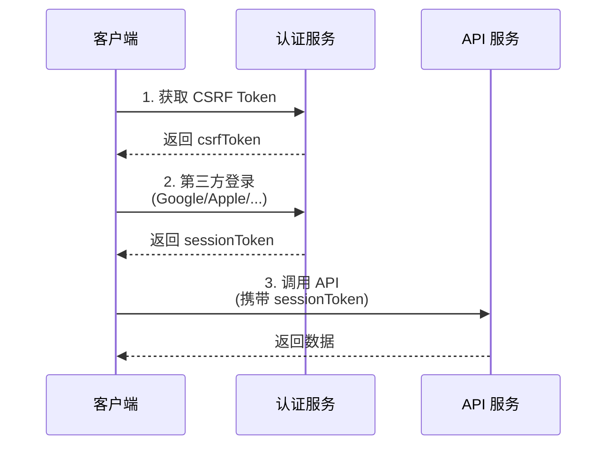

# API 文档目录

本文档包含 AINFT Chat 的所有 API 接口文档。

## RESTful API

### 认证相关

| 文档 | 说明 | 适用场景 |
|------|------|----------|
| [auth-google-v2.md](./RESTful/auth-google-v2.md) | Google V2 登录 | 移动端/桌面端直接通过 Google access token 登录 |
| [auth-apple-v2.md](./RESTful/auth-apple-v2.md) | Apple V2 登录 | 移动端/桌面端直接通过 Apple authorization code 登录 |
| [auth-trpc.md](./RESTful/auth-trpc.md) | tRPC 无 Cookie 认证 | 安卓等无法使用 Cookie 的客户端调用 tRPC 接口 |

## 文档说明

### 无 Cookie 认证模式

所有认证文档都支持 `noCookie` 模式，适用于：
- 移动端应用（iOS/Android）
- 桌面端应用
- 无法使用浏览器 Cookie 的嵌入式环境

### 通用流程



### 快速开始

1. **获取 CSRF Token**
   ```bash
   curl 'https://chat-dev.ainft.com/api/auth/csrf?noCookie=1'
   ```

2. **登录**（以 Google V2 为例）
   ```bash
   curl -X POST 'https://chat-dev.ainft.com/api/auth/callback/google-v2?noCookie=1' \
     -H 'Content-Type: application/x-www-form-urlencoded' \
     -d 'csrfToken=YOUR_CSRF_TOKEN' \
     -d 'accessToken=YOUR_GOOGLE_ACCESS_TOKEN'
   ```

3. **调用 API**
   ```bash
   curl 'https://chat-dev.ainft.com/trpc/lambda/user.getUserState?batch=1&input=...' \
     -H 'X-No-Cookie: 1' \
     -H 'X-Auth-Session-Token: YOUR_SESSION_TOKEN'
   ```

## 环境信息

- **开发环境**: `https://chat-dev.ainft.com`
- **生产环境**: `https://chat.ainft.com`

## 相关项目

- [AINFT Chat 主项目](https://github.com/your-org/ainft-chat)
- [NextAuth 文档](https://authjs.dev/)
- [tRPC 文档](https://trpc.io/)
