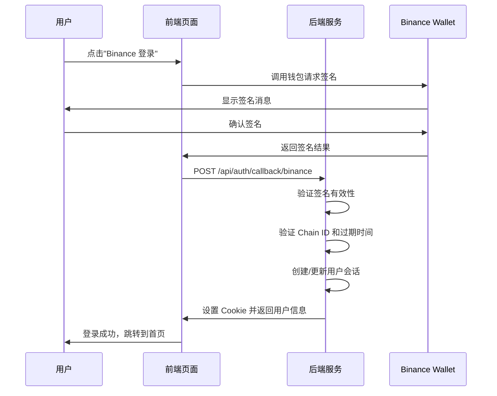

# Binance 登录接口

Binance 钱包登录接口，使用签名消息进行身份验证。

## POST /api/auth/callback/binance

**接口说明**: Binance 钱包 OAuth 回调接口，用于处理 Binance 钱包签名登录。

**请求方法**: `POST`

**Content-Type**: `application/x-www-form-urlencoded`

---

### 请求头

| 头部 | 必填 | 说明 |
|------|------|------|
| `Cookie` | 是 | 包含 `__Host-authjs.csrf-token`、`__Secure-authjs.callback-url` 等认证 Cookie |
| `Origin` | 是 | 请求来源，如 `https://chat-dev.ainft.com` |
| `Referer` | 是 | 来源页面 URL |
| `x-auth-return-redirect` | 否 | 是否返回重定向信息，如 `1` |

---

### 请求参数

| 参数 | 类型 | 必填 | 说明 |
|------|------|------|------|
| `chain` | string | 是 | 区块链类型，如 `bnb`（Binance Smart Chain） |
| `message` | string | 是 | 签名消息，包含欢迎语、地址、Chain ID、过期时间、Nonce |
| `signature` | string | 是 | 钱包签名（十六进制字符串，以 `0x` 开头） |
| `version` | string | 是 | 签名版本，如 `2` |
| `csrfToken` | string | 是 | CSRF 令牌，从 Cookie 中获取 |
| `callbackUrl` | string | 是 | 登录成功后的回调 URL（URL 编码） |

---

### 签名消息格式

```
Welcome to AINFT !
https://chat-dev.ainft.com wants you to sign in with your TRON account:
{wallet_address}

Chain ID: {chain_id}
Expiration Time: {iso_timestamp}
Nonce: {random_nonce}
```

**示例**:
```
Welcome to AINFT !
https://chat-dev.ainft.com wants you to sign in with your TRON account:
0x40469ab4316c3a8a864bdab1273735bdbc78dbd1

Chain ID: 0x38
Expiration Time: 2026-02-25T06:48:51.447Z
Nonce: 3YHUXD1771915726448
```

---

### 请求示例

```bash
curl 'https://chat-dev.ainft.com/api/auth/callback/binance' \
  -H 'accept: */*' \
  -H 'content-type: application/x-www-form-urlencoded' \
  -H 'origin: https://chat-dev.ainft.com' \
  -H 'referer: https://chat-dev.ainft.com/chat' \
  -H 'x-auth-return-redirect: 1' \
  -b '__Host-authjs.csrf-token=YOUR_CSRF_TOKEN; __Secure-authjs.callback-url=YOUR_CALLBACK_URL' \
  --data-urlencode 'chain=bnb' \
  --data-urlencode 'message=Welcome to AINFT !
https://chat-dev.ainft.com wants you to sign in with your TRON account:
0x40469ab4316c3a8a864bdab1273735bdbc78dbd1

Chain ID: 0x38
Expiration Time: 2026-02-25T06:48:51.447Z
Nonce: 3YHUXD1771915726448' \
  --data-urlencode 'signature=0x1b978190e7fa657071c20b6bf7121e1e1317999667373d59857cc393049907712fa10b0ebb77b2d9f337b5048b926d42732b069787c52f65b9f117d44a8906351b' \
  --data-urlencode 'version=2' \
  --data-urlencode 'csrfToken=YOUR_CSRF_TOKEN' \
  --data-urlencode 'callbackUrl=https://chat-dev.ainft.com/chat'
```

---

### 响应说明

登录成功后，服务器会：

1. **设置 Session Cookie**: 创建 `__Secure-authjs.session-token`
2. **重定向**: 根据 `callbackUrl` 重定向到指定页面
3. **返回用户信息**: 包含用户 ID、钱包地址等

---

### 登录流程



---

### 注意事项

1. **Chain ID**: 
   - BSC 主网: `0x38` (56)
   - BSC 测试网: `0x61` (97)

2. **签名验证**: 
   - 服务器会验证签名的有效性
   - 检查消息中的过期时间是否已过期
   - 验证 Chain ID 是否匹配

3. **Nonce**: 
   - 随机生成的字符串，用于防止重放攻击
   - 每次登录请求应使用新的 Nonce

4. **安全性**:
   - 签名消息包含过期时间，过期后无法使用
   - 必须使用 HTTPS 传输
   - CSRF 令牌必须有效

---

### 错误响应

| 状态码 | 说明 |
|--------|------|
| `400` | 参数错误、签名无效、消息过期 |
| `403` | CSRF 验证失败 |
| `500` | 服务器内部错误 |

---

### 相关接口

- [TronLink 登录](auth-tronlink.md) - TronLink 钱包登录接口
- [获取当前会话](auth-session.md) - 获取当前登录用户会话信息
- [登出接口](auth-signout.md) - 用户登出
