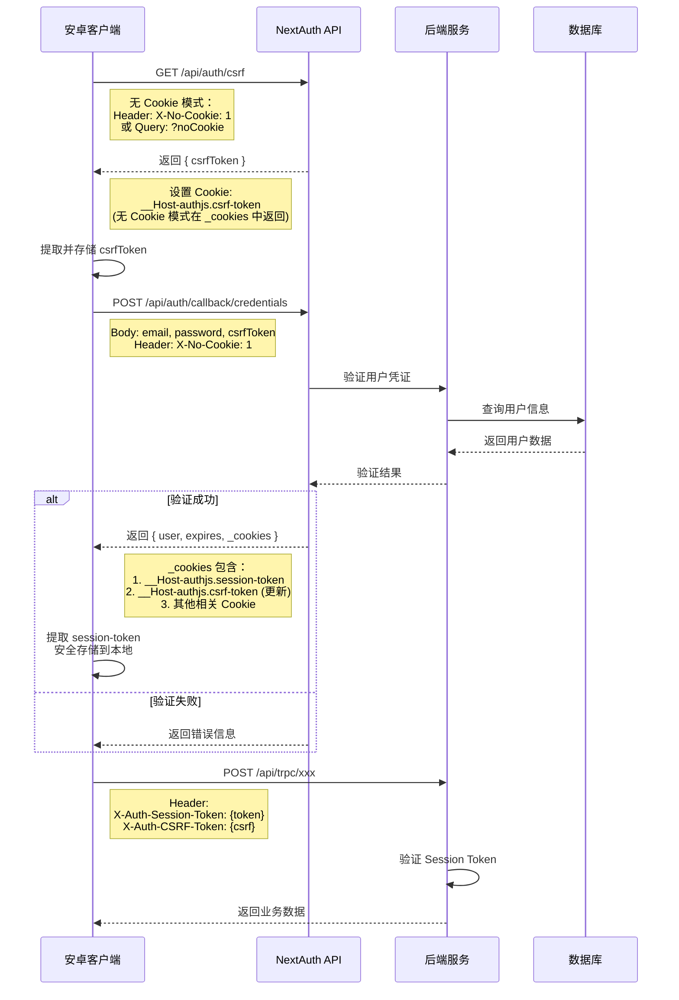
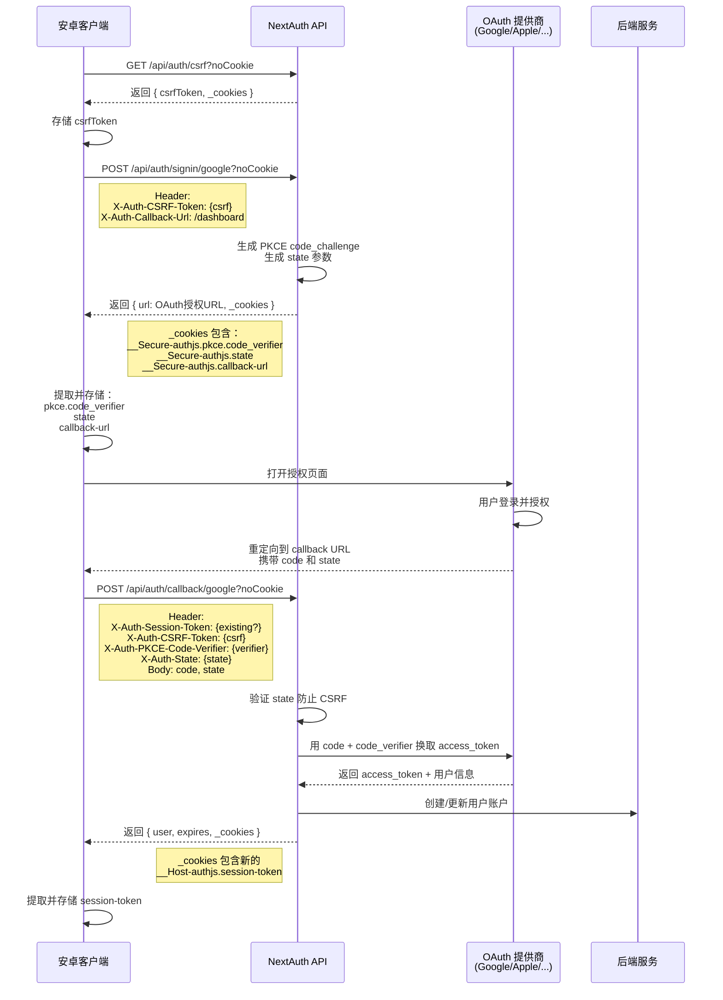
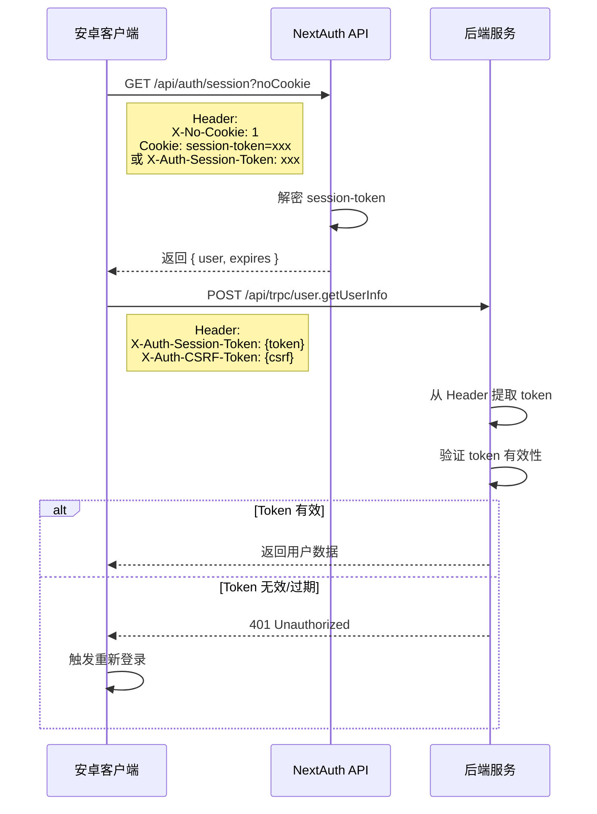
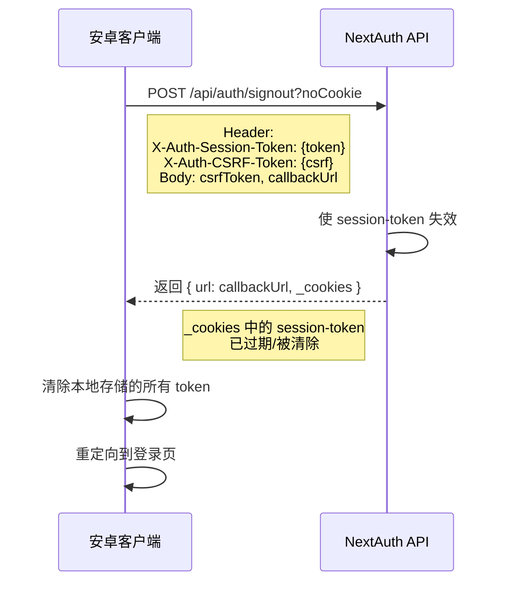
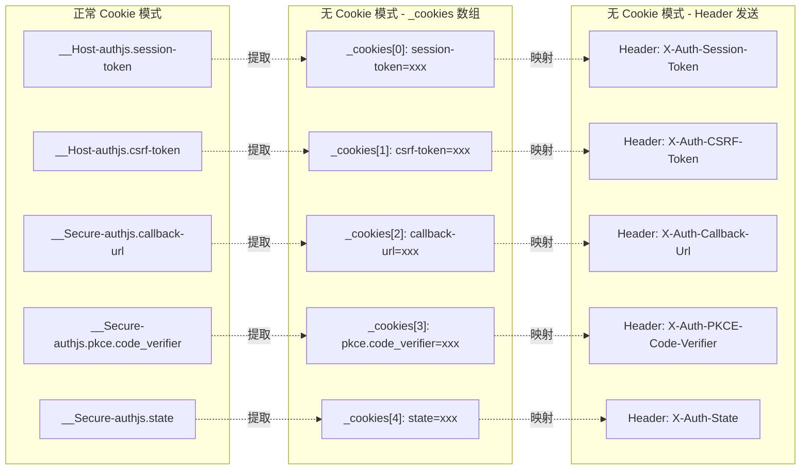

# 无 Cookie 认证方案（安卓客户端适配）

## 概述

LobeChat 默认使用基于 Cookie 的 Session 认证机制。然而，某些客户端（如安卓 WebView 或特定原生应用环境）可能存在 Cookie 限制或禁用 Cookie 的情况。本文档说明如何在无 Cookie 环境下进行认证。

## 适用场景

- 安卓 WebView 中 Cookie 被禁用或受限
- 原生应用内嵌浏览器环境
- 需要手动管理 Session 的客户端
- 跨域请求场景

## 服务端支持

### 1. NextAuth 无 Cookie 模式

在 `/api/auth/[...nextauth]/route.ts` 中，服务端已实现对无 Cookie 请求的支持：

**触发条件（满足任一即可）：**
- Query 参数包含 `noCookie`，如：`/api/auth/session?noCookie`
- 请求头包含 `X-No-Cookie: 1`

**响应格式变化：**

正常响应（有 Cookie）：
```http
HTTP/1.1 200 OK
Set-Cookie: next-auth.session-token=xxx; Path=/; HttpOnly
Content-Type: application/json

{
  "user": {
    "id": "user_xxx",
    "name": "John Doe",
    "email": "john@example.com"
  },
  "expires": "2024-03-26T12:00:00.000Z"
}
```

无 Cookie 模式响应：
```http
HTTP/1.1 200 OK
Content-Type: application/json

{
  "user": {
    "id": "user_xxx",
    "name": "John Doe",
    "email": "john@example.com"
  },
  "expires": "2024-03-26T12:00:00.000Z",
  "_cookies": [
    "next-auth.session-token=xxx; Path=/; HttpOnly"
  ]
}
```

> **注意**：`_cookies` 数组包含了原本应该通过 `Set-Cookie` 头部发送的 Cookie 信息。

### 2. NextAuth.js Cookie 说明

Auth.js (NextAuth.js v5) 使用以下 Cookie 进行会话管理：

| Cookie 名称 | 前缀 | 作用 | 生命周期 | 必需 |
|------------|------|------|----------|------|
| `authjs.session-token` | `__Host-` (HTTPS) 或 `__Secure-` | **会话令牌**，包含加密的用户会话信息（user id、email、name 等） | 默认 30 天 | ✅ 是 |
| `authjs.csrf-token` | `__Host-` (HTTPS) 或 `__Secure-` | **CSRF 防护令牌**，用于防止跨站请求伪造攻击 | 会话期间 | ✅ 是（写操作） |
| `authjs.callback-url` | `__Secure-` | **回调地址**，记录登录前的目标页面，登录成功后重定向 | 会话期间 | ❌ 否 |
| `authjs.pkce.code_verifier` | `__Secure-` | **PKCE 验证码**，OAuth 2.0 安全流程使用 | 短暂（分钟级） | ❌ 否（OAuth 登录时需要） |
| `authjs.state` | `__Secure-` | **OAuth 状态参数**，防止 OAuth 登录时的 CSRF 攻击 | 短暂 | ❌ 否（OAuth 登录时需要） |

#### 前后端交互流程

##### 1. 凭证登录流程（Credentials Sign In）



##### 2. OAuth 登录流程（以 Google 为例）



##### 3. Session 验证流程



##### 4. 登出流程



##### 5. Cookie 在无 Cookie 模式下的映射关系



#### Cookie 前缀说明

- **`__Host-`**：更强的安全前缀，要求 Cookie 必须满足：
  - 必须通过 HTTPS 发送（Secure 属性）
  - 不能包含 Domain 属性
  - Path 必须是 `/`
  
- **`__Secure-`**：要求 Cookie 必须通过 HTTPS 发送（Secure 属性）

#### 无 Cookie 模式下的处理

在无 Cookie 模式下，客户端需要特别关注以下 Cookie：

1. **`__Host-authjs.session-token` / `__Secure-authjs.session-token`**
   - 这是最重要的 Cookie，包含用户会话信息
   - 在无 Cookie 模式下，需要从 `_cookies` 中提取并安全存储
   - 后续 API 请求需要通过 `Cookie` 头部手动发送

2. **`__Host-authjs.csrf-token`**
   - 用于 POST/PUT/DELETE 等写操作的 CSRF 防护
   - 登录时需要从 `/api/auth/csrf` 获取
   - 格式为 `token|hash`，需要完整传递

3. **`__Secure-authjs.callback-url`**
   - 仅在 OAuth 登录流程中使用
   - 无 Cookie 模式下通常不需要处理

#### 示例：提取关键 Cookie

```javascript
const cookies = data._cookies;

// 提取 session token
const sessionCookie = cookies.find(c => 
  c.includes('authjs.session-token') || c.includes('next-auth.session-token')
);
const sessionToken = sessionCookie?.match(/authjs\.session-token=([^;]+)/)?.[1];

// 提取 CSRF token
const csrfCookie = cookies.find(c => 
  c.includes('authjs.csrf-token') || c.includes('next-auth.csrf-token')
);
const csrfToken = csrfCookie?.match(/authjs\.csrf-token=([^;]+)/)?.[1];

// 安全存储
secureStorage.set('session_token', sessionToken);
secureStorage.set('csrf_token', csrfToken);
```

### 3. 认证中间件限制

根据 `src/libs/trpc/middleware/userAuth.ts` 第 19–25 行：

```typescript
if (!ctx.userId) {
  if (enableClerk) {
    console.log('clerk auth:', ctx.clerkAuth);
  } else {
    console.log('next auth:', ctx.nextAuth);
  }
  throw new TRPCError({ code: 'UNAUTHORIZED' });
}
```

**关键限制：**
- 所有 tRPC API 调用都需要有效的 `userId`
- 如果 `ctx.userId` 为空，将返回 `UNAUTHORIZED` 错误
- 系统支持 Clerk 和 NextAuth 两种认证方式

## 客户端实现方案

### 方案选择指南

| 方案 | 适用场景 | 复杂度 | 推荐度 |
|------|----------|--------|--------|
| **方案一：手动 Cookie 头部** | 服务端支持 Cookie 头部解析 | 中 | ⭐⭐⭐ |
| **方案二：独立 Header 字段** | 安卓无法使用 Cookie，服务端支持 Header 认证 | 中 | ⭐⭐⭐⭐⭐ |
| **方案三：LobeChat 自定义 Header** | 使用 LobeChat 特定认证方式 | 低 | ⭐⭐⭐ |
| **方案四：WebView Cookie 管理** | 可以使用 WebView 且能启用 Cookie | 低 | ⭐⭐⭐⭐ |

### 方案一：手动管理 Session Token（Cookie 头部方式）

#### 步骤 1：获取 Session（登录后）

```javascript
// 登录请求时添加 noCookie 参数
const response = await fetch('/api/auth/callback/credentials?noCookie', {
  method: 'POST',
  headers: {
    'Content-Type': 'application/x-www-form-urlencoded',
  },
  body: new URLSearchParams({
    email: 'user@example.com',
    password: 'password',
    csrfToken: csrfToken, // 需要先获取 CSRF token
  }),
});

const data = await response.json();

// 提取 session token
const cookies = data._cookies;
const sessionToken = extractSessionToken(cookies); // 从 _cookies 解析 token

// 本地存储（使用 Android 的 SharedPreferences 或 KeyStore）
localStorage.setItem('session_token', sessionToken);
```

#### 步骤 2：后续 API 请求

```javascript
// 方式 1：使用 Authorization Bearer Token（如果服务端支持）
const response = await fetch('/api/trpc/xxx', {
  method: 'POST',
  headers: {
    'Content-Type': 'application/json',
    'Authorization': `Bearer ${localStorage.getItem('session_token')}`,
  },
  body: JSON.stringify(requestBody),
});

// 方式 2：手动设置 Cookie 头部
const response = await fetch('/api/trpc/xxx', {
  method: 'POST',
  headers: {
    'Content-Type': 'application/json',
    'Cookie': `next-auth.session-token=${localStorage.getItem('session_token')}`,
  },
  body: JSON.stringify(requestBody),
});
```

#### 步骤 3：获取当前 Session

```javascript
// 获取 session 时添加 noCookie 参数
const response = await fetch('/api/auth/session?noCookie', {
  headers: {
    'X-No-Cookie': '1',
  },
});

const session = await response.json();

if (session.user) {
  // 用户已登录
  console.log('User:', session.user);
  
  // 如果有新的 cookies，更新存储
  if (session._cookies) {
    const newToken = extractSessionToken(session._cookies);
    localStorage.setItem('session_token', newToken);
  }
} else {
  // 未登录，需要重新登录
}
```

### 方案二：使用独立 Header 字段发送认证信息（安卓推荐）

当安卓客户端无法正常使用 Cookie 时，可以通过独立的 Header 字段发送认证信息。服务端支持通过特定 Header 获取原本存储在 Cookie 中的认证数据。

#### Header 字段映射表

| 原始 Cookie | 对应 Header 字段 | 说明 | 使用场景 |
|------------|-----------------|------|----------|
| `__Host-authjs.session-token` / `__Secure-authjs.session-token` | `X-Auth-Session-Token` | 会话令牌 | 所有需要认证的请求 |
| `__Host-authjs.csrf-token` / `__Secure-authjs.csrf-token` | `X-Auth-CSRF-Token` | CSRF 防护令牌 | POST/PUT/DELETE 等写操作 |
| `__Secure-authjs.callback-url` | `X-Auth-Callback-Url` | 登录回调地址 | OAuth 登录流程 |
| `__Secure-authjs.pkce.code_verifier` | `X-Auth-PKCE-Code-Verifier` | PKCE 验证码 | OAuth PKCE 流程 |
| `__Secure-authjs.state` | `X-Auth-State` | OAuth 状态参数 | OAuth 登录流程 |

#### 使用示例

**1. 普通 API 请求（只需要 Session Token）**

```javascript
const response = await fetch('/api/trpc/session.getSessions', {
  method: 'POST',
  headers: {
    'Content-Type': 'application/json',
    'X-Auth-Session-Token': sessionToken,  // 从存储中读取的 session token
  },
  body: JSON.stringify({
    json: { current: 1, pageSize: 20 }
  }),
});
```

**2. 写操作请求（需要 Session Token + CSRF Token）**

```javascript
const response = await fetch('/api/trpc/session.createSession', {
  method: 'POST',
  headers: {
    'Content-Type': 'application/json',
    'X-Auth-Session-Token': sessionToken,  // 会话令牌
    'X-Auth-CSRF-Token': csrfToken,        // CSRF 防护令牌
  },
  body: JSON.stringify({
    json: {
      session: { title: 'New Chat' },
      config: {},
      type: 'agent'
    }
  }),
});
```

**3. OAuth 登录流程（需要额外参数）**

```javascript
// 步骤 1：获取 OAuth 授权 URL
const response = await fetch('/api/auth/signin/google?noCookie', {
  method: 'POST',
  headers: {
    'Content-Type': 'application/x-www-form-urlencoded',
    'X-Auth-CSRF-Token': csrfToken,
    'X-Auth-Callback-Url': 'https://your-app.com/callback',  // 自定义回调地址
  },
  body: new URLSearchParams({
    csrfToken: csrfToken,
    callbackUrl: '/',
    json: 'true',
  }),
});

// 步骤 2：处理 OAuth 回调（携带 PKCE 和 state）
const callbackResponse = await fetch('/api/auth/callback/google?noCookie', {
  method: 'POST',
  headers: {
    'Content-Type': 'application/x-www-form-urlencoded',
    'X-Auth-Session-Token': sessionToken,
    'X-Auth-CSRF-Token': csrfToken,
    'X-Auth-PKCE-Code-Verifier': pkceCodeVerifier,  // PKCE 验证码
    'X-Auth-State': oauthState,                      // OAuth 状态
  },
  body: new URLSearchParams({
    code: authorizationCode,  // 从 OAuth 提供商获取的授权码
    state: oauthState,
  }),
});
```

#### 完整封装示例

```typescript
class AuthHeaderManager {
  private sessionToken: string | null = null;
  private csrfToken: string | null = null;
  private callbackUrl: string | null = null;
  private pkceCodeVerifier: string | null = null;
  private oauthState: string | null = null;

  // 从登录响应中提取并存储所有 token
  extractFromResponse(data: { _cookies?: string[] }): void {
    if (!data._cookies) return;

    for (const cookie of data._cookies) {
      // Session Token
      const sessionMatch = cookie.match(/(?:__Host-|__Secure-)?authjs\.session-token=([^;]+)/);
      if (sessionMatch) this.sessionToken = decodeURIComponent(sessionMatch[1]);

      // CSRF Token
      const csrfMatch = cookie.match(/(?:__Host-|__Secure-)?authjs\.csrf-token=([^;]+)/);
      if (csrfMatch) this.csrfToken = decodeURIComponent(csrfMatch[1]);

      // Callback URL
      const callbackMatch = cookie.match(/__Secure-authjs\.callback-url=([^;]+)/);
      if (callbackMatch) this.callbackUrl = decodeURIComponent(callbackMatch[1]);

      // PKCE Code Verifier
      const pkceMatch = cookie.match(/__Secure-authjs\.pkce\.code_verifier=([^;]+)/);
      if (pkceMatch) this.pkceCodeVerifier = decodeURIComponent(pkceMatch[1]);

      // OAuth State
      const stateMatch = cookie.match(/__Secure-authjs\.state=([^;]+)/);
      if (stateMatch) this.oauthState = decodeURIComponent(stateMatch[1]);
    }

    // 持久化存储
    this.saveToStorage();
  }

  // 构建请求头部
  buildHeaders(options: {
    requireSession?: boolean;
    requireCsrf?: boolean;
    requireCallback?: boolean;
    requirePkce?: boolean;
    requireState?: boolean;
  } = {}): Record<string, string> {
    const headers: Record<string, string> = {
      'Content-Type': 'application/json',
    };

    if (options.requireSession && this.sessionToken) {
      headers['X-Auth-Session-Token'] = this.sessionToken;
    }

    if (options.requireCsrf && this.csrfToken) {
      headers['X-Auth-CSRF-Token'] = this.csrfToken;
    }

    if (options.requireCallback && this.callbackUrl) {
      headers['X-Auth-Callback-Url'] = this.callbackUrl;
    }

    if (options.requirePkce && this.pkceCodeVerifier) {
      headers['X-Auth-PKCE-Code-Verifier'] = this.pkceCodeVerifier;
    }

    if (options.requireState && this.oauthState) {
      headers['X-Auth-State'] = this.oauthState;
    }

    return headers;
  }

  // 普通查询请求
  async get(url: string): Promise<Response> {
    return fetch(url, {
      method: 'GET',
      headers: this.buildHeaders({ requireSession: true }),
    });
  }

  // 写操作请求
  async post(url: string, body: any): Promise<Response> {
    return fetch(url, {
      method: 'POST',
      headers: this.buildHeaders({ requireSession: true, requireCsrf: true }),
      body: JSON.stringify(body),
    });
  }

  // 从存储加载
  loadFromStorage(): void {
    this.sessionToken = localStorage.getItem('auth_session_token');
    this.csrfToken = localStorage.getItem('auth_csrf_token');
    this.callbackUrl = localStorage.getItem('auth_callback_url');
    this.pkceCodeVerifier = localStorage.getItem('auth_pkce_verifier');
    this.oauthState = localStorage.getItem('auth_oauth_state');
  }

  // 保存到存储
  saveToStorage(): void {
    if (this.sessionToken) localStorage.setItem('auth_session_token', this.sessionToken);
    if (this.csrfToken) localStorage.setItem('auth_csrf_token', this.csrfToken);
    if (this.callbackUrl) localStorage.setItem('auth_callback_url', this.callbackUrl);
    if (this.pkceCodeVerifier) localStorage.setItem('auth_pkce_verifier', this.pkceCodeVerifier);
    if (this.oauthState) localStorage.setItem('auth_oauth_state', this.oauthState);
  }

  // 清除所有 token
  clear(): void {
    this.sessionToken = null;
    this.csrfToken = null;
    this.callbackUrl = null;
    this.pkceCodeVerifier = null;
    this.oauthState = null;
    localStorage.removeItem('auth_session_token');
    localStorage.removeItem('auth_csrf_token');
    localStorage.removeItem('auth_callback_url');
    localStorage.removeItem('auth_pkce_verifier');
    localStorage.removeItem('auth_oauth_state');
  }
}
```

#### 注意事项

1. **Header 大小写**：Header 字段名不区分大小写，但建议使用文档中的驼峰命名（`X-Auth-Session-Token`）
2. **Token 编码**：从 Cookie 字符串提取的 Token 值可能需要 URL 解码（`decodeURIComponent`）
3. **安全性**：避免在日志中打印这些 Header 值，防止敏感信息泄露
4. **HTTPS**：生产环境必须使用 HTTPS，防止 Token 被中间人窃取

### 方案三：使用 LobeChat 自定义 Header 认证

如果服务端配置了 `LOBE_CHAT_AUTH_HEADER` 支持，可以使用：

```javascript
// 使用自定义认证头部
const response = await fetch('/api/trpc/xxx', {
  method: 'POST',
  headers: {
    'Content-Type': 'application/json',
    'X-Lobe-Auth': `Bearer ${localStorage.getItem('session_token')}`,
  },
  body: JSON.stringify(requestBody),
});
```

### 方案四：Android WebView Cookie 管理

如果可能，建议启用 WebView 的 Cookie 支持：

```kotlin
// Kotlin - Android WebView 启用 Cookie
val cookieManager = CookieManager.getInstance()
cookieManager.setAcceptCookie(true)
cookieManager.setAcceptThirdPartyCookies(webView, true)

// 手动设置 Cookie
cookieManager.setCookie("https://your-domain.com", "next-auth.session-token=xxx; Path=/")
```

## 完整示例

### React Native / Android 混合应用

```typescript
class LobeChatAuth {
  private sessionToken: string | null = null;
  private baseUrl: string;

  constructor(baseUrl: string) {
    this.baseUrl = baseUrl;
  }

  // 登录
  async login(email: string, password: string): Promise<boolean> {
    // 1. 获取 CSRF Token
    const csrfRes = await fetch(`${this.baseUrl}/api/auth/csrf?noCookie`);
    const { csrfToken } = await csrfRes.json();

    // 2. 执行登录
    const loginRes = await fetch(`${this.baseUrl}/api/auth/callback/credentials?noCookie`, {
      method: 'POST',
      headers: {
        'Content-Type': 'application/x-www-form-urlencoded',
      },
      body: new URLSearchParams({
        email,
        password,
        csrfToken,
      }),
    });

    const data = await loginRes.json();
    
    if (data._cookies) {
      this.sessionToken = this.extractToken(data._cookies);
      // 持久化存储
      await this.saveToken(this.sessionToken);
      return true;
    }
    return false;
  }

  // 调用 API
  async apiCall(procedure: string, payload: any): Promise<any> {
    const token = await this.getToken();
    
    const response = await fetch(`${this.baseUrl}/api/trpc/${procedure}`, {
      method: 'POST',
      headers: {
        'Content-Type': 'application/json',
        'Cookie': `next-auth.session-token=${token}`,
      },
      body: JSON.stringify(payload),
    });

    if (response.status === 401) {
      // Token 过期，尝试刷新或重新登录
      throw new Error('UNAUTHORIZED');
    }

    return response.json();
  }

  // 获取当前 Session
  async getSession(): Promise<any> {
    const response = await fetch(`${this.baseUrl}/api/auth/session?noCookie`, {
      headers: {
        'X-No-Cookie': '1',
        'Cookie': `next-auth.session-token=${await this.getToken()}`,
      },
    });

    const data = await response.json();
    
    // 更新 token（如果有）
    if (data._cookies) {
      this.sessionToken = this.extractToken(data._cookies);
      await this.saveToken(this.sessionToken);
    }

    return data;
  }

  private extractToken(cookies: string[]): string {
    for (const cookie of cookies) {
      // 支持多种 session token cookie 名称
      const patterns = [
        /__Host-authjs\.session-token=([^;]+)/,
        /__Secure-authjs\.session-token=([^;]+)/,
        /authjs\.session-token=([^;]+)/,
        /next-auth\.session-token=([^;]+)/,
      ];
      for (const pattern of patterns) {
        const match = cookie.match(pattern);
        if (match) return match[1];
      }
    }
    return '';
  }

  private async saveToken(token: string): Promise<void> {
    // 使用 Android KeyStore 或 SharedPreferences
    // await AsyncStorage.setItem('session_token', token);
  }

  private async getToken(): Promise<string> {
    if (!this.sessionToken) {
      // this.sessionToken = await AsyncStorage.getItem('session_token');
    }
    return this.sessionToken || '';
  }
}
```

## 安全注意事项

1. **Token 存储**：在 Android 中，建议使用 `EncryptedSharedPreferences` 或 `KeyStore` 安全存储 Session Token
2. **HTTPS**：生产环境必须使用 HTTPS
3. **Token 过期**：Session Token 默认 30 天过期，需要处理刷新逻辑
4. **CSRF 保护**：即使无 Cookie 模式，仍需传递 `csrfToken` 进行写操作
5. **Cookie 前缀**：生产环境（HTTPS）下 Cookie 名称可能带有 `__Host-` 或 `__Secure-` 前缀，解析时需要注意

## 故障排查

### 401 Unauthorized

- 检查 `userId` 是否正确传递到 tRPC 上下文
- 确认 Session Token 未过期
- 验证请求头部格式是否正确

### Session 获取失败

- 确认使用了 `?noCookie` 参数或 `X-No-Cookie: 1` 头部
- 检查响应中是否包含 `_cookies` 字段

### Cookie 解析错误

- 确保正确解析 `_cookies` 数组中的字符串格式
- 注意 URL 编码的 Cookie 值需要解码

## 相关配置

### 环境变量

```bash
# NextAuth 配置
NEXT_AUTH_SECRET=your-secret-key
NEXTAUTH_URL=https://your-domain.com

# 可选：启用调试
NEXT_AUTH_DEBUG=true
```

### 服务端配置

详见 `src/libs/next-auth/auth.config.ts` 和 `src/libs/next-auth/edge.ts`

## 参考

- [NextAuth.js 文档](https://next-auth.js.org/)
- [tRPC 上下文](/src/libs/trpc/lambda/context.ts)
- [用户认证中间件](/src/libs/trpc/middleware/userAuth.ts)
