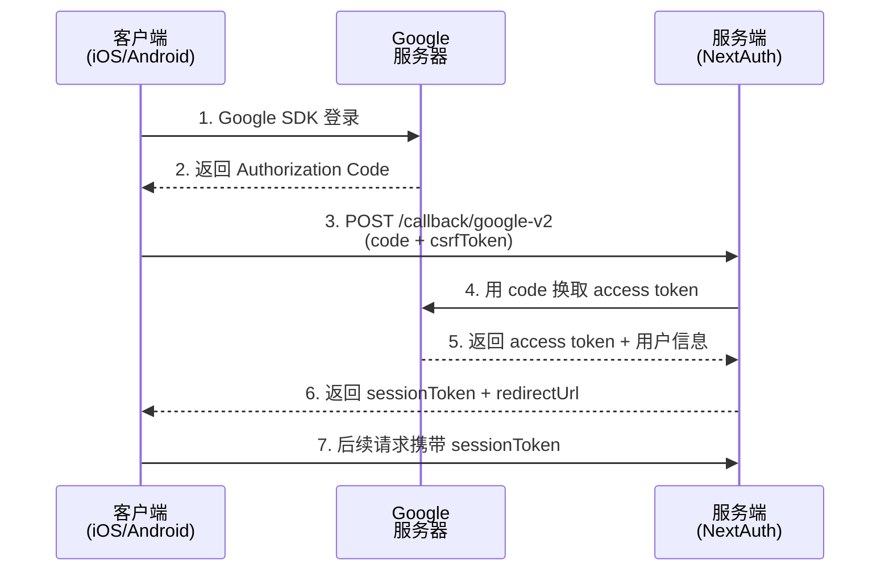

# Google V2 登录 API 文档

适用于移动端/桌面端等无法使用浏览器 OAuth 流程的场景。客户端先通过 Google SDK 获取 **Authorization Code**，然后传递给服务端，服务端使用 code 换取 access token，再获取用户信息完成登录。

## 流程概述



## 环境变量配置

服务端需要配置以下环境变量：

| 环境变量 | 说明 | 示例 |
|---------|------|------|
| `AUTH_GOOGLE_CLIENT_ID` | Google OAuth Client ID | `xxx.apps.googleusercontent.com` |
| `AUTH_GOOGLE_CLIENT_SECRET` | Google OAuth Client Secret | `GOCSPX-xxx` |

---

## 1. 获取 CSRF Token

在调用登录接口前，需要先获取 CSRF token 用于防止 CSRF 攻击。

### 请求

```bash
curl --location 'https://chat-dev.ainft.com/api/auth/csrf?noCookie=1'
```

### 响应

```json
{
  "csrfToken": "f6b8b4f40f689a82fcf6dd3a21832ced0777efd55a62baba5462f9eadbe4b414",
  "_cookies": [
    "__Secure-authjs.csrf-token=f6b8b4f40f689a82fcf6dd3a21832ced0777efd55a62baba5462f9eadbe4b414%7C9c8b39a33536a8029ae763844622989d14d921fd2abc5693e7034dfe4505d149; Path=/; HttpOnly; Secure; SameSite=Lax",
    "__Secure-authjs.callback-url=https%3A%2F%2Fchat-dev.ainft.com; Path=/; HttpOnly; Secure; SameSite=Lax"
  ]
}
```

### 字段说明

| 字段 | 类型 | 说明 |
|------|------|------|
| `csrfToken` | string | CSRF token，用于后续登录请求 |
| `_cookies` | array | 服务端设置的 cookie 列表（noCookie 模式下需要客户端自行管理） |

---

## 2. Google V2 登录

使用 Google **Authorization Code** 完成登录。

### 请求

```bash
curl --location 'https://chat-dev.ainft.com/api/auth/callback/google-v2?noCookie=1' \
--header 'X-Auth-CSRF-Token: f6b8b4f40f689a82fcf6dd3a21832ced0777efd55a62baba5462f9eadbe4b414%7C9c8b39a33536a8029ae763844622989d14d921fd2abc5693e7034dfe4505d149' \
--header 'Content-Type: application/x-www-form-urlencoded' \
--data-urlencode 'csrfToken=f6b8b4f40f689a82fcf6dd3a21832ced0777efd55a62baba5462f9eadbe4b414' \
--data-urlencode 'code=4/0A...' \
```

### 请求参数

#### URL 参数

| 参数 | 类型 | 必填 | 说明 |
|------|------|------|------|
| `noCookie` | string | 是 | 固定值 `1`，表示使用无 cookie 模式 |

#### Header

| 字段 | 类型 | 必填 | 说明 |
|------|------|------|------|
| `X-Auth-CSRF-Token` | string | 是 | 从 CSRF 接口获取的完整 token（包含 `\|hash` 部分） |
| `Content-Type` | string | 是 | 固定值 `application/x-www-form-urlencoded` |

#### Body (x-www-form-urlencoded)

| 字段 | 类型 | 必填 | 说明 |
|------|------|------|------|
| `csrfToken` | string | 是 | CSRF token（仅 `\|` 前面的部分） |
| `code` | string | 是 | Google Authorization Code，通过 Google SDK 获取 |

### 响应

```json
{
  "raw": "https://chat-dev.ainft.com",
  "_cookies": [
    "__Secure-authjs.callback-url=https%3A%2F%2Fchat-dev.ainft.com; Path=/; HttpOnly; Secure; SameSite=Lax",
    "__Secure-authjs.session-token=eyJhbGciOiJkaXIiLCJlbmMiOiJBMjU2Q0JDLUhTNTEyIiwia2lkIjoiZmRpajJBUnBic2FHNVVrRzBnNl9TMFRYS2s3LXNXV3lTdmlxV1J6Y2d6WVNzdXdTQk1XZ2Q2YXBFaEt0M2lrZjdrY3BFaUQ1Y1hpaHpaQVRHeDA5N1EifQ..SHkyRWMrDmRbhZYvXg6tTQ.GmuFQS-00iAbRVQzQ3KNYe32-q42VZ1wXLoFIQkv9OlkyS1b6c5EgW2tpllJ9uw57xGtaMhrLobY9xq3AU4duRJcYRRZS2v81quT76HazD_OZFaxkEitvpjMabJzXCHmxiuH-bihbDH3xWCv2VDk5ORFJ-gKlB96GJofi_QUvGZhMZ59_yqZx8uwC-b8Xifn7AJ6YMeJjLG2_SN0ChI_emRROI-XjZR74QCEs3aVwfz5wQFZbRm1aIkpSUZTtmZSpHADtkX7l6pkL0JWB-Hwu1tA7LLp5IPUsh0NwPRsFT-pvJYw1Qad4G7ptXjlItYSLDWH1RvlOklq1SsGn_FFC46sgdxKTvBO-j4jzQdZ6B_LnIThGs_mqq51lGI-AUIL6vzwqmZv0sfHe8HvQ33SgcmJZOge42aTh-qrYNJQAHANf12NgwNH2r5euTMZPHi9.veC7wYI3Ed1BCFiP7nwcvB5qTZ5TgWWWYuKwkUoQ-Og; Path=/; Expires=Sat, 28 Mar 2026 08:41:30 GMT; HttpOnly; Secure; SameSite=Lax"
  ]
}
```

### 响应字段说明

| 字段 | 类型 | 说明 |
|------|------|------|
| `raw` | string | 登录成功后的跳转 URL（通常是首页） |
| `_cookies` | array | 服务端设置的 cookie 列表，包含 `session-token` |

### 错误响应

#### CSRF 验证失败

```json
{
  "raw": "https://chat-dev.ainft.com/next-auth/signin?error=MissingCSRF",
  "_cookies": []
}
```

#### Authorization Code 无效

```json
{
  "raw": "https://chat-dev.ainft.com/next-auth/signin?error=CredentialsSignin&code=credentials",
  "_cookies": []
}
```

---

## 3. 使用 Session Token 访问受保护接口

登录成功后，从 `_cookies` 中提取 `session-token`，用于后续请求的身份验证。

### 提取 Session Token

从 cookie 字符串中提取：

```
__Secure-authjs.session-token=eyJhbGciOiJkaXIiLCJlbmMiOiJBMjU2Q0JDLUhTNTEyIiwia2lkIjoi...; Path=/; Expires=...
```

提取 `=` 和 `;` 之间的部分即为 session token。

### 调用 tRPC 接口示例

```bash
curl --location 'https://chat-dev.ainft.com/trpc/lambda/user.getUserState?batch=1&input=%7B%220%22%3A%7B%22json%22%3Anull%2C%22meta%22%3A%7B%22values%22%3A%5B%22undefined%22%5D%2C%22v%22%3A1%7D%7D%7D' \
--header 'X-No-Cookie: 1' \
--header 'X-Auth-Session-Token: eyJhbGciOiJkaXIiLCJlbmMiOiJBMjU2Q0JDLUhTNTEyIiwia2lkIjoi...'
```

### Header 说明

| 字段 | 类型 | 必填 | 说明 |
|------|------|------|------|
| `X-No-Cookie` | string | 是 | 固定值 `1`，表示使用无 cookie 模式 |
| `X-Auth-Session-Token` | string | 是 | 从登录响应中获取的 session token |

---

## 客户端获取 Authorization Code 示例

### iOS (Swift)

```swift
import GoogleSignIn

func signInWithGoogle() {
    guard let clientID = FirebaseApp.app()?.options.clientID else { return }
    
    let config = GIDConfiguration(clientID: clientID)
    GIDSignIn.sharedInstance.configuration = config
    
    GIDSignIn.sharedInstance.signIn(withPresenting: getRootViewController()) { result, error in
        guard error == nil else { return }
        
        guard let user = result?.user,
              let authCode = user.serverAuthCode else { 
            print("No authorization code")
            return 
        }
        
        // 将 authCode 发送到服务端
        loginWithGoogleV2(code: authCode)
    }
}

// 服务端登录
private func loginWithGoogleV2(code: String) {
    // 1. 获取 CSRF token
    getCsrfToken { csrfToken, csrfCookie in
        // 2. 调用登录接口
        let url = URL(string: "https://chat-dev.ainft.com/api/auth/callback/google-v2?noCookie=1")!
        var request = URLRequest(url: url)
        request.httpMethod = "POST"
        request.setValue(csrfCookie, forHTTPHeaderField: "X-Auth-CSRF-Token")
        request.setValue("application/x-www-form-urlencoded", forHTTPHeaderField: "Content-Type")
        
        let body = "csrfToken=\(csrfToken)&code=\(code)"
        request.httpBody = body.data(using: .utf8)
        
        URLSession.shared.dataTask(with: request) { data, response, error in
            guard let data = data,
                  let json = try? JSONSerialization.jsonObject(with: data) as? [String: Any],
                  let cookies = json["_cookies"] as? [String] else { return }
            
            // 提取 session token
            self.sessionToken = self.extractSessionToken(from: cookies)
        }.resume()
    }
}

// 获取 CSRF token
private func getCsrfToken(completion: @escaping (String, String) -> Void) {
    let url = URL(string: "https://chat-dev.ainft.com/api/auth/csrf?noCookie=1")!
    URLSession.shared.dataTask(with: url) { data, response, error in
        guard let data = data,
              let json = try? JSONSerialization.jsonObject(with: data) as? [String: Any],
              let csrfToken = json["csrfToken"] as? String,
              let cookies = json["_cookies"] as? [String] else { return }
        
        let csrfCookie = cookies.first { $0.contains("csrf-token") } ?? ""
        completion(csrfToken, csrfCookie)
    }.resume()
}

// 提取 session token
private func extractSessionToken(from cookies: [String]) -> String? {
    guard let cookie = cookies.first(where: { $0.contains("session-token") }),
          let range = cookie.range(of: "session-token=") else { return nil }
    
    let tokenStart = cookie.index(range.upperBound, offsetBy: 0)
    let tokenEnd = cookie.firstIndex(of: ";") ?? cookie.endIndex
    return String(cookie[tokenStart..<tokenEnd])
}
```

### Android (Kotlin)

```kotlin
class AuthManager(private val context: Context) {
    private var sessionToken: String? = null
    private val client = OkHttpClient()
    private val gson = Gson()
    
    // 1. Google 登录 - 获取 Authorization Code
    fun signInWithGoogle(activity: Activity) {
        val gso = GoogleSignInOptions.Builder(GoogleSignInOptions.DEFAULT_SIGN_IN)
            .requestServerAuthCode("YOUR_WEB_CLIENT_ID") // 重要：使用 Web Client ID
            .requestEmail()
            .build()
        
        val googleSignInClient = GoogleSignIn.getClient(activity, gso)
        activity.startActivityForResult(googleSignInClient.signInIntent, RC_SIGN_IN)
    }
    
    // 处理登录结果
    fun handleSignInResult(data: Intent?) {
        val task = GoogleSignIn.getSignedInAccountFromIntent(data)
        try {
            val account = task.getResult(ApiException::class.java)
            // 获取 authorization code（不是 idToken）
            val authCode = account?.serverAuthCode
            authCode?.let { loginWithGoogleV2(it) }
        } catch (e: ApiException) {
            Log.e("Auth", "Google sign in failed", e)
        }
    }
    
    // 2. 服务端登录
    private fun loginWithGoogleV2(code: String) {
        CoroutineScope(Dispatchers.IO).launch {
            try {
                // 2.1 获取 CSRF token
                val (csrfToken, csrfCookie) = getCsrfToken()
                
                // 2.2 调用登录接口
                val url = "https://chat-dev.ainft.com/api/auth/callback/google-v2?noCookie=1"
                val body = "csrfToken=$csrfToken&code=$code&redirectUri="
                    .toRequestBody("application/x-www-form-urlencoded".toMediaType())
                
                val request = Request.Builder()
                    .url(url)
                    .post(body)
                    .header("X-Auth-CSRF-Token", csrfCookie)
                    .build()
                
                val response = client.newCall(request).execute()
                val json = gson.fromJson(response.body?.string(), JsonObject::class.java)
                
                // 提取 session token
                val cookies = json.getAsJsonArray("_cookies")
                sessionToken = extractSessionToken(cookies)
                
            } catch (e: Exception) {
                Log.e("Auth", "Login failed", e)
            }
        }
    }
    
    // 3. 获取 CSRF token
    private suspend fun getCsrfToken(): Pair<String, String> = suspendCancellableCoroutine { continuation ->
        val url = "https://chat-dev.ainft.com/api/auth/csrf?noCookie=1"
        val request = Request.Builder().url(url).build()
        
        client.newCall(request).enqueue(object : Callback {
            override fun onFailure(call: Call, e: IOException) {
                continuation.resumeWithException(e)
            }
            
            override fun onResponse(call: Call, response: Response) {
                val json = gson.fromJson(response.body?.string(), JsonObject::class.java)
                val csrfToken = json.get("csrfToken").asString
                val cookies = json.getAsJsonArray("_cookies")
                val csrfCookie = cookies.firstOrNull { it.asString.contains("csrf-token") }?.asString ?: ""
                continuation.resume(csrfToken to csrfCookie)
            }
        })
    }
    
    // 4. 提取 session token
    private fun extractSessionToken(cookies: JsonArray): String? {
        val cookie = cookies.firstOrNull { it.asString.contains("session-token") }?.asString ?: return null
        val regex = "session-token=([^;]+)".toRegex()
        return regex.find(cookie)?.groupValues?.get(1)
    }
    
    // 5. 调用 API
    fun fetchUserState(callback: (UserState?) -> Unit) {
        val token = sessionToken ?: return callback(null)
        
        CoroutineScope(Dispatchers.IO).launch {
            try {
                val url = "https://chat-dev.ainft.com/trpc/lambda/user.getUserState?batch=1&input=%7B%220%22%3A%7B%22json%22%3Anull%7D%7D"
                val request = Request.Builder()
                    .url(url)
                    .header("X-No-Cookie", "1")
                    .header("X-Auth-Session-Token", token)
                    .build()
                
                val response = client.newCall(request).execute()
                val userState = gson.fromJson(response.body?.string(), UserState::class.java)
                callback(userState)
            } catch (e: Exception) {
                Log.e("Auth", "Fetch user state failed", e)
                callback(null)
            }
        }
    }
    
    companion object {
        const val RC_SIGN_IN = 9001
    }
}
```

### Flutter

```dart
import 'package:google_sign_in/google_sign_in.dart';
import 'package:http/http.dart' as http;
import 'dart:convert';

class AuthManager {
  String? sessionToken;
  
  final GoogleSignIn _googleSignIn = GoogleSignIn(
    scopes: ['email', 'profile'],
    serverClientId: 'YOUR_WEB_CLIENT_ID', // 用于获取 authorization code
  );

  // 1. Google 登录
  Future<void> signInWithGoogle() async {
    try {
      final GoogleSignInAccount? account = await _googleSignIn.signIn();
      if (account != null) {
        final GoogleSignInAuthentication auth = await account.authentication;
        // 获取 authorization code（不是 accessToken）
        final String? authCode = auth.serverAuthCode;
        if (authCode != null) {
          await loginWithGoogleV2(code: authCode);
        }
      }
    } catch (error) {
      print('Google Sign-In error: $error');
    }
  }
  
  // 2. 服务端登录
  Future<void> loginWithGoogleV2({required String code}) async {
    // 2.1 获取 CSRF token
    final csrfData = await getCsrfToken();
    final csrfToken = csrfData['token'];
    final csrfCookie = csrfData['cookie'];
    
    // 2.2 调用登录接口
    final url = Uri.parse('https://chat-dev.ainft.com/api/auth/callback/google-v2?noCookie=1');
    final response = await http.post(
      url,
      headers: {
        'X-Auth-CSRF-Token': csrfCookie,
        'Content-Type': 'application/x-www-form-urlencoded',
      },
      body: 'csrfToken=$csrfToken&code=$code&redirectUri=',
    );
    
    if (response.statusCode == 200) {
      final json = jsonDecode(response.body);
      final cookies = json['_cookies'] as List<dynamic>;
      sessionToken = extractSessionToken(cookies);
    } else {
      throw Exception('Login failed: ${response.body}');
    }
  }
  
  // 3. 获取 CSRF token
  Future<Map<String, String>> getCsrfToken() async {
    final url = Uri.parse('https://chat-dev.ainft.com/api/auth/csrf?noCookie=1');
    final response = await http.get(url);
    
    if (response.statusCode == 200) {
      final json = jsonDecode(response.body);
      final token = json['csrfToken'] as String;
      final cookies = json['_cookies'] as List<dynamic>;
      final csrfCookie = cookies.firstWhere(
        (c) => c.toString().contains('csrf-token'),
        orElse: () => '',
      ) as String;
      
      return {'token': token, 'cookie': csrfCookie};
    } else {
      throw Exception('Failed to get CSRF token');
    }
  }
  
  // 4. 提取 session token
  String? extractSessionToken(List<dynamic> cookies) {
    final cookie = cookies.firstWhere(
      (c) => c.toString().contains('session-token'),
      orElse: () => null,
    );
    if (cookie == null) return null;
    
    final regex = RegExp(r'session-token=([^;]+)');
    final match = regex.firstMatch(cookie.toString());
    return match?.group(1);
  }
}
```

---

## 注意事项

1. **Authorization Code 一次性使用** - Google 的 authorization code 只能使用一次，如果验证失败需要重新获取
2. **Code 有效期** - Authorization code 通常有几分钟的有效期，过期后需要重新获取
3. **Server Client ID** - 移动端获取 authorization code 时需要使用 **Web Client ID**（Server Client ID），而不是 Android/iOS Client ID
4. **CSRF Token 一次性使用** - 每个 CSRF token 只能使用一次，登录失败后需要重新获取
5. **Session Token 存储** - 需要安全存储（iOS Keychain / Android Keystore）
6. **HTTPS 必需** - 生产环境必须使用 HTTPS 传输 token
7. **Cookie 前缀差异** - 开发环境使用 `authjs.*`，生产环境可能使用 `__Secure-authjs.*` 或 `__Host-authjs.*`

---

## 测试工具

可以使用 [Google OAuth Playground](https://developers.google.com/oauthplayground/) 生成测试用的 authorization code：

1. 访问 https://developers.google.com/oauthplayground/
2. 选择 "Google OAuth2 API v2"
3. 选择 scope: `https://www.googleapis.com/auth/userinfo.email`
4. 点击 "Authorize APIs" 并登录
5. 点击 "Exchange authorization code for tokens"
6. 复制 authorization code 用于测试
