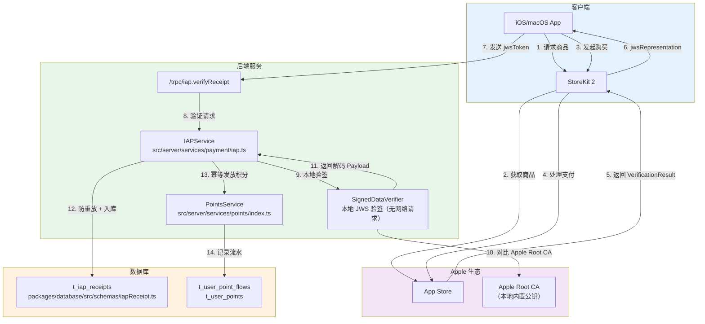
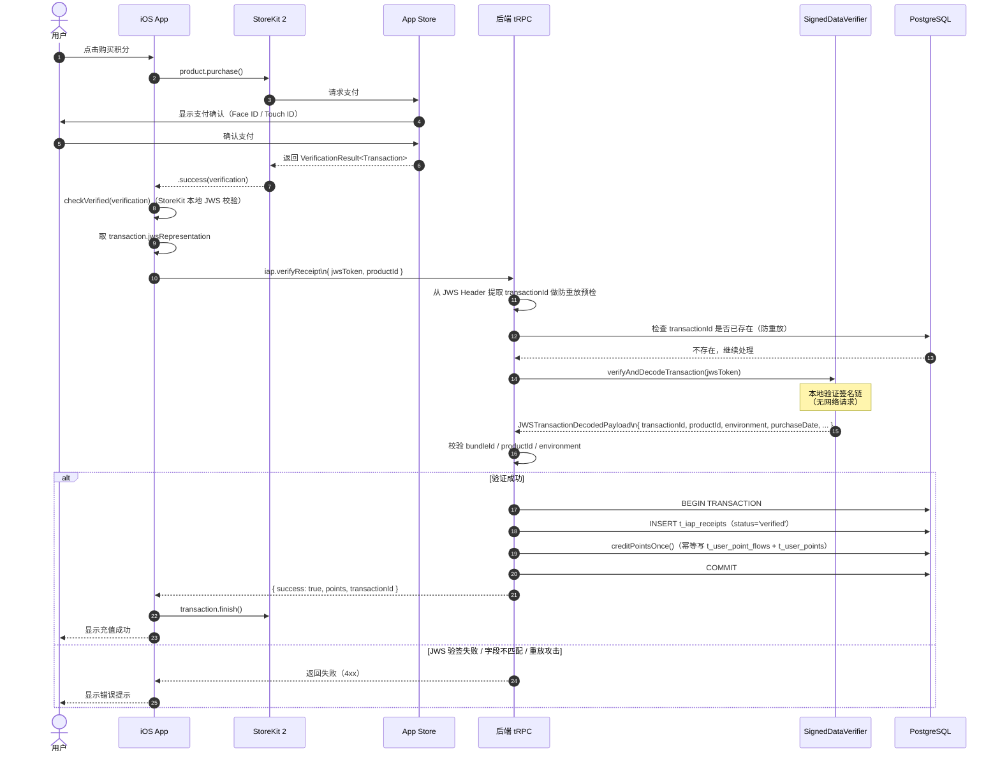

# App Store In-App Purchase（IAP）技术方案

> **方案 B**：适用于 iOS/macOS 原生 App 内销售数字商品（积分、会员）的唯一合规方式。
>
> **验证机制**：StoreKit 2 + JWS 本地验签（`@apple/app-store-server-library`）。

---

## 架构总览



---

## 购买时序图



---

## 商品配置

在 App Store Connect 中配置消耗型（Consumable）商品：

| Product ID | 类型 | 价格 | 积分 |
|---|---|---|---|
| `com.ainft.points.10` | Consumable | $9.99 | 10,000,000 |
| `com.ainft.points.50` | Consumable | $49.99 | 50,000,000 |
| `com.ainft.points.100` | Consumable | $99.99 | 100,000,000 |

---

## 后端实现

### 文件路径总览

| 文件 | 说明 |
|---|---|
| `packages/database/src/schemas/iapReceipt.ts` | Drizzle ORM 表定义 |
| `packages/database/src/models/iapReceipt.ts` | 数据库操作模型 |
| `packages/types/src/points.ts` | 新增 `IAP = 'iap'` 枚举值 |
| `src/server/services/payment/iap.ts` | 业务逻辑服务（JWS 验签 + 积分发放） |
| `src/server/routers/lambda/iap.ts` | tRPC 路由定义 |
| `src/server/routers/lambda/index.ts` | 主路由注册（新增 `iap: iapRouter`） |

### 依赖安装

```bash
pnpm add @apple/app-store-server-library
```

---

### 1. 数据库 Schema

**文件**: `packages/database/src/schemas/iapReceipt.ts`

```typescript
import { index, integer, pgTable, text, timestamp, uniqueIndex, varchar } from 'drizzle-orm/pg-core';
import { createdAt, updatedAt } from './_helpers';
import { users } from './user';

export const iapReceipt = pgTable(
  't_iap_receipts',
  {
    id: integer('id').primaryKey().generatedByDefaultAsIdentity(),
    userId: varchar('user_id', { length: 64 })
      .references(() => users.id, { onDelete: 'cascade' })
      .notNull(),

    // Apple 交易信息（从 JWS Payload 解码）
    transactionId: varchar('transaction_id', { length: 128 }).notNull(),
    originalTransactionId: varchar('original_transaction_id', { length: 128 }),
    productId: varchar('product_id', { length: 128 }).notNull(),

    // 金额与积分
    price: integer('price').notNull(),           // 单位：美分
    currency: varchar('currency', { length: 3 }).notNull().default('USD'),
    points: integer('points').notNull(),          // 发放积分数

    // 原始 JWS Token
    jwsToken: text('jws_token').notNull(),

    // 验证环境（从 JWS Payload 的 environment 字段提取）
    environment: varchar('environment', { length: 32 }),  // 'Production' | 'Sandbox'

    // 处理状态
    status: varchar('status', { length: 32 }).notNull().default('pending'),
    // pending | verified | failed | duplicate

    purchaseDate: timestamp('purchase_date', { withTimezone: true }),
    createdAt: createdAt(),
    updatedAt: updatedAt(),
    verifiedAt: timestamp('verified_at', { withTimezone: true }),
  },
  (table) => [
    index('idx_iap_receipts_user_id').on(table.userId),
    index('idx_iap_receipts_product_id').on(table.productId),
    index('idx_iap_receipts_status').on(table.status),
    uniqueIndex('idx_iap_receipts_transaction_id').on(table.transactionId),
  ],
);
```

> `jws_token` 字段存储原始 JWS 字符串，便于后续审计回溯。

---

### 2. 数据库模型

**文件**: `packages/database/src/models/iapReceipt.ts`

关键方法：

| 方法 | 说明 |
|---|---|
| `existsByTransactionId(db, transactionId)` | 防重放检查 |
| `insert(db, payload)` | 写入收据记录（含 jwsToken） |
| `listByUser(db, userId, params)` | 分页查询用户购买记录 |
| `countByUser(db, userId)` | 统计购买记录数 |
| `updateStatus(db, transactionId, status)` | 更新记录状态 |

---

### 3. PointFlowSourceType 枚举

**文件**: `packages/types/src/points.ts`

```typescript
export enum PointFlowSourceType {
  Chat = 'chat',
  IAP = 'iap',           // App Store IAP
  Recharge = 'recharge',
  SignupBonus = 'signup_bonus',
}
```

---

### 4. IAP 服务

**文件**: `src/server/services/payment/iap.ts`

#### 初始化 SignedDataVerifier

```typescript
import {
  Environment,
  SignedDataVerifier,
} from '@apple/app-store-server-library';
import * as fs from 'fs';
import * as path from 'path';

// Apple Root CA 证书（从 Apple 官网下载后放入项目 certs/ 目录）
// https://www.apple.com/certificateauthority/
const appleRootCAs: Buffer[] = [
  fs.readFileSync(path.resolve('certs/AppleRootCA-G3.cer')),
  fs.readFileSync(path.resolve('certs/AppleIncRootCertificate.cer')),
];

const BUNDLE_ID = 'com.ainft.app';  // 与 App Store Connect 中一致

// App Apple ID：App Store Connect > 我的 App > 通用 > Apple ID（纯数字）
const APP_APPLE_ID = Number(process.env.APP_APPLE_ID);

function createVerifier(environment: Environment): SignedDataVerifier {
  // 生产环境强制要求 appAppleId，沙盒环境可省略
  // 参见库源码：if (environment === PRODUCTION && appAppleId === undefined) throw
  const appAppleId = environment === Environment.PRODUCTION ? APP_APPLE_ID : undefined;
  return new SignedDataVerifier(
    appleRootCAs,
    true,           // enableOnlineChecks：启用 OCSP 吊销检查
    environment,
    BUNDLE_ID,
    appAppleId,
  );
}
```

> **证书说明**：`AppleRootCA-G3.cer` 和 `AppleIncRootCertificate.cer` 从 [Apple PKI 页面](https://www.apple.com/certificateauthority/) 下载，提交到代码仓库的 `certs/` 目录（非密钥，属公开证书，可安全提交）。

#### 商品配置（静态配置）

```typescript
const IAP_PRODUCT_CONFIGS: Record<string, { currency: string; points: number; price: number }> = {
  'com.ainft.points.10':  { currency: 'USD', points: 10_000_000,  price: 999  },
  'com.ainft.points.50':  { currency: 'USD', points: 50_000_000,  price: 4999 },
  'com.ainft.points.100': { currency: 'USD', points: 100_000_000, price: 9999 },
};
```

#### 核心方法：`processPurchase`

```typescript
async processPurchase(params: {
  userId: string;
  jwsToken: string;   // transaction.jwsRepresentation
  productId: string;  // 用于前置合法性校验
}): Promise<{ success: boolean; points: number; transactionId: string }>
```

**处理流程**：

```typescript
async processPurchase({ userId, jwsToken, productId }) {
  // 1. 前置校验 productId
  const config = IAP_PRODUCT_CONFIGS[productId];
  if (!config) throw new Error('Unknown product ID');

  // 2. 先尝试生产环境验签；若抛出 VerificationException，再尝试沙盒环境
  let payload: JWSTransactionDecodedPayload;
  let resolvedEnv: Environment;

  try {
    payload = await createVerifier(Environment.PRODUCTION).verifyAndDecodeTransaction(jwsToken);
    resolvedEnv = Environment.PRODUCTION;
  } catch {
    payload = await createVerifier(Environment.SANDBOX).verifyAndDecodeTransaction(jwsToken);
    resolvedEnv = Environment.SANDBOX;
  }

  // 3. 校验 Payload 关键字段
  // bundleId 已由 SignedDataVerifier 内部校验（不匹配时抛 INVALID_APP_IDENTIFIER）
  // 此处仅需校验业务字段
  if (payload.productId !== productId) throw new Error('Product ID mismatch');
  if (payload.type !== 'Consumable') throw new Error('Unexpected product type');

  const { transactionId, purchaseDate, environment } = payload;

  // 4. 防重放检查
  const exists = await IAPReceiptModel.existsByTransactionId(db, transactionId);
  if (exists) throw new Error('Transaction already processed');

  // 5. 数据库事务：入库 + 幂等发放积分
  await db.transaction(async (tx) => {
    await IAPReceiptModel.insert(tx, {
      userId,
      transactionId,
      originalTransactionId: payload.originalTransactionId,
      productId,
      price: config.price,
      currency: config.currency,
      points: config.points,
      jwsToken,                                      // 存储原始 JWS Token
      environment: environment ?? resolvedEnv,
      status: 'verified',
      purchaseDate: purchaseDate ? new Date(purchaseDate) : null,
      verifiedAt: new Date(),
    });

    await PointsService.creditPointsOnce(tx, {
      userId,
      points: config.points,
      source: PointFlowSourceType.IAP,
      idempotencyKey: transactionId,               // transactionId 作为幂等键
    });
  });

  return { success: true, points: config.points, transactionId };
}
```

#### JWS 验签说明

```
验签由 @apple/app-store-server-library 的 SignedDataVerifier 完成：
  1. 解析 JWS Header 中的 x5c（X.509 证书链，固定 3 段）
  2. 验证证书链是否锚定到内置的 Apple Root CA
  3. 使用叶证书的公钥验证 JWS 签名（ES256/ECDSA）
  4. 校验叶证书和中间证书在当前时间仍有效（enableOnlineChecks=true 时使用当前时间）
  5. 执行 OCSP 吊销检查（enableOnlineChecks=true）
  6. 校验 bundleId 与构造时传入的 bundleId 一致，否则抛 INVALID_APP_IDENTIFIER
  7. 校验 payload.environment 与构造时传入的 environment 一致，否则抛 INVALID_ENVIRONMENT
  8. 返回解码后的 JWSTransactionDecodedPayload

环境区分：
  - 先用 PRODUCTION 验证器尝试，若抛 VerificationException(INVALID_ENVIRONMENT)
    则说明是 Sandbox Token，改用 Sandbox 验证器重试
  - payload.environment 枚举值：'Production' | 'Sandbox'
```

#### JWSTransactionDecodedPayload 关键字段

| 字段 | 类型 | 说明 |
|---|---|---|
| `transactionId` | string | 本次交易唯一 ID（防重放键） |
| `originalTransactionId` | string | 原始交易 ID（订阅场景） |
| `bundleId` | string | App Bundle ID，需与后端配置一致 |
| `productId` | string | 商品 ID |
| `type` | string | `Consumable` / `Non-Consumable` / `Auto-Renewable Subscription` |
| `purchaseDate` | number | 购买时间（毫秒时间戳） |
| `quantity` | number | 购买数量 |
| `environment` | string | `Production` / `Sandbox` |
| `inAppOwnershipType` | string | `PURCHASED` / `FAMILY_SHARED` |
| `signedDate` | number | JWS 签发时间（毫秒时间戳） |
| `appAccountToken` | string | 购买时由 App 设置的用户 UUID（可选） |

---

### 5. tRPC 路由

**文件**: `src/server/routers/lambda/iap.ts`

#### `iap.getProducts`

```
GET /trpc/iap.getProducts
```

返回：
```typescript
Array<{
  productId: string;
  price: number;     // 美分
  currency: string;
  points: number;
}>
```

#### `iap.verifyReceipt`

```
POST /trpc/iap.verifyReceipt
```

输入：
```typescript
{
  jwsToken: string;   // transaction.jwsRepresentation
  productId: string;  // 如 com.ainft.points.10（用于前置合法性校验）
}
```

> `transactionId` 由后端从 JWS Payload 中解码提取，防止客户端伪造。

返回：
```typescript
{
  success: boolean;
  points: number;          // 本次发放的积分数
  transactionId: string;
}
```

错误码：
- `Transaction already processed` — 重放攻击，该交易已处理
- `Unknown product ID` — 非法的 productId
- `Bundle ID mismatch` — JWS 中的 bundleId 与服务器配置不一致
- `Product ID mismatch` — JWS Payload 与客户端上报 productId 不一致
- `VerificationException` — JWS 签名验证失败（伪造或过期）

#### `iap.getHistory`

```
GET /trpc/iap.getHistory?input={"page":1,"pageSize":20}
```

返回：
```typescript
{
  data: Array<{
    id: number;
    points: number;
    price: number;
    currency: string;
    productId: string;
    transactionId: string;
    status: string;
    environment: string | null;
    purchaseDate: number | null;  // Unix timestamp（秒）
    createdAt: number;            // Unix timestamp（秒）
  }>;
  page: number;
  pageSize: number;
  total: number;
}
```

---

### 6. 主路由注册

**文件**: `src/server/routers/lambda/index.ts`

```typescript
import { iapRouter } from './iap';

export const lambdaRouter = router({
  // ...其他路由...
  iap: iapRouter,
  // ...
});
```

---

## 环境变量

```bash
# .env

# App Bundle ID（与 App Store Connect 一致）
APP_BUNDLE_ID=com.ainft.app

# App Apple ID：App Store Connect > 我的 App > 通用 > Apple ID（纯数字）
# 生产环境 SignedDataVerifier 强制要求，缺少则抛异常
APP_APPLE_ID=1234567890
```

---

## Apple Root CA 证书

从 [https://www.apple.com/certificateauthority/](https://www.apple.com/certificateauthority/) 下载并放入项目 `certs/` 目录：

```
certs/
├── AppleRootCA-G3.cer          # Apple Root CA - G3（主要）
└── AppleIncRootCertificate.cer # Apple Inc Root Certificate（兼容旧版）
```

```bash
# 下载脚本（一次性操作）
mkdir -p certs
curl -o certs/AppleRootCA-G3.cer \
  https://www.apple.com/certificateauthority/AppleRootCA-G3.cer
curl -o certs/AppleIncRootCertificate.cer \
  https://www.apple.com/certificateauthority/AppleIncRootCertificate.cer
```

> 这些是 Apple 公开发布的根证书，属于公钥基础设施（PKI）的公开部分，可以安全提交到代码仓库。

---

## iOS 前端集成（Swift）

### StoreKit 2 购买管理器

```swift
import StoreKit

class IAPManager: ObservableObject {
    @Published var products: [Product] = []

    func loadProducts() async {
        products = (try? await Product.products(for: [
            "com.ainft.points.10",
            "com.ainft.points.50",
            "com.ainft.points.100",
        ])) ?? []
    }

    func purchase(_ product: Product) async throws {
        let result = try await product.purchase()

        switch result {
        case .success(let verification):
            let transaction = try checkVerified(verification)

            await verifyOnBackend(transaction: transaction, productId: product.id)

            // 后端验证成功后再 finish，确保积分已发放
            await transaction.finish()

        case .userCancelled, .pending:
            break

        @unknown default:
            break
        }
    }

    private func verifyOnBackend(transaction: Transaction, productId: String) async {
        let jwsToken = transaction.jwsRepresentation

        // 调用后端 tRPC 接口
        // await trpc.iap.verifyReceipt({ jwsToken, productId })
    }

    private func checkVerified<T>(_ result: VerificationResult<T>) throws -> T {
        switch result {
        case .unverified:
            throw IAPError.failedVerification
        case .verified(let safe):
            return safe
        }
    }
}

enum IAPError: Error {
    case failedVerification
}
```

### SwiftUI 充值页面

```swift
struct RechargeView: View {
    @StateObject private var iapManager = IAPManager()

    var body: some View {
        List(iapManager.products) { product in
            HStack {
                VStack(alignment: .leading) {
                    Text(product.displayName).font(.headline)
                    Text("获得 \(pointsLabel(for: product.id)) 积分")
                        .font(.subheadline)
                        .foregroundColor(.secondary)
                }
                Spacer()
                Button(product.displayPrice) {
                    Task { try? await iapManager.purchase(product) }
                }
                .buttonStyle(.borderedProminent)
            }
        }
        .task { await iapManager.loadProducts() }
    }

    private func pointsLabel(for productId: String) -> String {
        switch productId {
        case "com.ainft.points.10":  return "10,000,000"
        case "com.ainft.points.50":  return "50,000,000"
        case "com.ainft.points.100": return "100,000,000"
        default: return "0"
        }
    }
}
```

---

## 安全设计

| 风险 | 防护措施 |
|---|---|
| 重放攻击（同一交易重复提交） | `transactionId` 唯一索引 + `existsByTransactionId` 前置检查 |
| 伪造 JWS Token | `SignedDataVerifier` 验证 Apple Root CA 签名链，伪造 JWS 无法通过 |
| JWS 字段与客户端不一致 | 后端从 JWS Payload 独立解码 bundleId / productId，不信任客户端上报 |
| 沙盒 Token 进入生产 | `payload.environment` 字段自动区分 |
| 并发重复发积分 | `creditPointsOnce()` 在事务内检查 `userPointFlow` 唯一约束 |
| 过期证书链的 JWS 重放 | `enableOnlineChecks=true` 时使用当前时间校验证书有效期及 OCSP 吊销状态，过期证书签发的 JWS 无法通过 |

---

## 数据库迁移

执行以下命令生成并应用迁移：

```bash
# 生成迁移文件
pnpm db:generate

# 应用迁移
pnpm db:migrate
```

新增表：`t_iap_receipts`

---
