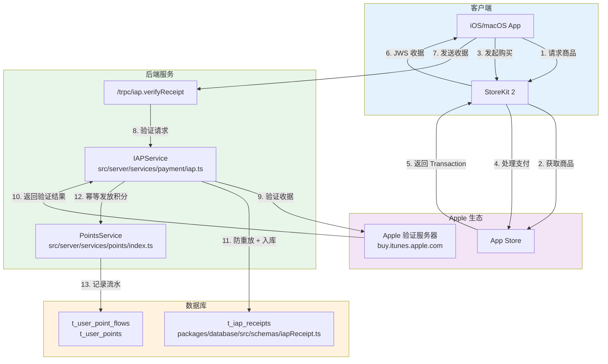
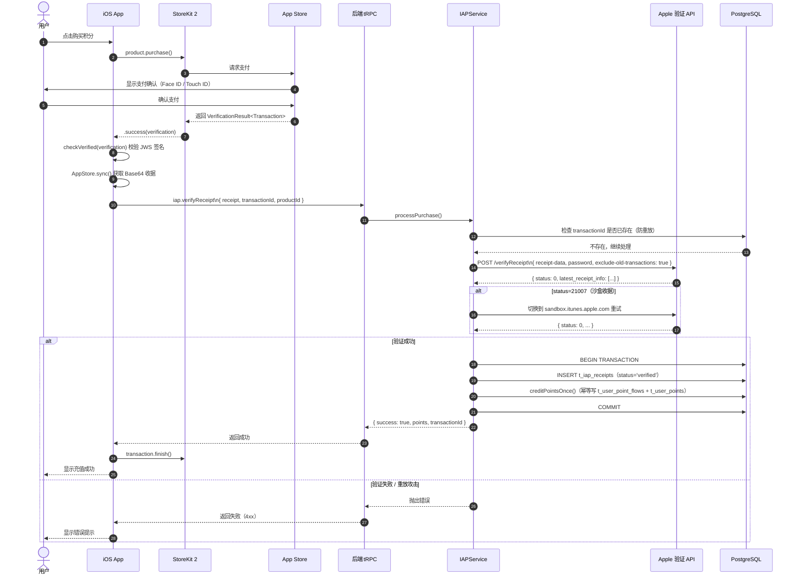

# App Store In-App Purchase（IAP）技术方案

> **方案 B**：适用于 iOS/macOS 原生 App 内销售数字商品（积分、会员）的唯一合规方式。

---

## 架构总览



---

## 购买时序图



---

## 商品配置

在 App Store Connect 中配置消耗型（Consumable）商品：

| Product ID | 类型 | 价格 | 积分 |
|---|---|---|---|
| `com.ainft.points.10` | Consumable | $9.99 | 10,000,000 |
| `com.ainft.points.50` | Consumable | $49.99 | 50,000,000 |
| `com.ainft.points.100` | Consumable | $99.99 | 100,000,000 |

---

## 后端实现

### 文件路径总览

| 文件 | 说明 |
|---|---|
| `packages/database/src/schemas/iapReceipt.ts` | Drizzle ORM 表定义 |
| `packages/database/src/models/iapReceipt.ts` | 数据库操作模型 |
| `packages/types/src/points.ts` | 新增 `IAP = 'iap'` 枚举值 |
| `src/server/services/payment/iap.ts` | 业务逻辑服务（收据验证 + 积分发放） |
| `src/server/routers/lambda/iap.ts` | tRPC 路由定义 |
| `src/server/routers/lambda/index.ts` | 主路由注册（新增 `iap: iapRouter`） |

---

### 1. 数据库 Schema

**文件**: `packages/database/src/schemas/iapReceipt.ts`

```typescript
import { index, integer, pgTable, text, timestamp, uniqueIndex, varchar } from 'drizzle-orm/pg-core';
import { createdAt, updatedAt } from './_helpers';
import { users } from './user';

export const iapReceipt = pgTable(
  't_iap_receipts',
  {
    id: integer('id').primaryKey().generatedByDefaultAsIdentity(),
    userId: varchar('user_id', { length: 64 })
      .references(() => users.id, { onDelete: 'cascade' })
      .notNull(),

    // Apple 交易信息
    transactionId: varchar('transaction_id', { length: 128 }).notNull(),
    originalTransactionId: varchar('original_transaction_id', { length: 128 }),
    productId: varchar('product_id', { length: 128 }).notNull(),

    // 金额与积分
    price: integer('price').notNull(),           // 单位：美分
    currency: varchar('currency', { length: 3 }).notNull().default('USD'),
    points: integer('points').notNull(),          // 发放积分数

    // 原始收据
    receipt: text('receipt').notNull(),

    // 验证环境
    environment: varchar('environment', { length: 32 }),  // 'Production' | 'Sandbox'

    // 处理状态
    status: varchar('status', { length: 32 }).notNull().default('pending'),
    // pending | verified | failed | duplicate

    purchaseDate: timestamp('purchase_date', { withTimezone: true }),
    createdAt: createdAt(),
    updatedAt: updatedAt(),
    verifiedAt: timestamp('verified_at', { withTimezone: true }),
  },
  (table) => [
    index('idx_iap_receipts_user_id').on(table.userId),
    index('idx_iap_receipts_product_id').on(table.productId),
    index('idx_iap_receipts_status').on(table.status),
    uniqueIndex('idx_iap_receipts_transaction_id').on(table.transactionId),
  ],
);
```

> 唯一索引 `idx_iap_receipts_transaction_id` 是防重放的数据库级保障：同一 transactionId 只能入库一次。

---

### 2. 数据库模型

**文件**: `packages/database/src/models/iapReceipt.ts`

关键方法：

| 方法 | 说明 |
|---|---|
| `existsByTransactionId(db, transactionId)` | 防重放检查 |
| `insert(db, payload)` | 写入收据记录 |
| `listByUser(db, userId, params)` | 分页查询用户购买记录 |
| `countByUser(db, userId)` | 统计购买记录数 |
| `updateStatus(db, transactionId, status)` | 更新记录状态 |

---

### 3. PointFlowSourceType 枚举

**文件**: `packages/types/src/points.ts`

```typescript
export enum PointFlowSourceType {
  Chat = 'chat',
  IAP = 'iap',           // 新增：App Store IAP
  Recharge = 'recharge',
  SignupBonus = 'signup_bonus',
}
```

---

### 4. IAP 服务

**文件**: `src/server/services/payment/iap.ts`

#### 商品配置（静态配置）

```typescript
const IAP_PRODUCT_CONFIGS = {
  'com.ainft.points.10':  { currency: 'USD', points: 10_000_000,  price: 999  },
  'com.ainft.points.50':  { currency: 'USD', points: 50_000_000,  price: 4999 },
  'com.ainft.points.100': { currency: 'USD', points: 100_000_000, price: 9999 },
};
```

#### 核心方法：`processPurchase`

```typescript
async processPurchase(params: {
  receipt: string;
  transactionId: string;
  productId: string;
}): Promise<{ success: boolean; points: number; transactionId: string }>
```

**处理流程**：
1. 防重放检查：查询 `t_iap_receipts.transactionId` 唯一索引
2. 校验 productId 合法性
3. 调用 Apple 验证 API（生产环境优先，遇 21007 自动降级沙盒）
4. 从验证结果中找到目标 transactionId 对应的交易信息
5. 开启数据库事务：
   - 插入 `t_iap_receipts`（status='verified'）
   - 调用 `PointsService.creditPointsOnce()` 幂等发放积分

#### 收据验证说明

```
生产环境：https://buy.itunes.apple.com/verifyReceipt
沙盒环境：https://sandbox.itunes.apple.com/verifyReceipt

Apple status 码：
  0     - 验证成功
  21007 - 沙盒收据，需切换到沙盒端点
  21002 - receipt-data 格式错误
  21004 - shared secret 不匹配
  21005 - Apple 收据服务器暂时不可用
```

---

### 5. tRPC 路由

**文件**: `src/server/routers/lambda/iap.ts`

#### `iap.getProducts`

```
GET /trpc/iap.getProducts
```

返回：
```typescript
Array<{
  productId: string;
  price: number;     // 美分
  currency: string;
  points: number;
}>
```

#### `iap.verifyReceipt`

```
POST /trpc/iap.verifyReceipt
```

输入：
```typescript
{
  receipt: string;        // Base64 编码的 App Store 收据
  transactionId: string;  // StoreKit Transaction.id
  productId: string;      // 如 com.ainft.points.10
}
```

返回：
```typescript
{
  success: boolean;
  points: number;          // 本次发放的积分数
  transactionId: string;
}
```

错误码：
- `Transaction already processed` — 重放攻击，该交易已处理
- `Unknown product ID` — 非法的 productId
- `Receipt verification failed, Apple status code: N` — Apple 验证失败

#### `iap.getHistory`

```
GET /trpc/iap.getHistory?input={"page":1,"pageSize":20}
```

返回：
```typescript
{
  data: Array<{
    id: number;
    points: number;
    price: number;
    currency: string;
    productId: string;
    transactionId: string;
    status: string;
    environment: string | null;
    purchaseDate: number | null;  // Unix timestamp (秒)
    createdAt: number;            // Unix timestamp (秒)
  }>;
  page: number;
  pageSize: number;
  total: number;
}
```

---

### 6. 主路由注册

**文件**: `src/server/routers/lambda/index.ts`

```typescript
import { iapRouter } from './iap';

export const lambdaRouter = router({
  // ...其他路由...
  iap: iapRouter,
  // ...
});
```

---

## 环境变量

```bash
# .env

# App Store 共享密钥（App Store Connect > App > In-App Purchases > App-Specific Shared Secret）
APP_STORE_SHARED_SECRET=xxxxxxxxxxxxxxxxxxxxxxxxxxxxxxxx
```

---

## iOS 前端集成（Swift）

### StoreKit 2 购买管理器

```swift
import StoreKit

class IAPManager: ObservableObject {
    @Published var products: [Product] = []

    func loadProducts() async {
        products = (try? await Product.products(for: [
            "com.ainft.points.10",
            "com.ainft.points.50",
            "com.ainft.points.100",
        ])) ?? []
    }

    func purchase(_ product: Product) async throws {
        let result = try await product.purchase()

        switch result {
        case .success(let verification):
            let transaction = try checkVerified(verification)
            await verifyOnBackend(transaction)
            // 后端验证成功后再 finish，避免积分未发放就消耗交易
            await transaction.finish()

        case .userCancelled, .pending:
            break

        @unknown default:
            break
        }
    }

    private func verifyOnBackend(_ transaction: Transaction) async {
        // 获取当前 App Store 收据（Base64）
        guard let receiptURL = Bundle.main.appStoreReceiptURL,
              let receiptData = try? Data(contentsOf: receiptURL) else {
            return
        }

        let receipt = receiptData.base64EncodedString()
        let transactionId = String(transaction.id)
        let productId = transaction.productID

        // 调用后端 tRPC 接口
        // await trpc.iap.verifyReceipt({ receipt, transactionId, productId })
    }

    private func checkVerified<T>(_ result: VerificationResult<T>) throws -> T {
        switch result {
        case .unverified:
            throw IAPError.failedVerification
        case .verified(let safe):
            return safe
        }
    }
}

enum IAPError: Error {
    case failedVerification
}
```

### SwiftUI 充值页面

```swift
struct RechargeView: View {
    @StateObject private var iapManager = IAPManager()

    var body: some View {
        List(iapManager.products) { product in
            HStack {
                VStack(alignment: .leading) {
                    Text(product.displayName).font(.headline)
                    Text("获得 \(pointsLabel(for: product.id)) 积分")
                        .font(.subheadline)
                        .foregroundColor(.secondary)
                }
                Spacer()
                Button(product.displayPrice) {
                    Task { try? await iapManager.purchase(product) }
                }
                .buttonStyle(.borderedProminent)
            }
        }
        .task { await iapManager.loadProducts() }
    }

    private func pointsLabel(for productId: String) -> String {
        switch productId {
        case "com.ainft.points.10":  return "10,000,000"
        case "com.ainft.points.50":  return "50,000,000"
        case "com.ainft.points.100": return "100,000,000"
        default: return "0"
        }
    }
}
```

---

## 安全设计

| 风险 | 防护措施 |
|---|---|
| 重放攻击（同一收据重复提交） | `transactionId` 唯一索引 + `existsByTransactionId` 前置检查 |
| 伪造收据 | 向 Apple 官方服务器二次验证，验证失败直接拒绝 |
| 并发重复发积分 | `creditPointsOnce()` 在事务内检查 `userPointFlow` 唯一约束 |
| 沙盒收据进入生产 | Apple status=21007 自动切换沙盒端点，environment 字段区分记录 |
| Shared Secret 泄露 | 仅存于服务端环境变量，不暴露给客户端 |

---

## 数据库迁移

执行以下命令生成并应用迁移：

```bash
# 生成迁移文件
pnpm db:generate

# 应用迁移
pnpm db:migrate
```

新增表：`t_iap_receipts`

---
