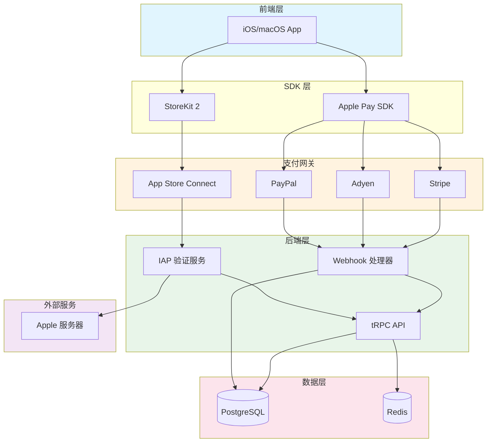
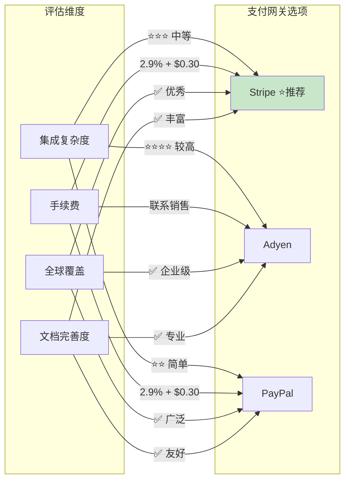
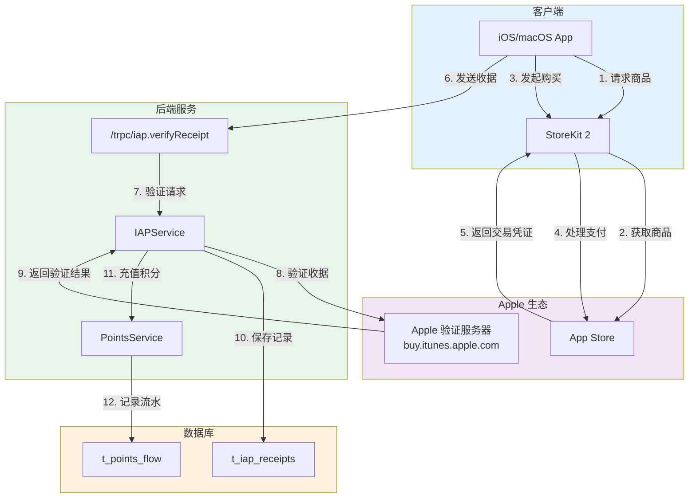
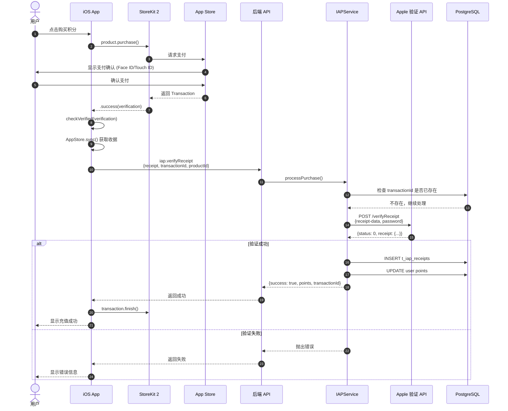

# Apple 支付技术方案


## Apple 支付方式概述

Apple 提供两种主要的支付方式：

### 1. Apple Pay

**适用场景**: iOS/macOS App 内的实体商品、服务购买

**特点**:
- 支持信用卡/借记卡支付
- 快速便捷，支持 Face ID / Touch ID
- 适合一次性购买
- 通过 Stripe 在 iOS App 内使用

**支付流程**:
```
用户选择商品 → 点击 Apple Pay → 认证（Face ID）→ 完成支付
```

### 2. App Store In-App Purchase (IAP)

**适用场景**: iOS/macOS App 内的数字商品

**特点**:
- Apple 强制使用（App Store 政策）
- Apple 抽成 15-30%
- 支持订阅、消耗品、非消耗品
- 仅限 App 内使用

**支付流程**:
```
用户选择商品 → 调用 IAP → Apple 处理支付 → 后端验证收据
```

---

## 技术方案

### 方案 A: Apple Pay（通过 Stripe）

#### 1. 架构设计



**架构说明**:
- **前端层**: iOS/macOS App 提供用户交互界面
- **SDK 层**: Apple Pay SDK 处理支付请求，StoreKit 2 处理应用内购买
- **支付网关**: 支持多种支付渠道（Stripe、Adyen、PayPal）和 App Store Connect
- **后端层**: tRPC API 处理业务逻辑，Webhook 接收支付通知，IAP 验证服务验证收据
- **数据层**: PostgreSQL 存储订单和交易数据，Redis 提供缓存支持
- **外部服务**: Apple 服务器用于验证 IAP 收据

#### 2. 技术选型

##### 技术选型对比



##### 选项 1: Stripe Payment（推荐）

**优势**:
- 成熟稳定，全球通用
- 完整的 Apple Pay 支持
- 丰富的 SDK 和文档
- 支持多种货币
- Webhook 通知可靠

**费率**:
- 2.9% + $0.30 per transaction (美国)
- 各国费率不同

**集成复杂度**: ⭐⭐⭐ (中等)

##### 选项 2: Adyen

**优势**:
- 企业级支付平台
- 支持全球支付方式
- 更低的费率（大客户）
- 强大的风控系统

**费率**:
- 需要联系销售
- 通常比 Stripe 低

**集成复杂度**: ⭐⭐⭐⭐ (较高)

##### 选项 3: PayPal

**优势**:
- 用户基础大
- 支持 Apple Pay
- 简单易用

**费率**:
- 2.9% + $0.30 per transaction

**集成复杂度**: ⭐⭐ (简单)

#### 3. 数据库设计

新增表：`t_apple_pay_orders`

```typescript
export const applePayOrders = pgTable('t_apple_pay_orders', {
  id: varchar('id', { length: 64 }).primaryKey(),
  userId: varchar('user_id', { length: 64 })
    .references(() => users.id, { onDelete: 'cascade' })
    .notNull(),
  
  // 支付信息
  amount: integer('amount').notNull(),  // 支付金额（美分）
  currency: varchar('currency', { length: 3 }).notNull().default('USD'),
  points: integer('points').notNull(),  // 充值积分数
  
  // 支付网关信息
  paymentGateway: varchar('payment_gateway', { length: 32 }).notNull(), // 'stripe', 'paypal', etc.
  paymentIntentId: varchar('payment_intent_id', { length: 128 }),  // Stripe Payment Intent ID
  transactionId: varchar('transaction_id', { length: 128 }),  // 支付网关交易 ID
  
  // 状态
  status: varchar('status', { length: 32 })
    .notNull()
    .default('pending'),  // pending, processing, succeeded, failed, refunded
  
  // Apple Pay 特定
  applePayToken: text('apple_pay_token'),  // Apple Pay token (encrypted)
  
  // 元数据
  metadata: jsonb('metadata'),  // 额外信息
  
  // 时间戳
  createdAt: timestamp('created_at').notNull().defaultNow(),
  updatedAt: timestamp('updated_at').notNull().defaultNow(),
  paidAt: timestamp('paid_at'),
  refundedAt: timestamp('refunded_at'),
}, (table) => [
  index('idx_apple_pay_orders_user_id').on(table.userId),
  index('idx_apple_pay_orders_status').on(table.status),
  index('idx_apple_pay_orders_payment_intent').on(table.paymentIntentId),
]);
```

#### 4. API 设计

##### 创建支付订单

**接口**: `POST /trpc/payment.createApplePayOrder`

**输入**:
```typescript
{
  packageId: string;  // 套餐 ID
  amount: number;     // 金额（美元）
  currency?: string;  // 货币（默认 USD）
}
```

**返回**:
```typescript
{
  orderId: string;
  clientSecret: string;  // Stripe client secret（用于前端）
  amount: number;
  currency: string;
  points: number;        // 将获得的积分
}
```

##### 确认支付

**接口**: `POST /trpc/payment.confirmApplePayOrder`

**输入**:
```typescript
{
  orderId: string;
  paymentIntentId: string;
}
```

**返回**:
```typescript
{
  success: boolean;
  points: number;
  balance: number;  // 充值后余额
}
```

##### Webhook 处理

**接口**: `POST /api/webhooks/stripe`

处理 Stripe 的 Webhook 通知：
- `payment_intent.succeeded`
- `payment_intent.payment_failed`
- `charge.refunded`

#### 5. 后端实现

##### 支付服务流程


##### 支付服务

创建 `src/server/services/payment/stripe.ts`:

```typescript
import Stripe from 'stripe';
import { PointsService } from '@/server/services/points';
import { PointFlowSourceType } from '@/types/points';

const stripe = new Stripe(process.env.STRIPE_SECRET_KEY!, {
  apiVersion: '2023-10-16',
});

export class StripePaymentService {
  constructor(
    private db: LobeChatDatabase,
    private userId: string,
  ) {}

  /**
   * 创建 Apple Pay 支付意图
   */
  async createApplePayIntent(params: {
    amount: number;      // 美元金额
    currency: string;
    points: number;
    metadata?: object;
  }) {
    const { amount, currency, points, metadata } = params;

    // 创建 Stripe Payment Intent
    const paymentIntent = await stripe.paymentIntents.create({
      amount: Math.round(amount * 100),  // 转换为美分
      currency: currency.toLowerCase(),
      payment_method_types: ['card'],  // Apple Pay 使用 card 类型
      metadata: {
        userId: this.userId,
        points: String(points),
        ...metadata,
      },
    });

    // 创建订单记录
    await this.db.insert(applePayOrders).values({
      id: paymentIntent.id,
      userId: this.userId,
      amount: Math.round(amount * 100),
      currency: currency.toUpperCase(),
      points,
      paymentGateway: 'stripe',
      paymentIntentId: paymentIntent.id,
      status: 'pending',
      metadata: metadata as any,
    });

    return {
      orderId: paymentIntent.id,
      clientSecret: paymentIntent.client_secret!,
      amount,
      currency,
      points,
    };
  }

  /**
   * 处理支付成功
   */
  async handlePaymentSuccess(paymentIntentId: string) {
    // 获取订单
    const order = await this.db.query.applePayOrders.findFirst({
      where: eq(applePayOrders.paymentIntentId, paymentIntentId),
    });

    if (!order) {
      throw new Error('Order not found');
    }

    if (order.status === 'succeeded') {
      // 已处理，避免重复充值
      return;
    }

    // 更新订单状态
    await this.db.update(applePayOrders)
      .set({
        status: 'succeeded',
        paidAt: new Date(),
        updatedAt: new Date(),
      })
      .where(eq(applePayOrders.id, order.id));

    // 充值积分
    const pointsService = new PointsService(this.db);
    await pointsService.creditPoints(order.userId, order.points, {
      sourceType: PointFlowSourceType.ApplePay,
      sourceId: order.id,
    });

    return {
      success: true,
      points: order.points,
    };
  }

  /**
   * 处理退款
   */
  async handleRefund(paymentIntentId: string) {
    const order = await this.db.query.applePayOrders.findFirst({
      where: eq(applePayOrders.paymentIntentId, paymentIntentId),
    });

    if (!order) return;

    // 更新订单状态
    await this.db.update(applePayOrders)
      .set({
        status: 'refunded',
        refundedAt: new Date(),
        updatedAt: new Date(),
      })
      .where(eq(applePayOrders.id, order.id));

    // 扣除积分
    const pointsService = new PointsService(this.db);
    await pointsService.deductPoints(order.userId, order.points, {
      sourceType: PointFlowSourceType.Refund,
      sourceId: order.id,
    });
  }
}
```

##### tRPC Router

创建 `src/server/routers/lambda/payment.ts`:

```typescript
import { z } from 'zod';
import { authedProcedure, router } from '@/libs/trpc/lambda';
import { serverDatabase } from '@/libs/trpc/lambda/middleware';
import { StripePaymentService } from '@/server/services/payment/stripe';

const paymentProcedure = authedProcedure.use(serverDatabase);

export const paymentRouter = router({
  /**
   * 创建 Apple Pay 订单
   */
  createApplePayOrder: paymentProcedure
    .input(
      z.object({
        packageId: z.string(),
        amount: z.number().positive(),
        currency: z.string().default('USD'),
      })
    )
    .mutation(async ({ ctx, input }) => {
      const paymentService = new StripePaymentService(
        ctx.serverDB,
        ctx.userId
      );

      // 计算积分（1 USD = 1,000,000 积分）
      const points = Math.floor(input.amount * 1_000_000);

      return paymentService.createApplePayIntent({
        amount: input.amount,
        currency: input.currency,
        points,
        metadata: {
          packageId: input.packageId,
        },
      });
    }),

  /**
   * 确认支付
   */
  confirmApplePayOrder: paymentProcedure
    .input(
      z.object({
        orderId: z.string(),
        paymentIntentId: z.string(),
      })
    )
    .mutation(async ({ ctx, input }) => {
      const paymentService = new StripePaymentService(
        ctx.serverDB,
        ctx.userId
      );

      const result = await paymentService.handlePaymentSuccess(
        input.paymentIntentId
      );

      // 获取用户余额
      const pointsService = new PointsService(ctx.serverDB);
      const balance = await pointsService.getUserBalance(ctx.userId);

      return {
        ...result,
        balance,
      };
    }),

  /**
   * 获取订单列表
   */
  getApplePayOrders: paymentProcedure
    .input(
      z.object({
        page: z.number().min(1).default(1),
        pageSize: z.number().min(1).max(100).default(20),
      }).optional()
    )
    .query(async ({ ctx, input }) => {
      const page = input?.page ?? 1;
      const pageSize = input?.pageSize ?? 20;
      const offset = (page - 1) * pageSize;

      const orders = await ctx.serverDB
        .select()
        .from(applePayOrders)
        .where(eq(applePayOrders.userId, ctx.userId))
        .orderBy(desc(applePayOrders.createdAt))
        .limit(pageSize)
        .offset(offset);

      const total = await ctx.serverDB
        .select({ count: count() })
        .from(applePayOrders)
        .where(eq(applePayOrders.userId, ctx.userId));

      return {
        data: orders,
        page,
        pageSize,
        total: total[0].count,
      };
    }),
});
```

##### Webhook 处理

创建 `src/app/(backend)/api/webhooks/stripe/route.ts`:

```typescript
import { headers } from 'next/headers';
import Stripe from 'stripe';
import { getServerDB } from '@/database/server';
import { StripePaymentService } from '@/server/services/payment/stripe';

const stripe = new Stripe(process.env.STRIPE_SECRET_KEY!, {
  apiVersion: '2023-10-16',
});

const webhookSecret = process.env.STRIPE_WEBHOOK_SECRET!;

export async function POST(req: Request) {
  const body = await req.text();
  const signature = headers().get('stripe-signature')!;

  let event: Stripe.Event;

  try {
    // 验证 Webhook 签名
    event = stripe.webhooks.constructEvent(body, signature, webhookSecret);
  } catch (err) {
    console.error('Webhook 签名验证失败:', err);
    return new Response('Webhook Error', { status: 400 });
  }

  const db = await getServerDB();

  try {
    switch (event.type) {
      case 'payment_intent.succeeded': {
        const paymentIntent = event.data.object as Stripe.PaymentIntent;
        const userId = paymentIntent.metadata.userId;
        
        if (userId) {
          const service = new StripePaymentService(db, userId);
          await service.handlePaymentSuccess(paymentIntent.id);
          console.log('✅ 支付成功处理完成:', paymentIntent.id);
        }
        break;
      }

      case 'payment_intent.payment_failed': {
        const paymentIntent = event.data.object as Stripe.PaymentIntent;
        
        // 更新订单状态为失败
        await db.update(applePayOrders)
          .set({ 
            status: 'failed',
            updatedAt: new Date(),
          })
          .where(eq(applePayOrders.paymentIntentId, paymentIntent.id));
        
        console.log('❌ 支付失败:', paymentIntent.id);
        break;
      }

      case 'charge.refunded': {
        const charge = event.data.object as Stripe.Charge;
        const paymentIntentId = charge.payment_intent as string;
        
        const order = await db.query.applePayOrders.findFirst({
          where: eq(applePayOrders.paymentIntentId, paymentIntentId),
        });

        if (order) {
          const service = new StripePaymentService(db, order.userId);
          await service.handleRefund(paymentIntentId);
          console.log('↩️ 退款处理完成:', paymentIntentId);
        }
        break;
      }

      default:
        console.log('未处理的事件类型:', event.type);
    }

    return new Response(JSON.stringify({ received: true }), { status: 200 });
  } catch (error) {
    console.error('Webhook 处理错误:', error);
    return new Response('Webhook Handler Error', { status: 500 });
  }
}
```

#### 6. 环境变量

```bash
# .env

# Stripe
STRIPE_SECRET_KEY=sk_live_xxxxxxxxxxxxxxxxxxxxxx
STRIPE_WEBHOOK_SECRET=whsec_xxxxxxxxxxxxxxxxxxxxxx
```

#### 7. 部署配置

##### Vercel 配置

```json
// vercel.json
{
  "env": {
    "STRIPE_SECRET_KEY": "@stripe-secret-key",
    "STRIPE_WEBHOOK_SECRET": "@stripe-webhook-secret"
  }
}
```

##### Webhook 端点配置

在 Stripe Dashboard 中配置 Webhook：

```
Endpoint URL: https://your-domain.com/api/webhooks/stripe

Events to send:
- payment_intent.succeeded
- payment_intent.payment_failed
- charge.refunded
```

---

### 方案 B: App Store In-App Purchase（用于原生 App）

#### 1. 架构设计



**IAP 流程说明**:
1. App 通过 StoreKit 2 向 App Store 请求商品信息
2. 用户发起购买，StoreKit 处理支付流程
3. 支付成功后，App Store 返回交易凭证
4. App 将收据发送到后端验证
5. 后端调用 Apple 服务器验证收据真实性
6. 验证通过后，为用户充值积分

#### 2. 商品配置

在 App Store Connect 中配置 IAP 商品：

| Product ID | Type | Price | Points |
|------------|------|-------|--------|
| com.ainft.points.10 | Consumable | $9.99 | 10,000,000 |
| com.ainft.points.50 | Consumable | $49.99 | 50,000,000 |
| com.ainft.points.100 | Consumable | $99.99 | 100,000,000 |

#### 3. 数据库设计

新增表：`t_iap_receipts`

```typescript
export const iapReceipts = pgTable('t_iap_receipts', {
  id: varchar('id', { length: 64 }).primaryKey(),
  userId: varchar('user_id', { length: 64 })
    .references(() => users.id, { onDelete: 'cascade' })
    .notNull(),
  
  // IAP 信息
  transactionId: varchar('transaction_id', { length: 128 }).notNull().unique(),
  originalTransactionId: varchar('original_transaction_id', { length: 128 }),
  productId: varchar('product_id', { length: 128 }).notNull(),
  
  // 金额和积分
  price: integer('price').notNull(),  // 美分
  currency: varchar('currency', { length: 3 }).notNull(),
  points: integer('points').notNull(),
  
  // 收据
  receipt: text('receipt').notNull(),  // Base64 编码的收据
  environment: varchar('environment', { length: 32 }),  // 'Production' | 'Sandbox'
  
  // 状态
  status: varchar('status', { length: 32 }).notNull().default('pending'),
  
  // 时间
  purchaseDate: timestamp('purchase_date'),
  createdAt: timestamp('created_at').notNull().defaultNow(),
  verifiedAt: timestamp('verified_at'),
}, (table) => [
  index('idx_iap_receipts_user_id').on(table.userId),
  index('idx_iap_receipts_transaction_id').on(table.transactionId),
]);
```

#### 4. 后端实现

##### IAP 购买时序图



##### IAP 验证服务

创建 `src/server/services/payment/iap.ts`:

```typescript
import { PointsService } from '@/server/services/points';
import { PointFlowSourceType } from '@/types/points';

// Apple IAP 收据验证
const PRODUCTION_VERIFY_URL = 'https://buy.itunes.apple.com/verifyReceipt';
const SANDBOX_VERIFY_URL = 'https://sandbox.itunes.apple.com/verifyReceipt';

export class IAPService {
  constructor(
    private db: LobeChatDatabase,
    private userId: string,
  ) {}

  /**
   * 验证 App Store 收据
   */
  async verifyReceipt(receipt: string, isProduction = true) {
    const url = isProduction ? PRODUCTION_VERIFY_URL : SANDBOX_VERIFY_URL;
    const password = process.env.APP_STORE_SHARED_SECRET!;

    const response = await fetch(url, {
      method: 'POST',
      headers: { 'Content-Type': 'application/json' },
      body: JSON.stringify({
        'receipt-data': receipt,
        'password': password,
        'exclude-old-transactions': true,
      }),
    });

    const result = await response.json();

    // 状态码 21007 表示沙盒收据，需要切换到沙盒环境验证
    if (result.status === 21007 && isProduction) {
      return this.verifyReceipt(receipt, false);
    }

    return result;
  }

  /**
   * 处理 IAP 购买
   */
  async processPurchase(params: {
    receipt: string;
    transactionId: string;
    productId: string;
  }) {
    const { receipt, transactionId, productId } = params;

    // 检查交易是否已处理
    const exists = await this.db.query.iapReceipts.findFirst({
      where: eq(iapReceipts.transactionId, transactionId),
    });

    if (exists) {
      throw new Error('Transaction already processed');
    }

    // 验证收据
    const verifyResult = await this.verifyReceipt(receipt);

    if (verifyResult.status !== 0) {
      throw new Error(`Receipt verification failed: ${verifyResult.status}`);
    }

    // 从收据中提取交易信息
    const latestReceipt = verifyResult.latest_receipt_info?.[0];
    if (!latestReceipt) {
      throw new Error('No transaction found in receipt');
    }

    // 获取商品价格和积分（从配置或数据库）
    const productConfig = await this.getProductConfig(productId);
    if (!productConfig) {
      throw new Error('Invalid product ID');
    }

    // 创建 IAP 记录
    await this.db.insert(iapReceipts).values({
      id: transactionId,
      userId: this.userId,
      transactionId,
      originalTransactionId: latestReceipt.original_transaction_id,
      productId,
      price: productConfig.price,
      currency: productConfig.currency,
      points: productConfig.points,
      receipt,
      environment: verifyResult.environment,
      status: 'verified',
      purchaseDate: new Date(Number(latestReceipt.purchase_date_ms)),
      verifiedAt: new Date(),
    });

    // 充值积分
    const pointsService = new PointsService(this.db);
    await pointsService.creditPoints(this.userId, productConfig.points, {
      sourceType: PointFlowSourceType.IAP,
      sourceId: transactionId,
    });

    return {
      success: true,
      points: productConfig.points,
      transactionId,
    };
  }

  /**
   * 获取商品配置
   */
  private async getProductConfig(productId: string) {
    const configs: Record<string, { price: number; currency: string; points: number }> = {
      'com.ainft.points.10': { price: 999, currency: 'USD', points: 10_000_000 },
      'com.ainft.points.50': { price: 4999, currency: 'USD', points: 50_000_000 },
      'com.ainft.points.100': { price: 9999, currency: 'USD', points: 100_000_000 },
    };

    return configs[productId];
  }
}
```

##### API 路由

```typescript
// src/server/routers/lambda/iap.ts
import { z } from 'zod';
import { authedProcedure, router } from '@/libs/trpc/lambda';
import { IAPService } from '@/server/services/payment/iap';

export const iapRouter = router({
  /**
   * 验证 IAP 收据并充值
   */
  verifyReceipt: authedProcedure
    .input(
      z.object({
        receipt: z.string(),
        transactionId: z.string(),
        productId: z.string(),
      })
    )
    .mutation(async ({ ctx, input }) => {
      const iapService = new IAPService(ctx.serverDB, ctx.userId);
      return iapService.processPurchase(input);
    }),

  /**
   * 获取 IAP 购买记录
   */
  getIAPHistory: authedProcedure
    .input(
      z.object({
        page: z.number().min(1).default(1),
        pageSize: z.number().min(1).max(100).default(20),
      }).optional()
    )
    .query(async ({ ctx, input }) => {
      // 查询 IAP 记录
      // ...
    }),
});
```

##### iOS 前端（Swift）

```swift
import StoreKit

class IAPManager: ObservableObject {
    @Published var products: [Product] = []
    
    // 加载商品
    func loadProducts() async {
        do {
            products = try await Product.products(for: [
                "com.ainft.points.10",
                "com.ainft.points.50",
                "com.ainft.points.100"
            ])
        } catch {
            print("加载商品失败: \(error)")
        }
    }
    
    // 购买
    func purchase(_ product: Product) async throws -> String? {
        let result = try await product.purchase()
        
        switch result {
        case .success(let verification):
            // 验证收据
            let transaction = try checkVerified(verification)
            
            // 发送收据到后端验证
            await verifyReceiptOnServer(transaction)
            
            // 完成交易
            await transaction.finish()
            
            return transaction.id
            
        case .userCancelled:
            return nil
            
        case .pending:
            return nil
            
        @unknown default:
            return nil
        }
    }
    
    // 发送到后端验证
    func verifyReceiptOnServer(_ transaction: Transaction) async {
        // 获取收据
        guard let receiptData = try? await AppStore.sync() else {
            return
        }
        
        // 调用后端 API
        let request = VerifyReceiptRequest(
            receipt: receiptData.base64EncodedString(),
            transactionId: String(transaction.id),
            productId: transaction.productID
        )
        
        // TODO: 调用 tRPC API
        // await trpc.iap.verifyReceipt(request)
    }
    
    func checkVerified<T>(_ result: VerificationResult<T>) throws -> T {
        switch result {
        case .unverified:
            throw IAPError.failedVerification
        case .verified(let safe):
            return safe
        }
    }
}

enum IAPError: Error {
    case failedVerification
}
```

##### iOS 前端（SwiftUI）

```swift
struct RechargeView: View {
    @StateObject private var iapManager = IAPManager()
    
    var body: some View {
        List(iapManager.products) { product in
            HStack {
                VStack(alignment: .leading) {
                    Text(product.displayName)
                        .font(.headline)
                    Text("获得 \(pointsForProduct(product)) 积分")
                        .font(.subheadline)
                        .foregroundColor(.gray)
                }
                
                Spacer()
                
                Button(product.displayPrice) {
                    Task {
                        try? await iapManager.purchase(product)
                    }
                }
                .buttonStyle(.borderedProminent)
            }
        }
        .task {
            await iapManager.loadProducts()
        }
    }
    
    func pointsForProduct(_ product: Product) -> String {
        switch product.id {
        case "com.ainft.points.10":
            return "10,000,000"
        case "com.ainft.points.50":
            return "50,000,000"
        case "com.ainft.points.100":
            return "100,000,000"
        default:
            return "0"
        }
    }
}
```

---

