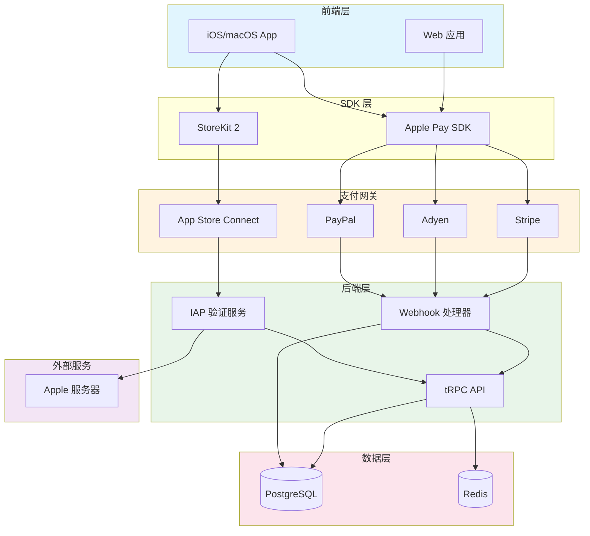
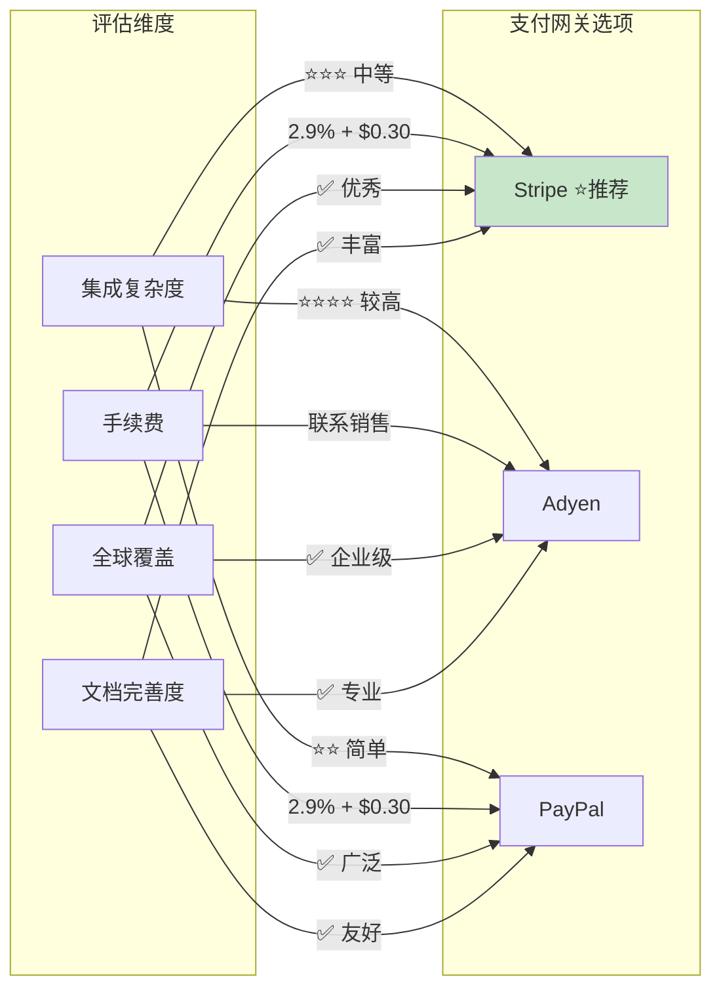
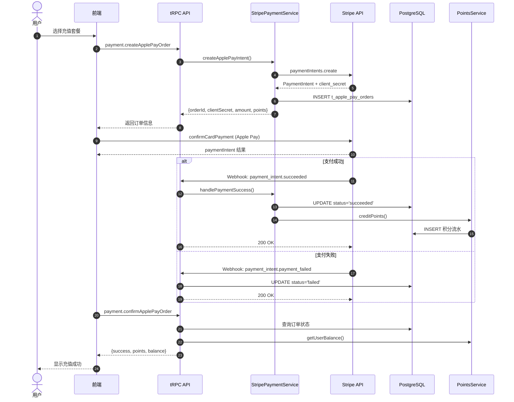
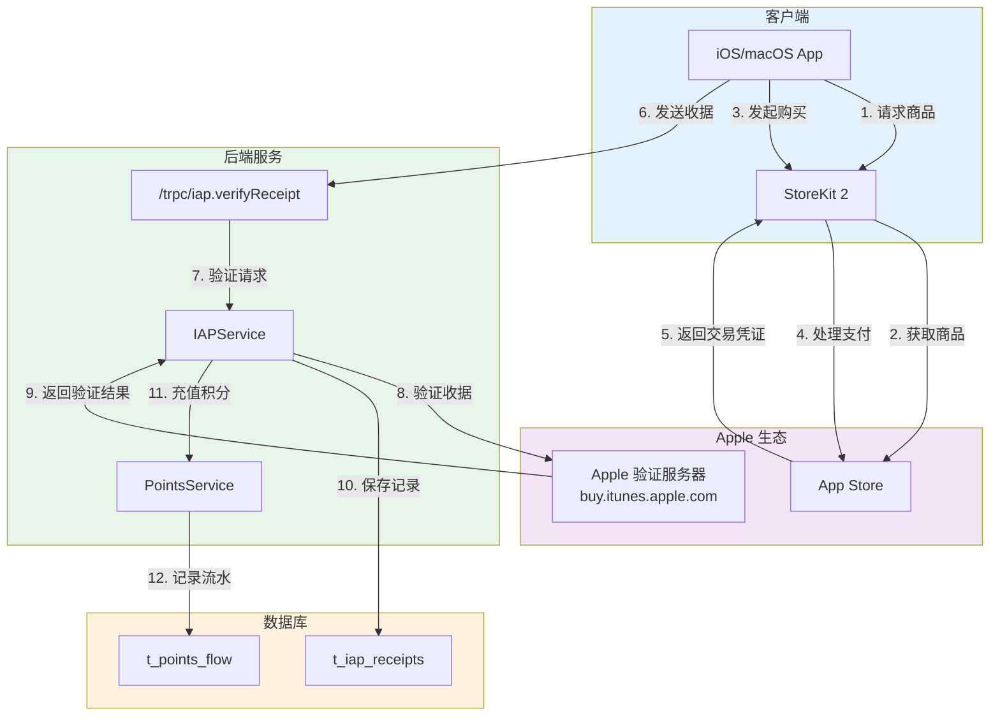
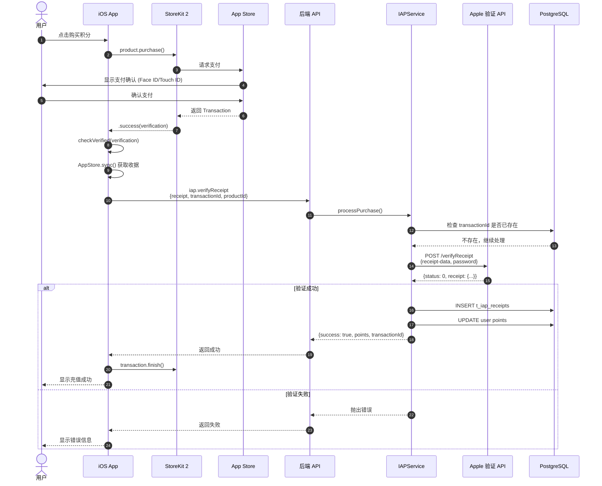
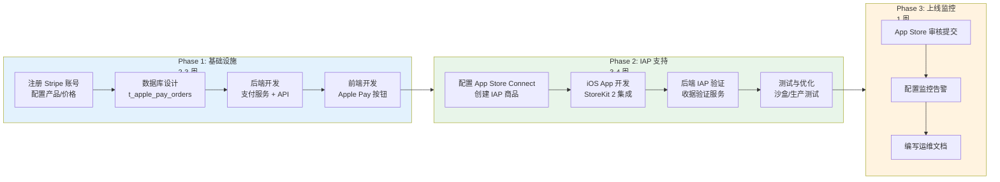
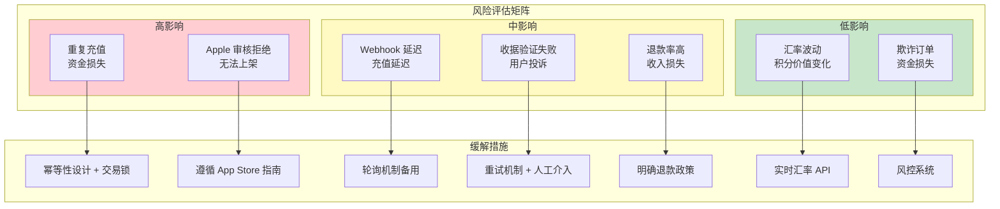
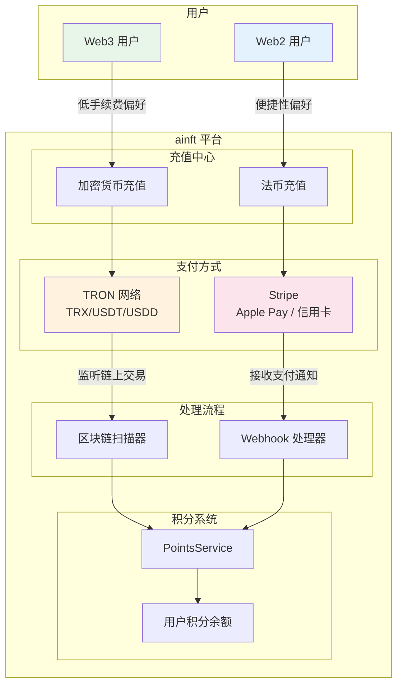
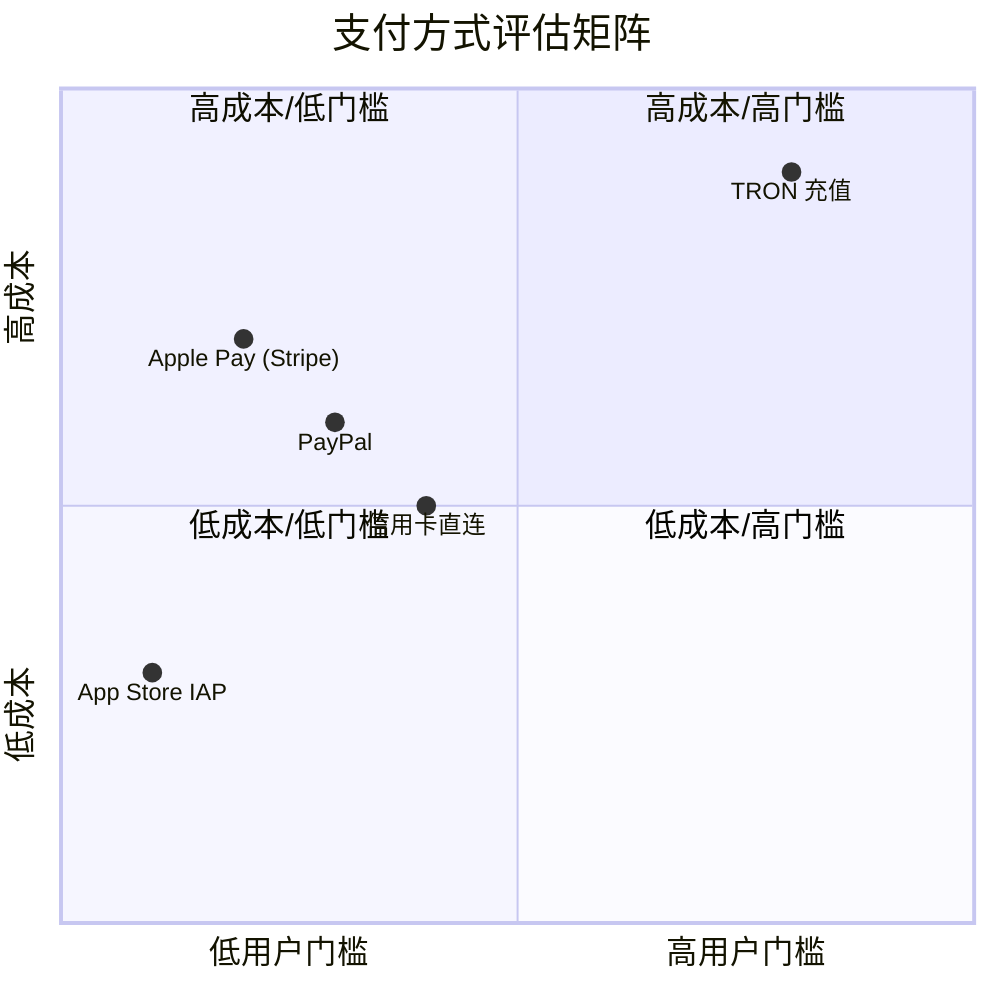
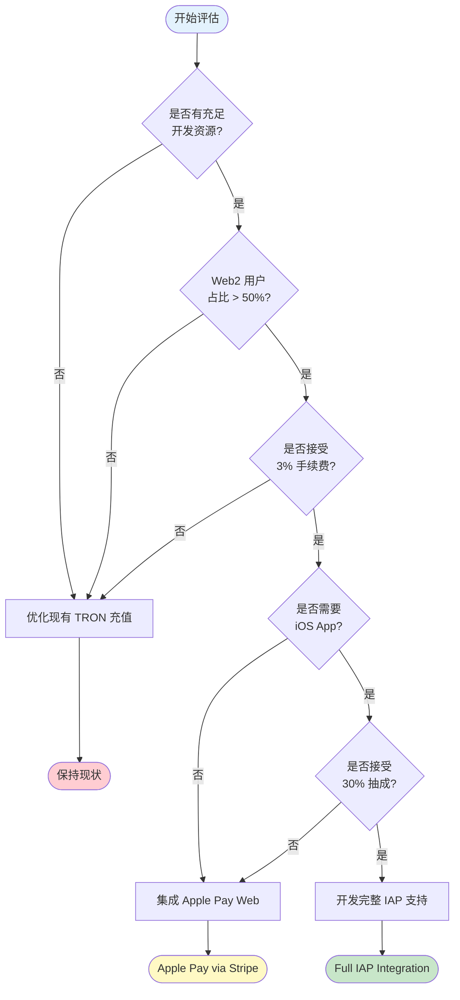

# Apple 支付技术方案

## 当前状态

❌ **ainft 平台当前不支持 Apple 支付**

### 现有支付方式

ainft 使用基于 **TRON 区块链的加密货币充值系统**：

- ✅ TRX（TRON 原生代币）
- ✅ USDT（TRC20）
- ✅ USDD（TRC20）
- ✅ USD1（TRC20）
- ✅ NFT（TRC20）

**充值流程**：
1. 用户转账加密货币到平台钱包地址
2. 后端扫描器监听区块链交易
3. 自动识别并确认充值
4. 按汇率计算并充值积分

---

## Apple 支付方式概述

Apple 提供两种主要的支付方式：

### 1. Apple Pay

**适用场景**: Web 和 App 的实体商品、服务购买

**特点**:
- 支持信用卡/借记卡支付
- 快速便捷，支持 Face ID / Touch ID
- 适合一次性购买
- Web 和 App 均可使用

**支付流程**:
```
用户选择商品 → 点击 Apple Pay → 认证（Face ID）→ 完成支付
```

### 2. App Store In-App Purchase (IAP)

**适用场景**: iOS/macOS App 内的数字商品

**特点**:
- Apple 强制使用（App Store 政策）
- Apple 抽成 15-30%
- 支持订阅、消耗品、非消耗品
- 仅限 App 内使用

**支付流程**:
```
用户选择商品 → 调用 IAP → Apple 处理支付 → 后端验证收据
```

---

## 技术方案

### 方案 A: Apple Pay（推荐用于 Web）

#### 1. 架构设计



**架构说明**:
- **前端层**: Web 应用和 iOS/macOS App 提供用户交互界面
- **SDK 层**: Apple Pay SDK 处理支付请求，StoreKit 2 处理应用内购买
- **支付网关**: 支持多种支付渠道（Stripe、Adyen、PayPal）和 App Store Connect
- **后端层**: tRPC API 处理业务逻辑，Webhook 接收支付通知，IAP 验证服务验证收据
- **数据层**: PostgreSQL 存储订单和交易数据，Redis 提供缓存支持
- **外部服务**: Apple 服务器用于验证 IAP 收据

#### 2. 技术选型

##### 技术选型对比



##### 选项 1: Stripe Payment（推荐）

**优势**:
- 成熟稳定，全球通用
- 完整的 Apple Pay 支持
- 丰富的 SDK 和文档
- 支持多种货币
- Webhook 通知可靠

**费率**:
- 2.9% + $0.30 per transaction (美国)
- 各国费率不同

**集成复杂度**: ⭐⭐⭐ (中等)

##### 选项 2: Adyen

**优势**:
- 企业级支付平台
- 支持全球支付方式
- 更低的费率（大客户）
- 强大的风控系统

**费率**:
- 需要联系销售
- 通常比 Stripe 低

**集成复杂度**: ⭐⭐⭐⭐ (较高)

##### 选项 3: PayPal

**优势**:
- 用户基础大
- 支持 Apple Pay
- 简单易用

**费率**:
- 2.9% + $0.30 per transaction

**集成复杂度**: ⭐⭐ (简单)

#### 3. 数据库设计

新增表：`t_apple_pay_orders`

```typescript
export const applePayOrders = pgTable('t_apple_pay_orders', {
  id: varchar('id', { length: 64 }).primaryKey(),
  userId: varchar('user_id', { length: 64 })
    .references(() => users.id, { onDelete: 'cascade' })
    .notNull(),
  
  // 支付信息
  amount: integer('amount').notNull(),  // 支付金额（美分）
  currency: varchar('currency', { length: 3 }).notNull().default('USD'),
  points: integer('points').notNull(),  // 充值积分数
  
  // 支付网关信息
  paymentGateway: varchar('payment_gateway', { length: 32 }).notNull(), // 'stripe', 'paypal', etc.
  paymentIntentId: varchar('payment_intent_id', { length: 128 }),  // Stripe Payment Intent ID
  transactionId: varchar('transaction_id', { length: 128 }),  // 支付网关交易 ID
  
  // 状态
  status: varchar('status', { length: 32 })
    .notNull()
    .default('pending'),  // pending, processing, succeeded, failed, refunded
  
  // Apple Pay 特定
  applePayToken: text('apple_pay_token'),  // Apple Pay token (encrypted)
  
  // 元数据
  metadata: jsonb('metadata'),  // 额外信息
  
  // 时间戳
  createdAt: timestamp('created_at').notNull().defaultNow(),
  updatedAt: timestamp('updated_at').notNull().defaultNow(),
  paidAt: timestamp('paid_at'),
  refundedAt: timestamp('refunded_at'),
}, (table) => [
  index('idx_apple_pay_orders_user_id').on(table.userId),
  index('idx_apple_pay_orders_status').on(table.status),
  index('idx_apple_pay_orders_payment_intent').on(table.paymentIntentId),
]);
```

#### 4. API 设计

##### 创建支付订单

**接口**: `POST /trpc/payment.createApplePayOrder`

**输入**:
```typescript
{
  packageId: string;  // 套餐 ID
  amount: number;     // 金额（美元）
  currency?: string;  // 货币（默认 USD）
}
```

**返回**:
```typescript
{
  orderId: string;
  clientSecret: string;  // Stripe client secret（用于前端）
  amount: number;
  currency: string;
  points: number;        // 将获得的积分
}
```

##### 确认支付

**接口**: `POST /trpc/payment.confirmApplePayOrder`

**输入**:
```typescript
{
  orderId: string;
  paymentIntentId: string;
}
```

**返回**:
```typescript
{
  success: boolean;
  points: number;
  balance: number;  // 充值后余额
}
```

##### Webhook 处理

**接口**: `POST /api/webhooks/stripe`

处理 Stripe 的 Webhook 通知：
- `payment_intent.succeeded`
- `payment_intent.payment_failed`
- `charge.refunded`

#### 5. 后端实现

##### 支付服务流程



##### 支付服务

创建 `src/server/services/payment/stripe.ts`:

```typescript
import Stripe from 'stripe';
import { PointsService } from '@/server/services/points';
import { PointFlowSourceType } from '@/types/points';

const stripe = new Stripe(process.env.STRIPE_SECRET_KEY!, {
  apiVersion: '2023-10-16',
});

export class StripePaymentService {
  constructor(
    private db: LobeChatDatabase,
    private userId: string,
  ) {}

  /**
   * 创建 Apple Pay 支付意图
   */
  async createApplePayIntent(params: {
    amount: number;      // 美元金额
    currency: string;
    points: number;
    metadata?: object;
  }) {
    const { amount, currency, points, metadata } = params;

    // 创建 Stripe Payment Intent
    const paymentIntent = await stripe.paymentIntents.create({
      amount: Math.round(amount * 100),  // 转换为美分
      currency: currency.toLowerCase(),
      payment_method_types: ['card'],  // Apple Pay 使用 card 类型
      metadata: {
        userId: this.userId,
        points: String(points),
        ...metadata,
      },
    });

    // 创建订单记录
    await this.db.insert(applePayOrders).values({
      id: paymentIntent.id,
      userId: this.userId,
      amount: Math.round(amount * 100),
      currency: currency.toUpperCase(),
      points,
      paymentGateway: 'stripe',
      paymentIntentId: paymentIntent.id,
      status: 'pending',
      metadata: metadata as any,
    });

    return {
      orderId: paymentIntent.id,
      clientSecret: paymentIntent.client_secret!,
      amount,
      currency,
      points,
    };
  }

  /**
   * 处理支付成功
   */
  async handlePaymentSuccess(paymentIntentId: string) {
    // 获取订单
    const order = await this.db.query.applePayOrders.findFirst({
      where: eq(applePayOrders.paymentIntentId, paymentIntentId),
    });

    if (!order) {
      throw new Error('Order not found');
    }

    if (order.status === 'succeeded') {
      // 已处理，避免重复充值
      return;
    }

    // 更新订单状态
    await this.db.update(applePayOrders)
      .set({
        status: 'succeeded',
        paidAt: new Date(),
        updatedAt: new Date(),
      })
      .where(eq(applePayOrders.id, order.id));

    // 充值积分
    const pointsService = new PointsService(this.db);
    await pointsService.creditPoints(order.userId, order.points, {
      sourceType: PointFlowSourceType.ApplePay,
      sourceId: order.id,
    });

    return {
      success: true,
      points: order.points,
    };
  }

  /**
   * 处理退款
   */
  async handleRefund(paymentIntentId: string) {
    const order = await this.db.query.applePayOrders.findFirst({
      where: eq(applePayOrders.paymentIntentId, paymentIntentId),
    });

    if (!order) return;

    // 更新订单状态
    await this.db.update(applePayOrders)
      .set({
        status: 'refunded',
        refundedAt: new Date(),
        updatedAt: new Date(),
      })
      .where(eq(applePayOrders.id, order.id));

    // 扣除积分
    const pointsService = new PointsService(this.db);
    await pointsService.deductPoints(order.userId, order.points, {
      sourceType: PointFlowSourceType.Refund,
      sourceId: order.id,
    });
  }
}
```

##### tRPC Router

创建 `src/server/routers/lambda/payment.ts`:

```typescript
import { z } from 'zod';
import { authedProcedure, router } from '@/libs/trpc/lambda';
import { serverDatabase } from '@/libs/trpc/lambda/middleware';
import { StripePaymentService } from '@/server/services/payment/stripe';

const paymentProcedure = authedProcedure.use(serverDatabase);

export const paymentRouter = router({
  /**
   * 创建 Apple Pay 订单
   */
  createApplePayOrder: paymentProcedure
    .input(
      z.object({
        packageId: z.string(),
        amount: z.number().positive(),
        currency: z.string().default('USD'),
      })
    )
    .mutation(async ({ ctx, input }) => {
      const paymentService = new StripePaymentService(
        ctx.serverDB,
        ctx.userId
      );

      // 计算积分（1 USD = 1,000,000 积分）
      const points = Math.floor(input.amount * 1_000_000);

      return paymentService.createApplePayIntent({
        amount: input.amount,
        currency: input.currency,
        points,
        metadata: {
          packageId: input.packageId,
        },
      });
    }),

  /**
   * 确认支付
   */
  confirmApplePayOrder: paymentProcedure
    .input(
      z.object({
        orderId: z.string(),
        paymentIntentId: z.string(),
      })
    )
    .mutation(async ({ ctx, input }) => {
      const paymentService = new StripePaymentService(
        ctx.serverDB,
        ctx.userId
      );

      const result = await paymentService.handlePaymentSuccess(
        input.paymentIntentId
      );

      // 获取用户余额
      const pointsService = new PointsService(ctx.serverDB);
      const balance = await pointsService.getUserBalance(ctx.userId);

      return {
        ...result,
        balance,
      };
    }),

  /**
   * 获取订单列表
   */
  getApplePayOrders: paymentProcedure
    .input(
      z.object({
        page: z.number().min(1).default(1),
        pageSize: z.number().min(1).max(100).default(20),
      }).optional()
    )
    .query(async ({ ctx, input }) => {
      const page = input?.page ?? 1;
      const pageSize = input?.pageSize ?? 20;
      const offset = (page - 1) * pageSize;

      const orders = await ctx.serverDB
        .select()
        .from(applePayOrders)
        .where(eq(applePayOrders.userId, ctx.userId))
        .orderBy(desc(applePayOrders.createdAt))
        .limit(pageSize)
        .offset(offset);

      const total = await ctx.serverDB
        .select({ count: count() })
        .from(applePayOrders)
        .where(eq(applePayOrders.userId, ctx.userId));

      return {
        data: orders,
        page,
        pageSize,
        total: total[0].count,
      };
    }),
});
```

##### Webhook 处理

创建 `src/app/(backend)/api/webhooks/stripe/route.ts`:

```typescript
import { headers } from 'next/headers';
import Stripe from 'stripe';
import { getServerDB } from '@/database/server';
import { StripePaymentService } from '@/server/services/payment/stripe';

const stripe = new Stripe(process.env.STRIPE_SECRET_KEY!, {
  apiVersion: '2023-10-16',
});

const webhookSecret = process.env.STRIPE_WEBHOOK_SECRET!;

export async function POST(req: Request) {
  const body = await req.text();
  const signature = headers().get('stripe-signature')!;

  let event: Stripe.Event;

  try {
    // 验证 Webhook 签名
    event = stripe.webhooks.constructEvent(body, signature, webhookSecret);
  } catch (err) {
    console.error('Webhook 签名验证失败:', err);
    return new Response('Webhook Error', { status: 400 });
  }

  const db = await getServerDB();

  try {
    switch (event.type) {
      case 'payment_intent.succeeded': {
        const paymentIntent = event.data.object as Stripe.PaymentIntent;
        const userId = paymentIntent.metadata.userId;
        
        if (userId) {
          const service = new StripePaymentService(db, userId);
          await service.handlePaymentSuccess(paymentIntent.id);
          console.log('✅ 支付成功处理完成:', paymentIntent.id);
        }
        break;
      }

      case 'payment_intent.payment_failed': {
        const paymentIntent = event.data.object as Stripe.PaymentIntent;
        
        // 更新订单状态为失败
        await db.update(applePayOrders)
          .set({ 
            status: 'failed',
            updatedAt: new Date(),
          })
          .where(eq(applePayOrders.paymentIntentId, paymentIntent.id));
        
        console.log('❌ 支付失败:', paymentIntent.id);
        break;
      }

      case 'charge.refunded': {
        const charge = event.data.object as Stripe.Charge;
        const paymentIntentId = charge.payment_intent as string;
        
        const order = await db.query.applePayOrders.findFirst({
          where: eq(applePayOrders.paymentIntentId, paymentIntentId),
        });

        if (order) {
          const service = new StripePaymentService(db, order.userId);
          await service.handleRefund(paymentIntentId);
          console.log('↩️ 退款处理完成:', paymentIntentId);
        }
        break;
      }

      default:
        console.log('未处理的事件类型:', event.type);
    }

    return new Response(JSON.stringify({ received: true }), { status: 200 });
  } catch (error) {
    console.error('Webhook 处理错误:', error);
    return new Response('Webhook Handler Error', { status: 500 });
  }
}
```

#### 6. 前端实现

##### 安装依赖

```bash
pnpm add @stripe/stripe-js @stripe/react-stripe-js
```

##### Apple Pay 按钮组件

```tsx
'use client';

import { useState, useEffect } from 'react';
import { 
  PaymentRequestButtonElement,
  useStripe,
  useElements,
} from '@stripe/react-stripe-js';
import { loadStripe } from '@stripe/stripe-js';

// 初始化 Stripe
const stripePromise = loadStripe(process.env.NEXT_PUBLIC_STRIPE_PUBLISHABLE_KEY!);

export function ApplePayButton({ 
  packageId,
  amount,
  points 
}: {
  packageId: string;
  amount: number;
  points: number;
}) {
  const stripe = useStripe();
  const elements = useElements();
  const [paymentRequest, setPaymentRequest] = useState<any>(null);

  useEffect(() => {
    if (!stripe) return;

    const pr = stripe.paymentRequest({
      country: 'US',
      currency: 'usd',
      total: {
        label: `充值 ${points.toLocaleString()} 积分`,
        amount: amount * 100,  // 转换为美分
      },
      requestPayerName: true,
      requestPayerEmail: true,
    });

    // 检查是否支持 Apple Pay
    pr.canMakePayment().then((result) => {
      if (result) {
        setPaymentRequest(pr);
      }
    });

    // 处理支付
    pr.on('paymentmethod', async (ev) => {
      try {
        // 创建订单
        const order = await trpc.payment.createApplePayOrder.mutate({
          packageId,
          amount,
          currency: 'USD',
        });

        // 确认支付
        const { error, paymentIntent } = await stripe.confirmCardPayment(
          order.clientSecret,
          { payment_method: ev.paymentMethod.id },
          { handleActions: false }
        );

        if (error) {
          ev.complete('fail');
          alert('支付失败: ' + error.message);
        } else if (paymentIntent.status === 'requires_action') {
          ev.complete('success');
          // 处理 3D Secure
          await stripe.confirmCardPayment(order.clientSecret);
        } else {
          ev.complete('success');
          
          // 确认订单
          await trpc.payment.confirmApplePayOrder.mutate({
            orderId: order.orderId,
            paymentIntentId: paymentIntent.id,
          });

          alert('✅ 充值成功！');
        }
      } catch (error) {
        ev.complete('fail');
        console.error('支付错误:', error);
      }
    });
  }, [stripe, packageId, amount, points]);

  if (!paymentRequest) {
    return null;  // Apple Pay 不可用
  }

  return (
    <PaymentRequestButtonElement 
      options={{ paymentRequest }}
      className="w-full"
    />
  );
}
```

##### 完整支付页面

```tsx
'use client';

import { Elements } from '@stripe/react-stripe-js';
import { loadStripe } from '@stripe/stripe-js';
import { ApplePayButton } from './ApplePayButton';

const stripePromise = loadStripe(
  process.env.NEXT_PUBLIC_STRIPE_PUBLISHABLE_KEY!
);

export default function RechargeWithApplePay() {
  const packages = [
    { id: 'basic', amount: 10, points: 10_000_000, label: '基础套餐' },
    { id: 'pro', amount: 50, points: 50_000_000, label: '专业套餐' },
    { id: 'ultimate', amount: 100, points: 100_000_000, label: '旗舰套餐' },
  ];

  return (
    <Elements stripe={stripePromise}>
      <div className="max-w-2xl mx-auto p-6">
        <h1 className="text-3xl font-bold mb-6">充值积分</h1>
        
        <div className="grid gap-4">
          {packages.map((pkg) => (
            <div 
              key={pkg.id}
              className="p-6 border rounded-lg hover:shadow-lg transition"
            >
              <div className="flex justify-between items-center mb-4">
                <div>
                  <h3 className="text-xl font-semibold">{pkg.label}</h3>
                  <p className="text-gray-600">
                    获得 {pkg.points.toLocaleString()} 积分
                  </p>
                </div>
                <div className="text-2xl font-bold">
                  ${pkg.amount}
                </div>
              </div>

              {/* Apple Pay 按钮 */}
              <ApplePayButton
                packageId={pkg.id}
                amount={pkg.amount}
                points={pkg.points}
              />

              {/* 备用支付方式 */}
              <button className="w-full mt-2 py-3 border rounded-lg hover:bg-gray-50">
                使用信用卡支付
              </button>
            </div>
          ))}
        </div>
      </div>
    </Elements>
  );
}
```

#### 7. 环境变量

```bash
# .env

# Stripe
STRIPE_SECRET_KEY=sk_live_xxxxxxxxxxxxxxxxxxxxxx
NEXT_PUBLIC_STRIPE_PUBLISHABLE_KEY=pk_live_xxxxxxxxxxxxxxxxxxxxxx
STRIPE_WEBHOOK_SECRET=whsec_xxxxxxxxxxxxxxxxxxxxxx
```

#### 8. 部署配置

##### Vercel 配置

```json
// vercel.json
{
  "env": {
    "STRIPE_SECRET_KEY": "@stripe-secret-key",
    "STRIPE_WEBHOOK_SECRET": "@stripe-webhook-secret"
  }
}
```

##### Webhook 端点配置

在 Stripe Dashboard 中配置 Webhook：

```
Endpoint URL: https://your-domain.com/api/webhooks/stripe

Events to send:
- payment_intent.succeeded
- payment_intent.payment_failed
- charge.refunded
```

---

### 方案 B: App Store In-App Purchase（用于原生 App）

#### 1. 架构设计



**IAP 流程说明**:
1. App 通过 StoreKit 2 向 App Store 请求商品信息
2. 用户发起购买，StoreKit 处理支付流程
3. 支付成功后，App Store 返回交易凭证
4. App 将收据发送到后端验证
5. 后端调用 Apple 服务器验证收据真实性
6. 验证通过后，为用户充值积分

#### 2. 商品配置

在 App Store Connect 中配置 IAP 商品：

| Product ID | Type | Price | Points |
|------------|------|-------|--------|
| com.ainft.points.10 | Consumable | $9.99 | 10,000,000 |
| com.ainft.points.50 | Consumable | $49.99 | 50,000,000 |
| com.ainft.points.100 | Consumable | $99.99 | 100,000,000 |

#### 3. 数据库设计

新增表：`t_iap_receipts`

```typescript
export const iapReceipts = pgTable('t_iap_receipts', {
  id: varchar('id', { length: 64 }).primaryKey(),
  userId: varchar('user_id', { length: 64 })
    .references(() => users.id, { onDelete: 'cascade' })
    .notNull(),
  
  // IAP 信息
  transactionId: varchar('transaction_id', { length: 128 }).notNull().unique(),
  originalTransactionId: varchar('original_transaction_id', { length: 128 }),
  productId: varchar('product_id', { length: 128 }).notNull(),
  
  // 金额和积分
  price: integer('price').notNull(),  // 美分
  currency: varchar('currency', { length: 3 }).notNull(),
  points: integer('points').notNull(),
  
  // 收据
  receipt: text('receipt').notNull(),  // Base64 编码的收据
  environment: varchar('environment', { length: 32 }),  // 'Production' | 'Sandbox'
  
  // 状态
  status: varchar('status', { length: 32 }).notNull().default('pending'),
  
  // 时间
  purchaseDate: timestamp('purchase_date'),
  createdAt: timestamp('created_at').notNull().defaultNow(),
  verifiedAt: timestamp('verified_at'),
}, (table) => [
  index('idx_iap_receipts_user_id').on(table.userId),
  index('idx_iap_receipts_transaction_id').on(table.transactionId),
]);
```

#### 4. 后端实现

##### IAP 购买时序图



##### IAP 验证服务

创建 `src/server/services/payment/iap.ts`:

```typescript
import { PointsService } from '@/server/services/points';
import { PointFlowSourceType } from '@/types/points';

// Apple IAP 收据验证
const PRODUCTION_VERIFY_URL = 'https://buy.itunes.apple.com/verifyReceipt';
const SANDBOX_VERIFY_URL = 'https://sandbox.itunes.apple.com/verifyReceipt';

export class IAPService {
  constructor(
    private db: LobeChatDatabase,
    private userId: string,
  ) {}

  /**
   * 验证 App Store 收据
   */
  async verifyReceipt(receipt: string, isProduction = true) {
    const url = isProduction ? PRODUCTION_VERIFY_URL : SANDBOX_VERIFY_URL;
    const password = process.env.APP_STORE_SHARED_SECRET!;

    const response = await fetch(url, {
      method: 'POST',
      headers: { 'Content-Type': 'application/json' },
      body: JSON.stringify({
        'receipt-data': receipt,
        'password': password,
        'exclude-old-transactions': true,
      }),
    });

    const result = await response.json();

    // 状态码 21007 表示沙盒收据，需要切换到沙盒环境验证
    if (result.status === 21007 && isProduction) {
      return this.verifyReceipt(receipt, false);
    }

    return result;
  }

  /**
   * 处理 IAP 购买
   */
  async processPurchase(params: {
    receipt: string;
    transactionId: string;
    productId: string;
  }) {
    const { receipt, transactionId, productId } = params;

    // 检查交易是否已处理
    const exists = await this.db.query.iapReceipts.findFirst({
      where: eq(iapReceipts.transactionId, transactionId),
    });

    if (exists) {
      throw new Error('Transaction already processed');
    }

    // 验证收据
    const verifyResult = await this.verifyReceipt(receipt);

    if (verifyResult.status !== 0) {
      throw new Error(`Receipt verification failed: ${verifyResult.status}`);
    }

    // 从收据中提取交易信息
    const latestReceipt = verifyResult.latest_receipt_info?.[0];
    if (!latestReceipt) {
      throw new Error('No transaction found in receipt');
    }

    // 获取商品价格和积分（从配置或数据库）
    const productConfig = await this.getProductConfig(productId);
    if (!productConfig) {
      throw new Error('Invalid product ID');
    }

    // 创建 IAP 记录
    await this.db.insert(iapReceipts).values({
      id: transactionId,
      userId: this.userId,
      transactionId,
      originalTransactionId: latestReceipt.original_transaction_id,
      productId,
      price: productConfig.price,
      currency: productConfig.currency,
      points: productConfig.points,
      receipt,
      environment: verifyResult.environment,
      status: 'verified',
      purchaseDate: new Date(Number(latestReceipt.purchase_date_ms)),
      verifiedAt: new Date(),
    });

    // 充值积分
    const pointsService = new PointsService(this.db);
    await pointsService.creditPoints(this.userId, productConfig.points, {
      sourceType: PointFlowSourceType.IAP,
      sourceId: transactionId,
    });

    return {
      success: true,
      points: productConfig.points,
      transactionId,
    };
  }

  /**
   * 获取商品配置
   */
  private async getProductConfig(productId: string) {
    const configs: Record<string, { price: number; currency: string; points: number }> = {
      'com.ainft.points.10': { price: 999, currency: 'USD', points: 10_000_000 },
      'com.ainft.points.50': { price: 4999, currency: 'USD', points: 50_000_000 },
      'com.ainft.points.100': { price: 9999, currency: 'USD', points: 100_000_000 },
    };

    return configs[productId];
  }
}
```

##### API 路由

```typescript
// src/server/routers/lambda/iap.ts
import { z } from 'zod';
import { authedProcedure, router } from '@/libs/trpc/lambda';
import { IAPService } from '@/server/services/payment/iap';

export const iapRouter = router({
  /**
   * 验证 IAP 收据并充值
   */
  verifyReceipt: authedProcedure
    .input(
      z.object({
        receipt: z.string(),
        transactionId: z.string(),
        productId: z.string(),
      })
    )
    .mutation(async ({ ctx, input }) => {
      const iapService = new IAPService(ctx.serverDB, ctx.userId);
      return iapService.processPurchase(input);
    }),

  /**
   * 获取 IAP 购买记录
   */
  getIAPHistory: authedProcedure
    .input(
      z.object({
        page: z.number().min(1).default(1),
        pageSize: z.number().min(1).max(100).default(20),
      }).optional()
    )
    .query(async ({ ctx, input }) => {
      // 查询 IAP 记录
      // ...
    }),
});
```

##### iOS 前端（Swift）

```swift
import StoreKit

class IAPManager: ObservableObject {
    @Published var products: [Product] = []
    
    // 加载商品
    func loadProducts() async {
        do {
            products = try await Product.products(for: [
                "com.ainft.points.10",
                "com.ainft.points.50",
                "com.ainft.points.100"
            ])
        } catch {
            print("加载商品失败: \(error)")
        }
    }
    
    // 购买
    func purchase(_ product: Product) async throws -> String? {
        let result = try await product.purchase()
        
        switch result {
        case .success(let verification):
            // 验证收据
            let transaction = try checkVerified(verification)
            
            // 发送收据到后端验证
            await verifyReceiptOnServer(transaction)
            
            // 完成交易
            await transaction.finish()
            
            return transaction.id
            
        case .userCancelled:
            return nil
            
        case .pending:
            return nil
            
        @unknown default:
            return nil
        }
    }
    
    // 发送到后端验证
    func verifyReceiptOnServer(_ transaction: Transaction) async {
        // 获取收据
        guard let receiptData = try? await AppStore.sync() else {
            return
        }
        
        // 调用后端 API
        let request = VerifyReceiptRequest(
            receipt: receiptData.base64EncodedString(),
            transactionId: String(transaction.id),
            productId: transaction.productID
        )
        
        // TODO: 调用 tRPC API
        // await trpc.iap.verifyReceipt(request)
    }
    
    func checkVerified<T>(_ result: VerificationResult<T>) throws -> T {
        switch result {
        case .unverified:
            throw IAPError.failedVerification
        case .verified(let safe):
            return safe
        }
    }
}

enum IAPError: Error {
    case failedVerification
}
```

##### iOS 前端（SwiftUI）

```swift
struct RechargeView: View {
    @StateObject private var iapManager = IAPManager()
    
    var body: some View {
        List(iapManager.products) { product in
            HStack {
                VStack(alignment: .leading) {
                    Text(product.displayName)
                        .font(.headline)
                    Text("获得 \(pointsForProduct(product)) 积分")
                        .font(.subheadline)
                        .foregroundColor(.gray)
                }
                
                Spacer()
                
                Button(product.displayPrice) {
                    Task {
                        try? await iapManager.purchase(product)
                    }
                }
                .buttonStyle(.borderedProminent)
            }
        }
        .task {
            await iapManager.loadProducts()
        }
    }
    
    func pointsForProduct(_ product: Product) -> String {
        switch product.id {
        case "com.ainft.points.10":
            return "10,000,000"
        case "com.ainft.points.50":
            return "50,000,000"
        case "com.ainft.points.100":
            return "100,000,000"
        default:
            return "0"
        }
    }
}
```

---

## 实施计划

### 实施流程图



### Phase 1: 基础设施（2-3 周）

**Week 1**: 支付网关集成
- [ ] 注册 Stripe 账号并完成 KYC
- [ ] 配置 Stripe 产品和价格
- [ ] 集成 Stripe SDK

**Week 2**: 后端开发
- [ ] 设计数据库表
- [ ] 实现支付服务
- [ ] 实现 tRPC Router
- [ ] 实现 Webhook 处理

**Week 3**: 前端开发
- [ ] 实现 Apple Pay 按钮
- [ ] 实现充值页面
- [ ] 实现订单列表页面

### Phase 2: IAP 支持（3-4 周）

**Week 4-5**: iOS App 开发
- [ ] 配置 App Store Connect
- [ ] 实现 StoreKit 2 集成
- [ ] 实现收据验证

**Week 6-7**: 测试与优化
- [ ] 沙盒环境测试
- [ ] 生产环境测试
- [ ] 性能优化

### Phase 3: 上线与监控（1 周）

**Week 8**: 发布
- [ ] 提交 App Store 审核
- [ ] 配置监控告警
- [ ] 编写运维文档

---

## 成本估算

### 开发成本

| 阶段 | 人力 | 时间 |
|------|------|------|
| 支付网关集成 | 1 后端 + 1 前端 | 1 周 |
| 数据库和 API | 1 后端 | 1 周 |
| Web 前端 | 1 前端 | 1 周 |
| iOS IAP | 1 iOS 开发 | 3 周 |
| 测试 | 1 QA | 1 周 |
| **总计** | **3-4 人** | **7-8 周** |

### 运营成本

| 项目 | 费用 |
|------|------|
| Stripe 交易费 | 2.9% + $0.30 / 笔 |
| Apple 抽成（IAP） | 15-30% |
| Apple Developer | $99 / 年 |
| 服务器成本 | $50 / 月（增量） |

### 月度预估（假设 1000 笔交易）

```
平均交易额: $50
总交易额: $50,000

Apple Pay (Stripe):
- 交易费: $50,000 × 2.9% + $0.30 × 1000 = $1,750
- 净收入: $48,250

App Store IAP:
- Apple 抽成: $50,000 × 30% = $15,000
- 净收入: $35,000
```

---

## 风险与挑战

### 风险矩阵



### 技术风险

| 风险 | 影响 | 缓解措施 |
|------|------|---------|
| Webhook 延迟 | 充值延迟 | 实现轮询机制备用 |
| 收据验证失败 | 用户无法充值 | 重试机制 + 人工介入 |
| 重复充值 | 资金损失 | 幂等性设计 + 交易锁 |
| 汇率波动 | 积分价值变化 | 实时汇率 API |

### 合规风险

| 风险 | 影响 | 缓解措施 |
|------|------|---------|
| Apple 审核拒绝 | 无法上架 | 遵循 App Store 指南 |
| 金融监管 | 业务受限 | 咨询法律顾问 |
| 数据隐私 | GDPR/CCPA | 合规的数据处理 |

### 业务风险

| 风险 | 影响 | 缓解措施 |
|------|------|---------|
| 退款率高 | 损失收入 | 明确退款政策 |
| 欺诈订单 | 资金损失 | 风控系统 |
| 用户流失 | 收入下降 | A/B 测试价格 |

---

## 替代方案

### 方案 C: 混合支付系统

保留现有的 TRON 充值，同时支持 Apple Pay：



**优势**:
- Web3 用户继续使用加密货币（低手续费）
- Web2 用户使用 Apple Pay（便捷）
- 最大化用户覆盖面

**实现**:

```typescript
// 统一的充值接口
const rechargeOptions = [
  {
    type: 'crypto',
    name: 'TRON 加密货币',
    fee: '0%',
    methods: ['TRX', 'USDT', 'USDD'],
  },
  {
    type: 'fiat',
    name: 'Apple Pay',
    fee: '2.9%',
    methods: ['信用卡', 'Apple Pay'],
  },
];
```

---

## 推荐方案

### 短期（3 个月内）

**保持现状 + 增强**：
- ✅ 优化现有 TRON 充值体验
- ✅ 添加更多加密货币支持（ETH, BNB 等）
- ✅ 改善充值到账速度
- ✅ 提供充值教程和客服支持

**理由**:
- 与平台 Web3 定位一致
- 无需支付手续费给第三方
- 无需 Apple 审核
- 开发成本低

### 中期（6-12 个月）

**添加 Apple Pay（Web）**：
- ✅ 通过 Stripe 集成 Apple Pay
- ✅ 仅限 Web 端使用
- ✅ 作为 TRON 充值的补充

**理由**:
- 降低 Web2 用户门槛
- 增加支付渠道多样性
- 相对简单（无需 App Store 审核）

### 长期（1 年以上）

**完整 IAP 支持**：
- ✅ 开发 iOS 原生应用
- ✅ 集成 App Store IAP
- ✅ 提交 App Store 审核

**前提条件**:
- iOS App 有足够用户需求
- 愿意接受 30% 抽成
- 有 iOS 开发团队

---

## 对比分析

### 支付方式对比图



### 详细对比表

| 维度 | TRON 充值（现有） | Apple Pay | App Store IAP |
|------|------------------|-----------|---------------|
| **手续费** | 链上 Gas 费（~$0.01） | 2.9% + $0.30 | 15-30% |
| **到账速度** | 3-5 分钟 | 即时 | 即时 |
| **用户门槛** | 需要钱包 | 低 | 最低 |
| **开发成本** | ✅ 已完成 | 中 | 高 |
| **维护成本** | 低 | 中 | 高 |
| **适用平台** | Web + App | Web + App | 仅 iOS/macOS App |
| **合规要求** | 低 | 中 | 高 |
| **审核要求** | 无 | 无 | 严格 |

---

## 决策建议

### 建议 1: 当前阶段不实施 Apple 支付

**理由**:
1. **高手续费**: Apple Pay 3%，IAP 30%，而 TRON 几乎免费
2. **定位冲突**: ainft 是 Web3 平台，应强化加密货币支付
3. **开发成本高**: 需要 2-3 个月开发时间
4. **维护复杂**: 需要处理退款、争议、审核等

### 建议 2: 优化现有充值体验

**优先级更高的改进**:

1. **降低充值门槛**:
   - 提供详细的充值教程
   - 集成钱包引导（如何安装 TronLink）
   - 支持更多钱包（MetaMask 跨链充值）

2. **提升充值速度**:
   - 优化区块链扫描器频率
   - 支持 1 个确认即到账（当前需要 3 个）
   - 添加充值进度追踪

3. **增加充值渠道**:
   - 支持以太坊（ETH）
   - 支持 BSC（BNB）
   - 支持其他主流公链

### 建议 3: 未来考虑 Apple Pay（仅 Web）

**如果满足以下条件**:

- ✅ 用户明确反馈需要传统支付
- ✅ Web2 用户占比 > 50%
- ✅ 愿意接受 3% 手续费
- ✅ 有充足的开发资源

**实施方式**:
- 仅集成 Apple Pay（通过 Stripe）
- 不做 App Store IAP
- 与 TRON 充值并存

---

## 总结

### 决策流程图



### 总结表

| 项目 | 结论 |
|------|------|
| **当前支持** | ❌ 不支持 Apple 支付 |
| **技术可行性** | ✅ 可行（需要 2-3 个月） |
| **成本效益** | ❌ 不建议（高手续费） |
| **推荐方案** | ✅ 优化现有 TRON 充值 |
| **长期规划** | 🔮 视用户需求决定 |

---

## 附录

### A. 相关文档

- [订单管理接口](../tRPC/lambda/order.md)
- [用户积分系统](../tRPC/lambda/user.md)
- [Stripe 文档](https://stripe.com/docs/apple-pay)
- [StoreKit 2 文档](https://developer.apple.com/storekit/)

### B. 环境变量清单

如果实施 Apple 支付，需要添加：

```bash
# Stripe
STRIPE_SECRET_KEY=sk_live_xxx
NEXT_PUBLIC_STRIPE_PUBLISHABLE_KEY=pk_live_xxx
STRIPE_WEBHOOK_SECRET=whsec_xxx

# App Store IAP
APP_STORE_SHARED_SECRET=xxx
NEXT_PUBLIC_IAP_ENABLED=true
```

### C. 数据库迁移

```sql
-- Apple Pay 订单表
CREATE TABLE t_apple_pay_orders (
  id VARCHAR(64) PRIMARY KEY,
  user_id VARCHAR(64) NOT NULL REFERENCES users(id) ON DELETE CASCADE,
  amount INTEGER NOT NULL,
  currency VARCHAR(3) NOT NULL DEFAULT 'USD',
  points INTEGER NOT NULL,
  payment_gateway VARCHAR(32) NOT NULL,
  payment_intent_id VARCHAR(128),
  transaction_id VARCHAR(128),
  status VARCHAR(32) NOT NULL DEFAULT 'pending',
  metadata JSONB,
  created_at TIMESTAMP NOT NULL DEFAULT NOW(),
  updated_at TIMESTAMP NOT NULL DEFAULT NOW(),
  paid_at TIMESTAMP,
  refunded_at TIMESTAMP
);

CREATE INDEX idx_apple_pay_orders_user_id ON t_apple_pay_orders(user_id);
CREATE INDEX idx_apple_pay_orders_status ON t_apple_pay_orders(status);

-- IAP 收据表
CREATE TABLE t_iap_receipts (
  id VARCHAR(64) PRIMARY KEY,
  user_id VARCHAR(64) NOT NULL REFERENCES users(id) ON DELETE CASCADE,
  transaction_id VARCHAR(128) NOT NULL UNIQUE,
  product_id VARCHAR(128) NOT NULL,
  price INTEGER NOT NULL,
  currency VARCHAR(3) NOT NULL,
  points INTEGER NOT NULL,
  receipt TEXT NOT NULL,
  status VARCHAR(32) NOT NULL DEFAULT 'pending',
  purchase_date TIMESTAMP,
  created_at TIMESTAMP NOT NULL DEFAULT NOW(),
  verified_at TIMESTAMP
);

CREATE INDEX idx_iap_receipts_user_id ON t_iap_receipts(user_id);
CREATE INDEX idx_iap_receipts_transaction_id ON t_iap_receipts(transaction_id);
```

---

最后更新: 2026-02-14
