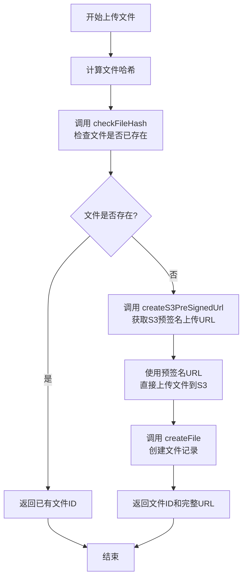

# File 文件管理接口

文件管理接口用于上传、查询、删除文件，以及管理文件的分块（chunk）和向量嵌入（embedding）任务。

## 接口列表

### getFiles

获取文件列表。

**类型**: `query`

**权限**: 需要认证

**输入参数**:

```typescript
{
  knowledgeBaseId?: string;        // 知识库 ID（可选）
  showFilesInKnowledgeBase?: boolean;  // 是否显示知识库中的文件
  current?: number;                // 当前页码
  pageSize?: number;               // 每页数量
}
```

**返回数据**:

```typescript
Array<{
  id: string;
  name: string;
  fileType: string;  // MIME 类型
  size: number;
  url: string;       // 完整 URL
  createdAt: string;
  updatedAt: string;
  knowledgeBaseId?: string;
  chunkCount?: number | null;
  chunkingStatus?: 'pending' | 'processing' | 'success' | 'error';
  chunkingError?: string | null;
  embeddingStatus?: 'pending' | 'processing' | 'success' | 'error';
  embeddingError?: string | null;
  finishEmbedding?: boolean;
}>
```

---

### getFileItemById

根据 ID 获取文件详情。

**类型**: `query`

**权限**: 需要认证

**输入参数**:

```typescript
{
  id: string;
}
```

**返回数据**:

```typescript
{
  id: string;
  name: string;
  fileType: string;
  size: number;
  url: string;
  createdAt: string;
  updatedAt: string;
  knowledgeBaseId?: string;
  chunkCount: number;
  chunkingStatus?: 'pending' | 'processing' | 'success' | 'error';
  chunkingError?: string | null;
  embeddingStatus?: 'pending' | 'processing' | 'success' | 'error';
  embeddingError?: string | null;
  finishEmbedding?: boolean;
}
```

**错误**:

- `NOT_FOUND`: 文件不存在

---

### findById

根据 ID 查找文件（基础信息）。

**类型**: `query`

**权限**: 需要认证

**输入参数**:

```typescript
{
  id: string;
}
```

**返回数据**:

```typescript
{
  id: string;
  name: string;
  fileType: string;
  size: number;
  url: string;
  // ... 其他基础字段
}
```

**错误**:

- `BAD_REQUEST`: 文件不存在

---

### createFile

创建文件记录（文件需先上传到存储）。

**类型**: `mutation`

**权限**: 需要认证

**输入参数**:

```typescript
{
  name: string;                    // 文件名
  fileType: string;                // MIME 类型，如 "image/jpeg"
  size: number;                    // 文件大小（字节）
  url: string;                     // 文件路径（相对于存储桶）
  hash?: string;                   // 文件哈希（如 SHA-256）
  knowledgeBaseId?: string | null; // 关联的知识库 ID（可选）
  metadata?: {                     // 文件元数据（可选）
    date?: string;
    dirname?: string;
    filename?: string;
    path?: string;
  };
}
```

**HTTP 示例**:

```bash
# POST，batch=1
curl --location 'https://chat-dev.ainft.com/trpc/lambda/file.createFile?batch=1' \
  -H 'Content-Type: application/json' \
  -H 'x-ainft-chat-auth: YOUR_AUTH_TOKEN' \
  --data '{"0":{"json":{"fileType":"image/jpeg","hash":"7913ef768f2e55fdda7d3f55eca7dcad35c8878bdcb2e9b3edc2edbb63a8efe0","metadata":{"date":"492196","dirname":"files/492196","filename":"bdd31faf-2267-477b-b610-ca05ede31bef.jpg","path":"files/492196/bdd31faf-2267-477b-b610-ca05ede31bef.jpg"},"name":"photo_2025-10-10_17-55-12.jpg","size":38544,"url":"files/492196/bdd31faf-2267-477b-b610-ca05ede31bef.jpg","knowledgeBaseId":null},"meta":{"values":{"knowledgeBaseId":["undefined"]},"v":1}}}'
```

**返回数据**:

```typescript
{
  id: string;   // 文件 ID
  url: string;  // 完整 URL（包含存储桶域名）
}
```

**返回示例**:

```json
{
  "result": {
    "data": {
      "json": {
        "id": "file_6T5L0VjLELig",
        "url": "https://ainft-chat-dev.s3.ap-southeast-1.amazonaws.com/files/492196/bdd31faf-2267-477b-b610-ca05ede31bef.jpg"
      }
    }
  }
}
```

**说明**:

- 会检查文件哈希，避免重复上传
- 如果哈希已存在，仅创建关联记录
- 返回的 `url` 是完整的 CDN/存储 URL，可直接访问
- `knowledgeBaseId` 为 `null` 时表示不关联到任何知识库

---

### checkFileHash

检查文件哈希是否已存在。

**类型**: `mutation`

**权限**: 需要认证

**输入参数**:

```typescript
{
  hash: string;  // 文件哈希值（如 SHA-256）
}
```

**HTTP 示例**:

```bash
# POST，batch=1
curl --location 'https://chat-dev.ainft.com/trpc/lambda/file.checkFileHash?batch=1' \
  -H 'Content-Type: application/json' \
  -H 'x-ainft-chat-auth: YOUR_AUTH_TOKEN' \
  --data '{"0":{"json":{"hash":"7913ef768f2e55fdda7d3f55eca7dcad35c8878bdcb2e9b3edc2edbb63a8efe0"}}}'
```

**返回数据**:

```typescript
{
  isExist: boolean;      // 文件是否已存在
  fileId?: string;       // 如果存在，返回文件 ID
}
```

**返回示例**:

```json
{
  "result": {
    "data": {
      "json": {
        "isExist": false
      }
    }
  }
}
```

**说明**:
- `isExist` 为 `false` 表示文件不存在，可以上传
- `isExist` 为 `true` 时，`fileId` 字段会返回已存在文件的 ID

---

### removeFile

删除单个文件。

**类型**: `mutation`

**权限**: 需要认证

**输入参数**:

```typescript
{
  id: string;  // 文件 ID
}
```

**HTTP 示例**:

```bash
# POST，batch=1
curl --location 'https://chat-dev.ainft.com/trpc/lambda/file.removeFile?batch=1' \
  -H 'Content-Type: application/json' \
  -H 'x-ainft-chat-auth: YOUR_AUTH_TOKEN' \
  --data '{"0":{"json":{"id":"file_CkxhlUCovQ7V"}}}'
```

**返回数据**:

```typescript
null  // 删除成功返回 null
```

**返回示例**:

```json
{
  "result": {
    "data": {
      "json": null,
      "meta": {
        "values": ["undefined"],
        "v": 1
      }
    }
  }
}
```

**说明**:

- 会从存储（S3）中删除文件
- 会删除关联的分块和嵌入数据
- 删除成功返回 `null`

---

### removeFiles

批量删除文件。

**类型**: `mutation`

**权限**: 需要认证

**输入参数**:

```typescript
{
  ids: string[];
}
```

**返回数据**:

```typescript
void
```

**说明**:

- 批量从存储中删除文件
- 删除所有关联数据

---

### removeAllFiles

删除所有文件。

**类型**: `mutation`

**权限**: 需要认证

**输入参数**: 无

**返回数据**:

```typescript
void
```

---

### removeFileAsyncTask

删除文件的异步任务（分块或嵌入）。

**类型**: `mutation`

**权限**: 需要认证

**输入参数**:

```typescript
{
  id: string;
  type: 'embedding' | 'chunk';
}
```

**返回数据**:

```typescript
void
```

**说明**:

- 用于清除失败的异步任务
- 允许重新触发处理

---

## 文件上传流程



### 流程说明

1. **计算文件哈希**：客户端计算文件的 SHA-256 哈希值
2. **检查文件是否存在**：调用 `file.checkFileHash` 接口，避免重复上传
3. **获取预签名 URL**：调用 `upload.createS3PreSignedUrl` 获取 S3 直传地址
4. **上传文件到 S3**：使用预签名 URL 直接上传文件到存储桶
5. **创建文件记录**：调用 `file.createFile` 在数据库中创建文件记录

---

## 使用示例

### 获取文件列表

```typescript
// 获取所有文件
const allFiles = await trpc.file.getFiles.query({});

// 获取特定知识库的文件
const kbFiles = await trpc.file.getFiles.query({
  knowledgeBaseId: 'kb-id'
});

// 分页查询
const page1 = await trpc.file.getFiles.query({
  current: 1,
  pageSize: 20
});
```

### 上传文件的完整流程

```typescript
// 1. 计算文件哈希（如 SHA-256）
const fileHash = await calculateHash(file);

// 2. 检查文件是否已存在
const { isExist, fileId } = await trpc.file.checkFileHash.mutate({
  hash: fileHash
});

if (isExist) {
  console.log(`文件已存在，ID: ${fileId}`);
  return fileId;
}

// 3. 获取 S3 预签名上传 URL
const { uploadUrl, fileKey } = await trpc.upload.createS3PreSignedUrl.mutate({
  pathname: `files/${userId}/${generateUUID()}.${fileExt}`
});

// 4. 直接上传文件到 S3
await fetch(uploadUrl, {
  method: 'PUT',
  body: file,
  headers: {
    'Content-Type': file.type
  }
});

// 5. 创建文件记录
const result = await trpc.file.createFile.mutate({
  name: file.name,
  fileType: file.type,
  size: file.size,
  url: fileKey,           // S3 文件路径
  hash: fileHash,
  knowledgeBaseId: null   // 可选：关联到知识库
});

console.log(`文件创建成功，ID: ${result.id}`);
console.log(`文件 URL: ${result.url}`);
```

### 获取文件详情

```typescript
const file = await trpc.file.getFileItemById.query({
  id: 'file-id'
});

console.log(`文件名: ${file.name}`);
console.log(`大小: ${file.size} bytes`);
console.log(`分块数: ${file.chunkCount}`);
console.log(`嵌入状态: ${file.embeddingStatus}`);
console.log(`分块状态: ${file.chunkingStatus}`);
```

### 删除文件

```typescript
// 删除单个文件
await trpc.file.removeFile.mutate({
  id: 'file-id'
});

// 批量删除
await trpc.file.removeFiles.mutate({
  ids: ['file-1', 'file-2', 'file-3']
});
```

### 处理异步任务错误

```typescript
// 获取文件状态
const file = await trpc.file.getFileItemById.query({
  id: 'file-id'
});

// 如果分块失败，清除任务并重试
if (file.chunkingStatus === 'error') {
  console.log(`分块错误: ${file.chunkingError}`);
  
  // 删除失败的任务
  await trpc.file.removeFileAsyncTask.mutate({
    id: 'file-id',
    type: 'chunk'
  });
  
  // 重新触发分块（通过 async.file.parseFileToChunks）
  console.log('重新触发分块任务...');
}

// 如果嵌入失败，清除任务并重试
if (file.embeddingStatus === 'error') {
  console.log(`嵌入错误: ${file.embeddingError}`);
  
  await trpc.file.removeFileAsyncTask.mutate({
    id: 'file-id',
    type: 'embedding'
  });
  
  console.log('重新触发嵌入任务...');
}
```

### 监控文件处理进度

```typescript
async function monitorFileProcessing(fileId: string) {
  const checkInterval = 2000; // 2秒
  const maxWait = 60000;      // 60秒
  
  let elapsed = 0;
  
  while (elapsed < maxWait) {
    const file = await trpc.file.getFileItemById.query({ id: fileId });
    
    console.log(`分块: ${file.chunkingStatus}`);
    console.log(`嵌入: ${file.embeddingStatus}`);
    
    if (file.finishEmbedding) {
      console.log('✅ 文件处理完成！');
      console.log(`共 ${file.chunkCount} 个分块`);
      return true;
    }
    
    if (file.chunkingStatus === 'error' || file.embeddingStatus === 'error') {
      console.log('❌ 处理失败');
      return false;
    }
    
    await new Promise(resolve => setTimeout(resolve, checkInterval));
    elapsed += checkInterval;
  }
  
  console.log('⏱️ 超时');
  return false;
}
```

---

## 数据类型

### FileItem

```typescript
{
  id: string;
  name: string;
  fileType: string;      // MIME 类型，如 'application/pdf'
  size: number;          // 字节
  url: string;
  createdAt: string;
  updatedAt: string;
  knowledgeBaseId?: string;
  chunkTaskId?: string;
  embeddingTaskId?: string;
  metadata?: object;
}
```

### FileListItem

```typescript
{
  id: string;
  name: string;
  fileType: string;
  size: number;
  url: string;
  knowledgeBaseId?: string;
  chunkCount?: number | null;
  chunkingStatus?: 'pending' | 'processing' | 'success' | 'error';
  chunkingError?: string | null;
  embeddingStatus?: 'pending' | 'processing' | 'success' | 'error';
  embeddingError?: string | null;
  finishEmbedding?: boolean;
  createdAt: string;
  updatedAt: string;
}
```

---

## 文件处理状态说明

### chunkingStatus（分块状态）

- `pending`: 等待处理
- `processing`: 正在分块
- `success`: 分块成功
- `error`: 分块失败

### embeddingStatus（嵌入状态）

- `pending`: 等待处理
- `processing`: 正在生成嵌入
- `success`: 嵌入成功
- `error`: 嵌入失败

### finishEmbedding

当 `embeddingStatus === 'success'` 时为 `true`，表示文件已完全处理完成，可用于 RAG 检索。

---

## 最佳实践

### 1. 文件上传去重

```typescript
async function uploadFileWithDedup(file: File, knowledgeBaseId: string) {
  // 计算哈希
  const hash = await calculateHash(file);
  
  // 检查重复
  const { isExist, fileId } = await trpc.file.checkFileHash.mutate({ hash });
  
  if (isExist) {
    // 文件已存在，直接添加到知识库
    await trpc.knowledgeBase.addFilesToKnowledgeBase.mutate({
      knowledgeBaseId,
      ids: [fileId!]
    });
    return fileId;
  }
  
  // 正常上传流程
  // ...
}
```

### 2. 大文件分页加载

```typescript
const PAGE_SIZE = 50;

async function loadAllFiles() {
  let current = 1;
  let allFiles: FileItem[] = [];
  
  while (true) {
    const files = await trpc.file.getFiles.query({
      current,
      pageSize: PAGE_SIZE
    });
    
    allFiles.push(...files);
    
    if (files.length < PAGE_SIZE) break;
    current++;
  }
  
  return allFiles;
}
```

### 3. 批量处理文件

```typescript
async function batchProcessFiles(fileIds: string[]) {
  const BATCH_SIZE = 10;
  
  for (let i = 0; i < fileIds.length; i += BATCH_SIZE) {
    const batch = fileIds.slice(i, i + BATCH_SIZE);
    
    await Promise.all(batch.map(async (id) => {
      const file = await trpc.file.getFileItemById.query({ id });
      // 处理文件...
    }));
    
    console.log(`已处理 ${Math.min(i + BATCH_SIZE, fileIds.length)}/${fileIds.length}`);
  }
}
```
