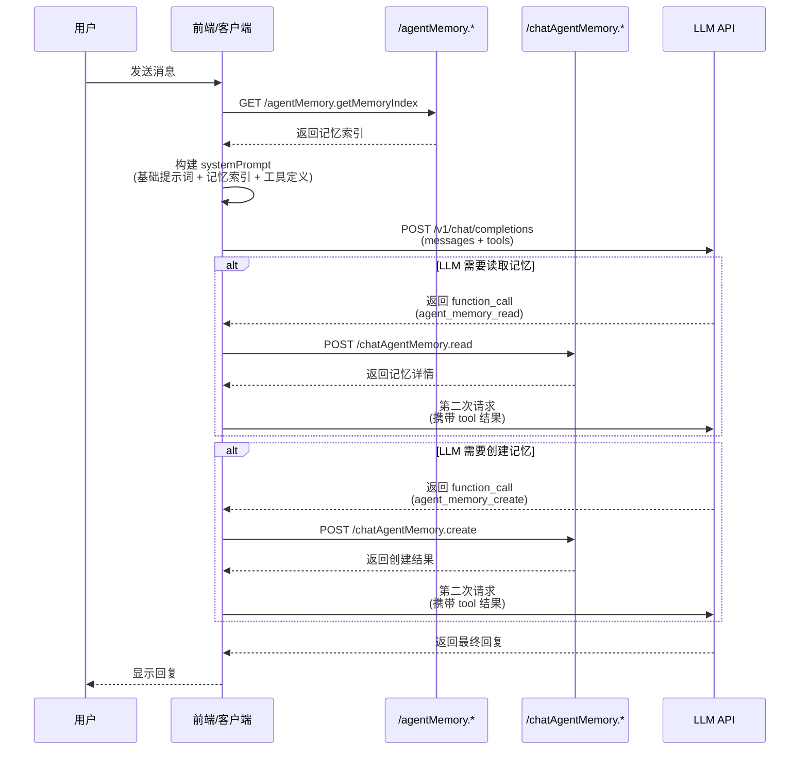

# Agent Memory Curl 示例

## 1. 基础对话（无记忆）

```bash
curl --location 'https://api.ainft.com/v1/chat/completions' \
--header 'Content-Type: application/json' \
--header 'Authorization: Bearer sk-your-api-key' \
--data '{
  "messages": [
    { "role": "user", "content": "介绍一下你自己" }
  ],
  "model": "claude-sonnet-4.5",
  "stream": false,
  "temperature": 0.7
}'
```

## 2. 启用记忆功能的对话

### 2.1 第一步：获取记忆索引

```bash
curl --location 'https://api.ainft.com/api/trpc/agentMemory.getMemoryIndex' \
--header 'Content-Type: application/json' \
--header 'Authorization: Bearer sk-your-api-key'
```

**返回示例：**
```json
{
  "result": {
    "data": {
      "json": [
        {
          "id": "agent_mem_idx_01HQ1234567890",
          "entryId": "agent_memory_01HQ1234567890",
          "category": "user",
          "title": "用户偏好简洁回答",
          "description": "用户明确表示不喜欢冗长的解释",
          "isActive": true,
          "accessCount": 5,
          "lastAccessedAt": "2024-01-16T10:30:00Z"
        },
        {
          "id": "agent_mem_idx_01HQ1234567891",
          "entryId": "agent_memory_01HQ1234567891",
          "category": "feedback",
          "title": "避免使用表情符号",
          "description": "用户反馈不喜欢在回答中使用表情符号",
          "isActive": true,
          "accessCount": 3,
          "lastAccessedAt": "2024-01-15T16:45:00Z"
        }
      ]
    }
  }
}
```

### 2.2 第二步：构建带记忆的系统提示词

将记忆索引格式化为系统提示词：

```markdown
# Agent Memory

You have a persistent memory system.

## Types of memory

- **user**: Information about the user's role, goals, and preferences
- **feedback**: Guidance on what to avoid or continue doing
- **project**: Context about ongoing work and initiatives
- **reference**: Pointers to external resources

## Available Memories

- [user] 用户偏好简洁回答 — 用户明确表示不喜欢冗长的解释
- [feedback] 避免使用表情符号 — 用户反馈不喜欢在回答中使用表情符号

## Memory Tools

You can use the following tools to manage memories:

- agent_memory_read(entryId) - Load full content of a memory when needed
- agent_memory_create(category, title, content) - Create new memory
- agent_memory_update(entryId, content) - Update existing memory
- agent_memory_delete(entryId) - Delete memory

## When to use memories

- When memories seem relevant to the current conversation
- When the user references prior work or preferences
- When you need to recall specific guidance from the user
```

### 2.3 第三步：发送带记忆的对话请求（强制使用工具）

使用 `tool_choice` 强制指定要调用的工具，确保 LLM 一定会返回工具调用：

```bash
curl --location 'https://api.ainft.com/v1/chat/completions' \
--header 'Content-Type: application/json' \
--header 'Authorization: Bearer sk-your-api-key' \
--data '{
  "messages": [
    {
      "role": "system",
      "content": "# Agent Memory\n\nYou have a persistent memory system.\n\n## Types of memory\n\n- **user**: Information about the user'\''s role, goals, and preferences\n- **feedback**: Guidance on what to avoid or continue doing\n- **project**: Context about ongoing work and initiatives\n- **reference**: Pointers to external resources\n\n## Available Memories\n\n- [user] 用户偏好简洁回答 — 用户明确表示不喜欢冗长的解释\n- [feedback] 避免使用表情符号 — 用户反馈不喜欢在回答中使用表情符号\n\n## Memory Tools\n\nYou can use the following tools to manage memories:\n\n- agent_memory_read(entryId) - Load full content of a memory when needed\n- agent_memory_create(category, title, content) - Create new memory\n- agent_memory_update(entryId, content) - Update existing memory\n- agent_memory_delete(entryId) - Delete memory\n\n## When to use memories\n\n- When memories seem relevant to the current conversation\n- When the user references prior work or preferences\n- When you need to recall specific guidance from the user"
    },
    {
      "role": "user",
      "content": "请读取我的记忆偏好，然后介绍一下你自己"
    }
  ],
  "model": "claude-sonnet-4.5",
  "tools": [
    {
      "type": "function",
      "function": {
        "name": "agent_memory_read",
        "description": "Load full content of a memory by its ID when you need more details",
        "parameters": {
          "type": "object",
          "properties": {
            "entryId": {
              "type": "string",
              "description": "The memory entry ID from the index"
            }
          },
          "required": ["entryId"]
        }
      }
    },
    {
      "type": "function",
      "function": {
        "name": "agent_memory_create",
        "description": "Create a new memory when you learn something worth remembering",
        "parameters": {
          "type": "object",
          "properties": {
            "category": {
              "type": "string",
              "enum": ["user", "feedback", "project", "reference"],
              "description": "Memory category"
            },
            "title": {
              "type": "string",
              "description": "Short, descriptive title"
            },
            "content": {
              "type": "string",
              "description": "Memory content in Markdown"
            }
          },
          "required": ["category", "title", "content"]
        }
      }
    },
    {
      "type": "function",
      "function": {
        "name": "agent_memory_update",
        "description": "Update an existing memory when you need to correct or add to it",
        "parameters": {
          "type": "object",
          "properties": {
            "entryId": {
              "type": "string",
              "description": "The memory entry ID"
            },
            "content": {
              "type": "string",
              "description": "New content"
            }
          },
          "required": ["entryId", "content"]
        }
      }
    },
    {
      "type": "function",
      "function": {
        "name": "agent_memory_delete",
        "description": "Delete a memory when it is outdated or incorrect",
        "parameters": {
          "type": "object",
          "properties": {
            "entryId": {
              "type": "string",
              "description": "The memory entry ID"
            }
          },
          "required": ["entryId"]
        }
      }
    }
  ],
  "tool_choice": {
    "type": "function",
    "function": {
      "name": "agent_memory_read"
    }
  },
  "stream": false,
  "temperature": 0.7
}'
```

**注意：** 使用 `tool_choice: { "type": "function", "function": { "name": "agent_memory_read" } }` 强制 LLM 调用 `agent_memory_read` 工具。这样可以确保一定能收到 `tool_calls` 响应。

## 3. 处理工具调用

### 3.1 LLM 返回工具调用示例

当 LLM 需要读取记忆详情时，会返回：

```json
{
  "id": "chatcmpl-xxx",
  "object": "chat.completion",
  "choices": [{
    "message": {
      "role": "assistant",
      "content": null,
      "tool_calls": [{
        "id": "call_xxx",
        "type": "function",
        "function": {
          "name": "agent_memory_read",
          "arguments": "{\"entryId\":\"agent_memory_01HQ1234567890\"}"
        }
      }]
    },
    "finish_reason": "tool_calls"
  }]
}
```

### 3.2 调用后端获取记忆详情

```bash
curl --location 'https://api.ainft.com/api/trpc/chatAgentMemory.read' \
--header 'Content-Type: application/json' \
--header 'Authorization: Bearer sk-your-api-key' \
--data '{
  "json": {
    "entryId": "agent_memory_01HQ1234567890"
  }
}'
```

**返回示例：**
```json
{
  "result": {
    "data": {
      "json": {
        "id": "agent_memory_01HQ1234567890",
        "category": "user",
        "title": "用户偏好简洁回答",
        "content": "用户明确表示不喜欢冗长的解释，希望回答简洁直接。\n\n**Why:** 用户认为过多的技术细节会分散注意力\n\n**How to apply:** 先给出简洁答案，再根据需要补充细节",
        "isActive": true,
        "createdAt": "2024-01-15T08:30:00Z",
        "updatedAt": "2024-01-15T08:30:00Z"
      }
    }
  }
}
```

### 3.3 第二次请求（携带工具结果）

```bash
curl --location 'https://api.ainft.com/v1/chat/completions' \
--header 'Content-Type: application/json' \
--header 'Authorization: Bearer sk-your-api-key' \
--data '{
  "messages": [
    {
      "role": "system",
      "content": "# Agent Memory\n\nYou have a persistent memory system.\n\n## Types of memory\n\n- **user**: Information about the user'\''s role, goals, and preferences\n- **feedback**: Guidance on what to avoid or continue doing\n- **project**: Context about ongoing work and initiatives\n- **reference**: Pointers to external resources\n\n## Available Memories\n\n- [user] 用户偏好简洁回答 — 用户明确表示不喜欢冗长的解释\n- [feedback] 避免使用表情符号 — 用户反馈不喜欢在回答中使用表情符号\n\n## Memory Tools\n\nYou can use the following tools to manage memories:\n\n- agent_memory_read(entryId) - Load full content of a memory when needed\n- agent_memory_create(category, title, content) - Create new memory\n- agent_memory_update(entryId, content) - Update existing memory\n- agent_memory_delete(entryId) - Delete memory\n\n## When to use memories\n\n- When memories seem relevant to the current conversation\n- When the user references prior work or preferences\n- When you need to recall specific guidance from the user"
    },
    {
      "role": "user",
      "content": "请读取我的记忆偏好，然后介绍一下你自己"
    },
    {
      "role": "assistant",
      "content": null,
      "tool_calls": [{
        "id": "call_xxx",
        "type": "function",
        "function": {
          "name": "agent_memory_read",
          "arguments": "{\"entryId\":\"agent_memory_01HQ1234567890\"}"
        }
      }]
    },
    {
      "role": "tool",
      "tool_call_id": "call_xxx",
      "content": "{\"id\":\"agent_memory_01HQ1234567890\",\"category\":\"user\",\"title\":\"用户偏好简洁回答\",\"content\":\"用户明确表示不喜欢冗长的解释，希望回答简洁直接。\\n\\n**Why:** 用户认为过多的技术细节会分散注意力\\n\\n**How to apply:** 先给出简洁答案，再根据需要补充细节\",\"isActive\":true,\"createdAt\":\"2024-01-15T08:30:00Z\",\"updatedAt\":\"2024-01-15T08:30:00Z\"}""
    }
  ],
  "model": "claude-sonnet-4.5",
  "stream": false,
  "temperature": 0.7
}'
```

## 4. LLM 创建记忆示例

### 4.1 用户要求记住偏好

```bash
curl --location 'https://api.ainft.com/v1/chat/completions' \
--header 'Content-Type: application/json' \
--header 'Authorization: Bearer sk-your-api-key' \
--data '{
  "messages": [
    {
      "role": "system",
      "content": "# Agent Memory\n\nYou have a persistent memory system.\n\n## Types of memory\n\n- **user**: Information about the user'\''s role, goals, and preferences\n- **feedback**: Guidance on what to avoid or continue doing\n- **project**: Context about ongoing work and initiatives\n- **reference**: Pointers to external resources\n\n## Available Memories\n\n- [user] 用户偏好简洁回答 — 用户明确表示不喜欢冗长的解释\n- [feedback] 避免使用表情符号 — 用户反馈不喜欢在回答中使用表情符号\n\n## Memory Tools\n\nYou can use the following tools to manage memories:\n\n- agent_memory_read(entryId) - Load full content of a memory when needed\n- agent_memory_create(category, title, content) - Create new memory\n- agent_memory_update(entryId, content) - Update existing memory\n- agent_memory_delete(entryId) - Delete memory\n\n## When to use memories\n\n- When memories seem relevant to the current conversation\n- When the user references prior work or preferences\n- When you need to recall specific guidance from the user"
    },
    {
      "role": "user",
      "content": "记住我喜欢简洁的回答，不要太多技术细节"
    }
  ],
  "model": "claude-sonnet-4.5",
  "tools": [
    {
      "type": "function",
      "function": {
        "name": "agent_memory_create",
        "description": "Create a new memory when you learn something worth remembering",
        "parameters": {
          "type": "object",
          "properties": {
            "category": {
              "type": "string",
              "enum": ["user", "feedback", "project", "reference"]
            },
            "title": { "type": "string" },
            "content": { "type": "string" }
          },
          "required": ["category", "title", "content"]
        }
      }
    }
  ],
  "tool_choice": "auto",
  "stream": false
}'
```

### 4.2 LLM 返回创建记忆的工具调用

```json
{
  "id": "chatcmpl-yyy",
  "object": "chat.completion",
  "choices": [{
    "message": {
      "role": "assistant",
      "content": null,
      "tool_calls": [{
        "id": "call_yyy",
        "type": "function",
        "function": {
          "name": "agent_memory_create",
          "arguments": "{\"category\":\"feedback\",\"title\":\"用户偏好简洁回答\",\"content\":\"用户喜欢简洁的回答，不要太多技术细节\\n\\n**Why:** 用户认为过多的技术细节会分散注意力\\n\\n**How to apply:** 先给出简洁答案，再根据需要补充细节\"}"
        }
      }]
    },
    "finish_reason": "tool_calls"
  }]
}
```

### 4.3 调用后端创建记忆

```bash
curl --location 'https://api.ainft.com/api/trpc/chatAgentMemory.create' \
--header 'Content-Type: application/json' \
--header 'Authorization: Bearer sk-your-api-key' \
--data '{
  "json": {
    "category": "feedback",
    "title": "用户偏好简洁回答",
    "content": "用户喜欢简洁的回答，不要太多技术细节\n\n**Why:** 用户认为过多的技术细节会分散注意力\n\n**How to apply:** 先给出简洁答案，再根据需要补充细节"
  }
}'
```

**返回示例：**
```json
{
  "result": {
    "data": {
      "json": {
        "id": "agent_memory_01HQ1234567892",
        "category": "feedback",
        "title": "用户偏好简洁回答",
        "content": "用户喜欢简洁的回答，不要太多技术细节\n\n**Why:** 用户认为过多的技术细节会分散注意力\n\n**How to apply:** 先给出简洁答案，再根据需要补充细节",
        "isActive": true,
        "createdAt": "2024-01-17T09:00:00Z"
      }
    }
  }
}
```

### 4.4 第二次请求获取最终回复

```bash
curl --location 'https://api.ainft.com/v1/chat/completions' \
--header 'Content-Type: application/json' \
--header 'Authorization: Bearer sk-your-api-key' \
--data '{
  "messages": [
    {
      "role": "system",
      "content": "# Agent Memory\n\nYou have a persistent memory system.\n\n## Types of memory\n\n- **user**: Information about the user'\''s role, goals, and preferences\n- **feedback**: Guidance on what to avoid or continue doing\n- **project**: Context about ongoing work and initiatives\n- **reference**: Pointers to external resources\n\n## Available Memories\n\n- [user] 用户偏好简洁回答 — 用户明确表示不喜欢冗长的解释\n- [feedback] 避免使用表情符号 — 用户反馈不喜欢在回答中使用表情符号\n\n## Memory Tools\n\nYou can use the following tools to manage memories:\n\n- agent_memory_read(entryId) - Load full content of a memory when needed\n- agent_memory_create(category, title, content) - Create new memory\n- agent_memory_update(entryId, content) - Update existing memory\n- agent_memory_delete(entryId) - Delete memory\n\n## When to use memories\n\n- When memories seem relevant to the current conversation\n- When the user references prior work or preferences\n- When you need to recall specific guidance from the user"
    },
    {
      "role": "user",
      "content": "记住我喜欢简洁的回答，不要太多技术细节"
    },
    {
      "role": "assistant",
      "content": null,
      "tool_calls": [{
        "id": "call_yyy",
        "type": "function",
        "function": {
          "name": "agent_memory_create",
          "arguments": "{\"category\":\"feedback\",\"title\":\"用户偏好简洁回答\",\"content\":\"用户喜欢简洁的回答，不要太多技术细节\\n\\n**Why:** 用户认为过多的技术细节会分散注意力\\n\\n**How to apply:** 先给出简洁答案，再根据需要补充细节\"}"
        }
      }]
    },
    {
      "role": "tool",
      "tool_call_id": "call_yyy",
      "content": "Memory created: 用户偏好简洁回答 (agent_memory_01HQ1234567892)"
    }
  ],
  "model": "claude-sonnet-4.5",
  "stream": false
}'
```

**返回示例：**
```json
{
  "id": "chatcmpl-zzz",
  "object": "chat.completion",
  "choices": [{
    "message": {
      "role": "assistant",
      "content": "好的，我记住了。以后我会尽量给出简洁的回答，避免过多的技术细节。"
    },
    "finish_reason": "stop"
  }]
}
```

## 5. 完整流程总结


