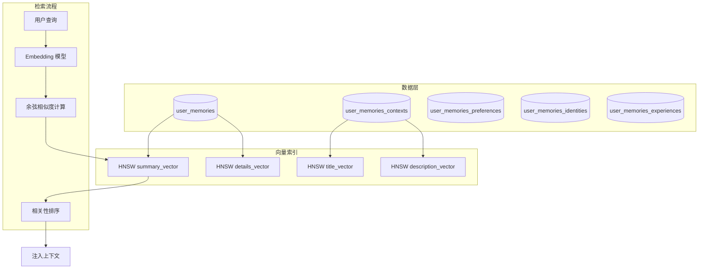
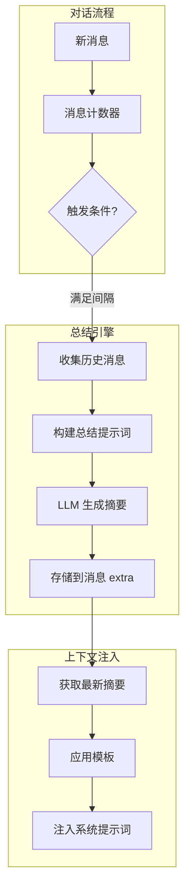
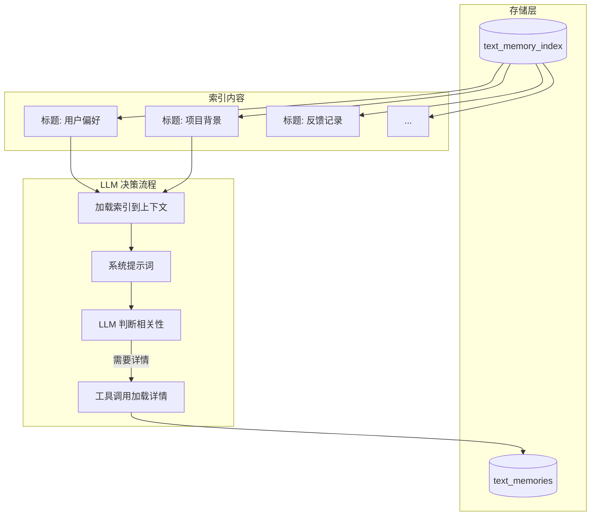
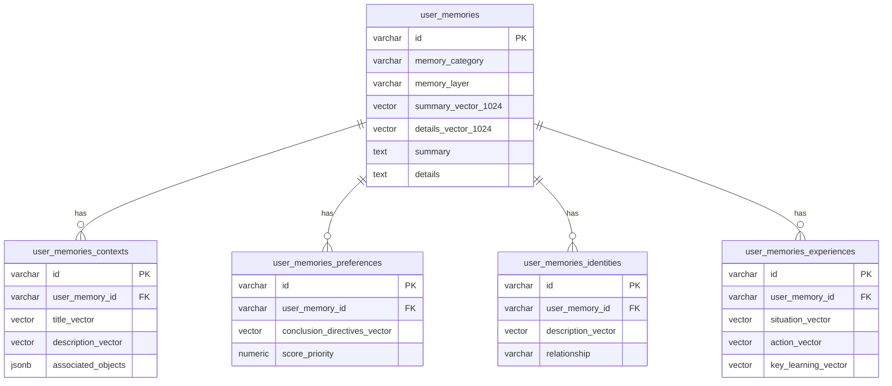
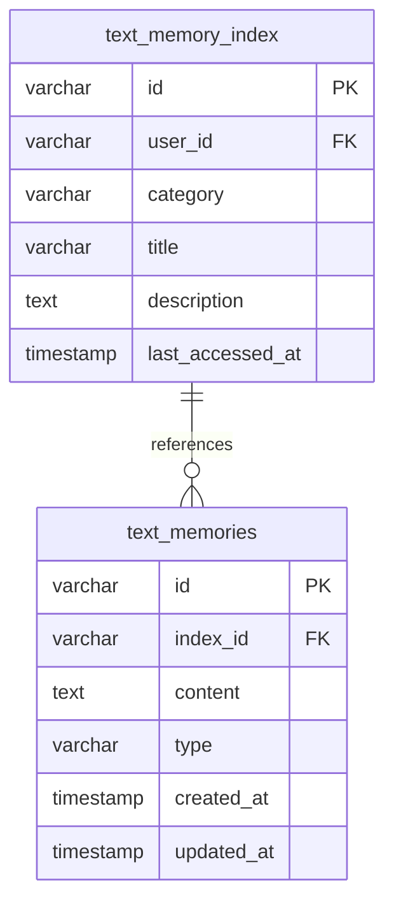
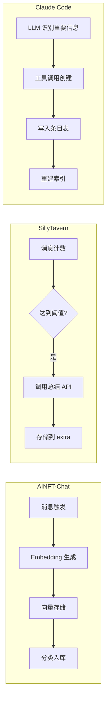
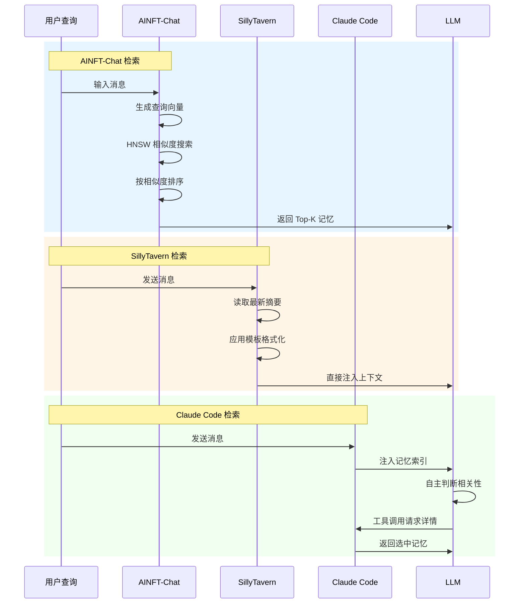
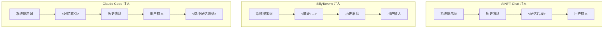
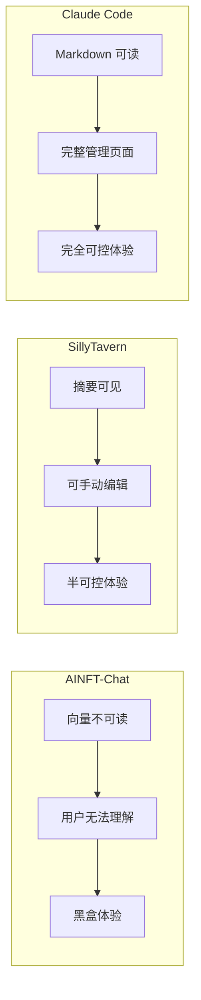
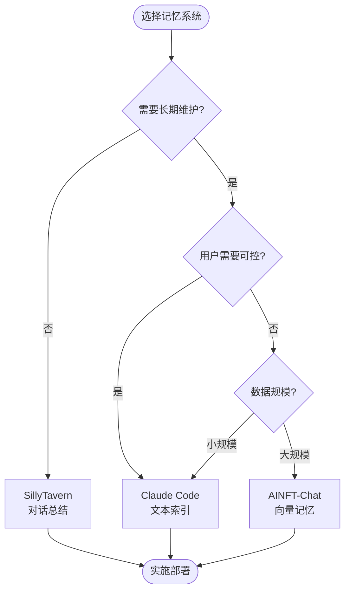

# 三种记忆系统对比分析

## 概述

| 特性 | AINFT-Chat (向量记忆) | SillyTavern (对话总结) | Claude Code (文本索引) |
|------|----------------------|------------------------|------------------------|
| **核心理念** | 向量相似度检索 | 渐进式对话总结 | LLM 自主判断相关性 |
| **存储形式** | 向量嵌入 + 文本 | 纯文本摘要 | Markdown 文本 + 索引 |
| **检索方式** | pgvector HNSW 索引 | 直接注入上下文 | LLM 选择性加载 |
| **数据结构** | 5 张关联表 | 单条摘要存储 | 2 张表（索引 + 条目） |
| **用户可控性** | 低（向量不可读） | 中（可编辑摘要） | 高（完全可读可编辑） |

---

## 1. 系统架构对比

### 1.1 AINFT-Chat 向量记忆架构

**特点**：
- 多表关联存储不同类型的记忆（上下文、偏好、身份、经历）
- 每张表包含多个向量字段用于语义检索
- 依赖 pgvector 的 HNSW 索引加速相似度搜索

### 1.2 SillyTavern 对话总结架构

**特点**：
- 单条摘要存储在聊天消息的 `extra.memory` 字段
- 基于消息数量或字数阈值触发总结
- 摘要随对话递进不断累积更新

### 1.3 Claude Code 文本记忆架构

**特点**：
- 两层结构：轻量索引 + 完整条目
- 索引始终注入上下文，LLM 自主选择加载哪些详情
- 完全摒弃向量相似度计算

---

## 2. 数据模型对比

### 2.1 表结构复杂度

| 系统 | 表数量 | 字段复杂度 | 关联关系 |
|------|--------|-----------|----------|
| AINFT-Chat | 5 张 | 高（多向量字段） | 多对多关联 |
| SillyTavern | 0 张 | 无（存储在消息 JSON） | 无 |
| Claude Code | 2 张 | 低（纯文本） | 一对多 |

### 2.2 AINFT-Chat 五表结构

### 2.3 Claude Code 两表结构

---

## 3. 记忆生命周期对比

### 3.1 创建流程

### 3.2 更新策略

| 系统 | 触发条件 | 更新方式 | 冲突处理 |
|------|----------|----------|----------|
| AINFT-Chat | 定时任务/消息触发 | 向量重新计算 | 相似度合并 |
| SillyTavern | 消息间隔/字数阈值 | 累积式追加 | 后写覆盖 |
| Claude Code | LLM 主动调用 | 直接编辑/替换 | 用户干预 |

---

## 4. 检索机制对比

### 4.1 检索流程对比

### 4.2 检索特性对比

| 特性 | AINFT-Chat | SillyTavern | Claude Code |
|------|------------|-------------|-------------|
| **检索延迟** | 中（向量计算） | 低（直接读取） | 低（索引常驻） |
| **相关性判断** | 算法（余弦相似度） | 无（固定注入） | LLM 自主判断 |
| **灵活性** | 中（依赖嵌入质量） | 低 | 高（语义理解） |
| **可解释性** | 低（黑盒相似度） | 高 | 高（LLM 决策透明） |

---

## 5. 上下文注入对比

### 5.1 注入位置与方式

### 5.2 Token 消耗对比

| 系统 | 固定开销 | 可变开销 | 控制粒度 |
|------|----------|----------|----------|
| AINFT-Chat | 中（Top-K 记忆） | 高（可能检索过多） | 粗（K值限制） |
| SillyTavern | 低（单条摘要） | 低（固定长度） | 中（字数限制） |
| Claude Code | 中（索引常驻） | 可控（LLM 自选） | 细（条目级别） |

---

## 6. 用户体验对比

### 6.1 可观测性

### 6.2 管理功能对比

| 功能 | AINFT-Chat | SillyTavern | Claude Code |
|------|------------|-------------|-------------|
| **查看记忆** | ❌ 不可读 | ✅ 可查看摘要 | ✅ 完整可读 |
| **编辑记忆** | ❌ 不可编辑 | ✅ 手动编辑 | ✅ 完整编辑 |
| **删除记忆** | ⚠️ 后台操作 | ✅ 删除摘要 | ✅ 管理页面删除 |
| **搜索记忆** | ✅ 向量搜索 | ❌ 无 | ✅ 关键词搜索 |
| **导入导出** | ❌ 不支持 | ❌ 不支持 | ⚠️ 未来支持 |

---

## 7. 优劣势总结

### 7.1 AINFT-Chat 向量记忆

| 优势 | 劣势 |
|------|------|
| 技术成熟，向量检索速度快 | 向量不可读，用户无法理解 |
| 语义相似度捕捉隐含关联 | 依赖 Embedding 模型质量 |
| 支持复杂的多维度记忆分类 | 5 张关联表结构复杂 |
| HNSW 索引查询效率高 | 每次操作需调用嵌入模型 |

**适用场景**：需要大规模语义检索、技术团队维护的后台系统

### 7.2 SillyTavern 对话总结

| 优势 | 劣势 |
|------|------|
| 实现简单，无额外存储 | 记忆随对话线性累积 |
| 摘要可直接编辑 | 无法选择性遗忘 |
| Token 消耗可控 | 长期对话摘要膨胀 |
| 实时更新 | 不支持跨会话记忆 |

**适用场景**：单会话角色扮演、轻量级对话管理

### 7.3 Claude Code 文本记忆

| 优势 | 劣势 |
|------|------|
| 完全可读可编辑 | 索引占用上下文空间 |
| LLM 自主判断相关性 | 需要 LLM 支持工具调用 |
| 结构简单易于维护 | 依赖 LLM 决策质量 |
| 用户完全可控 | 无自动衰减机制 |

**适用场景**：需要高度可控、长期维护的助手类应用

---

## 8. 选型建议

| 场景 | 推荐方案 | 理由 |
|------|----------|------|
| 角色扮演聊天 | SillyTavern | 简单高效，适合单会话 |
| 个人 AI 助手 | Claude Code | 用户可控，长期维护 |
| 企业知识库 | AINFT-Chat | 大规模语义检索 |
| 多租户 SaaS | Claude Code | 结构简单，易于隔离 |
| 实时对话系统 | SillyTavern | 低延迟，无外部依赖 |
