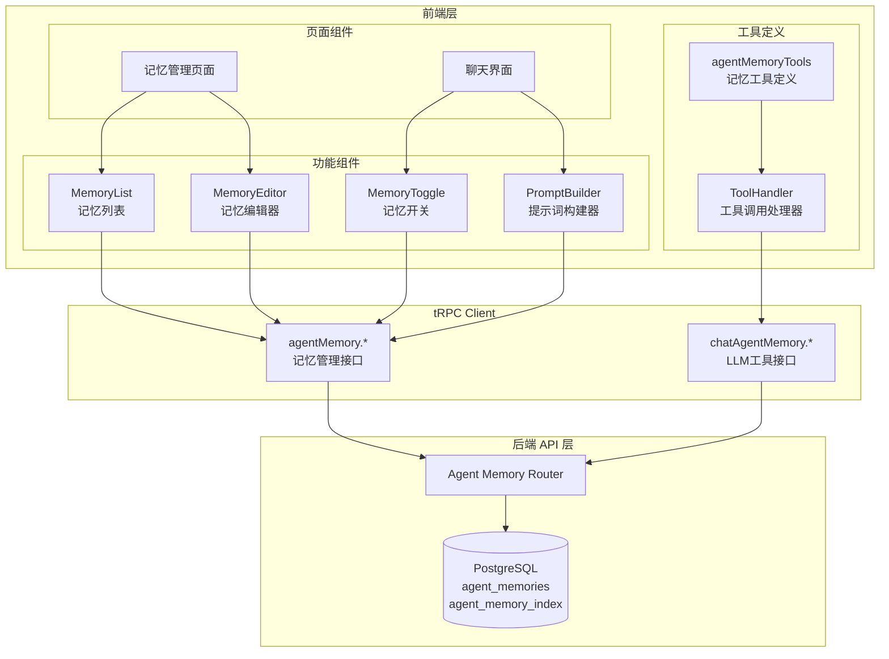
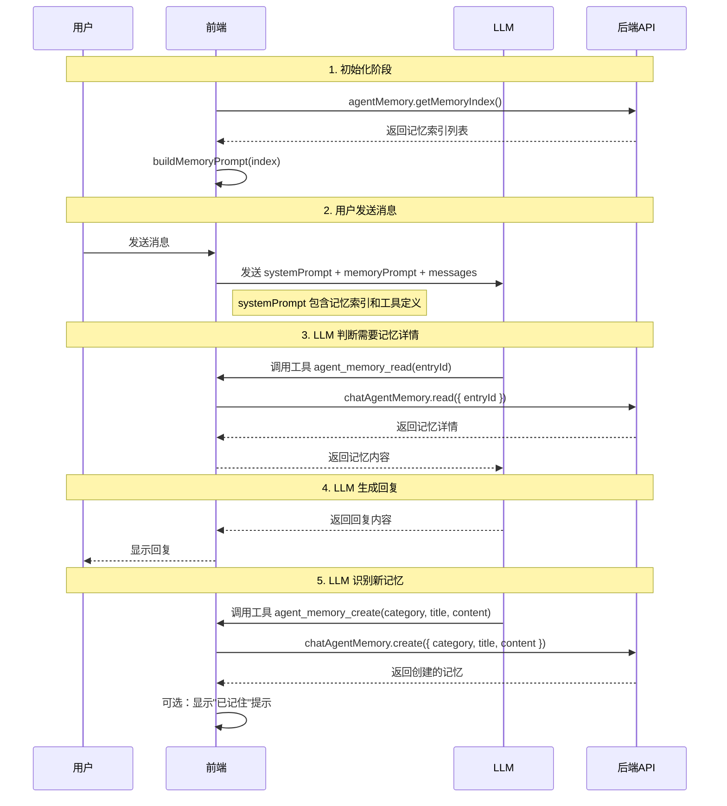

# Agent Memory 前端设计方案

## 1. 概述

### 1.1 设计目标

基于 Claude Code 文本索引记忆架构，实现前端记忆管理功能和聊天集成。

**核心原则**：
- 记忆索引轻量加载，详情按需获取
- 前端负责构建记忆提示词注入 LLM 上下文
- 通过工具调用让 LLM 自主管理记忆

### 1.2 功能范围

| 功能模块 | 说明 |
|---------|------|
| 记忆管理页面 | 查看、创建、编辑、删除记忆 |
| 聊天记忆开关 | 控制当前对话是否读写记忆 |
| LLM 上下文注入 | 构建记忆提示词发送到 LLM |
| 工具调用处理 | 处理 LLM 的记忆工具调用 |

## 2. 架构设计



## 3. 页面设计

### 3.1 记忆管理页面

#### 页面布局

```
┌─────────────────────────────────────────────────────────────┐
│  记忆管理                                    [+ 新建记忆]   │
├────────────────────────────┬────────────────────────────────┤
│  筛选栏                    │                                │
│  ┌──────────────────────┐  │   详情面板                      │
│  │ 分类: [全部 ▼]       │  │   ┌────────────────────────┐   │
│  │ 搜索: [________]     │  │   │ 标题: [____________]   │   │
│  └──────────────────────┘  │   │ 分类: [user ▼]         │   │
│                            │   │                        │   │
│  记忆列表                   │   │ 内容:                  │   │
│  ┌──────────────────────┐  │   │ ┌────────────────────┐ │   │
│  │ [user] 用户偏好      │  │   │ │                    │ │   │
│  │ 用户喜欢简洁回答...  │◄─┼───┤ │ Markdown 编辑器    │ │   │
│  └──────────────────────┘  │   │ │                    │ │   │
│  ┌──────────────────────┐  │   │ └────────────────────┘ │   │
│  │ [feedback] 行为反馈  │  │   │                        │   │
│  │ 避免使用表情符号...  │  │   │ [保存] [删除] [取消]   │   │
│  └──────────────────────┘  │   └────────────────────────┘   │
│                            │                                │
└────────────────────────────┴────────────────────────────────┘
```

#### 组件结构

```typescript
// app/(main)/settings/memory/page.tsx
export default function MemoryPage() {
  return (
    <MemoryLayout>
      <MemoryFilter />
      <MemoryList />
      <MemoryDetail />
    </MemoryLayout>
  );
}
```

#### 核心实现

```typescript
'use client';

import { api } from '@/services/api';
import { useState } from 'react';

export function MemoryManager() {
  const [selectedId, setSelectedId] = useState<string | null>(null);
  const [search, setSearch] = useState('');
  const [category, setCategory] = useState<string>('');

  // 1. 获取记忆索引（轻量列表）
  const { data: index, isLoading } = api.agentMemory.getMemoryIndex.useQuery();

  // 2. 获取选中记忆的详情
  const { data: selectedMemory } = api.agentMemory.getMemory.useQuery(
    { id: selectedId! },
    { enabled: !!selectedId }
  );

  // 3. Mutations
  const createMutation = api.agentMemory.createMemory.useMutation({
    onSuccess: (data) => {
      setSelectedId(data.id);
    },
  });

  const updateMutation = api.agentMemory.updateMemory.useMutation();

  const deleteMutation = api.agentMemory.deleteMemory.useMutation({
    onSuccess: () => {
      setSelectedId(null);
    },
  });

  // 4. 筛选逻辑
  const filteredIndex = index?.filter((item) => {
    if (category && item.category !== category) return false;
    if (search && !item.title.includes(search) && !item.description?.includes(search)) 
      return false;
    return true;
  });

  if (isLoading) return <div>加载中...</div>;

  return (
    <div className="memory-manager">
      {/* 左侧：索引列表 */}
      <div className="index-list">
        <MemoryFilters
          category={category}
          search={search}
          onCategoryChange={setCategory}
          onSearchChange={setSearch}
        />
        
        {filteredIndex?.map((item) => (
          <MemoryIndexCard
            key={item.id}
            item={item}
            isActive={selectedId === item.entryId}
            onClick={() => setSelectedId(item.entryId)}
          />
        ))}
      </div>
      
      {/* 右侧：详情面板 */}
      <div className="detail-panel">
        {selectedMemory ? (
          <MemoryEditor
            memory={selectedMemory}
            onSave={(values) => updateMutation.mutate({ 
              id: selectedMemory.id, 
              value: values 
            })}
            onDelete={() => deleteMutation.mutate({ id: selectedMemory.id })}
          />
        ) : (
          <EmptyState onCreate={() => createMutation.mutate(defaultMemory)} />
        )}
      </div>
    </div>
  );
}
```

### 3.2 聊天界面记忆开关

#### 组件设计

```typescript
// src/features/ChatInput/ActionBar/MemoryToggle.tsx
export function MemoryToggle({ sessionId }: { sessionId: string }) {
  const { data: config } = api.agent.getAgentConfig.useQuery({ sessionId });
  const updateConfig = api.session.updateSessionChatConfig.useMutation();

  const memoryReadEnabled = config?.chatConfig?.memoryReadEnabled ?? true;
  const memoryWriteEnabled = config?.chatConfig?.memoryWriteEnabled ?? true;

  return (
    <div className="memory-toggles">
      <Tooltip title="读取记忆">
        <Switch
          checked={memoryReadEnabled}
          onChange={(checked) => {
            updateConfig.mutate({
              id: sessionId,
              value: { memoryReadEnabled: checked },
            });
          }}
          checkedChildren={<BookOutlined />}
          unCheckedChildren={<BookOutlined />}
        />
      </Tooltip>
      
      <Tooltip title="写入记忆">
        <Switch
          checked={memoryWriteEnabled}
          onChange={(checked) => {
            updateConfig.mutate({
              id: sessionId,
              value: { memoryWriteEnabled: checked },
            });
          }}
          checkedChildren={<EditOutlined />}
          unCheckedChildren={<EditOutlined />}
        />
      </Tooltip>
    </div>
  );
}
```

## 4. LLM 与记忆交互流程

### 4.1 完整交互流程



### 4.2 记忆提示词构建器

```typescript
// src/services/agentMemory/promptBuilder.ts

const DEFAULT_AGENT_ID = 'default_agent';

/**
 * 构建记忆系统提示词
 */
export async function buildMemoryPrompt(
  index: AgentMemoryIndexItem[]
): Promise<string> {
  if (index.length === 0) {
    return '';
  }

  const lines: string[] = [
    '# Agent Memory',
    '',
    'You have a persistent memory system.',
    '',
    '## Types of memory',
    '',
    '- **user**: Information about the user\'s role, goals, and preferences',
    '- **feedback**: Guidance on what to avoid or continue doing',
    '- **project**: Context about ongoing work and initiatives',
    '- **reference**: Pointers to external resources',
    '',
    '## Available Memories',
    '',
  ];

  for (const item of index) {
    lines.push(`- [${item.category}] ${item.title} — ${item.description}`);
  }

  lines.push(
    '',
    '## Memory Tools',
    'You can use the following tools to manage memories:',
    '- agent_memory_read(entryId) - Load full content of a memory when needed',
    '- agent_memory_create(category, title, content) - Create new memory',
    '- agent_memory_update(entryId, content) - Update existing memory',
    '- agent_memory_delete(entryId) - Delete memory',
    '',
    '## When to use memories',
    '- When memories seem relevant to the current conversation',
    '- When the user references prior work or preferences',
    '- When you need to recall specific guidance from the user',
    '',
  );

  return lines.join('\n');
}
```

### 4.3 集成到聊天服务

```typescript
// src/store/chat/slices/aiChat/actions/generateAIChat.ts

export const generateAIChat = async (params: GenerateParams) => {
  const { messages, sessionId, memoryReadEnabled, memoryWriteEnabled } = params;

  // 1. 获取记忆索引（如果开启记忆读取）
  let memoryPrompt = '';
  if (memoryReadEnabled) {
    const { data: index } = await api.agentMemory.getMemoryIndex.fetch();
    if (index && index.length > 0) {
      memoryPrompt = buildMemoryPrompt(index);
    }
  }

  // 2. 构建系统提示词
  const systemPrompt = [
    getBaseSystemPrompt(),
    memoryPrompt, // 注入记忆索引
    getUserCustomPrompt(),
  ].filter(Boolean).join('\n\n');

  // 3. 确定可用工具
  const availableTools = [...baseTools];
  if (memoryReadEnabled || memoryWriteEnabled) {
    availableTools.push(...agentMemoryTools);
  }

  // 4. 调用 LLM
  return streamChatCompletion({
    systemPrompt,
    messages,
    tools: availableTools,
  });
};
```

### 4.4 工具调用处理流程

```typescript
// src/store/chat/slices/aiChat/actions/handleToolCall.ts

export async function handleToolCall(
  toolCall: ToolCall,
  context: ChatContext
): Promise<ToolResult> {
  const { name, arguments: args } = toolCall;

  // 处理记忆相关工具
  if (name.startsWith('agent_memory_')) {
    // 检查是否开启了记忆写入（对于写操作）
    if (['agent_memory_create', 'agent_memory_update', 'agent_memory_delete'].includes(name)) {
      if (!context.memoryWriteEnabled) {
        return {
          type: 'error',
          content: 'Memory write is disabled for this conversation',
        };
      }
    }

    // 调用记忆工具处理器
    return handleAgentMemoryTool(name, JSON.parse(args));
  }

  // 处理其他工具...
}
```

### 4.5 前端状态管理

```typescript
// src/store/chat/slices/aiChat/actions/processStream.ts

export async function* processChatStream(params: StreamParams) {
  const { messages, sessionId, memoryReadEnabled, memoryWriteEnabled } = params;

  // 1. 准备记忆上下文
  let memoryIndex: AgentMemoryIndexItem[] = [];
  if (memoryReadEnabled) {
    const result = await api.agentMemory.getMemoryIndex.fetch();
    memoryIndex = result || [];
  }

  // 2. 构建提示词
  const memoryPrompt = buildMemoryPrompt(memoryIndex);
  const systemPrompt = buildSystemPrompt(memoryPrompt);

  // 3. 发送请求到 LLM
  const stream = await callLLM({
    systemPrompt,
    messages,
    tools: memoryReadEnabled || memoryWriteEnabled 
      ? [...baseTools, ...agentMemoryTools] 
      : baseTools,
  });

  // 4. 处理流式响应
  for await (const chunk of stream) {
    // 如果是工具调用
    if (chunk.type === 'tool_call') {
      const result = await handleToolCall(chunk.toolCall, {
        sessionId,
        memoryWriteEnabled,
      });
      
      // 将工具结果发送回 LLM
      yield { type: 'tool_result', result };
      
      // 继续获取 LLM 的回复
      continue;
    }

    // 普通文本回复
    yield { type: 'content', content: chunk.content };
  }
}
```

## 5. 工具调用处理

### 5.1 工具调用完整流程图

```mermaid
flowchart TD
    Start(["LLM 返回工具调用"]) --> CheckTool{"工具类型?"}
    
    CheckTool -->|agent_memory_read| Read["调用 chatAgentMemory.read"]
    CheckTool -->|agent_memory_create| Create["调用 chatAgentMemory.create"]
    CheckTool -->|agent_memory_update| Update["调用 chatAgentMemory.update"]
    CheckTool -->|agent_memory_delete| Delete["调用 chatAgentMemory.delete"]
    
    Read --> Backend1["POST /api/trpc/chatAgentMemory.read"]
    Create --> Backend2["POST /api/trpc/chatAgentMemory.create"]
    Update --> Backend3["POST /api/trpc/chatAgentMemory.update"]
    Delete --> Backend4["POST /api/trpc/chatAgentMemory.delete"]
    
    Backend1 --> Response1["返回记忆详情"]
    Backend2 --> Response2["返回创建的记忆"]
    Backend3 --> Response3["返回更新结果"]
    Backend4 --> Response4["返回删除结果"]
    
    Response1 --> ReturnLLM["将结果返回给 LLM"]
    Response2 --> ReturnLLM
    Response3 --> ReturnLLM
    Response4 --> ReturnLLM
    
    ReturnLLM --> Continue["LLM 继续生成回复"]
    Continue --> End(["完成"])
```



### 5.2 工具定义

```typescript
// src/tools/agentMemory/definition.ts

export const agentMemoryTools: ToolDefinition[] = [
  {
    name: 'agent_memory_read',
    description: 'Load full content of a memory by its ID when you need more details',
    parameters: {
      type: 'object',
      properties: {
        entryId: {
          type: 'string',
          description: 'The memory entry ID from the index',
        },
      },
      required: ['entryId'],
    },
  },
  {
    name: 'agent_memory_create',
    description: 'Create a new memory when you learn something worth remembering',
    parameters: {
      type: 'object',
      properties: {
        category: {
          type: 'string',
          enum: ['user', 'feedback', 'project', 'reference'],
          description: 'Memory category',
        },
        title: {
          type: 'string',
          description: 'Short, descriptive title',
        },
        content: {
          type: 'string',
          description: 'Memory content in Markdown. For feedback/project types, include **Why:** and **How to apply:** sections',
        },
      },
      required: ['category', 'title', 'content'],
    },
  },
  {
    name: 'agent_memory_update',
    description: 'Update an existing memory when you need to correct or add to it',
    parameters: {
      type: 'object',
      properties: {
        entryId: {
          type: 'string',
          description: 'The memory entry ID',
        },
        content: {
          type: 'string',
          description: 'New content',
        },
      },
      required: ['entryId', 'content'],
    },
  },
  {
    name: 'agent_memory_delete',
    description: 'Delete a memory when it is outdated or incorrect',
    parameters: {
      type: 'object',
      properties: {
        entryId: {
          type: 'string',
          description: 'The memory entry ID',
        },
      },
      required: ['entryId'],
    },
  },
];
```

### 5.3 工具调用处理器

```typescript
// src/tools/agentMemory/handler.ts
import { api } from '@/services/api';

/**
 * 处理 Agent Memory 相关工具调用
 * 
 * 使用场景：
 * 1. LLM 在生成回复过程中调用工具
 * 2. 前端接收到工具调用请求后，调用后端 API
 * 3. 将后端返回结果返回给 LLM
 */
export async function handleAgentMemoryTool(
  toolName: string,
  args: Record<string, any>
): Promise<ToolResult> {
  switch (toolName) {
    case 'agent_memory_read':
      return handleRead(args.entryId);
    
    case 'agent_memory_create':
      return handleCreate(args);
    
    case 'agent_memory_update':
      return handleUpdate(args.entryId, args.content);
    
    case 'agent_memory_delete':
      return handleDelete(args.entryId);
    
    default:
      throw new Error(`Unknown tool: ${toolName}`);
  }
}

/**
 * 读取记忆详情
 * 
 * 调用链：
 * LLM -> handler.ts -> chatAgentMemory.read -> 后端 -> 数据库
 */
async function handleRead(entryId: string): Promise<ToolResult> {
  // 调用后端 chatAgentMemory.read 接口
  const memory = await api.chatAgentMemory.read.mutate({ entryId });
  
  if (!memory) {
    return {
      type: 'error',
      content: `Memory ${entryId} not found`,
    };
  }

  // 返回给 LLM 的格式
  return {
    type: 'success',
    content: JSON.stringify({
      id: memory.id,
      category: memory.category,
      title: memory.title,
      content: memory.content,
    }),
  };
}

/**
 * 创建新记忆
 * 
 * 调用链：
 * LLM -> handler.ts -> chatAgentMemory.create -> 后端 -> 数据库
 */
async function handleCreate(args: {
  category: string;
  title: string;
  content: string;
}): Promise<ToolResult> {
  // 调用后端 chatAgentMemory.create 接口
  const memory = await api.chatAgentMemory.create.mutate(args);
  
  return {
    type: 'success',
    content: `Memory created: ${memory.title} (${memory.id})`,
  };
}

/**
 * 更新记忆
 * 
 * 调用链：
 * LLM -> handler.ts -> chatAgentMemory.update -> 后端 -> 数据库
 */
async function handleUpdate(
  entryId: string,
  content: string
): Promise<ToolResult> {
  // 调用后端 chatAgentMemory.update 接口
  await api.chatAgentMemory.update.mutate({ entryId, content });
  
  return {
    type: 'success',
    content: `Memory ${entryId} updated`,
  };
}

/**
 * 删除记忆
 * 
 * 调用链：
 * LLM -> handler.ts -> chatAgentMemory.delete -> 后端 -> 数据库
 */
async function handleDelete(entryId: string): Promise<ToolResult> {
  // 调用后端 chatAgentMemory.delete 接口
  await api.chatAgentMemory.delete.mutate({ entryId });
  
  return {
    type: 'success',
    content: `Memory ${entryId} deleted`,
  };
}
```

### 5.4 使用示例

```typescript
// 示例：LLM 在对话中创建记忆

// 1. 用户发送消息
const userMessage = "我喜欢简洁的回答，不要太多技术细节";

// 2. 前端构建提示词（包含记忆索引）
const systemPrompt = `
# Agent Memory
...
## Available Memories
- [user] 用户角色 — 用户是数据科学家

## Memory Tools
- agent_memory_create(category, title, content)
...
`;

// 3. LLM 识别到需要创建记忆，调用工具
const toolCall = {
  name: 'agent_memory_create',
  arguments: JSON.stringify({
    category: 'feedback',
    title: '用户偏好简洁回答',
    content: '用户喜欢简洁的回答，不要太多技术细节\n\n**Why:** 用户认为过多的技术细节会分散注意力\n\n**How to apply:** 先给出简洁答案，再根据需要补充细节'
  })
};

// 4. 前端处理工具调用
const result = await handleAgentMemoryTool(
  toolCall.name, 
  JSON.parse(toolCall.arguments)
);
// result: { type: 'success', content: 'Memory created: 用户偏好简洁回答 (agent_memory_xxx)' }

// 5. 将结果返回给 LLM，LLM 继续生成回复
```

## 6. 路由配置

```typescript
// src/app/(main)/settings/memory/page.tsx
export default function MemorySettingsPage() {
  return (
    <SettingsLayout>
      <PageHeader title="记忆管理" />
      <MemoryManager />
    </SettingsLayout>
  );
}
```

## 7. 类型定义

```typescript
// src/types/agentMemory.ts

export interface AgentMemoryIndexItem {
  id: string;
  entryId: string;
  category: 'user' | 'feedback' | 'project' | 'reference';
  title: string;
  description: string;
  isActive: boolean;
  accessCount: number;
  lastAccessedAt: string;
  createdAt: string;
  updatedAt: string;
}

export interface AgentMemoryItem {
  id: string;
  category: 'user' | 'feedback' | 'project' | 'reference';
  title: string;
  content: string;
  description?: string;
  sourceSessionId?: string;
  sourceMessageIds?: string[];
  isActive: boolean;
  createdAt: string;
  updatedAt: string;
}

export interface AgentMemorySettings {
  enabled: boolean;
  maxEntriesPerUser: number;
  defaultReadEnabled: boolean;
  defaultWriteEnabled: boolean;
  categories: string[];
}
```

## 8. 部署检查清单

- [ ] 1. 创建记忆管理页面 `app/(main)/settings/memory/page.tsx`
- [ ] 2. 创建 MemoryManager 组件
- [ ] 3. 创建 MemoryToggle 组件
- [ ] 4. 创建提示词构建器 `src/services/agentMemory/promptBuilder.ts`
- [ ] 5. 创建工具定义 `src/tools/agentMemory/definition.ts`
- [ ] 6. 创建工具处理器 `src/tools/agentMemory/handler.ts`
- [ ] 7. 集成到聊天流程
- [ ] 8. 添加路由配置
- [ ] 9. 编写组件测试
