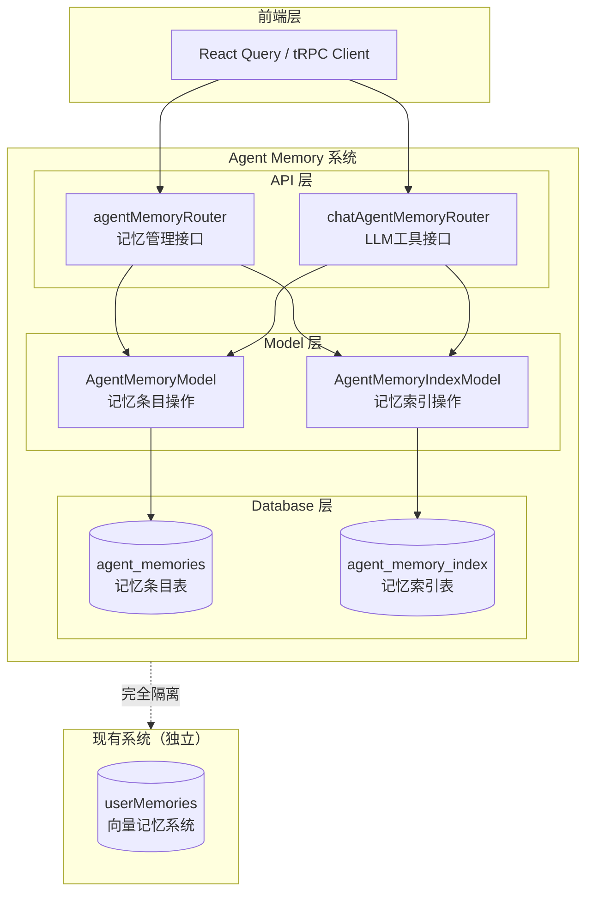

# Agent Memory 后端设计方案

## 1. 概述

### 1.1 设计目标

基于 Claude Code 的文本索引记忆架构，实现一个与现有向量记忆系统（`userMemories`）并存的 Agent 记忆系统。

**核心原则**：
- 记忆是文本，不是向量
- 判断相关性的是 AI，不是算法
- 两表结构：索引表 + 条目表
- 与现有 `userMemories` 系统完全隔离

### 1.2 系统边界



## 2. 数据库设计

### 2.1 Schema 定义

#### agent_memories 表（记忆条目表）

**文件**: `packages/database/src/schemas/agentMemory.ts`

```typescript
/* eslint-disable sort-keys-fix/sort-keys-fix  */
import { boolean, index, pgTable, text } from 'drizzle-orm/pg-core';
import { createInsertSchema } from 'drizzle-zod';

import { idGenerator } from '../utils/idGenerator';
import { timestamps, varchar255 } from './_helpers';
import { users } from './user';

export const agentMemories = pgTable(
  'agent_memories',
  {
    id: varchar255('id')
      .$defaultFn(() => idGenerator('agent_memory'))
      .primaryKey(),

    userId: text('user_id')
      .references(() => users.id, { onDelete: 'cascade' })
      .notNull(),

    // 固定为 'default_agent'，未来支持多角色
    agentId: varchar255('agent_id').notNull().default('default_agent'),

    // 记忆分类: user, feedback, project, reference
    category: varchar255('category').notNull(),

    title: varchar255('title').notNull(),
    content: text('content').notNull(),
    description: text('description'),

    // 来源追踪
    sourceSessionId: text('source_session_id'),
    sourceMessageIds: text('source_message_ids').array(),

    isActive: boolean('is_active').default(true).notNull(),

    ...timestamps,
  },
  (table) => [
    // 复合索引：按用户和角色查询
    index('agent_memories_user_agent_idx').on(table.userId, table.agentId),
    // 分类筛选索引
    index('agent_memories_category_idx').on(table.category),
    // 激活状态索引
    index('agent_memories_active_idx').on(table.isActive),
    // 标题搜索索引
    index('agent_memories_title_idx').on(table.title),
  ],
);

export const insertAgentMemorySchema = createInsertSchema(agentMemories);
export type NewAgentMemory = typeof agentMemories.$inferInsert;
export type AgentMemoryItem = typeof agentMemories.$inferSelect;
```

#### agent_memory_index 表（记忆索引表）

```typescript
export const agentMemoryIndex = pgTable(
  'agent_memory_index',
  {
    id: varchar255('id')
      .$defaultFn(() => idGenerator('agent_memory_idx'))
      .primaryKey(),

    userId: text('user_id')
      .references(() => users.id, { onDelete: 'cascade' })
      .notNull(),

    agentId: varchar255('agent_id').notNull().default('default_agent'),

    // 关联的记忆条目
    entryId: varchar255('entry_id')
      .references(() => agentMemories.id, { onDelete: 'cascade' })
      .notNull(),

    category: varchar255('category').notNull(),
    title: varchar255('title').notNull(),
    description: text('description'),

    isActive: boolean('is_active').default(true).notNull(),

    // 访问统计
    accessCount: integer('access_count').default(0).notNull(),
    lastAccessedAt: timestamptz('last_accessed_at').defaultNow().notNull(),

    ...timestamps,
  },
  (table) => [
    // 复合索引：按用户和角色查询索引
    index('agent_memory_index_user_agent_idx').on(table.userId, table.agentId),
    // entryId 唯一索引（一个条目对应一个索引）
    index('agent_memory_index_entry_id_idx').on(table.entryId),
    // 分类筛选
    index('agent_memory_index_category_idx').on(table.category),
    // 访问时间排序
    index('agent_memory_index_accessed_idx').on(table.lastAccessedAt),
  ],
);

export const insertAgentMemoryIndexSchema = createInsertSchema(agentMemoryIndex);
export type NewAgentMemoryIndex = typeof agentMemoryIndex.$inferInsert;
export type AgentMemoryIndexItem = typeof agentMemoryIndex.$inferSelect;
```

### 2.2 索引设计说明

| 索引名 | 字段 | 用途 |
|--------|------|------|
| agent_memories_user_agent_idx | (userId, agentId) | 按用户和角色查询记忆 |
| agent_memories_category_idx | category | 按分类筛选 |
| agent_memories_active_idx | isActive | 按激活状态筛选 |
| agent_memory_index_entry_id_idx | entryId | 关联查询和唯一性检查 |
| agent_memory_index_accessed_idx | lastAccessedAt | 按访问时间排序 |

## 3. Model 层实现

### 3.1 AgentMemoryModel

**文件**: `packages/database/src/models/agentMemory.ts`

```typescript
import { and, count, desc, eq, inArray, like, sql } from 'drizzle-orm';

import {
  AgentMemoryItem,
  NewAgentMemory,
  agentMemories,
} from '../schemas';
import { LobeChatDatabase } from '../type';

export class AgentMemoryModel {
  private userId: string;
  private db: LobeChatDatabase;

  constructor(db: LobeChatDatabase, userId: string) {
    this.userId = userId;
    this.db = db;
  }

  // **************** Query *************** //

  /**
   * 查询记忆列表（支持筛选）
   */
  query = async (params: {
    agentId: string;
    category?: string;
    search?: string;
    isActive?: boolean;
  }) => {
    const { agentId, category, search, isActive } = params;

    return this.db.query.agentMemories.findMany({
      where: and(
        eq(agentMemories.userId, this.userId),
        eq(agentMemories.agentId, agentId),
        category ? eq(agentMemories.category, category) : undefined,
        isActive !== undefined ? eq(agentMemories.isActive, isActive) : undefined,
        search ? like(agentMemories.title, `%${search}%`) : undefined,
      ),
      orderBy: [desc(agentMemories.updatedAt)],
    });
  };

  /**
   * 根据 ID 查找记忆
   */
  findById = async (id: string): Promise<AgentMemoryItem | undefined> => {
    return this.db.query.agentMemories.findFirst({
      where: and(
        eq(agentMemories.id, id),
        eq(agentMemories.userId, this.userId),
      ),
    });
  };

  /**
   * 根据 ID 查找（带用户校验）
   */
  findByIdWithUser = async (id: string): Promise<AgentMemoryItem | undefined> => {
    return this.findById(id);
  };

  // **************** Create *************** //

  /**
   * 创建记忆
   */
  create = async (data: Omit<NewAgentMemory, 'id' | 'userId'>): Promise<AgentMemoryItem> => {
    const [result] = await this.db
      .insert(agentMemories)
      .values({
        ...data,
        userId: this.userId,
      })
      .returning();

    return result;
  };

  // **************** Update *************** //

  /**
   * 更新记忆
   */
  update = async (
    id: string,
    data: Partial<Omit<AgentMemoryItem, 'id' | 'userId' | 'createdAt'>>,
  ): Promise<AgentMemoryItem | undefined> => {
    const [result] = await this.db
      .update(agentMemories)
      .set({
        ...data,
        updatedAt: new Date(),
      })
      .where(and(eq(agentMemories.id, id), eq(agentMemories.userId, this.userId)))
      .returning();

    return result;
  };

  // **************** Delete *************** //

  /**
   * 删除记忆
   */
  delete = async (id: string): Promise<void> => {
    await this.db
      .delete(agentMemories)
      .where(and(eq(agentMemories.id, id), eq(agentMemories.userId, this.userId)));
  };

  /**
   * 批量删除
   */
  batchDelete = async (ids: string[]): Promise<void> => {
    await this.db
      .delete(agentMemories)
      .where(and(eq(agentMemories.userId, this.userId), inArray(agentMemories.id, ids)));
  };

  // **************** Count *************** //

  /**
   * 统计记忆数量
   */
  count = async (params: { agentId: string; category?: string }): Promise<number> => {
    const [result] = await this.db
      .select({ count: count() })
      .from(agentMemories)
      .where(
        and(
          eq(agentMemories.userId, this.userId),
          eq(agentMemories.agentId, params.agentId),
          params.category ? eq(agentMemories.category, params.category) : undefined,
        ),
      );

    return result.count;
  };
}
```

### 3.2 AgentMemoryIndexModel

**文件**: `packages/database/src/models/agentMemoryIndex.ts`

```typescript
import { and, desc, eq, inArray, sql } from 'drizzle-orm';

import {
  AgentMemoryIndexItem,
  NewAgentMemoryIndex,
  agentMemoryIndex,
} from '../schemas';
import { LobeChatDatabase } from '../type';

export class AgentMemoryIndexModel {
  private userId: string;
  private db: LobeChatDatabase;

  constructor(db: LobeChatDatabase, userId: string) {
    this.userId = userId;
    this.db = db;
  }

  // **************** Query *************** //

  /**
   * 查询某 Agent 的所有索引
   */
  queryByAgentId = async (agentId: string): Promise<AgentMemoryIndexItem[]> => {
    return this.db.query.agentMemoryIndex.findMany({
      where: and(
        eq(agentMemoryIndex.userId, this.userId),
        eq(agentMemoryIndex.agentId, agentId),
        eq(agentMemoryIndex.isActive, true),
      ),
      orderBy: [desc(agentMemoryIndex.lastAccessedAt)],
    });
  };

  /**
   * 根据 entryId 查找索引
   */
  findByEntryId = async (entryId: string): Promise<AgentMemoryIndexItem | undefined> => {
    return this.db.query.agentMemoryIndex.findFirst({
      where: and(
        eq(agentMemoryIndex.entryId, entryId),
        eq(agentMemoryIndex.userId, this.userId),
      ),
    });
  };

  // **************** Create *************** //

  /**
   * 创建索引
   */
  create = async (
    data: Omit<NewAgentMemoryIndex, 'id' | 'userId' | 'accessCount' | 'lastAccessedAt'>,
  ): Promise<AgentMemoryIndexItem> => {
    const [result] = await this.db
      .insert(agentMemoryIndex)
      .values({
        ...data,
        userId: this.userId,
        accessCount: 0,
        lastAccessedAt: new Date(),
      })
      .returning();

    return result;
  };

  // **************** Update *************** //

  /**
   * 更新索引（通过 entryId）
   */
  updateByEntryId = async (
    entryId: string,
    data: Partial<Pick<AgentMemoryIndexItem, 'category' | 'title' | 'description' | 'isActive'>>,
  ): Promise<void> => {
    await this.db
      .update(agentMemoryIndex)
      .set({
        ...data,
        updatedAt: new Date(),
      })
      .where(
        and(
          eq(agentMemoryIndex.entryId, entryId),
          eq(agentMemoryIndex.userId, this.userId),
        ),
      );
  };

  /**
   * 记录访问
   */
  recordAccess = async (id: string): Promise<void> => {
    await this.db
      .update(agentMemoryIndex)
      .set({
        accessCount: sql`${agentMemoryIndex.accessCount} + 1`,
        lastAccessedAt: new Date(),
      })
      .where(and(eq(agentMemoryIndex.id, id), eq(agentMemoryIndex.userId, this.userId)));
  };

  // **************** Delete *************** //

  /**
   * 删除索引（通过 entryId）
   */
  deleteByEntryId = async (entryId: string): Promise<void> => {
    await this.db
      .delete(agentMemoryIndex)
      .where(
        and(
          eq(agentMemoryIndex.entryId, entryId),
          eq(agentMemoryIndex.userId, this.userId),
        ),
      );
  };

  /**
   * 批量删除
   */
  deleteByEntryIds = async (entryIds: string[]): Promise<void> => {
    await this.db
      .delete(agentMemoryIndex)
      .where(
        and(
          eq(agentMemoryIndex.userId, this.userId),
          inArray(agentMemoryIndex.entryId, entryIds),
        ),
      );
  };
}
```

### 3.3 导出到 schemas/index.ts

在 `packages/database/src/schemas/index.ts` 中添加：

```typescript
export * from './agentMemory';
```

## 4. tRPC Router 实现

### 4.1 主 Router - agentMemory.ts

**文件**: `src/server/routers/lambda/agentMemory.ts`

```typescript
import { z } from 'zod';

import { AgentMemoryIndexModel } from '@/database/models/agentMemoryIndex';
import { AgentMemoryModel } from '@/database/models/agentMemory';
import { insertAgentMemorySchema } from '@/database/schemas';
import { authedProcedure, router } from '@/libs/trpc/lambda';
import { serverDatabase } from '@/libs/trpc/lambda/middleware';

// 固定 agentId，未来支持多角色
const DEFAULT_AGENT_ID = 'default_agent';

const agentMemoryProcedure = authedProcedure
  .use(serverDatabase)
  .use(async (opts) => {
    const { ctx } = opts;
    return opts.next({
      ctx: {
        agentMemoryModel: new AgentMemoryModel(ctx.serverDB, ctx.userId),
        agentMemoryIndexModel: new AgentMemoryIndexModel(ctx.serverDB, ctx.userId),
      },
    });
  });

export const agentMemoryRouter = router({
  // ============== Query ==============

  /**
   * 获取记忆索引列表（轻量，供列表展示）
   */
  getMemoryIndex: agentMemoryProcedure.query(async ({ ctx }) => {
    return ctx.agentMemoryIndexModel.queryByAgentId(DEFAULT_AGENT_ID);
  }),

  /**
   * 获取记忆详情
   */
  getMemory: agentMemoryProcedure
    .input(z.object({ id: z.string() }))
    .query(async ({ input, ctx }) => {
      const memory = await ctx.agentMemoryModel.findById(input.id);
      
      if (memory) {
        // 更新访问统计
        const index = await ctx.agentMemoryIndexModel.findByEntryId(input.id);
        if (index) {
          await ctx.agentMemoryIndexModel.recordAccess(index.id);
        }
      }
      
      return memory;
    }),

  /**
   * 统计记忆数量
   */
  countMemories: agentMemoryProcedure
    .input(
      z
        .object({
          category: z.enum(['user', 'feedback', 'project', 'reference']).optional(),
        })
        .optional(),
    )
    .query(async ({ ctx, input }) => {
      return ctx.agentMemoryModel.count({
        agentId: DEFAULT_AGENT_ID,
        category: input?.category,
      });
    }),

  // ============== Mutation ==============

  /**
   * 创建记忆
   */
  createMemory: agentMemoryProcedure
    .input(
      z.object({
        category: z.enum(['user', 'feedback', 'project', 'reference']),
        title: z.string().min(1).max(255),
        content: z.string().min(1),
        description: z.string().max(500).optional(),
        sourceSessionId: z.string().optional(),
        sourceMessageIds: z.array(z.string()).optional(),
      }),
    )
    .mutation(async ({ input, ctx }) => {
      // 1. 创建记忆条目
      const entry = await ctx.agentMemoryModel.create({
        agentId: DEFAULT_AGENT_ID,
        ...input,
      });

      // 2. 自动创建索引记录
      await ctx.agentMemoryIndexModel.create({
        agentId: DEFAULT_AGENT_ID,
        entryId: entry.id,
        category: input.category,
        title: input.title,
        description: input.description || input.content.slice(0, 100),
        isActive: true,
      });

      return entry;
    }),

  /**
   * 更新记忆
   */
  updateMemory: agentMemoryProcedure
    .input(
      z.object({
        id: z.string(),
        value: z.object({
          category: z.enum(['user', 'feedback', 'project', 'reference']).optional(),
          title: z.string().min(1).max(255).optional(),
          content: z.string().min(1).optional(),
          description: z.string().max(500).optional(),
          isActive: z.boolean().optional(),
        }),
      }),
    )
    .mutation(async ({ input, ctx }) => {
      // 1. 更新记忆条目
      const result = await ctx.agentMemoryModel.update(input.id, input.value);

      // 2. 同步更新索引
      if (result && (input.value.title || input.value.description || input.value.category)) {
        await ctx.agentMemoryIndexModel.updateByEntryId(input.id, {
          category: input.value.category,
          title: input.value.title,
          description: input.value.description,
          isActive: input.value.isActive,
        });
      }

      return result;
    }),

  /**
   * 删除记忆
   */
  deleteMemory: agentMemoryProcedure
    .input(z.object({ id: z.string() }))
    .mutation(async ({ input, ctx }) => {
      // 1. 先删除索引
      await ctx.agentMemoryIndexModel.deleteByEntryId(input.id);
      
      // 2. 再删除条目
      await ctx.agentMemoryModel.delete(input.id);

      return { success: true, deletedId: input.id };
    }),

  /**
   * 批量删除记忆
   */
  batchDeleteMemories: agentMemoryProcedure
    .input(z.object({ ids: z.array(z.string()) }))
    .mutation(async ({ input, ctx }) => {
      // 1. 先删除索引
      await ctx.agentMemoryIndexModel.deleteByEntryIds(input.ids);
      
      // 2. 再删除条目
      await ctx.agentMemoryModel.batchDelete(input.ids);

      return {
        success: true,
        deletedCount: input.ids.length,
        deletedIds: input.ids,
      };
    }),

  // ============== Settings ==============

  /**
   * 获取记忆设置
   */
  getSettings: agentMemoryProcedure.query(async () => {
    // TODO: 从用户配置或系统配置读取
    return {
      enabled: true,
      maxEntriesPerUser: 200,
      defaultReadEnabled: true,
      defaultWriteEnabled: true,
      categories: ['user', 'feedback', 'project', 'reference', 'general'],
    };
  }),

  /**
   * 更新记忆设置
   */
  updateSettings: agentMemoryProcedure
    .input(
      z.object({
        enabled: z.boolean().optional(),
        defaultReadEnabled: z.boolean().optional(),
        defaultWriteEnabled: z.boolean().optional(),
      }),
    )
    .mutation(async ({ input }) => {
      // TODO: 保存到用户配置
      return {
        enabled: input.enabled ?? true,
        maxEntriesPerUser: 200,
        defaultReadEnabled: input.defaultReadEnabled ?? true,
        defaultWriteEnabled: input.defaultWriteEnabled ?? true,
        categories: ['user', 'feedback', 'project', 'reference', 'general'],
      };
    }),
});

export type AgentMemoryRouter = typeof agentMemoryRouter;
```

### 4.2 LLM 工具 Router - chatAgentMemory.ts

**文件**: `src/server/routers/lambda/chatAgentMemory.ts`

```typescript
import { z } from 'zod';

import { AgentMemoryIndexModel } from '@/database/models/agentMemoryIndex';
import { AgentMemoryModel } from '@/database/models/agentMemory';
import { authedProcedure, router } from '@/libs/trpc/lambda';
import { serverDatabase } from '@/libs/trpc/lambda/middleware';

const DEFAULT_AGENT_ID = 'default_agent';

const chatAgentMemoryProcedure = authedProcedure
  .use(serverDatabase)
  .use(async (opts) => {
    const { ctx } = opts;
    return opts.next({
      ctx: {
        agentMemoryModel: new AgentMemoryModel(ctx.serverDB, ctx.userId),
        agentMemoryIndexModel: new AgentMemoryIndexModel(ctx.serverDB, ctx.userId),
      },
    });
  });

/**
 * LLM 工具接口
 * 供 AI 在对话过程中调用，管理记忆
 */
export const chatAgentMemoryRouter = router({
  /**
   * 读取记忆详情
   */
  read: chatAgentMemoryProcedure
    .input(z.object({ entryId: z.string() }))
    .mutation(async ({ input, ctx }) => {
      const memory = await ctx.agentMemoryModel.findById(input.entryId);

      if (memory) {
        // 更新访问统计
        const index = await ctx.agentMemoryIndexModel.findByEntryId(input.entryId);
        if (index) {
          await ctx.agentMemoryIndexModel.recordAccess(index.id);
        }
      }

      return memory;
    }),

  /**
   * 创建记忆
   */
  create: chatAgentMemoryProcedure
    .input(
      z.object({
        category: z.enum(['user', 'feedback', 'project', 'reference']),
        title: z.string(),
        content: z.string(),
      }),
    )
    .mutation(async ({ input, ctx }) => {
      // 1. 创建条目
      const entry = await ctx.agentMemoryModel.create({
        agentId: DEFAULT_AGENT_ID,
        ...input,
      });

      // 2. 创建索引
      await ctx.agentMemoryIndexModel.create({
        agentId: DEFAULT_AGENT_ID,
        entryId: entry.id,
        category: input.category,
        title: input.title,
        description: input.content.slice(0, 100),
        isActive: true,
      });

      return entry;
    }),

  /**
   * 更新记忆
   */
  update: chatAgentMemoryProcedure
    .input(
      z.object({
        entryId: z.string(),
        content: z.string(),
      }),
    )
    .mutation(async ({ input, ctx }) => {
      return ctx.agentMemoryModel.update(input.entryId, {
        content: input.content,
      });
    }),

  /**
   * 删除记忆
   */
  delete: chatAgentMemoryProcedure
    .input(z.object({ entryId: z.string() }))
    .mutation(async ({ input, ctx }) => {
      await ctx.agentMemoryIndexModel.deleteByEntryId(input.entryId);
      await ctx.agentMemoryModel.delete(input.entryId);
      return { success: true };
    }),

  /**
   * 列出所有记忆索引
   */
  list: chatAgentMemoryProcedure.query(async ({ ctx }) => {
    return ctx.agentMemoryIndexModel.queryByAgentId(DEFAULT_AGENT_ID);
  }),
});

export type ChatAgentMemoryRouter = typeof chatAgentMemoryRouter;
```

### 4.3 注册到 Lambda Router

**文件**: `src/server/routers/lambda/index.ts`

```typescript
import { agentMemoryRouter } from './agentMemory';
import { chatAgentMemoryRouter } from './chatAgentMemory';

export const lambdaRouter = router({
  // ... 其他 routers
  agentMemory: agentMemoryRouter,
  chatAgentMemory: chatAgentMemoryRouter,
});
```

## 5. 测试用例

### 5.1 Model 层测试

**文件**: `packages/database/src/models/__tests__/agentMemory.test.ts`

```typescript
import { AgentMemoryModel } from '../agentMemory';
import { AgentMemoryIndexModel } from '../agentMemoryIndex';

describe('AgentMemoryModel', () => {
  let memoryModel: AgentMemoryModel;
  let indexModel: AgentMemoryIndexModel;

  beforeEach(() => {
    // 初始化测试数据库
  });

  it('should create memory and auto-create index', async () => {
    const memory = await memoryModel.create({
      agentId: 'default_agent',
      category: 'user',
      title: 'Test Memory',
      content: 'Test content',
    });

    expect(memory.id).toBeDefined();
    expect(memory.title).toBe('Test Memory');

    const index = await indexModel.findByEntryId(memory.id);
    expect(index).toBeDefined();
    expect(index?.title).toBe('Test Memory');
  });

  it('should update memory and sync index', async () => {
    const memory = await memoryModel.create({
      agentId: 'default_agent',
      category: 'user',
      title: 'Original Title',
      content: 'Content',
    });

    await memoryModel.update(memory.id, {
      title: 'Updated Title',
    });

    const index = await indexModel.findByEntryId(memory.id);
    expect(index?.title).toBe('Updated Title');
  });

  it('should delete memory and cascade to index', async () => {
    const memory = await memoryModel.create({
      agentId: 'default_agent',
      category: 'user',
      title: 'To Delete',
      content: 'Content',
    });

    await indexModel.create({
      agentId: 'default_agent',
      entryId: memory.id,
      category: 'user',
      title: 'To Delete',
      description: 'Desc',
    });

    await memoryModel.delete(memory.id);

    const found = await memoryModel.findById(memory.id);
    expect(found).toBeUndefined();
  });
});
```

## 6. 部署检查清单

- [ ] 1. 创建数据库迁移文件
- [ ] 2. 添加 Schema 定义到 `packages/database/src/schemas/agentMemory.ts`
- [ ] 3. 导出 Schema 到 `packages/database/src/schemas/index.ts`
- [ ] 4. 创建 Model 文件 `packages/database/src/models/agentMemory.ts`
- [ ] 5. 创建 Model 文件 `packages/database/src/models/agentMemoryIndex.ts`
- [ ] 6. 创建 tRPC Router `src/server/routers/lambda/agentMemory.ts`
- [ ] 7. 创建 tRPC Router `src/server/routers/lambda/chatAgentMemory.ts`
- [ ] 8. 注册 Routers 到 `src/server/routers/lambda/index.ts`
- [ ] 9. 创建上下文 Provider `src/server/services/agentMemory/contextProvider.ts`
- [ ] 10. 创建工具定义 `src/tools/agentMemory/index.ts`
- [ ] 11. 运行数据库迁移
- [ ] 12. 编写并运行测试

## 7. 与现有系统的关系

### 9.1 与 userMemories 的区别

| 特性 | Agent Memory (新) | User Memories (现有) |
|------|-------------------|---------------------|
| 存储方式 | 纯文本 Markdown | 向量 + 文本 |
| 检索方式 | LLM 自主判断 | 向量相似度搜索 |
| 表结构 | 2 张表 | 5 张表 |
| 可读性 | 完全可读可编辑 | 向量不可读 |
| 依赖 | 无 Embedding | 依赖 Embedding 模型 |
| 用途 | Agent 角色记忆 | 用户全局记忆 |

### 9.2 共存策略

- 两个系统完全独立，使用不同的表
