# 记忆系统设计方案（Claude Code 文本索引方案）

## 1. 设计概述

### 1.1 核心理念

**记忆是文本，不是向量。判断相关性的是 AI，不是算法。**

本方案采用 Claude Code 的文本记忆架构，以人类可读的 Markdown 文本存储记忆，由 LLM 自主判断记忆的相关性，而非依赖向量相似度计算。

### 1.2 与角色系统的关系

> **当前阶段**：角色系统暂不开发，但保留完整的向后扩展性。
> 
> **agent_id 处理**：所有记忆统一使用固定值 `default_agent`，未来角色系统开发后可无缝迁移。

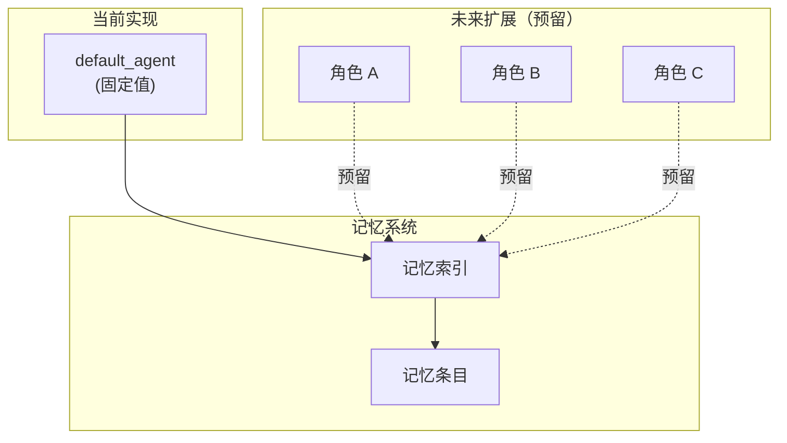

---

## 2. 系统架构

### 2.1 整体架构

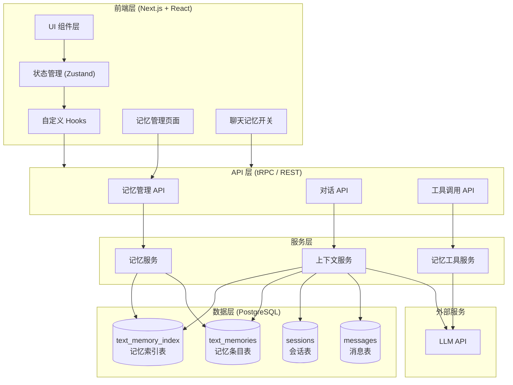

### 2.2 核心数据流

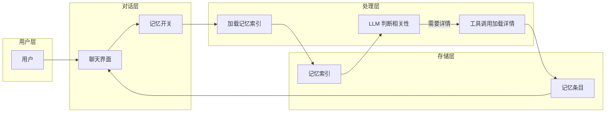

---

## 3. 数据库 Schema 设计

### 3.1 记忆索引表 (text_memory_index)

存储轻量级的记忆摘要列表，始终加载到上下文中。

| 字段名 | 类型 | 约束 | 说明 |
|--------|------|------|------|
| id | varchar(255) | PK | 索引唯一标识 |
| user_id | text | FK → users.id | 所属用户 |
| agent_id | varchar(100) | Default 'default_agent' | 所属角色（预留） |
| category | varchar(50) | - | 记忆分类 |
| title | varchar(255) | - | 记忆标题 |
| description | text | - | 记忆描述（一行） |
| entry_id | varchar(255) | FK → text_memories.id | 关联条目 ID |
| is_active | boolean | Default true | 是否激活 |
| last_accessed_at | timestamptz | - | 最后访问时间 |
| access_count | bigint | Default 0 | 访问次数 |
| created_at | timestamptz | - | 创建时间 |
| updated_at | timestamptz | - | 更新时间 |

**索引设计**：
```sql
-- 按用户和角色查询索引
CREATE INDEX idx_memory_index_user_agent ON text_memory_index(user_id, agent_id);
-- 按分类筛选
CREATE INDEX idx_memory_index_category ON text_memory_index(category);
-- 按激活状态筛选
CREATE INDEX idx_memory_index_active ON text_memory_index(is_active);
```

### 3.2 记忆条目表 (text_memories)

存储完整的 Markdown 记忆内容。

| 字段名 | 类型 | 约束 | 说明 |
|--------|------|------|------|
| id | varchar(255) | PK | 条目唯一标识 |
| user_id | text | FK → users.id | 所属用户 |
| agent_id | varchar(100) | Default 'default_agent' | 所属角色（预留） |
| category | varchar(50) | - | 记忆分类 |
| title | varchar(255) | - | 记忆标题 |
| content | text | - | 记忆内容（Markdown） |
| source_session_id | text | FK → sessions.id | 来源会话 ID（可选） |
| source_message_ids | jsonb | - | 来源消息 ID 列表 |
| is_active | boolean | Default true | 是否激活 |
| created_at | timestamptz | - | 创建时间 |
| updated_at | timestamptz | - | 更新时间 |

**索引设计**：
```sql
-- 按用户和角色查询条目
CREATE INDEX idx_memories_user_agent ON text_memories(user_id, agent_id);
-- 按分类筛选
CREATE INDEX idx_memories_category ON text_memories(category);
```

### 3.3 记忆分类定义

| 分类 | 说明 | 示例 |
|------|------|------|
| `user` | 用户画像/偏好 | "用户喜欢简洁的回答" |
| `feedback` | 行为指导/反馈 | "用户不喜欢使用表情符号" |
| `project` | 进行中的工作上下文 | "正在开发用户认证模块" |
| `reference` | 外部资源指针 | "参考文档: https://..." |
| `general` | 未分类通用记忆 | "其他重要信息" |

### 3.4 ER 关系图

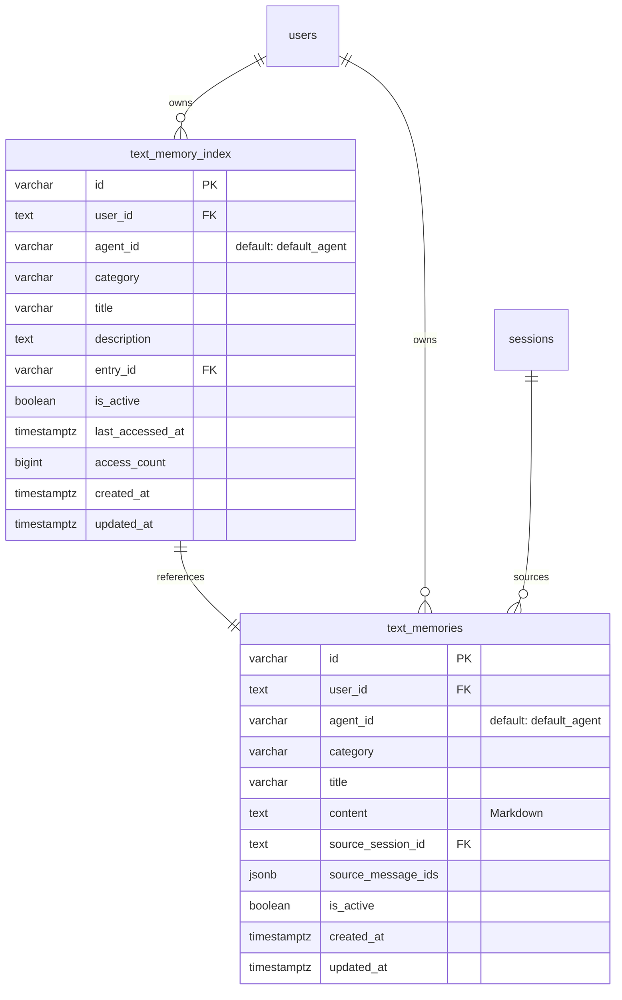

---

## 4. 核心功能流程

### 4.1 记忆生命周期

```mermaid
flowchart TB
    subgraph Create["创建记忆"]
        C1["LLM 识别重要信息"] --> C2["调用 memory_create 工具"]
        C2 --> C3["写入 text_memories"]
        C3 --> C4["自动生成索引记录"]
    end
    
    subgraph Read["读取记忆"]
        R1["加载索引到上下文"] --> R2["LLM 判断相关性"]
        R2 -->|需要详情| R3["调用 memory_read 工具"]
        R3 --> R4["查询 text_memories"]
        R4 --> R5["更新访问统计"]
    end
    
    subgraph Update["更新记忆"]
        U1["调用 memory_update 工具"] --> U2["更新 text_memories"]
        U2 --> U3["同步更新索引"]
    end
    
    subgraph Delete["删除记忆"]
        D1["调用 memory_delete 工具"] --> D2["删除 text_memories"]
        D2 --> D3["删除索引记录"]
    end
```

### 4.2 对话中的记忆流程

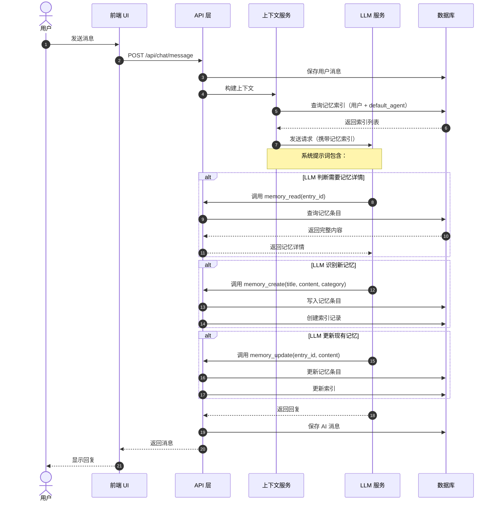

### 4.3 索引重建流程

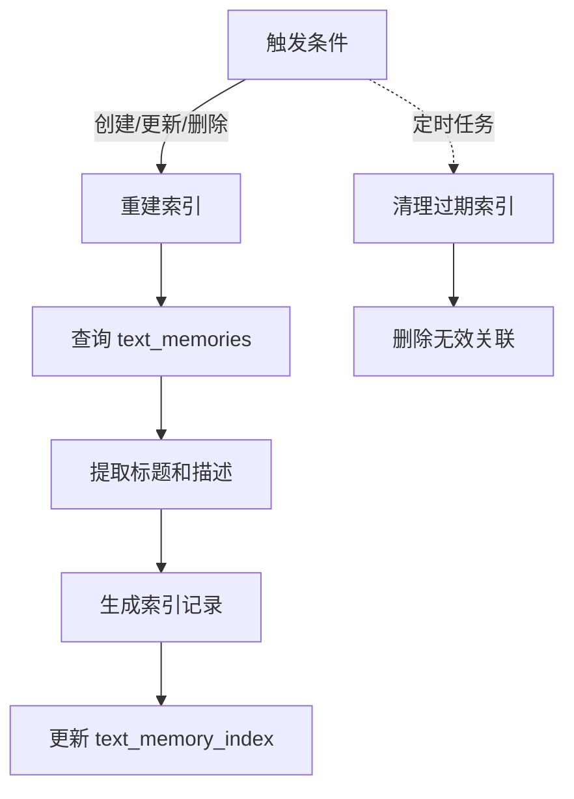

---

## 5. LLM 记忆工具设计

### 5.1 工具列表

| 工具名 | 功能 | 调用时机 |
|--------|------|----------|
| `memory_create` | 创建新记忆 | LLM 识别到值得记住的信息 |
| `memory_read` | 读取记忆详情 | LLM 判断需要某条记忆的完整内容 |
| `memory_update` | 更新记忆 | LLM 发现已有记忆需要修正或补充 |
| `memory_delete` | 删除记忆 | LLM 判断某条记忆已过时或错误 |
| `memory_list` | 列出所有记忆 | LLM 需要了解可用记忆范围 |

### 5.2 工具调用流程

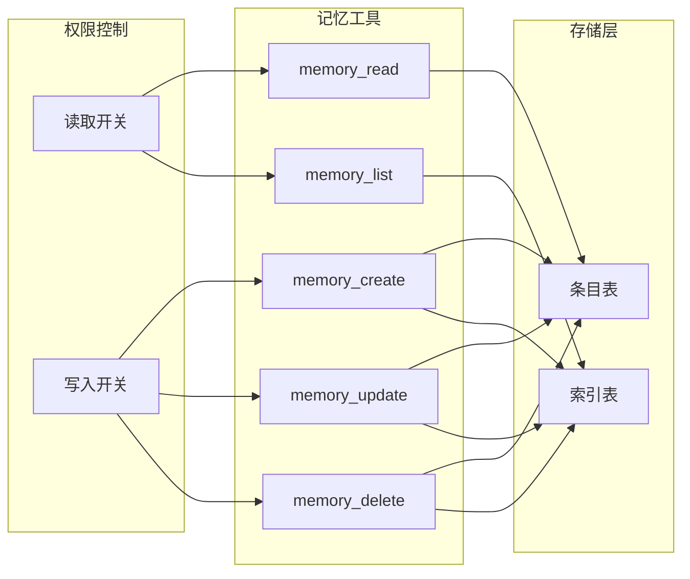

---

## 6. 上下文注入策略

### 6.1 提示词构建

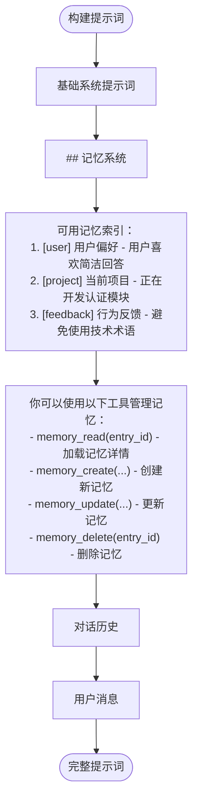

### 6.2 Token 控制策略

| 项目 | 估算 Token | 控制策略 |
|------|-----------|----------|
| 基础系统提示词 | 200-500 | 固定 |
| 记忆索引（200条） | ~5000 | 限制每用户最多 200 条 |
| 选中记忆详情 | 可变 | LLM 自主选择加载 |
| 对话历史 | 可变 | 按消息数量限制 |

**溢出处理**：
- 当记忆数量超过 200 条时，LLM 需要合并或删除低价值条目
- 管理页面显示警告提示用户清理记忆

---

## 7. 用户界面设计

### 7.1 聊天界面记忆开关

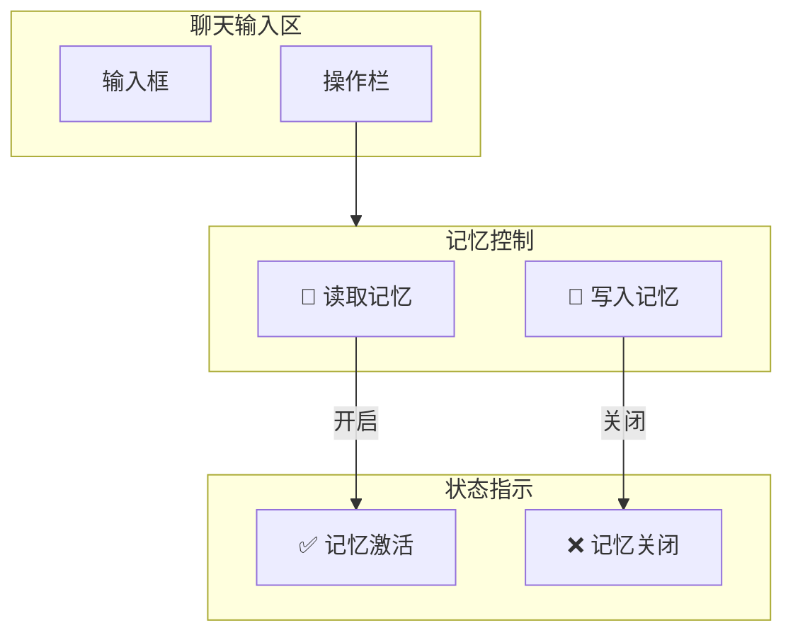

### 7.2 记忆管理页面

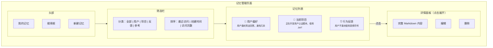

---

## 8. 接口设计

### 8.1 记忆管理接口

| 方法 | 路径 | 描述 |
|------|------|------|
| GET | /api/memories | 获取记忆列表（支持分类筛选） |
| POST | /api/memories | 创建记忆（用户手动创建） |
| GET | /api/memories/:id | 获取记忆详情 |
| PUT | /api/memories/:id | 更新记忆 |
| DELETE | /api/memories/:id | 删除记忆 |
| GET | /api/memories/index | 获取记忆索引（供 LLM 使用） |

### 8.2 聊天记忆接口

| 方法 | 路径 | 描述 |
|------|------|------|
| POST | /api/chat/memory/read | LLM 工具：读取记忆详情 |
| POST | /api/chat/memory/create | LLM 工具：创建记忆 |
| POST | /api/chat/memory/update | LLM 工具：更新记忆 |
| POST | /api/chat/memory/delete | LLM 工具：删除记忆 |
| POST | /api/chat/memory/list | LLM 工具：列出记忆 |

### 8.3 用户设置接口

| 方法 | 路径 | 描述 |
|------|------|------|
| GET | /api/settings/memory | 获取记忆设置 |
| PUT | /api/settings/memory | 更新记忆设置 |

---

## 9. 状态管理（可选）

### 9.1 状态分布建议

记忆相关的状态可以分散到现有的 Store 中，无需创建独立的 MemoryStore：

| 状态 | 建议存放位置 | 说明 |
|------|-------------|------|
| 记忆列表数据 | 页面本地 state / React Query | 通过 API 获取，无需全局状态 |
| 当前编辑的记忆 | 页面本地 state | 仅在管理页面使用 |
| 记忆读写开关 | `chat` Store 或 `user` Store | 跟随会话或用户偏好 |
| 加载状态 | 页面本地 state | 组件级管理 |

### 9.2 简单实现方式

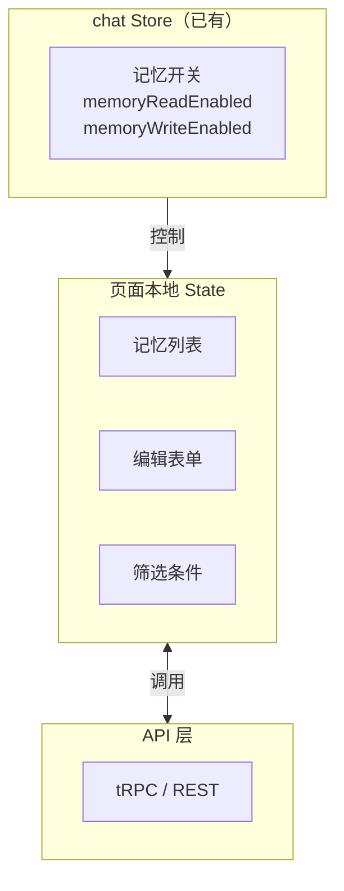

**理由**：
- 记忆数据主要是**列表展示**，用 React Query / SWR 管理即可
- 记忆管理页面是**独立页面**，状态无需共享给其他页面
- 只有记忆开关需要在**聊天界面**使用，放到 chat Store 足够

---

## 10. 配置项

| 配置项 | 类型 | 默认值 | 说明 |
|--------|------|--------|------|
| `memory.enabled` | boolean | true | 是否启用记忆系统 |
| `memory.maxEntriesPerUser` | number | 200 | 每用户最大记忆数 |
| `memory.defaultReadEnabled` | boolean | true | 默认开启记忆读取 |
| `memory.defaultWriteEnabled` | boolean | true | 默认开启记忆写入 |
| `memory.categories` | string[] | ['user', 'feedback', 'project', 'reference', 'general'] | 可用记忆分类 |

---

## 11. 向后扩展性设计

### 11.1 角色系统预留

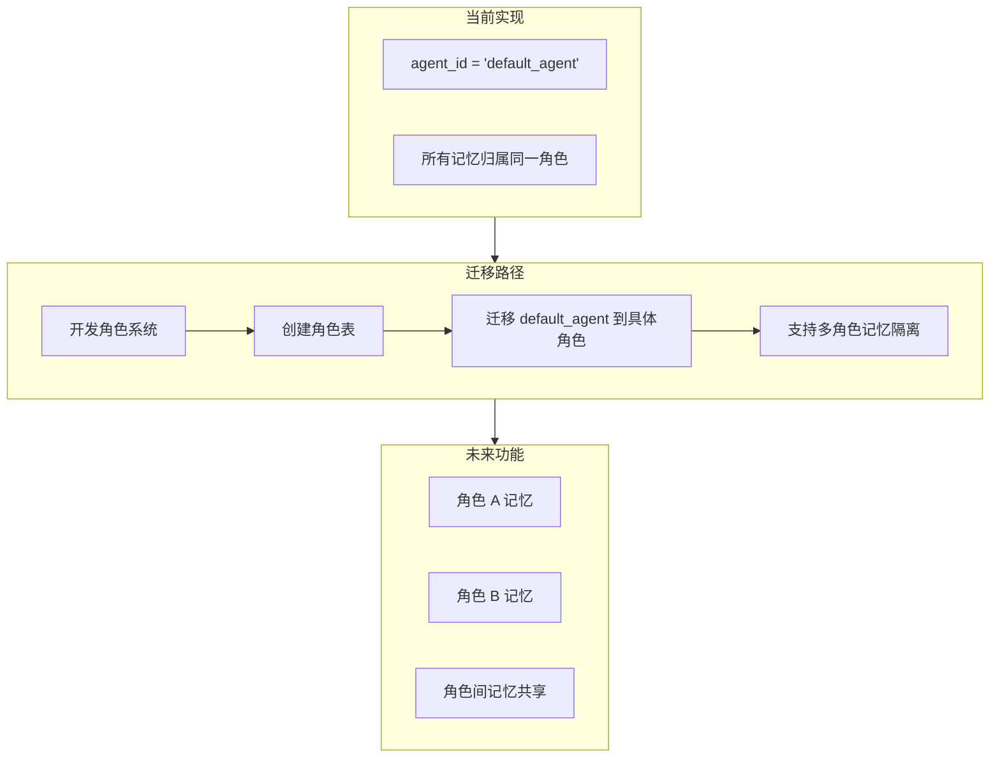

### 11.2 预留字段说明

| 字段 | 当前值 | 未来用途 |
|------|--------|----------|
| `agent_id` | 'default_agent' | 关联到具体角色 ID |
| `source_session_id` | 可选 | 追踪记忆来源会话 |
| `source_message_ids` | JSON 数组 | 精确定位来源消息 |

---

## 12. 与现有系统共存

### 12.1 与向量记忆系统的关系

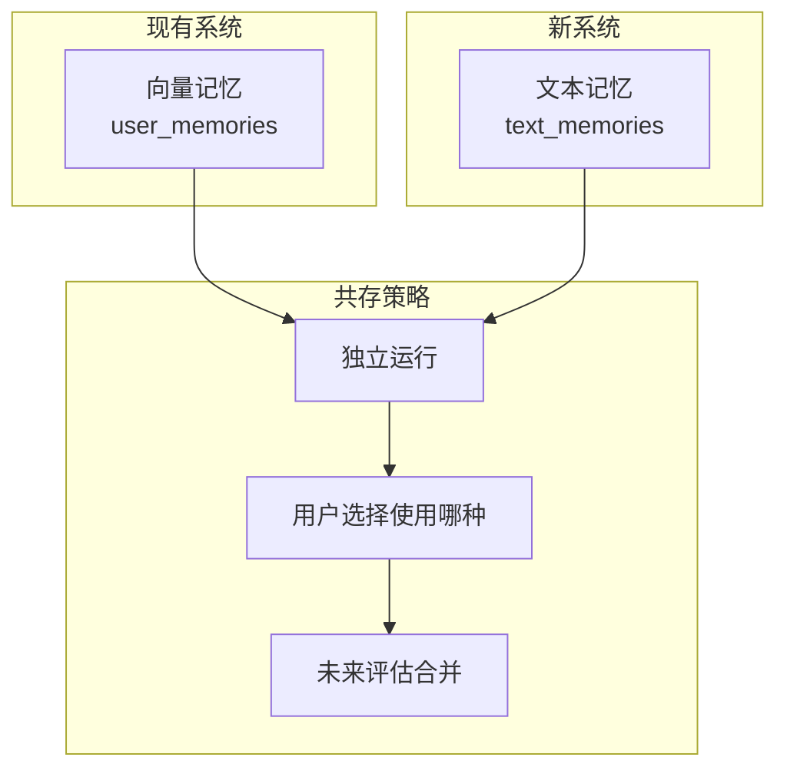

**共存原则**：
- 新系统使用独立的表（`text_memories`, `text_memory_index`）
- 不与现有的 `user_memories` 表交互
- 用户可在设置中选择使用哪种记忆系统
- 未来根据使用反馈评估是否迁移/合并

---

## 13. 总结

本记忆设计方案采用 Claude Code 的文本索引架构，核心特点：

1. **两表结构**：索引表 + 条目表，简单清晰
2. **LLM 驱动**：由 LLM 自主判断记忆相关性，无需向量计算
3. **完全可读**：Markdown 格式，用户可直接查看编辑
4. **工具调用**：通过函数调用实现记忆的 CRUD 操作
5. **预留扩展**：`agent_id` 固定为 `default_agent`，未来无缝支持多角色

关键优势：
- 消除 Embedding 模型依赖
- 提升用户可控性和可观测性
- 简化数据库结构
- 降低系统复杂度
