# 记忆系统设计方案（Claude Code 文本索引方案）

## 1. 设计概述

### 1.1 核心理念

**记忆是文本，不是向量。判断相关性的是 AI，不是算法。**

本方案采用 Claude Code 的文本记忆架构，以人类可读的 Markdown 文本存储记忆，由 LLM 自主判断记忆的相关性，而非依赖向量相似度计算。

本方案成关键词agentMemories与先前的userMemories系统不属于同一概念，互不相关

### 1.2 与角色系统的关系

> **当前阶段**：角色系统暂不开发，但保留完整的向后扩展性。
> 
> **agent_id 处理**：所有记忆统一使用固定值 `default_agent`，未来角色系统开发后可无缝迁移。

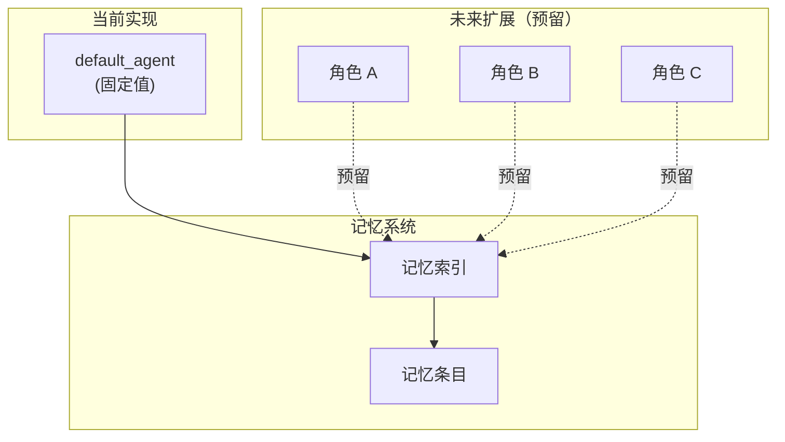

---

## 2. 系统架构

### 2.1 整体架构

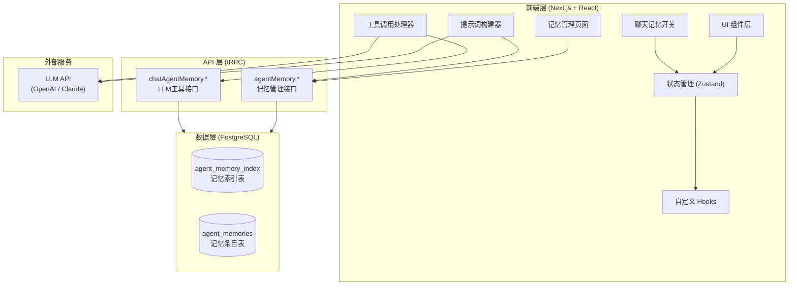

### 2.2 核心数据流

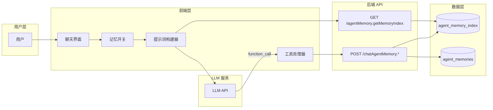

---

## 3. 数据库 Schema 设计

### 3.1 记忆索引表 (agent_memory_index)

存储轻量级的记忆摘要列表，始终加载到上下文中。

| 字段名 | 类型 | 约束 | 说明 |
|--------|------|------|------|
| id | varchar(255) | PK | 索引唯一标识 |
| user_id | text | FK → users.id | 所属用户 |
| agent_id | varchar(100) | Default 'default_agent' | 所属角色（预留） |
| category | varchar(50) | - | 记忆分类 |
| title | varchar(255) | - | 记忆标题 |
| description | text | - | 记忆描述（一行） |
| entry_id | varchar(255) | FK → agent_memories.id | 关联条目 ID |
| is_active | boolean | Default true | 是否激活 |
| last_accessed_at | timestamptz | - | 最后访问时间 |
| access_count | bigint | Default 0 | 访问次数 |
| created_at | timestamptz | - | 创建时间 |
| updated_at | timestamptz | - | 更新时间 |

**索引设计**：
```sql
-- 按用户和角色查询索引
CREATE INDEX idx_agent_memory_index_user_agent ON agent_memory_index(user_id, agent_id);
-- 按分类筛选
CREATE INDEX idx_agent_memory_index_category ON agent_memory_index(category);
-- 按激活状态筛选
CREATE INDEX idx_agent_memory_index_active ON agent_memory_index(is_active);
```

### 3.2 记忆条目表 (agent_memories)

存储完整的 Markdown 记忆内容。

| 字段名 | 类型 | 约束 | 说明 |
|--------|------|------|------|
| id | varchar(255) | PK | 条目唯一标识 |
| user_id | text | FK → users.id | 所属用户 |
| agent_id | varchar(100) | Default 'default_agent' | 所属角色（预留） |
| category | varchar(50) | - | 记忆分类 |
| title | varchar(255) | - | 记忆标题 |
| content | text | - | 记忆内容（Markdown） |
| source_session_id | text | FK → sessions.id | 来源会话 ID（可选） |
| source_message_ids | jsonb | - | 来源消息 ID 列表 |
| is_active | boolean | Default true | 是否激活 |
| created_at | timestamptz | - | 创建时间 |
| updated_at | timestamptz | - | 更新时间 |

**索引设计**：
```sql
-- 按用户和角色查询条目
CREATE INDEX idx_agent_memories_user_agent ON agent_memories(user_id, agent_id);
-- 按分类筛选
CREATE INDEX idx_agent_memories_category ON agent_memories(category);
```

### 3.3 记忆分类定义（参考 Claude Code）

| 分类 | 说明 | 何时保存 | 如何使用 | 示例 |
|------|------|---------|---------|------|
| `user` | 用户画像/偏好 | 了解用户角色、偏好、职责时 | 根据用户画像调整回答风格 | "用户是数据科学家，关注可观测性" |
| `feedback` | 行为指导/反馈 | 用户纠正或确认某种做法时 | 避免重复犯同样错误 | "用户不喜欢使用表情符号" |
| `project` | 进行中的工作上下文 | 了解项目状态、截止日期时 | 理解工作背景和动机 | "正在开发用户认证模块，3月发布" |
| `reference` | 外部资源指针 | 发现外部系统资源时 | 需要时知道去哪里查找 | "Bug 跟踪在 Linear 项目 INGEST" |

**记忆类型详细定义**（源自 Claude Code）：

**user - 用户画像**
```markdown
描述：包含用户的角色、目标、职责和知识水平。

保存时机：
- 了解用户的职业角色时
- 发现用户的偏好时
- 知道用户的知识背景时

使用方式：
- 根据用户画像调整回答风格
- 为新手提供更详细的解释
- 为专家提供简洁的技术细节

示例：
user: "我是数据科学家，正在调查日志记录情况"
assistant: [保存 user 记忆：用户是数据科学家，目前关注可观测性/日志]
```

**feedback - 行为反馈**
```markdown
描述：用户关于如何工作的指导——包括避免什么和保持什么。

保存时机：
- 用户纠正你的做法（"不对"、"不要"、"停止做X"）
- 用户确认某种做法有效（"是的没错"、"完美，继续这样做"）

结构要求：
- 首先写规则本身
- 然后写 **Why:** 行（用户给出的原因）
- 然后写 **How to apply:** 行（何时/何地应用）

示例：
user: "别在测试里 mock 数据库了——上次 mock 测试通过了但生产迁移失败了"
assistant: [保存 feedback 记忆：集成测试必须连接真实数据库。原因：mock/生产差异掩盖了损坏的迁移]
```

**project - 项目上下文**
```markdown
描述：关于正在进行的工作、目标、计划、bug 或事件的信息。

保存时机：
- 了解谁在做什么、为什么、截止什么时候
- 将相对日期转换为绝对日期（如 "周四" → "2026-03-05"）

结构要求：
- 首先写事实或决定
- 然后写 **Why:** 行（动机）
- 然后写 **How to apply:** 行（如何影响建议）

注意：项目记忆衰减很快，要记录原因以便判断记忆是否仍然有效。
```

**reference - 外部引用**
```markdown
描述：存储指向外部系统信息的指针。

保存时机：
- 发现外部系统资源及其用途时

示例：
user: "在 Linear 项目 INGEST 里查看这些工单的上下文"
assistant: [保存 reference 记忆：管道 bug 跟踪在 Linear 项目 INGEST]
```

**不应保存的内容**：
- 代码模式、约定、架构、文件路径（可从代码推导）
- Git 历史、最近更改（可用 git log/blame）
- 调试解决方案或修复方法（修复已在代码中）
- 临时任务详情：进行中工作、临时状态

### 3.4 记忆文件格式（参考 Claude Code MEMORY.md）

**文件结构**：
```markdown
---
name: 用户偏好
description: 用户是数据科学家，关注可观测性和日志记录
type: user
---

用户是数据科学家，目前正在调查系统中的日志记录情况。

**Why:** 用户需要了解现有可观测性基础设施以优化数据管道

**How to apply:** 在回答时提供与数据科学工作流相关的日志分析视角
```

**索引文件格式（MEMORY.md）**：
```markdown
- [用户偏好](user_preferences.md) — 用户是数据科学家，关注可观测性/日志
- [前端经验](frontend_exp.md) — 用户有 10 年 Go 经验，刚接触 React
- [测试策略](testing_policy.md) — 集成测试必须连接真实数据库，不使用 mock
- [合并冻结](merge_freeze.md) — 2026-03-05 开始合并冻结，移动端发布分支
```

**约束**：
- 每条索引**一行**，不超过 ~150 字符
- 超过 200 行会被截断
- 索引只包含标题和一句话描述，详细内容在单独文件中

### 3.5 ER 关系图


---

## 4. 核心功能流程

### 4.1 记忆生命周期

```mermaid
flowchart TB
    subgraph Create["创建记忆"]
        C1["LLM 识别重要信息"] --> C2["调用 agent_memory_create 工具"]
        C2 --> C3["写入 agent_memories"]
        C3 --> C4["自动生成索引记录"]
    end
    
    subgraph Read["读取记忆"]
        R1["加载索引到上下文"] --> R2["LLM 判断相关性"]
        R2 -->|需要详情| R3["调用 agent_memory_read 工具"]
        R3 --> R4["查询 agent_memories"]
        R4 --> R5["更新访问统计"]
    end
    
    subgraph Update["更新记忆"]
        U1["调用 agent_memory_update 工具"] --> U2["更新 agent_memories"]
        U2 --> U3["同步更新索引"]
    end
    
    subgraph Delete["删除记忆"]
        D1["调用 agent_memory_delete 工具"] --> D2["删除 agent_memories"]
        D2 --> D3["删除索引记录"]
    end
```

### 4.2 对话中的记忆流程

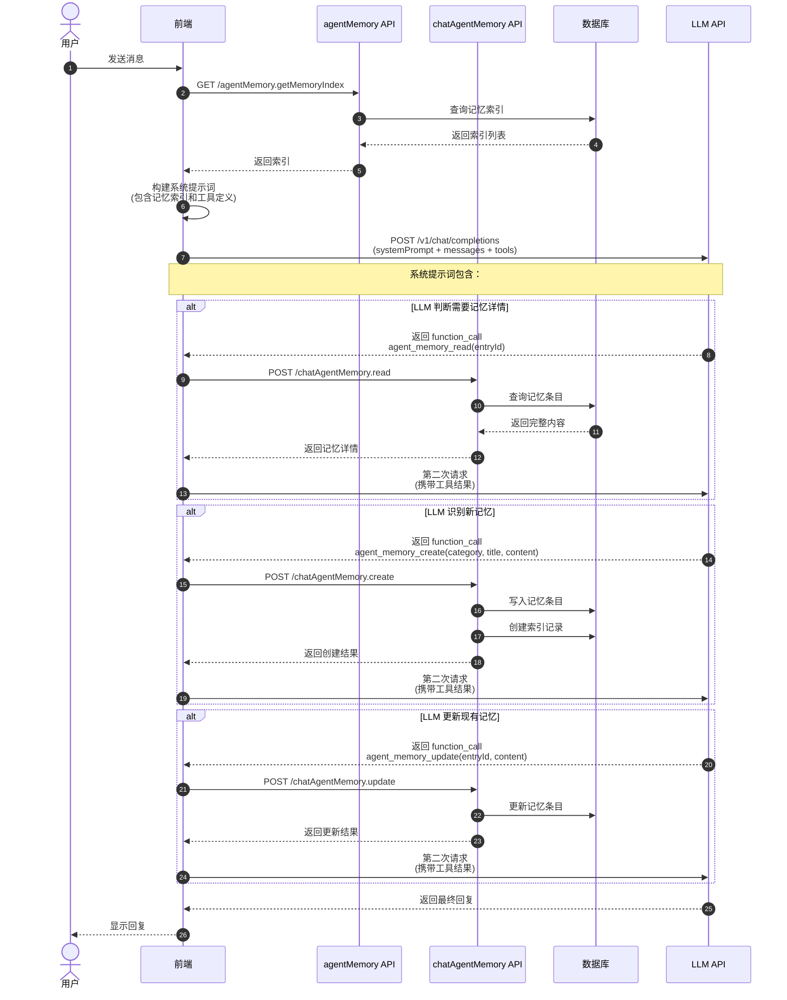

### 4.3 索引重建流程


---

## 5. LLM 记忆工具设计

### 5.1 工具列表

| 工具名 | 功能 | 调用时机 |
|--------|------|----------|
| `agent_memory_create` | 创建新记忆 | LLM 识别到值得记住的信息 |
| `agent_memory_read` | 读取记忆详情 | LLM 判断需要某条记忆的完整内容 |
| `agent_memory_update` | 更新记忆 | LLM 发现已有记忆需要修正或补充 |
| `agent_memory_delete` | 删除记忆 | LLM 判断某条记忆已过时或错误 |

> 注：`agent_memory_list` 功能由 `getMemoryIndex` 接口提供，在系统提示词中直接注入记忆索引列表，无需 LLM 主动调用。

### 5.2 工具调用流程

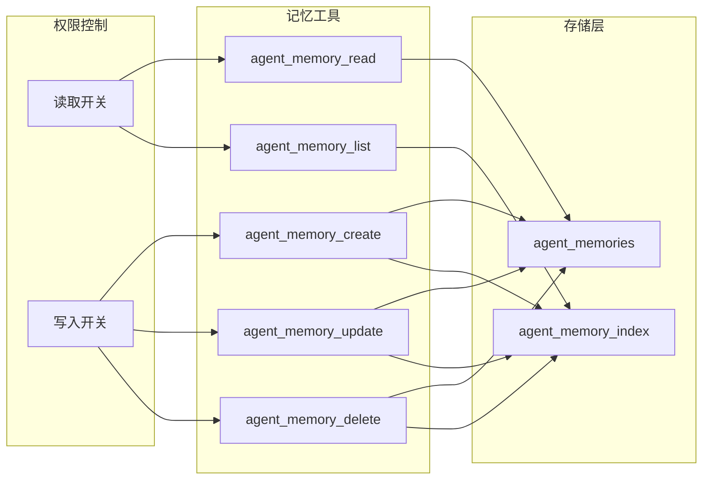

---

## 6. 上下文注入策略

### 6.1 提示词构建

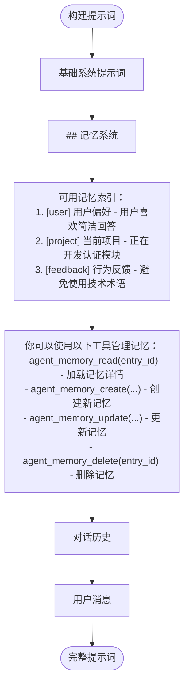

### 6.2 LLM 自主判断相关性的机制

Claude Code 的核心设计：**记忆索引始终注入上下文，由 LLM 自主决定何时加载详情**。

#### 6.2.1 系统提示词结构（参考 Claude Code）

**记忆系统头部说明**：
```markdown
# Agent Memory

You have a persistent memory system. 

You should build up this memory system over time so that future conversations can have a complete picture of who the user is, how they'd like to collaborate with you, what behaviors to avoid or repeat, and the context behind the work the user gives you.

If the user explicitly asks you to remember something, save it immediately as whichever type fits best. If they ask you to forget something, find and remove the relevant entry.
```

**记忆类型定义（Types of memory）**：
```markdown
## Types of memory

There are several discrete types of memory that you can store in your memory system:

<type>
    <name>user</name>
    <description>Contain information about the user's role, goals, responsibilities, and knowledge...</description>
    <when_to_save>When you learn any details about the user's role, preferences, responsibilities, or knowledge</when_to_save>
    <how_to_use>When your work should be informed by the user's profile or perspective...</how_to_use>
</type>

<type>
    <name>feedback</name>
    <description>Guidance the user has given you about how to approach work — both what to avoid and what to keep doing...</description>
    <when_to_save>Any time the user corrects your approach ("no not that", "don't", "stop doing X") OR confirms a non-obvious approach worked...</when_to_save>
    <how_to_use>Let these memories guide your behavior so that the user does not need to offer the same guidance twice.</how_to_use>
    <body_structure>Lead with the rule itself, then a **Why:** line and a **How to apply:** line...</body_structure>
</type>

<type>
    <name>project</name>
    <description>Information that you learn about ongoing work, goals, initiatives, bugs, or incidents...</description>
    <when_to_save>When you learn who is doing what, why, or by when...</when_to_save>
</type>

<type>
    <name>reference</name>
    <description>Stores pointers to where information can be found in external systems...</description>
</type>
```

**不应保存的内容（What NOT to save）**：
```markdown
## What NOT to save in memory

- Code patterns, conventions, architecture, file paths, or project structure — these can be derived by reading the current project state.
- Git history, recent changes, or who-changed-what — `git log` / `git blame` are authoritative.
- Debugging solutions or fix recipes — the fix is in the code; the commit message has the context.
- Anything already documented in CLAUDE.md files.
- Ephemeral task details: in-progress work, temporary state, current conversation context.
```

**何时访问记忆（When to access memories）**：
```markdown
## When to access memories

- When memories seem relevant, or the user references prior-conversation work.
- You MUST access memory when the user explicitly asks you to check, recall, or remember.
- If the user says to *ignore* or *not use* memory: proceed as if MEMORY.md were empty.
- Memory records can become stale over time. Use memory as context for what was true at a given point in time. Before answering the user or building assumptions based solely on information in memory records, verify that the memory is still correct and up-to-date.
```

**信任记忆前的验证（Before recommending from memory）**：
```markdown
## Before recommending from memory

A memory that names a specific function, file, or flag is a claim that it existed *when the memory was written*. It may have been renamed, removed, or never merged. Before recommending it:

- If the memory names a file path: check the file exists.
- If the memory names a function or flag: grep for it.
- If the user is about to act on your recommendation (not just asking about history), verify first.

"The memory says X exists" is not the same as "X exists now."
```

#### 6.2.2 记忆索引格式

```markdown
## MEMORY.md

- [用户偏好](user_preferences.md) — 用户是数据科学家，关注可观测性/日志
- [前端经验](frontend_exp.md) — 用户有 10 年 Go 经验，刚接触 React
- [测试策略](testing_policy.md) — 集成测试必须连接真实数据库，不使用 mock
- [合并冻结](merge_freeze.md) — 2026-03-05 开始合并冻结，移动端发布分支
```

**关键约束**：
- MEMORY.md 是**索引**，不是记忆本身
- 每条索引**一行**，不超过 ~150 字符
- 超过 200 行会被截断，保持简洁

#### 6.2.3 LLM 如何自主判断

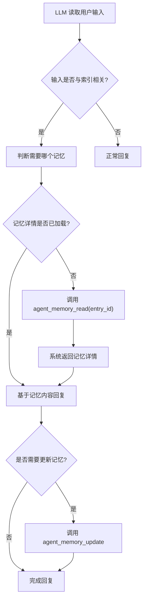

**判断逻辑示例**：

| 用户输入 | LLM 判断 | 行动 |
|---------|---------|------|
| "帮我优化这段代码" | 与 [前端经验] 相关 | 调用 agent_memory_read 加载用户技术背景 |
| "记住我喜欢简洁回答" | 需要创建新记忆 | 调用 agent_memory_create |
| "别用表情符号了" | 与 [沟通偏好] 相关 | 调用 agent_memory_update 更新 |
| "上次说的那个方案" | 不明确 | 调用 agent_memory_list 查看所有记忆 |

### 6.3 Token 控制策略

| 项目 | 估算 Token | 控制策略 |
|------|-----------|----------|
| 基础系统提示词 | 200-500 | 固定 |
| 记忆索引（200条） | ~5000 | 限制每用户最多 200 条 |
| 选中记忆详情 | 可变 | LLM 自主选择加载 |
| 对话历史 | 可变 | 按消息数量限制 |

**溢出处理**：
- 当记忆数量超过 200 条时，LLM 需要合并或删除低价值条目
- 管理页面显示警告提示用户清理记忆

### 6.4 记忆生成策略

记忆由 **LLM 通过工具调用主动创建/更新**，而非后台自动提取。

**实现方式**：
1. 前端在系统提示词中告知 LLM 何时应该保存记忆
2. LLM 在对话过程中识别值得记住的信息
3. LLM 调用 `agent_memory_create` 工具创建记忆
4. 前端处理工具调用，将记忆保存到后端

**触发时机**（由 LLM 判断）：
- 用户明确说"记住这个"
- 用户纠正或确认某种做法
- 了解到重要的项目上下文
- 发现外部资源引用

**前端处理流程**：
```typescript
// 1. LLM 返回工具调用
const toolCall = {
  name: 'agent_memory_create',
  arguments: '{"category":"feedback","title":"...","content":"..."}'
};

// 2. 前端调用后端 API
const result = await api.chatAgentMemory.create.mutate(args);

// 3. 将结果返回给 LLM
const toolResult = {
  role: 'tool',
  tool_call_id: toolCall.id,
  content: 'Memory created successfully'
};
```

---

## 7. 用户界面设计

### 7.1 聊天界面记忆开关

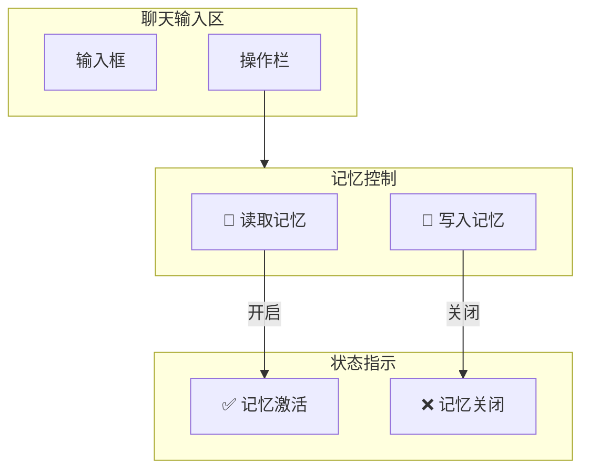

### 7.2 记忆管理页面

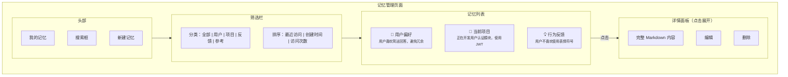

---

## 8. 接口设计

### 8.1 记忆管理接口

| 方法 | 路径 | 描述 |
|------|------|------|
| GET | /api/trpc/agentMemory.getMemoryIndex | 获取记忆索引列表（轻量，供列表展示） |
| GET | /api/trpc/agentMemory.getMemory | 获取记忆详情（包含完整 content） |
| POST | /api/trpc/agentMemory.createMemory | 创建记忆 |
| POST | /api/trpc/agentMemory.updateMemory | 更新记忆 |
| POST | /api/trpc/agentMemory.deleteMemory | 删除记忆 |
| POST | /api/trpc/agentMemory.batchDeleteMemories | 批量删除记忆 |
| GET | /api/trpc/agentMemory.countMemories | 统计记忆数量 |
| GET | /api/trpc/agentMemory.getSettings | 获取记忆设置 |
| POST | /api/trpc/agentMemory.updateSettings | 更新记忆设置 |

> 详细接口定义见：[api/tRPC/lambda/agent_memory.md](/api/tRPC/lambda/agent_memory.md)

---

## 9. 状态管理（可选）

### 9.1 状态分布建议

记忆相关的状态可以分散到现有的 Store 中，无需创建独立的 MemoryStore：

| 状态 | 建议存放位置 | 说明 |
|------|-------------|------|
| 记忆列表数据 | 页面本地 state / React Query | 通过 API 获取，无需全局状态 |
| 当前编辑的记忆 | 页面本地 state | 仅在管理页面使用 |
| 记忆读写开关 | `chat` Store 或 `user` Store | 跟随会话或用户偏好 |
| 加载状态 | 页面本地 state | 组件级管理 |

### 9.2 简单实现方式

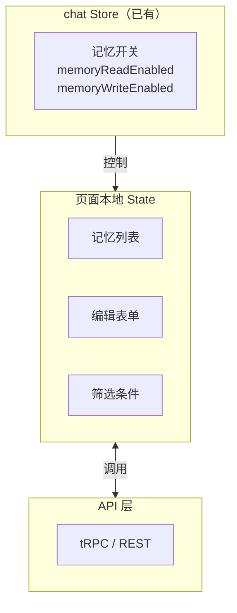

**理由**：
- 记忆数据主要是**列表展示**，用 React Query / SWR 管理即可
- 记忆管理页面是**独立页面**，状态无需共享给其他页面
- 只有记忆开关需要在**聊天界面**使用，放到 chat Store 足够

---

## 10. 配置项

| 配置项 | 类型 | 默认值 | 说明 |
|--------|------|--------|------|
| `memory.enabled` | boolean | true | 是否启用记忆系统 |
| `memory.maxEntriesPerUser` | number | 200 | 每用户最大记忆数 |
| `memory.defaultReadEnabled` | boolean | true | 默认开启记忆读取 |
| `memory.defaultWriteEnabled` | boolean | true | 默认开启记忆写入 |
| `memory.categories` | string[] | ['user', 'feedback', 'project', 'reference', 'general'] | 可用记忆分类 |

---

## 11. 向后扩展性设计

### 11.1 角色系统预留

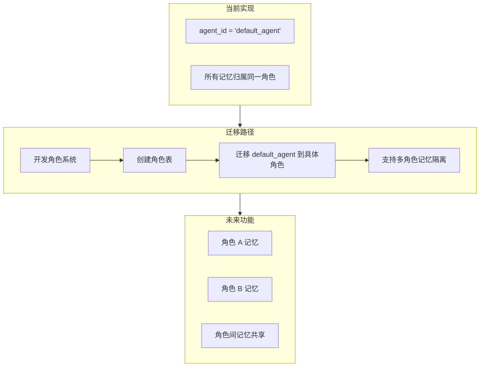

### 11.2 预留字段说明

| 字段 | 当前值 | 未来用途 |
|------|--------|----------|
| `agent_id` | 'default_agent' | 关联到具体角色 ID |
| `source_session_id` | 可选 | 追踪记忆来源会话 |
| `source_message_ids` | JSON 数组 | 精确定位来源消息 |

---


---

## 12. 总结

本记忆设计方案采用 Claude Code 的文本索引架构，核心特点：

1. **两表结构**：索引表 + 条目表，简单清晰
2. **LLM 驱动**：由 LLM 自主判断记忆相关性，无需向量计算
3. **完全可读**：Markdown 格式，用户可直接查看编辑
4. **工具调用**：通过函数调用实现记忆的 CRUD 操作
5. **预留扩展**：`agent_id` 固定为 `default_agent`，未来无缝支持多角色

关键优势：
- 消除 Embedding 模型依赖
- 提升用户可控性和可观测性
- 简化数据库结构
- 降低系统复杂度
