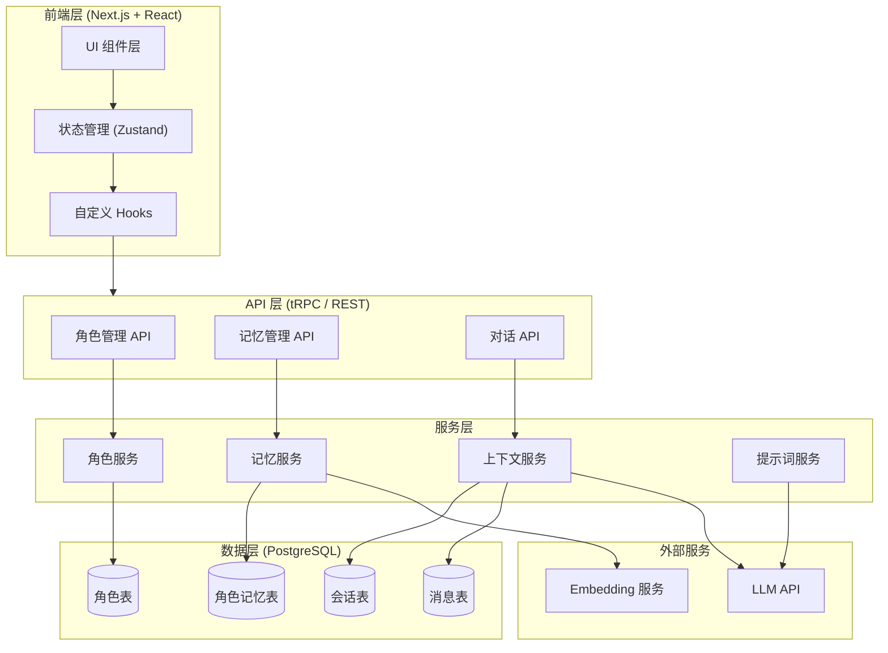
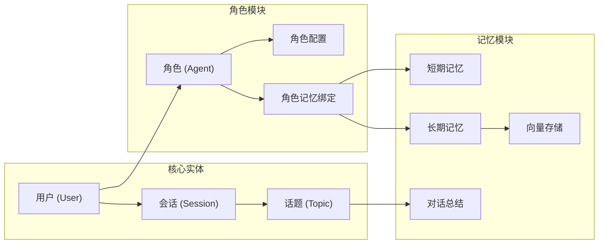
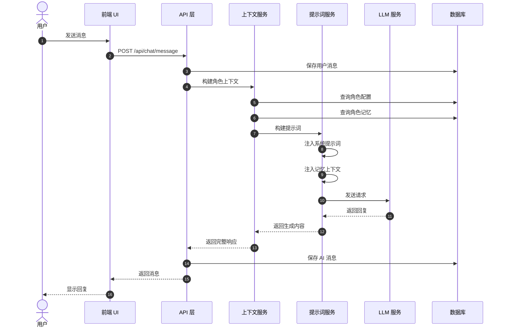
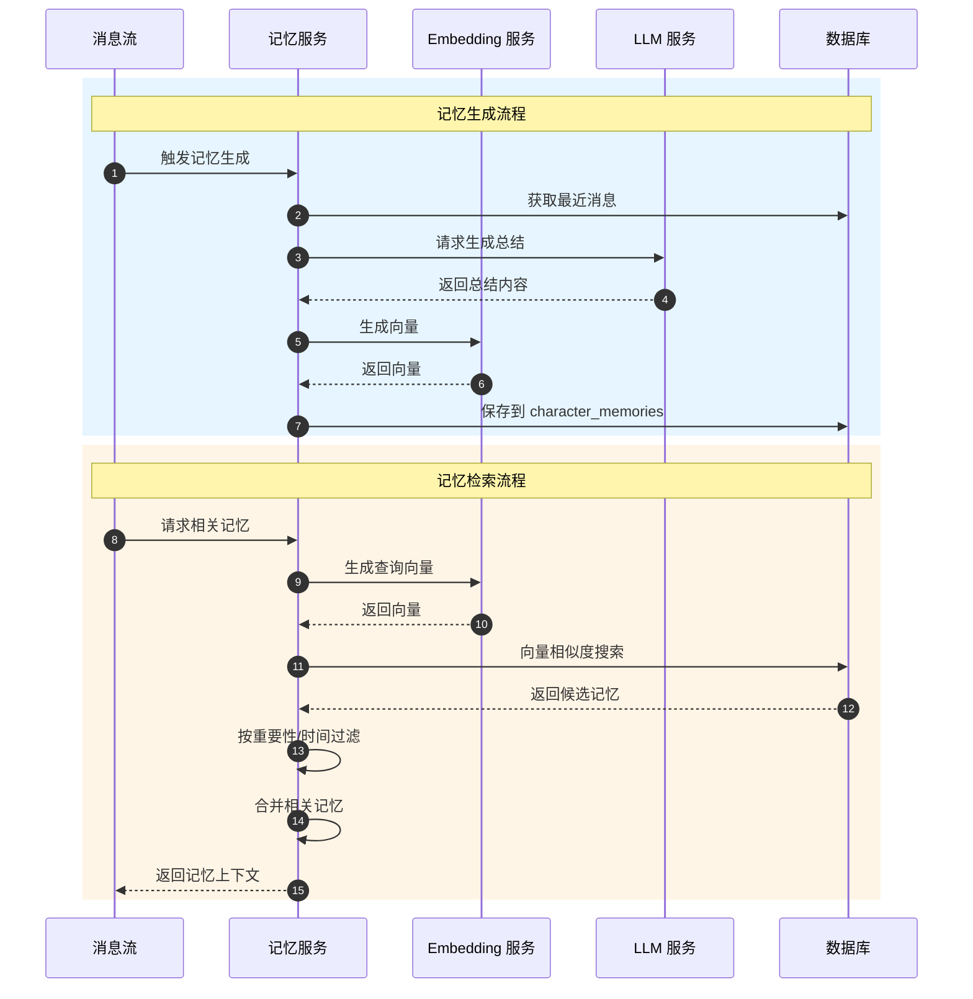
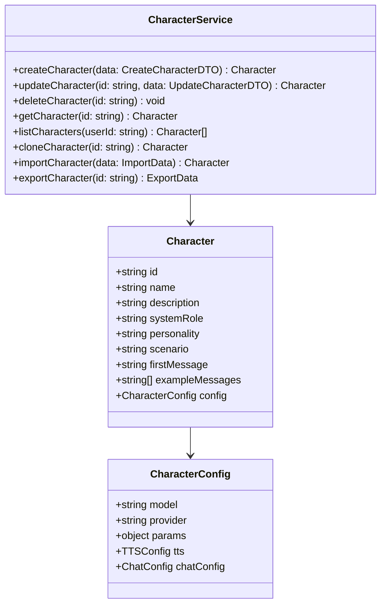
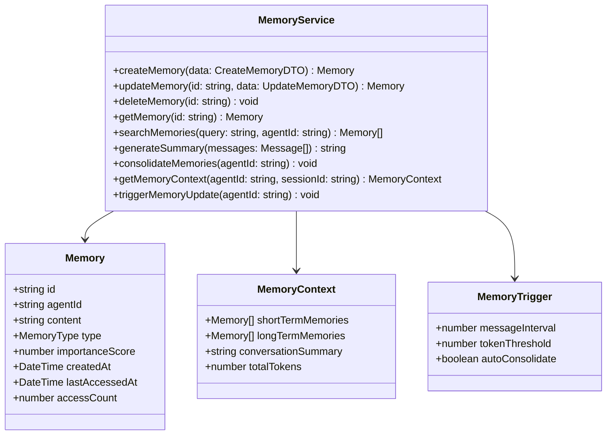
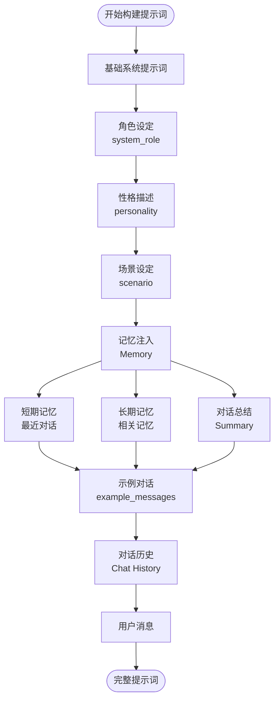
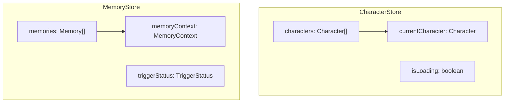
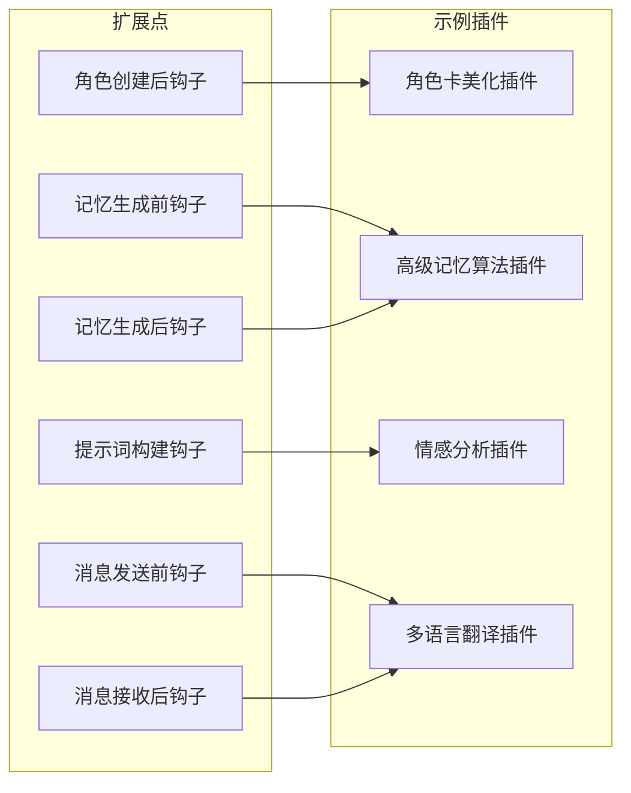
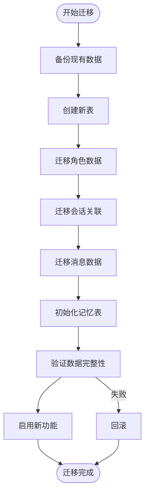

# 多角色与角色记忆功能设计方案

## 1. 项目调研总结

### 1.1 SillyTavern 项目架构

SillyTavern 是一个面向高级用户的 LLM 前端应用，采用以下技术栈：
- **后端**: Node.js + Express.js
- **前端**: 原生 JavaScript (ES Modules) + jQuery + Handlebars
- **存储**: 文件系统 (JSON/JSONL) + PNG 元数据存储角色卡

**核心功能模块**:
- **角色系统**: 支持 TavernCard V2/V3 规范，角色数据嵌入 PNG 图片元数据
- **记忆系统**: 作为扩展实现，自动总结对话历史维护长期记忆

### 1.2 ainft-chat-opcnclaw 项目现状

**技术栈**:
- **框架**: Next.js 16 + React 19 + TypeScript
- **数据库**: PostgreSQL + Drizzle ORM
- **状态管理**: Zustand
- **UI**: Ant Design + LobeHub UI

**现有数据模型**:
- `agents`: AI 助手/角色定义
- `sessions`: 会话管理
- `topics`: 话题/子会话
- `messages`: 消息存储
- `userMemories`: 用户记忆系统（已存在多层记忆结构）

---

## 2. 总体架构设计

### 2.1 系统架构图

### 2.2 核心模块关系图

---

## 3. 数据库 Schema 设计

### 3.1 角色相关表

#### 3.1.1 角色主表 (agents)

| 字段名 | 类型 | 约束 | 说明 |
|--------|------|------|------|
| id | text | PK | 角色唯一标识 |
| slug | varchar(100) | Unique | URL 友好标识 |
| title | varchar(255) | - | 角色名称 |
| description | varchar(1000) | - | 角色描述 |
| avatar | text | - | 头像 URL |
| background_color | text | - | 背景色 |
| user_id | text | FK → users.id | 创建者 |
| system_role | text | - | 系统角色设定 |
| personality | text | - | 性格描述 |
| scenario | text | - | 场景设定 |
| first_message | text | - | 开场白 |
| example_messages | jsonb | - | 示例对话 |
| model | text | - | 默认模型 |
| provider | text | - | 模型提供商 |
| params | jsonb | - | 模型参数 |
| chat_config | jsonb | - | 聊天配置 |
| tags | jsonb | - | 标签数组 |
| plugins | jsonb | - | 插件列表 |
| opening_message | text | - | 开场消息 |
| opening_questions | text[] | - | 开场问题 |
| tts | jsonb | - | TTS 配置 |
| virtual | boolean | Default false | 是否为虚拟角色 |
| created_at | timestamptz | - | 创建时间 |
| updated_at | timestamptz | - | 更新时间 |

#### 3.1.2 角色与会话关联表 (agents_to_sessions)

| 字段名 | 类型 | 约束 | 说明 |
|--------|------|------|------|
| agent_id | text | FK, PK | 角色 ID |
| session_id | text | FK, PK | 会话 ID |
| user_id | text | FK | 用户 ID |

### 3.2 角色记忆相关表

#### 3.2.1 角色记忆主表 (character_memories)

| 字段名 | 类型 | 约束 | 说明 |
|--------|------|------|------|
| id | text | PK | 记忆唯一标识 |
| agent_id | text | FK → agents.id | 所属角色 |
| user_id | text | FK → users.id | 所属用户 |
| session_id | text | FK → sessions.id | 所属会话 |
| memory_type | varchar(50) | - | 记忆类型 (short_term/long_term/summary) |
| category | varchar(100) | - | 记忆分类 |
| content | text | - | 记忆内容 |
| content_vector | vector(1024) | - | 内容向量 |
| importance_score | real | Default 0 | 重要性评分 |
| access_count | bigint | Default 0 | 访问次数 |
| last_accessed_at | timestamptz | - | 最后访问时间 |
| source_message_ids | jsonb | - | 来源消息 ID 列表 |
| metadata | jsonb | - | 元数据 |
| is_active | boolean | Default true | 是否激活 |
| expires_at | timestamptz | - | 过期时间 |
| created_at | timestamptz | - | 创建时间 |
| updated_at | timestamptz | - | 更新时间 |

#### 3.2.2 记忆上下文表 (memory_contexts)

| 字段名 | 类型 | 约束 | 说明 |
|--------|------|------|------|
| id | text | PK | 上下文唯一标识 |
| memory_id | text | FK | 关联记忆 ID |
| user_id | text | FK | 用户 ID |
| context_type | varchar(50) | - | 上下文类型 |
| title | varchar(255) | - | 标题 |
| description | text | - | 描述 |
| related_entities | jsonb | - | 相关实体 |
| created_at | timestamptz | - | 创建时间 |
| updated_at | timestamptz | - | 更新时间 |

#### 3.2.3 对话总结表 (conversation_summaries)

| 字段名 | 类型 | 约束 | 说明 |
|--------|------|------|------|
| id | text | PK | 总结唯一标识 |
| topic_id | text | FK → topics.id | 所属话题 |
| agent_id | text | FK → agents.id | 所属角色 |
| user_id | text | FK → users.id | 用户 ID |
| summary_text | text | - | 总结内容 |
| summary_vector | vector(1024) | - | 总结向量 |
| message_range_start | text | - | 起始消息 ID |
| message_range_end | text | - | 结束消息 ID |
| message_count | integer | - | 消息数量 |
| summary_level | integer | Default 1 | 总结层级 |
| parent_summary_id | text | FK | 父总结 ID |
| created_at | timestamptz | - | 创建时间 |
| updated_at | timestamptz | - | 更新时间 |

### 3.3 扩展消息表

#### 3.3.1 消息记忆关联表 (message_memories)

| 字段名 | 类型 | 约束 | 说明 |
|--------|------|------|------|
| id | text | PK | 唯一标识 |
| message_id | text | FK → messages.id | 消息 ID |
| agent_id | text | FK → agents.id | 角色 ID |
| memory_content | text | - | 记忆内容（存储在消息中的记忆快照） |
| is_memory_checkpoint | boolean | Default false | 是否为记忆检查点 |
| created_at | timestamptz | - | 创建时间 |

---

## 4. 核心功能流程设计

### 4.1 多角色对话流程

### 4.2 角色记忆生成与检索流程

---

## 5. 关键服务设计

### 5.1 角色管理服务

### 5.2 记忆管理服务

---

## 6. 提示词构建流程

### 6.1 单角色提示词构建

---

## 7. 状态管理设计

### 7.1 Zustand Store 结构

---

## 8. 接口设计概览

### 8.1 角色管理接口

| 方法 | 路径 | 描述 |
|------|------|------|
| GET | /api/characters | 获取角色列表 |
| POST | /api/characters | 创建角色 |
| GET | /api/characters/:id | 获取角色详情 |
| PUT | /api/characters/:id | 更新角色 |
| DELETE | /api/characters/:id | 删除角色 |
| POST | /api/characters/:id/clone | 克隆角色 |
| POST | /api/characters/import | 导入角色 |
| GET | /api/characters/:id/export | 导出角色 |

### 8.2 记忆管理接口

| 方法 | 路径 | 描述 |
|------|------|------|
| GET | /api/characters/:id/memories | 获取角色记忆 |
| POST | /api/characters/:id/memories | 创建记忆 |
| PUT | /api/memories/:id | 更新记忆 |
| DELETE | /api/memories/:id | 删除记忆 |
| POST | /api/characters/:id/memories/search | 搜索记忆 |
| POST | /api/characters/:id/memories/summarize | 生成总结 |
| GET | /api/characters/:id/memory-context | 获取记忆上下文 |

---

## 9. 扩展性设计

### 9.1 插件扩展点

### 9.2 配置化设计

| 配置项 | 类型 | 默认值 | 说明 |
|--------|------|--------|------|
| memory.enabled | boolean | true | 是否启用记忆 |
| memory.triggerInterval | number | 10 | 记忆触发间隔（消息数） |
| memory.maxShortTermMemories | number | 5 | 最大短期记忆数 |
| memory.maxLongTermMemories | number | 10 | 最大长期记忆数 |
| memory.summaryThreshold | number | 20 | 总结触发阈值 |

---

## 10. 数据迁移策略

### 10.1 迁移步骤

---

## 11. 总结

本设计方案基于 SillyTavern 的多角色和记忆功能，结合 ainft-chat-opcnclaw 现有的技术栈，提出了完整的实现方案：

1. **数据层**: 使用 Drizzle ORM 定义清晰的数据库 Schema，支持角色、记忆等核心实体
2. **服务层**: 设计独立的 CharacterService、MemoryService 等核心服务
3. **API 层**: 提供完整的 RESTful API 支持
4. **前端层**: 使用 Zustand 进行状态管理，支持响应式 UI 更新

关键特性：
- 每个角色拥有独立的记忆系统，支持短期/长期记忆分离
- 完整的向量搜索支持，实现语义化记忆检索
