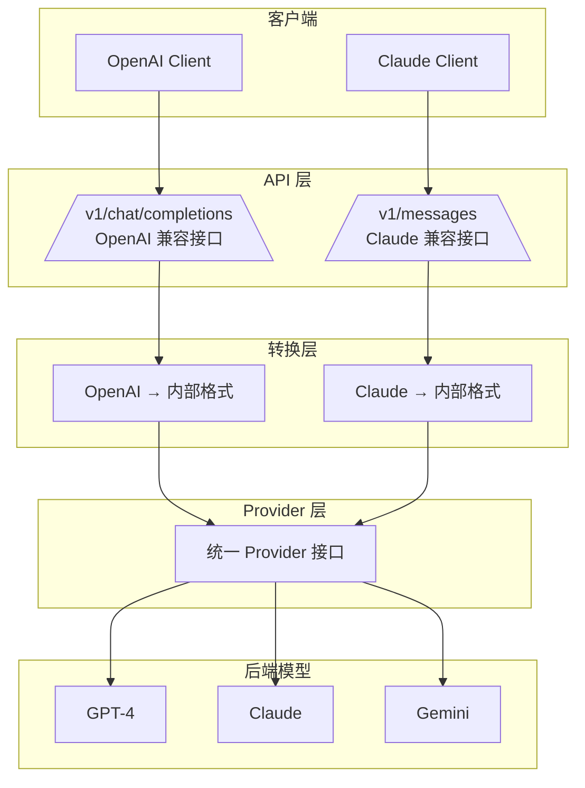

# Claude 协议与 OpenAI 协议对比

本文档详细对比 Claude 协议（Anthropic Messages API）与 OpenAI 协议（Chat Completions API）的区别，帮助开发者理解两种协议的差异。

---

## 目录

- [概述](#概述)
- [端点对比](#端点对比)
- [请求格式对比](#请求格式对比)
- [响应格式对比](#响应格式对比)
- [消息角色对比](#消息角色对比)
- [流式响应对比](#流式响应对比)
- [工具调用对比](#工具调用对比)
- [错误处理对比](#错误处理对比)
- [AINFT 平台实现](#ainft-平台实现)

---

## 概述

| 特性 | OpenAI 协议 | Claude 协议 |
|------|------------|------------|
| **端点路径** | `/v1/chat/completions` | `/v1/messages` |
| **消息格式** | `messages` 数组 | `messages` 数组 |
| **系统消息** | `system` role in messages | 独立的 `system` 参数 |
| **流式响应** | `data: {...}` SSE 格式 | `event: {...}` SSE 格式 |
| **停止原因** | `finish_reason: stop/tool_calls` | `stop_reason: end_turn/tool_use` |
| **错误格式** | `{ error: { message, type, code } }` | `{ error: { message, type } }` |

---

## 端点对比

### OpenAI 协议

```http
POST /v1/chat/completions
Content-Type: application/json
Authorization: Bearer {api_key}
```

### Claude 协议

```http
POST /v1/messages
Content-Type: application/json
x-api-key: {api_key}
anthropic-version: 2023-06-01
```

> **注意**: Claude 协议使用 `x-api-key` 头部而非 `Authorization`，且需要 `anthropic-version` 头部。

---

## 请求格式对比

### OpenAI 请求格式

```json
{
  "model": "gpt-4",
  "messages": [
    { "role": "system", "content": "你是一个有用的助手" },
    { "role": "user", "content": "你好" },
    { "role": "assistant", "content": "你好！有什么可以帮助你的？" },
    { "role": "user", "content": "今天天气怎么样？" }
  ],
  "max_tokens": 1024,
  "temperature": 0.7,
  "stream": false
}
```

### Claude 请求格式

```json
{
  "model": "claude-3-opus-20240229",
  "system": "你是一个有用的助手",
  "messages": [
    { "role": "user", "content": "你好" },
    { "role": "assistant", "content": "你好！有什么可以帮助你的？" },
    { "role": "user", "content": "今天天气怎么样？" }
  ],
  "max_tokens": 1024,
  "temperature": 0.7,
  "stream": false
}
```

### 关键区别

| 特性 | OpenAI | Claude |
|------|--------|--------|
| **系统消息** | 包含在 `messages` 数组中 (`role: system`) | 独立的 `system` 字符串参数 |
| **消息数组** | 可包含 `system` 角色 | 仅支持 `user` 和 `assistant` 角色 |
| **max_tokens** | 可选，默认无限 | **必需** 参数 |
| **temperature** | 支持 (0-2) | 支持 (0-1) |

---

## 响应格式对比

### OpenAI 非流式响应

```json
{
  "id": "chatcmpl-1234567890",
  "object": "chat.completion",
  "created": 1677652288,
  "model": "gpt-4",
  "choices": [
    {
      "index": 0,
      "message": {
        "role": "assistant",
        "content": "我无法获取实时天气信息..."
      },
      "finish_reason": "stop"
    }
  ],
  "usage": {
    "prompt_tokens": 20,
    "completion_tokens": 30,
    "total_tokens": 50
  }
}
```

### Claude 非流式响应

```json
{
  "id": "msg_01AbCdEfGhIjKlMnOpQrStUv",
  "type": "message",
  "role": "assistant",
  "content": [
    {
      "type": "text",
      "text": "我无法获取实时天气信息..."
    }
  ],
  "model": "claude-3-opus-20240229",
  "stop_reason": "end_turn",
  "stop_sequence": null,
  "usage": {
    "input_tokens": 20,
    "output_tokens": 30
  }
}
```

### 关键区别

| 特性 | OpenAI | Claude |
|------|--------|--------|
| **content 类型** | 字符串 | 数组（支持多模态内容块） |
| **finish_reason** | `stop`, `length`, `tool_calls`, `content_filter` | `end_turn`, `max_tokens`, `stop_sequence`, `tool_use` |
| **usage 字段名** | `prompt_tokens` / `completion_tokens` | `input_tokens` / `output_tokens` |
| **对象类型** | `chat.completion` | `message` |

---

## 消息角色对比

### OpenAI 支持的角色

- `system` - 系统指令
- `user` - 用户消息
- `assistant` - AI 助手回复
- `tool` - 工具调用结果（Function Calling）

### Claude 支持的角色

- `user` - 用户消息
- `assistant` - AI 助手回复

> **注意**: Claude 协议中，系统消息通过独立的 `system` 参数传递，而不是放在 `messages` 数组中。

---

## 流式响应对比

### OpenAI 流式响应格式

```
data: {"id":"chatcmpl-123","object":"chat.completion.chunk","choices":[{"index":0,"delta":{"role":"assistant"},"finish_reason":null}]}

data: {"id":"chatcmpl-123","object":"chat.completion.chunk","choices":[{"index":0,"delta":{"content":"你好"},"finish_reason":null}]}

data: {"id":"chatcmpl-123","object":"chat.completion.chunk","choices":[{"index":0,"delta":{"content":"！"},"finish_reason":null}]}

data: {"id":"chatcmpl-123","object":"chat.completion.chunk","choices":[{"index":0,"delta":{},"finish_reason":"stop"}]}

data: [DONE]
```

### Claude 流式响应格式

```
event: message_start
data: {"type":"message_start","message":{"id":"msg_01AbCd...","type":"message","role":"assistant","content":[],"model":"claude-3-opus-20240229","stop_reason":null,"stop_sequence":null}}

event: content_block_start
data: {"type":"content_block_start","index":0,"content_block":{"type":"text","text":""}}

event: content_block_delta
data: {"type":"content_block_delta","index":0,"delta":{"type":"text_delta","text":"你好"}}

event: content_block_delta
data: {"type":"content_block_delta","index":0,"delta":{"type":"text_delta","text":"！"}}

event: content_block_stop
data: {"type":"content_block_stop","index":0}

event: message_delta
data: {"type":"message_delta","delta":{"stop_reason":"end_turn","stop_sequence":null},"usage":{"output_tokens":10}}

event: message_stop
data: {"type":"message_stop"}
```

### 流式事件对比

| OpenAI | Claude | 说明 |
|--------|--------|------|
| `data: {...}` | `event: xxx\ndata: {...}` | Claude 使用标准 SSE 格式 |
| `delta.role` | `message_start` 事件 | Claude 单独发送角色信息 |
| `delta.content` | `content_block_delta` | Claude 内容块增量更新 |
| `finish_reason` | `message_delta` | Claude 单独发送停止原因 |
| `[DONE]` | `message_stop` | 结束标记不同 |

---

## 工具调用对比

### OpenAI 工具定义

```json
{
  "model": "gpt-4",
  "messages": [...],
  "tools": [
    {
      "type": "function",
      "function": {
        "name": "get_weather",
        "description": "获取指定城市的天气",
        "parameters": {
          "type": "object",
          "properties": {
            "city": { "type": "string" }
          },
          "required": ["city"]
        }
      }
    }
  ],
  "tool_choice": "auto"
}
```

### Claude 工具定义

```json
{
  "model": "claude-3-opus-20240229",
  "messages": [...],
  "tools": [
    {
      "name": "get_weather",
      "description": "获取指定城市的天气",
      "input_schema": {
        "type": "object",
        "properties": {
          "city": { "type": "string" }
        },
        "required": ["city"]
      }
    }
  ],
  "tool_choice": { "type": "auto" }
}
```

### 工具调用响应对比

**OpenAI:**
```json
{
  "choices": [{
    "message": {
      "role": "assistant",
      "content": null,
      "tool_calls": [{
        "id": "call_abc123",
        "type": "function",
        "function": {
          "name": "get_weather",
          "arguments": "{\"city\":\"北京\"}"
        }
      }]
    },
    "finish_reason": "tool_calls"
  }]
}
```

**Claude:**
```json
{
  "content": [{
    "type": "tool_use",
    "id": "toolu_01AbCdEfGhIjKlMnOpQrStUv",
    "name": "get_weather",
    "input": { "city": "北京" }
  }],
  "stop_reason": "tool_use"
}
```

### 工具结果传递对比

**OpenAI:**
```json
{
  "messages": [
    ...,
    { "role": "tool", "tool_call_id": "call_abc123", "content": "晴天，25°C" }
  ]
}
```

**Claude:**
```json
{
  "messages": [
    ...,
    { 
      "role": "user", 
      "content": [{
        "type": "tool_result",
        "tool_use_id": "toolu_01AbCdEfGhIjKlMnOpQrStUv",
        "content": "晴天，25°C"
      }]
    }
  ]
}
```

---

## 错误处理对比

### OpenAI 错误格式

```json
{
  "error": {
    "message": "Invalid API key",
    "type": "invalid_request_error",
    "code": "invalid_api_key"
  }
}
```

### Claude 错误格式

```json
{
  "error": {
    "type": "authentication_error",
    "message": "Invalid API key"
  }
}
```

### 错误类型映射

| HTTP 状态码 | OpenAI 错误类型 | Claude 错误类型 |
|------------|----------------|----------------|
| 400 | `invalid_request_error` | `invalid_request_error` |
| 401 | `invalid_api_key` / `authentication_error` | `authentication_error` |
| 403 | `permission_error` | `permission_error` |
| 404 | `not_found_error` | `not_found_error` |
| 429 | `rate_limit_error` | `rate_limit_error` |
| 500+ | `api_error` | `api_error` |
| 529 | - | `overloaded_error` (Claude 特有) |

---

## AINFT 平台实现

AINFT 平台同时支持 OpenAI 协议和 Claude 协议，通过统一的 Provider 层将两种协议转换为内部标准格式。

### 协议转换架构



### 使用 AINFT 的 Claude 协议

```bash
curl -X POST https://chat.ainft.com/webapi/v1/messages \
  -H "Content-Type: application/json" \
  -H "x-api-key: YOUR_API_KEY" \
  -H "anthropic-version: 2023-06-01" \
  -d '{
    "model": "claude-opus-4.5",
    "max_tokens": 1024,
    "messages": [
      {"role": "user", "content": "你好"}
    ]
  }'
```

### 使用 AINFT 的 OpenAI 协议

```bash
curl -X POST https://chat.ainft.com/webapi/v1/chat/completions \
  -H "Content-Type: application/json" \
  -H "Authorization: Bearer YOUR_API_KEY" \
  -d '{
    "model": "gpt-5-nano",
    "messages": [
      {"role": "user", "content": "你好"}
    ]
  }'
```

---

## 迁移指南

### 从 OpenAI 迁移到 Claude 协议

1. **修改端点**: `/v1/chat/completions` → `/v1/messages`
2. **修改认证头**: `Authorization: Bearer` → `x-api-key`
3. **提取系统消息**: 从 `messages` 数组移到独立的 `system` 参数
4. **添加必需参数**: 添加 `max_tokens`
5. **修改响应解析**: 处理 `content` 数组而非字符串
6. **更新流式处理**: 解析 `event:` 而非直接解析 `data:`
7. **修改工具调用**: 更新工具定义格式和结果传递方式

### 代码示例

**OpenAI 客户端代码:**
```typescript
const response = await fetch('/v1/chat/completions', {
  method: 'POST',
  headers: { 'Authorization': `Bearer ${apiKey}` },
  body: JSON.stringify({
    model: 'gpt-4',
    messages: [
      { role: 'system', content: '你是助手' },
      { role: 'user', content: '你好' }
    ]
  })
});
const data = await response.json();
console.log(data.choices[0].message.content);
```

**Claude 客户端代码:**
```typescript
const response = await fetch('/v1/messages', {
  method: 'POST',
  headers: { 
    'x-api-key': apiKey,
    'anthropic-version': '2023-06-01'
  },
  body: JSON.stringify({
    model: 'claude-3-opus-20240229',
    system: '你是助手',
    messages: [
      { role: 'user', content: '你好' }
    ],
    max_tokens: 1024
  })
});
const data = await response.json();
console.log(data.content[0].text);
```

---

## 参考文档

- [Anthropic Messages API 官方文档](https://docs.anthropic.com/claude/reference/messages_post)
- [OpenAI Chat Completions API 官方文档](https://platform.openai.com/docs/api-reference/chat/create)
- [AINFT API 文档](../api/README.md)
- [v1-messages-api 技术文档](./v1-messages-api.md)
