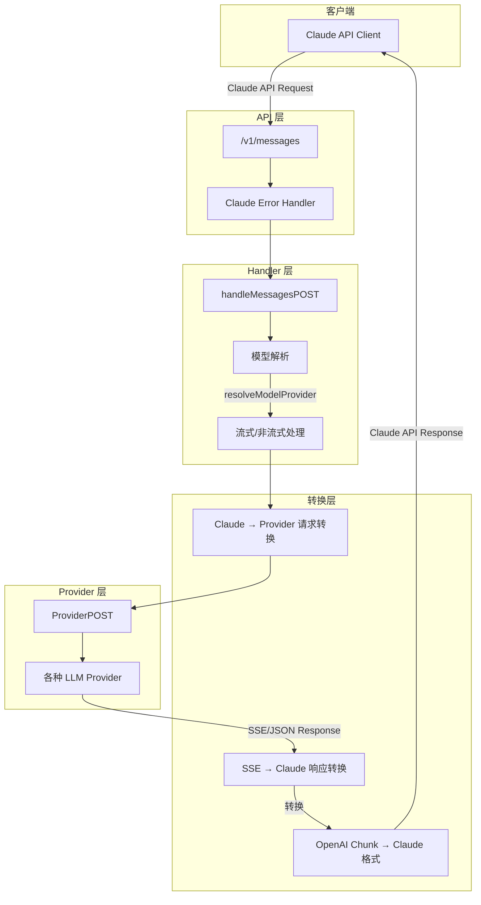
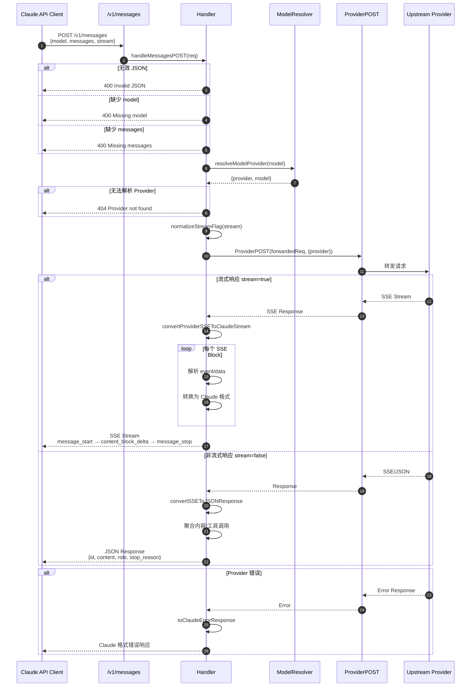
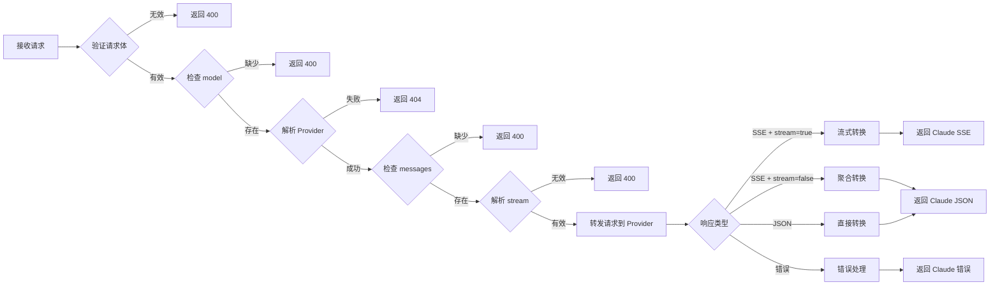
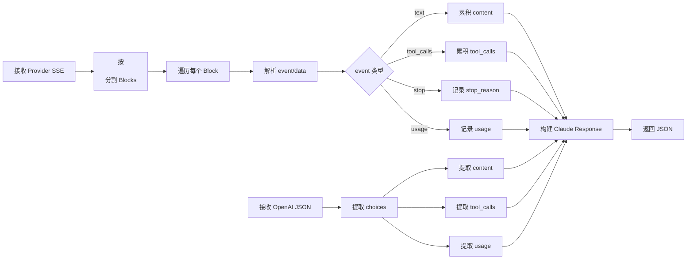
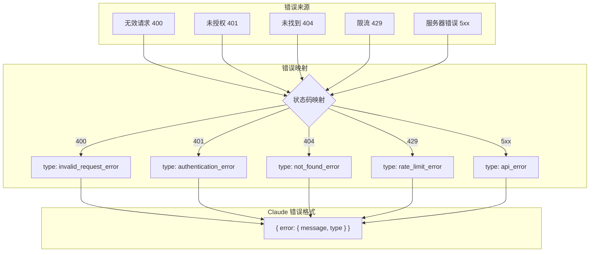
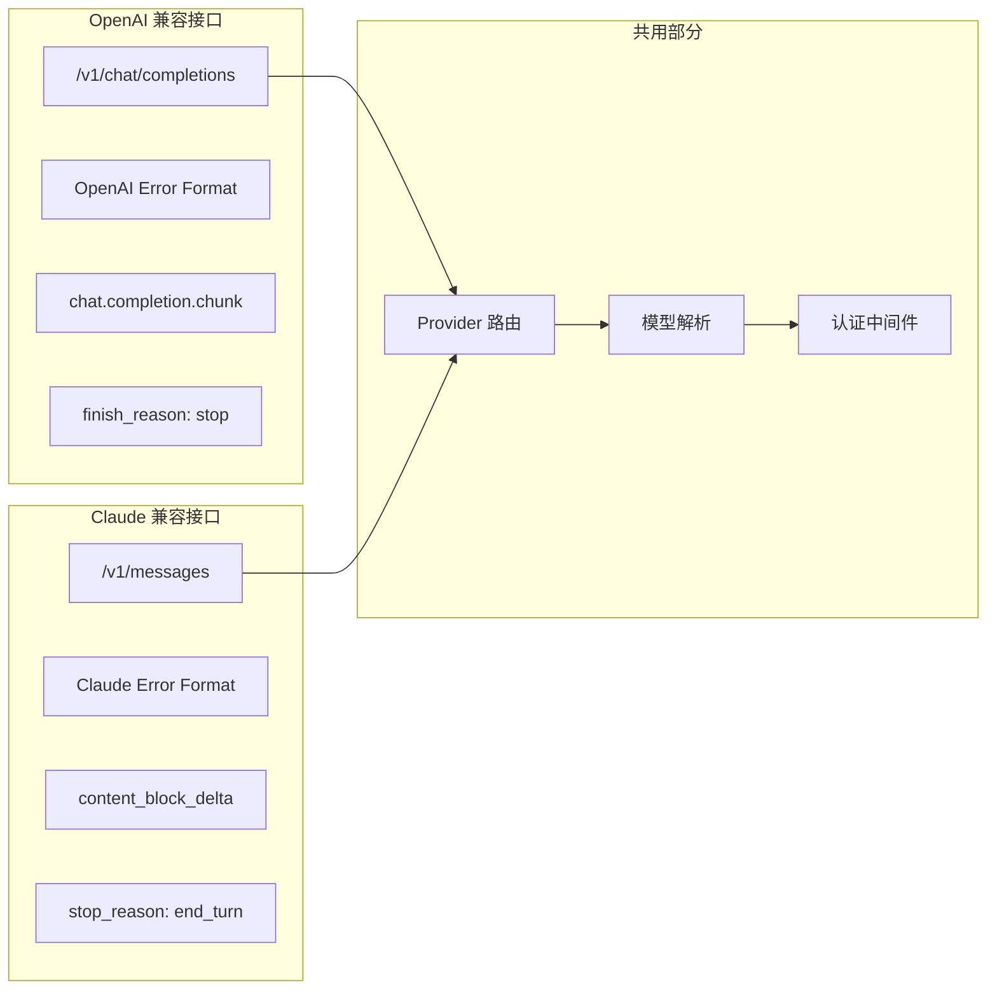

# Claude 兼容接口 /v1/messages 技术文档

## 概述

Claude 兼容接口提供了与 Anthropic Messages API 兼容的 REST 端点，路径为 `/v1/messages`。该接口将 Claude API 请求转换为内部 Provider API 调用，并将响应转换回 Claude 格式。

## 架构图



## 时序图



## 请求处理流程图



## 响应转换流程

### 流式响应转换

```mermaid
flowchart TB
    subgraph Input["Provider SSE 输入"]
        A1[event: text<br/>data: "你好"]
        A2[event: text<br/>data: "，世界"]
        A3[event: stop<br/>data: "stop"]
    end

    subgraph Process["转换处理"]
        B1[解析 SSE Block]
        B2[识别 event 类型]
        B3{event 类型}
        B4[累积文本内容]
        B5[生成 content_block_start]
        B6[生成 content_block_delta]
        B7[生成 message_delta]
        B8[生成 message_stop]
    end

    subgraph Output["Claude SSE 输出"]
        C1[message_start]
        C2[content_block_start]
        C3[content_block_delta × N]
        C4[message_delta]
        C5[message_stop]
    end

    A1 --> B1
    A2 --> B1
    A3 --> B1
    B1 --> B2
    B2 --> B3
    B3 -->|text| B4
    B3 -->|stop| B7
    B4 --> B5
    B5 --> C2
    B4 --> B6
    B6 --> C3
    B7 --> B8
    B8 --> C4
    B8 --> C5
    C1 --> C2 --> C3 --> C4 --> C5
```

### 非流式响应转换



## 错误处理流程



## API 端点

### POST /v1/messages

创建一个新的消息完成。

#### 请求格式

```typescript
interface ClaudeMessagesRequest {
  model: string;
  messages: Array<{
    role: 'user' | 'assistant';
    content: string | Array<ContentBlock>;
  }>;
  max_tokens?: number;
  stream?: boolean;
  system?: string;
  tools?: Array<{
    name: string;
    description: string;
    input_schema: object;
  }>;
}
```

#### 响应格式

**非流式响应:**
```typescript
interface ClaudeMessageResponse {
  id: string;
  type: 'message';
  role: 'assistant';
  content: Array<TextBlock | ToolUseBlock>;
  model: string;
  stop_reason: 'end_turn' | 'max_tokens' | 'stop_sequence' | 'tool_use';
  stop_sequence: string | null;
  usage?: {
    input_tokens: number;
    output_tokens: number;
  };
}
```

**流式响应:**
```typescript
// message_start
type MessageStartEvent = {
  type: 'message_start';
  message: {
    id: string;
    type: 'message';
    role: 'assistant';
    content: [];
    model: string;
    stop_reason: null;
    stop_sequence: null;
  };
};

// content_block_start
type ContentBlockStartEvent = {
  type: 'content_block_start';
  index: number;
  content_block: {
    type: 'text';
    text: string;
  };
};

// content_block_delta
type ContentBlockDeltaEvent = {
  type: 'content_block_delta';
  index: number;
  delta: {
    type: 'text_delta';
    text: string;
  };
};

// message_delta
type MessageDeltaEvent = {
  type: 'message_delta';
  delta: {
    stop_reason: string;
  };
  usage?: {
    input_tokens: number;
    output_tokens: number;
  };
};

// message_stop
type MessageStopEvent = {
  type: 'message_stop';
};
```

## 文件结构

```
src/app/(backend)/v1/messages/
├── route.ts          # 路由入口，导出 POST handler 和 maxDuration
├── handler.ts        # 核心处理逻辑
└── route.test.ts     # 单元测试

src/app/(backend)/v1/_utils/
├── claudeError.ts    # Claude 错误处理工具
```

## 关键函数说明

| 函数名 | 作用 |
|--------|------|
| `handleMessagesPOST` | 主处理函数，协调请求验证、Provider 调用、响应转换 |
| `convertProviderSSEToClaudeStream` | 将 Provider SSE 流转换为 Claude SSE 格式 |
| `convertSSEToJSONResponse` | 将 Provider SSE 聚合为 Claude JSON 响应 |
| `mapFinishReason` | 映射 finish_reason (stop → end_turn, tool_calls → tool_use) |
| `normalizeStreamFlag` | 规范化 stream 参数 (支持 boolean/string/number) |
| `createClaudeErrorResponse` | 创建 Claude 格式的错误响应 |

## 与 OpenAI 接口对比

