# Claude Code AINFT Provider 一键配置脚本

## 概述

一键配置脚本帮助用户快速将 AINFT 配置为 Claude Code 的模型提供商。脚本支持 Windows (PowerShell) 和 Linux/macOS (Bash) 两大平台，提供交互式引导，自动完成环境检查、API Token 配置、模型选择和配置文件更新。

## 系统架构

### 整体架构图

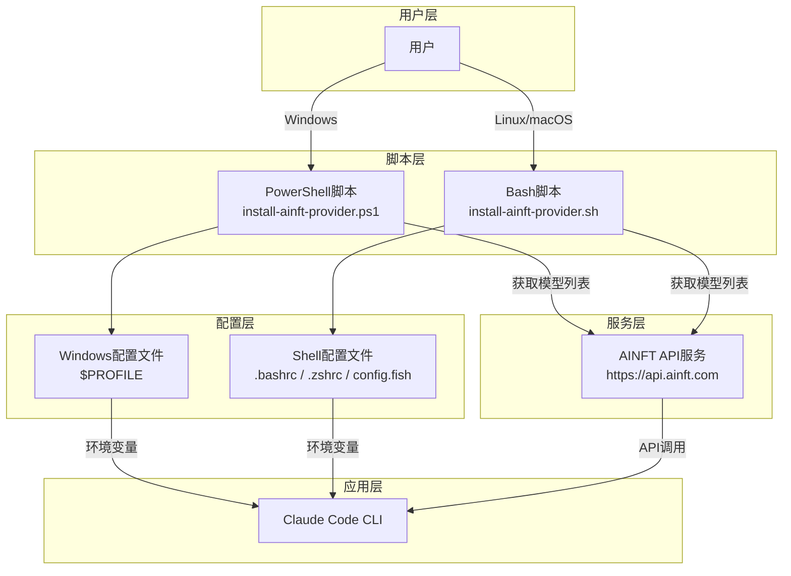

### 环境变量映射

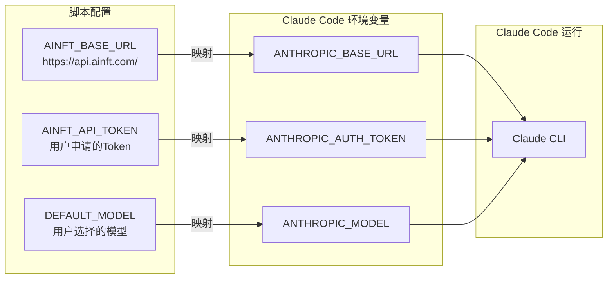

## 工作流程

### 主流程图

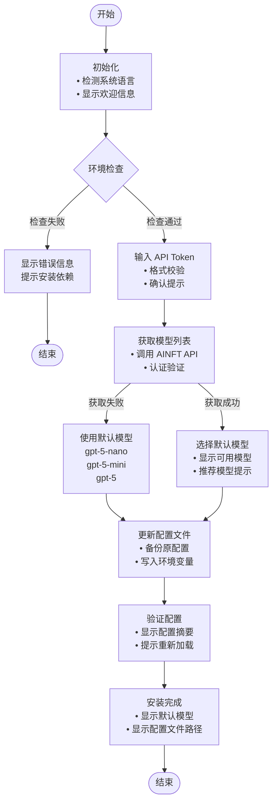

### 环境检查流程

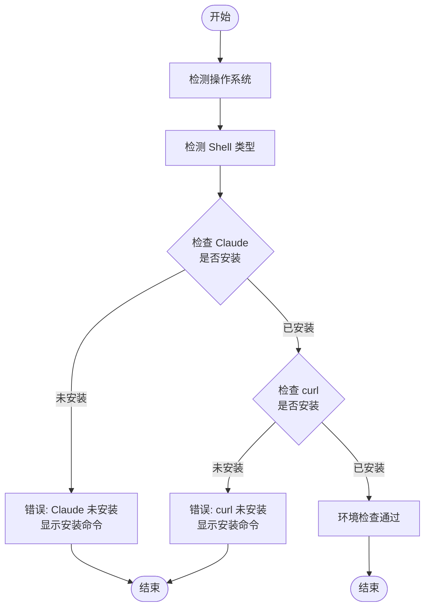

### 模型选择流程

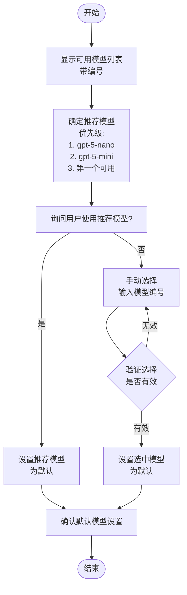

## 时序图

### 完整配置流程时序图

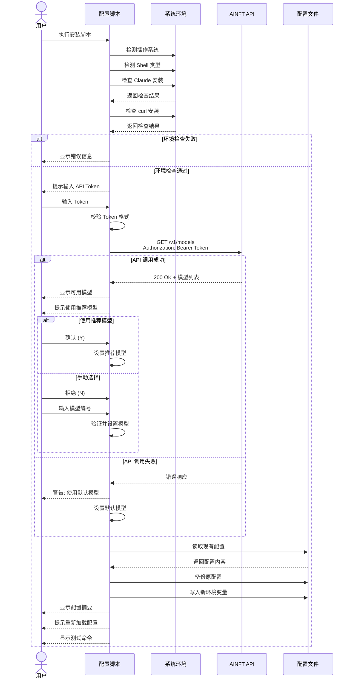

### 配置文件更新时序图

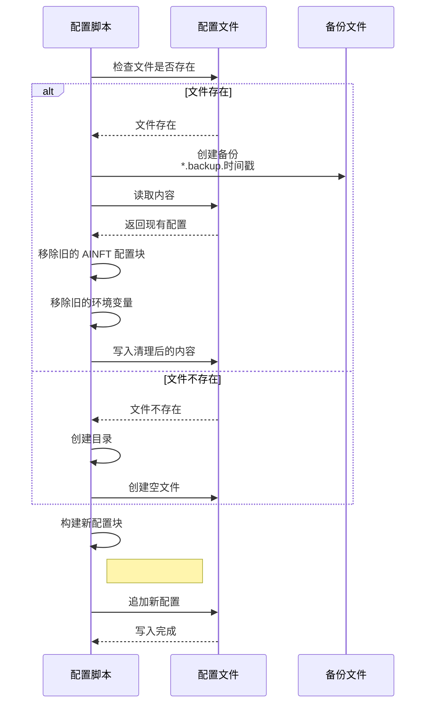

## 多语言支持架构

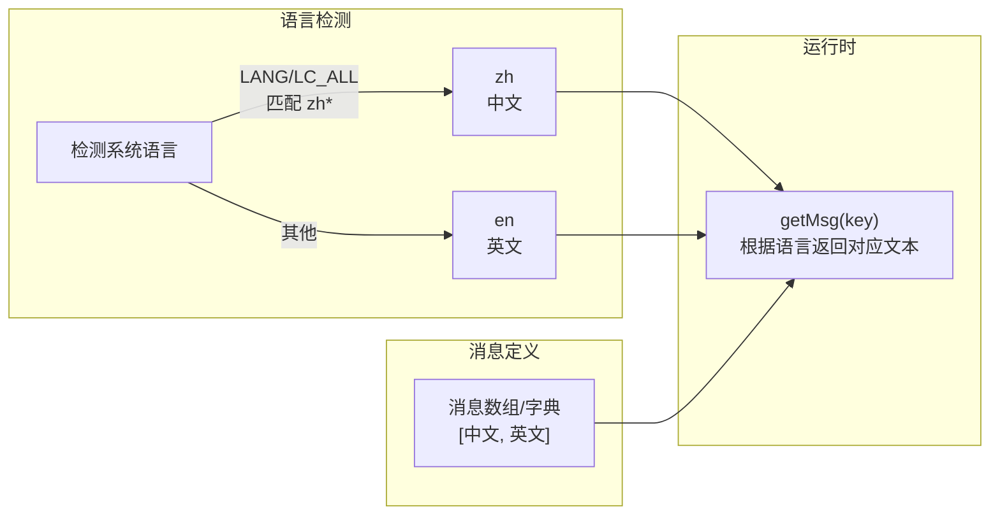

## 平台差异对比

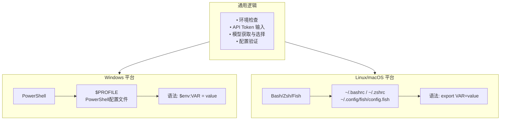

## 错误处理流程

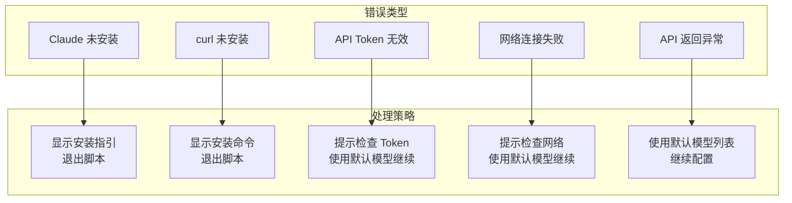

## 使用方法

### Windows (PowerShell)

```powershell
# 方式一: 直接远程执行
iwr -useb https://chat.ainft.com/scripts/install-ainft-provider-claude.ps1 | iex

# 方式二: 下载后执行
.\install-ainft-provider.ps1
```

### Linux / macOS (Bash)

```bash
# 方式一: 直接远程执行
curl -fsSL https://chat.ainft.com/scripts/install-ainft-provider-claude.sh | bash

# 方式二: 下载后执行
chmod +x install-ainft-provider.sh
./install-ainft-provider.sh
```

## 配置生效

脚本完成后，需要重新加载配置文件使环境变量生效：

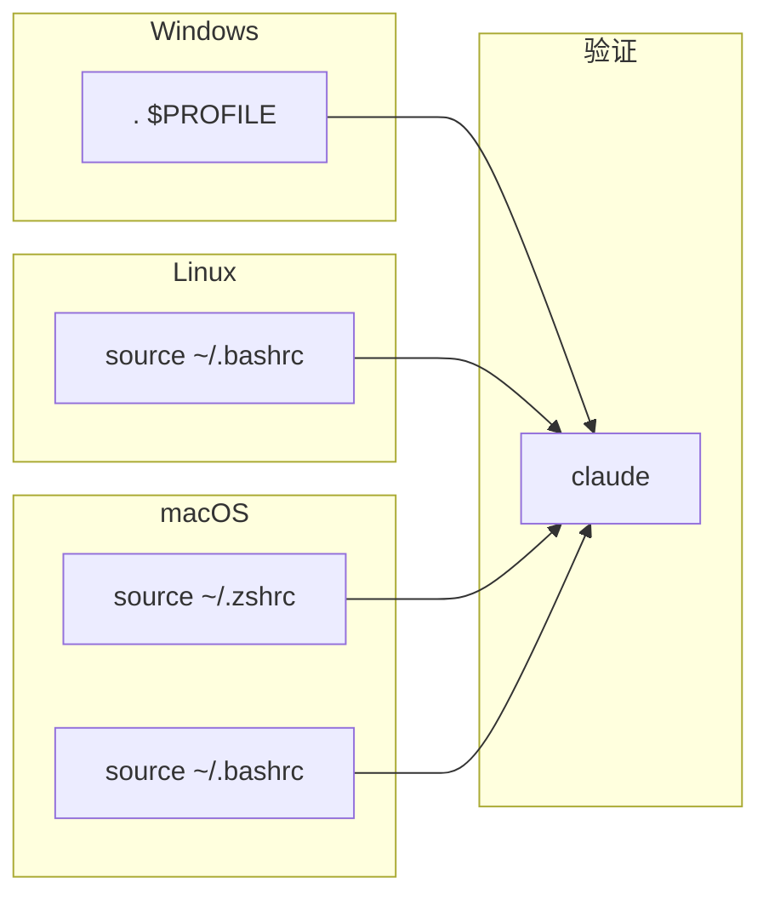

