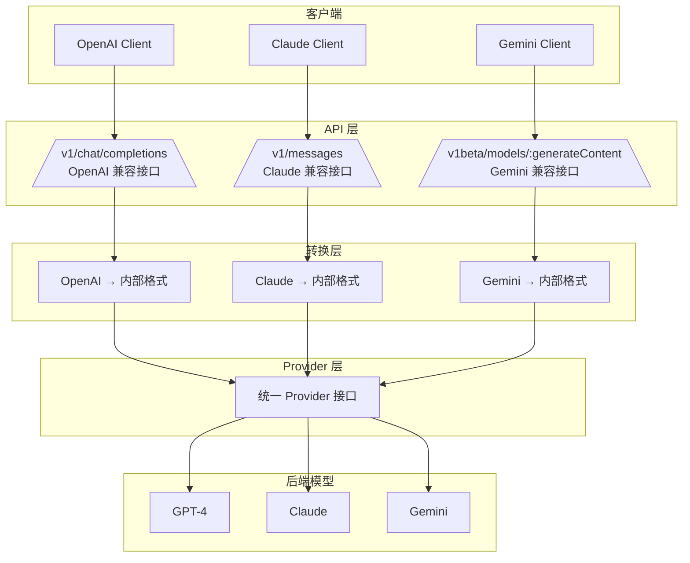

# Claude 协议、OpenAI 协议与 Gemini 协议详细对比

本文档详细对比 Claude 协议（Anthropic Messages API）、OpenAI 协议（Chat Completions API）与 Gemini 协议（Google Generative Language API）的区别，深入解析每个字段的用途和含义，帮助开发者全面理解三种协议的差异。

---

## 目录

- [概述](#概述)
- [端点对比](#端点对比)
- [请求格式详解](#请求格式详解)
- [响应格式详解](#响应格式详解)
- [消息角色详解](#消息角色详解)
- [流式响应详解](#流式响应详解)
- [工具调用详解](#工具调用详解)
- [错误处理详解](#错误处理详解)
- [AINFT 平台实现](#ainft-平台实现)

---

## 概述

| 特性 | OpenAI 协议 | Claude 协议 | Gemini 协议 |
|------|------------|------------|------------|
| **端点路径** | `/v1/chat/completions` | `/v1/messages` | `/v1beta/models/{model}:generateContent` |
| **消息格式** | `messages` 数组 | `messages` 数组 | `contents` 数组 |
| **系统消息** | `system` role in messages | 独立的 `system` 参数 | `systemInstruction` 参数 |
| **流式响应** | `data: {...}` SSE 格式 | `event: {...}` SSE 格式 | `data: {...}` SSE 格式 |
| **停止原因** | `finish_reason: stop/tool_calls` | `stop_reason: end_turn/tool_use` | `finishReason: STOP/MAX_TOKENS/SAFETY/RECITATION/OTHER` |
| **错误格式** | `{ error: { message, type, code } }` | `{ error: { message, type } }` | `{ error: { code, message, status } }` |
| **认证方式** | `Authorization: Bearer` | `x-api-key` + `anthropic-version` | `key` 查询参数或 `x-goog-api-key` |

---

## 端点对比

### OpenAI 协议

- **官方文档**: [Chat Completions API](https://platform.openai.com/docs/api-reference/chat/create)

```http
POST /v1/chat/completions
Content-Type: application/json
Authorization: Bearer {api_key}
```

**端点说明**:
- **路径**: `/v1/chat/completions` - OpenAI 聊天补全接口的标准路径
- **方法**: `POST` - 使用 POST 方法提交请求
- **Content-Type**: `application/json` - 请求体为 JSON 格式
- **Authorization**: `Bearer {api_key}` - 使用 Bearer Token 方式认证，在请求头中传递 API Key

### Claude 协议

- **官方文档**: [Anthropic Messages API](https://docs.anthropic.com/en/api/messages)

```http
POST /v1/messages
Content-Type: application/json
x-api-key: {api_key}
anthropic-version: 2023-06-01
```

**端点说明**:
- **路径**: `/v1/messages` - Anthropic Messages API 的标准路径
- **方法**: `POST` - 使用 POST 方法提交请求
- **Content-Type**: `application/json` - 请求体为 JSON 格式
- **x-api-key**: `{api_key}` - 使用自定义请求头传递 API Key（注意：不是标准的 Authorization 头）
- **anthropic-version**: `2023-06-01` - API 版本号，必需，用于指定使用的 API 版本

> **注意**: Claude 协议使用 `x-api-key` 头部而非 `Authorization`，且需要 `anthropic-version` 头部。

### Gemini 协议

- **官方文档**: [Gemini API - Generate Content](https://ai.google.dev/api/generate-content)

```http
POST https://generativelanguage.googleapis.com/v1beta/models/{model}:generateContent?key={api_key}
Content-Type: application/json
```

或流式接口：

```http
POST https://generativelanguage.googleapis.com/v1beta/models/{model}:streamGenerateContent?key={api_key}
Content-Type: application/json
```

**端点说明**:
- **基础 URL**: `https://generativelanguage.googleapis.com` - Google Generative Language API 的基础地址
- **版本**: `v1beta` - API 版本，目前为 beta 版本
- **路径参数**: `models/{model}` - 模型名称，如 `gemini-1.5-pro`
- **方法后缀**: `:generateContent` 或 `:streamGenerateContent` - 指定是标准生成还是流式生成
- **查询参数**: `key={api_key}` - API Key 作为 URL 查询参数传递（注意：不是请求头）
- **Content-Type**: `application/json` - 请求体为 JSON 格式

> **注意**: Gemini 协议使用 URL 查询参数 `key` 传递 API Key，而非请求头。

---

## 请求格式详解

### OpenAI 请求格式

```json
{
  "model": "gpt-4",
  "messages": [
    { "role": "system", "content": "你是一个有用的助手" },
    { "role": "user", "content": "你好" },
    { "role": "assistant", "content": "你好！有什么可以帮助你的？" },
    { "role": "user", "content": "今天天气怎么样？" }
  ],
  "max_tokens": 1024,
  "temperature": 0.7,
  "stream": false
}
```

**字段详解**:

| 字段 | 类型 | 必填 | 说明 |
|------|------|------|------|
| `model` | string | 是 | 模型标识符，如 `gpt-4`、`gpt-4o`、`gpt-3.5-turbo` |
| `messages` | array | 是 | 消息数组，包含对话历史 |
| `messages[].role` | string | 是 | 消息角色：`system`、`user`、`assistant`、`tool` |
| `messages[].content` | string/array | 是 | 消息内容，可以是字符串或多模态内容数组 |
| `max_tokens` | integer | 否 | 生成的最大 token 数，默认无限制 |
| `temperature` | number | 否 | 采样温度，范围 0-2，默认 1。值越高输出越随机，越低越确定 |
| `stream` | boolean | 否 | 是否使用流式响应，默认 false |
| `top_p` | number | 否 | 核采样参数，范围 0-1，默认 1 |
| `n` | integer | 否 | 生成多少个回复选项，默认 1 |
| `stop` | string/array | 否 | 停止序列，遇到时停止生成 |
| `presence_penalty` | number | 否 | 存在惩罚，范围 -2.0 到 2.0，默认 0 |
| `frequency_penalty` | number | 否 | 频率惩罚，范围 -2.0 到 2.0，默认 0 |
| `tools` | array | 否 | 可用工具（函数）列表 |
| `tool_choice` | string/object | 否 | 工具选择策略：`none`、`auto`、`required` 或指定工具 |

### Claude 请求格式

```json
{
  "model": "claude-3-opus-20240229",
  "system": "你是一个有用的助手",
  "messages": [
    { "role": "user", "content": "你好" },
    { "role": "assistant", "content": "你好！有什么可以帮助你的？" },
    { "role": "user", "content": "今天天气怎么样？" }
  ],
  "max_tokens": 1024,
  "temperature": 0.7,
  "stream": false
}
```

**字段详解**:

| 字段 | 类型 | 必填 | 说明 |
|------|------|------|------|
| `model` | string | 是 | 模型标识符，如 `claude-3-opus-20240229`、`claude-3-5-sonnet-20241022` |
| `system` | string | 否 | 系统提示，用于设置 AI 的行为和角色，独立于 messages 数组 |
| `messages` | array | 是 | 消息数组，仅包含 `user` 和 `assistant` 角色 |
| `messages[].role` | string | 是 | 消息角色：仅支持 `user`、`assistant` |
| `messages[].content` | string/array | 是 | 消息内容，可以是字符串或多模态内容块数组 |
| `max_tokens` | integer | **是** | 生成的最大 token 数，**这是 Claude 的必需参数** |
| `temperature` | number | 否 | 采样温度，范围 0-1，默认 1 |
| `stream` | boolean | 否 | 是否使用流式响应，默认 false |
| `top_p` | number | 否 | 核采样参数，范围 0-1，默认 1 |
| `top_k` | integer | 否 | Top-k 采样参数，默认 无限制 |
| `stop_sequences` | array | 否 | 自定义停止序列数组 |
| `tools` | array | 否 | 可用工具列表 |
| `tool_choice` | object | 否 | 工具选择策略，如 `{ "type": "auto" }` |
| `metadata` | object | 否 | 元数据，如 `user_id` 用于追踪 |

### Gemini 请求格式

```json
{
  "systemInstruction": {
    "parts": [{ "text": "你是一个有用的助手" }]
  },
  "contents": [
    {
      "role": "user",
      "parts": [{ "text": "你好" }]
    },
    {
      "role": "model",
      "parts": [{ "text": "你好！有什么可以帮助你的？" }]
    },
    {
      "role": "user",
      "parts": [{ "text": "今天天气怎么样？" }]
    }
  ],
  "generationConfig": {
    "maxOutputTokens": 1024,
    "temperature": 0.7
  }
}
```

**字段详解**:

| 字段 | 类型 | 必填 | 说明 |
|------|------|------|------|
| `model` | string | 是 | 模型标识符，通过 URL 路径传递，如 `gemini-1.5-pro` |
| `systemInstruction` | object | 否 | 系统指令，包含 `parts` 数组 |
| `systemInstruction.parts` | array | 否 | 系统指令内容块数组，每个元素包含 `text` 字段 |
| `contents` | array | 是 | 内容数组，相当于其他协议的 messages |
| `contents[].role` | string | 是 | 角色：`user` 或 `model`（注意不是 `assistant`） |
| `contents[].parts` | array | 是 | 内容块数组，每个元素可以是 `text`、`inlineData`、`fileData` 等 |
| `contents[].parts[].text` | string | 条件 | 文本内容 |
| `generationConfig` | object | 否 | 生成配置参数对象 |
| `generationConfig.maxOutputTokens` | integer | 否 | 最大输出 token 数 |
| `generationConfig.temperature` | number | 否 | 采样温度，范围 0-1，默认 1 |
| `generationConfig.topP` | number | 否 | 核采样参数，范围 0-1，默认 1 |
| `generationConfig.topK` | integer | 否 | Top-k 采样参数 |
| `generationConfig.stopSequences` | array | 否 | 停止序列数组 |
| `tools` | array | 否 | 工具声明数组 |
| `toolConfig` | object | 否 | 工具配置，包含 `functionCallingConfig` |
| `safetySettings` | array | 否 | 安全设置数组，控制内容过滤级别 |

### 关键区别汇总

| 特性 | OpenAI | Claude | Gemini |
|------|--------|--------|--------|
| **系统消息** | 包含在 `messages` 数组中 (`role: system`) | 独立的 `system` 字符串参数 | `systemInstruction.parts` 对象 |
| **消息数组** | 可包含 `system` 角色 | 仅支持 `user` 和 `assistant` 角色 | `contents` 数组，角色为 `user`/`model` |
| **消息结构** | `{role, content}` | `{role, content}` | `{role, parts: [{text}]}` |
| **max_tokens** | 可选，默认无限 | **必需** 参数 | `maxOutputTokens` 在 `generationConfig` 中 |
| **temperature** | 支持 (0-2) | 支持 (0-1) | 支持 (0-1) |
| **content 格式** | 字符串或数组 | 字符串或数组 | `parts` 数组 |

---

## 响应格式详解

### OpenAI 非流式响应

```json
{
  "id": "chatcmpl-1234567890",
  "object": "chat.completion",
  "created": 1677652288,
  "model": "gpt-4",
  "choices": [
    {
      "index": 0,
      "message": {
        "role": "assistant",
        "content": "我无法获取实时天气信息..."
      },
      "finish_reason": "stop"
    }
  ],
  "usage": {
    "prompt_tokens": 20,
    "completion_tokens": 30,
    "total_tokens": 50
  }
}
```

**字段详解**:

| 字段 | 类型 | 说明 |
|------|------|------|
| `id` | string | 唯一的响应标识符，格式为 `chatcmpl-xxx` |
| `object` | string | 对象类型，固定为 `chat.completion` |
| `created` | integer | 响应创建时间戳（Unix 时间戳，秒） |
| `model` | string | 实际使用的模型名称 |
| `choices` | array | 生成的回复选项数组（根据 `n` 参数可能有多个） |
| `choices[].index` | integer | 选项索引，从 0 开始 |
| `choices[].message` | object | 消息对象 |
| `choices[].message.role` | string | 角色，固定为 `assistant` |
| `choices[].message.content` | string/null | 回复内容，工具调用时可能为 null |
| `choices[].message.tool_calls` | array | 工具调用信息（如果有） |
| `choices[].finish_reason` | string | 停止原因：`stop`、`length`、`tool_calls`、`content_filter` |
| `usage` | object | Token 使用量统计 |
| `usage.prompt_tokens` | integer | 输入（提示）token 数量 |
| `usage.completion_tokens` | integer | 输出（生成）token 数量 |
| `usage.total_tokens` | integer | 总 token 数量 |

**finish_reason 说明**:
- `stop`: 正常完成，遇到停止序列或自然结束
- `length`: 达到 `max_tokens` 限制而停止
- `tool_calls`: 模型决定调用工具
- `content_filter`: 内容被过滤而截断

### Claude 非流式响应

```json
{
  "id": "msg_01AbCdEfGhIjKlMnOpQrStUv",
  "type": "message",
  "role": "assistant",
  "content": [
    {
      "type": "text",
      "text": "我无法获取实时天气信息..."
    }
  ],
  "model": "claude-3-opus-20240229",
  "stop_reason": "end_turn",
  "stop_sequence": null,
  "usage": {
    "input_tokens": 20,
    "output_tokens": 30
  }
}
```

**字段详解**:

| 字段 | 类型 | 说明 |
|------|------|------|
| `id` | string | 唯一的响应标识符，格式为 `msg_xxx` |
| `type` | string | 对象类型，固定为 `message` |
| `role` | string | 角色，固定为 `assistant` |
| `content` | array | 内容块数组，支持多种类型（text、image、tool_use 等） |
| `content[].type` | string | 内容块类型：`text`、`image`、`tool_use`、`tool_result` |
| `content[].text` | string | 当 type 为 text 时的文本内容 |
| `model` | string | 实际使用的模型名称 |
| `stop_reason` | string | 停止原因：`end_turn`、`max_tokens`、`stop_sequence`、`tool_use` |
| `stop_sequence` | string | 触发的停止序列（如果 stop_reason 为 stop_sequence） |
| `usage` | object | Token 使用量统计 |
| `usage.input_tokens` | integer | 输入 token 数量 |
| `usage.output_tokens` | integer | 输出 token 数量 |

**stop_reason 说明**:
- `end_turn`: 正常完成，模型自然结束对话
- `max_tokens`: 达到 `max_tokens` 限制
- `stop_sequence`: 遇到自定义停止序列
- `tool_use`: 模型决定使用工具

### Gemini 非流式响应

```json
{
  "candidates": [
    {
      "content": {
        "parts": [
          { "text": "我无法获取实时天气信息..." }
        ],
        "role": "model"
      },
      "finishReason": "STOP",
      "index": 0,
      "safetyRatings": [
        {
          "category": "HARM_CATEGORY_HARASSMENT",
          "probability": "NEGLIGIBLE"
        }
      ],
      "tokenCount": 30
    }
  ],
  "usageMetadata": {
    "promptTokenCount": 20,
    "candidatesTokenCount": 30,
    "totalTokenCount": 50
  }
}
```

**字段详解**:

| 字段 | 类型 | 说明 |
|------|------|------|
| `candidates` | array | 候选回复数组（可能有多个） |
| `candidates[].index` | integer | 候选索引 |
| `candidates[].content` | object | 内容对象 |
| `candidates[].content.role` | string | 角色，固定为 `model` |
| `candidates[].content.parts` | array | 内容块数组 |
| `candidates[].content.parts[].text` | string | 文本内容 |
| `candidates[].finishReason` | string | 停止原因：`STOP`、`MAX_TOKENS`、`SAFETY`、`RECITATION`、`OTHER` |
| `candidates[].safetyRatings` | array | 安全评级数组 |
| `candidates[].safetyRatings[].category` | string | 安全类别，如 `HARM_CATEGORY_HARASSMENT` |
| `candidates[].safetyRatings[].probability` | string | 风险概率：`NEGLIGIBLE`、`LOW`、`MEDIUM`、`HIGH` |
| `candidates[].tokenCount` | integer | 此候选的 token 数量 |
| `usageMetadata` | object | Token 使用元数据 |
| `usageMetadata.promptTokenCount` | integer | 输入 token 数量 |
| `usageMetadata.candidatesTokenCount` | integer | 输出 token 数量 |
| `usageMetadata.totalTokenCount` | integer | 总 token 数量 |

**finishReason 说明**:
- `STOP`: 正常完成
- `MAX_TOKENS`: 达到最大 token 限制
- `SAFETY`: 因安全原因停止
- `RECITATION`: 因引用风险停止
- `OTHER`: 其他原因

### 关键区别汇总

| 特性 | OpenAI | Claude | Gemini |
|------|--------|--------|--------|
| **content 类型** | 字符串 | 数组（支持多模态内容块） | `parts` 数组 |
| **响应结构** | `choices[0].message` | `content` 数组 | `candidates[0].content` |
| **finish_reason** | `stop`, `length`, `tool_calls`, `content_filter` | `end_turn`, `max_tokens`, `stop_sequence`, `tool_use` | `STOP`, `MAX_TOKENS`, `SAFETY`, `RECITATION`, `OTHER` |
| **usage 字段名** | `prompt_tokens` / `completion_tokens` | `input_tokens` / `output_tokens` | `promptTokenCount` / `candidatesTokenCount` |
| **对象类型** | `chat.completion` | `message` | `generateContentResponse` |
| **安全评级** | 无 | 无 | `safetyRatings` 数组 |

---

## 消息角色详解

### OpenAI 支持的角色

| 角色 | 用途 | 说明 |
|------|------|------|
| `system` | 系统指令 | 设置 AI 的行为、角色和约束条件，通常作为 messages 数组的第一个元素 |
| `user` | 用户消息 | 用户输入的消息或问题 |
| `assistant` | AI 助手回复 | AI 模型生成的回复内容 |
| `tool` | 工具调用结果 | Function Calling 时，传递工具执行结果给模型 |

**使用示例**:
```json
{
  "messages": [
    { "role": "system", "content": "你是一个专业的程序员" },
    { "role": "user", "content": "写一个快速排序" },
    { "role": "assistant", "content": "这是快速排序的实现..." },
    { "role": "user", "content": "优化一下" }
  ]
}
```

### Claude 支持的角色

| 角色 | 用途 | 说明 |
|------|------|------|
| `user` | 用户消息 | 用户输入的消息或问题 |
| `assistant` | AI 助手回复 | AI 模型生成的回复内容 |

**注意**: Claude 协议中，系统消息通过独立的 `system` 参数传递，而不是放在 `messages` 数组中。

**使用示例**:
```json
{
  "system": "你是一个专业的程序员",
  "messages": [
    { "role": "user", "content": "写一个快速排序" },
    { "role": "assistant", "content": "这是快速排序的实现..." },
    { "role": "user", "content": "优化一下" }
  ]
}
```

### Gemini 支持的角色

| 角色 | 用途 | 说明 |
|------|------|------|
| `user` | 用户消息 | 用户输入的消息或问题 |
| `model` | AI 助手回复 | AI 模型生成的回复内容（注意：不是 `assistant`） |

**注意**: Gemini 协议中，系统消息通过 `systemInstruction` 参数传递，且角色名称为 `model` 而非 `assistant`。

**使用示例**:
```json
{
  "systemInstruction": {
    "parts": [{ "text": "你是一个专业的程序员" }]
  },
  "contents": [
    { "role": "user", "parts": [{ "text": "写一个快速排序" }] },
    { "role": "model", "parts": [{ "text": "这是快速排序的实现..." }] },
    { "role": "user", "parts": [{ "text": "优化一下" }] }
  ]
}
```

---

## 流式响应详解

### OpenAI 流式响应格式

```
data: {"id":"chatcmpl-123","object":"chat.completion.chunk","created":1677652288,"model":"gpt-4","choices":[{"index":0,"delta":{"role":"assistant"},"finish_reason":null}]}

data: {"id":"chatcmpl-123","object":"chat.completion.chunk","choices":[{"index":0,"delta":{"content":"你好"},"finish_reason":null}]}

data: {"id":"chatcmpl-123","object":"chat.completion.chunk","choices":[{"index":0,"delta":{"content":"！"},"finish_reason":null}]}

data: {"id":"chatcmpl-123","object":"chat.completion.chunk","choices":[{"index":0,"delta":{},"finish_reason":"stop"}]}

data: [DONE]
```

**字段详解**:

| 字段 | 类型 | 说明 |
|------|------|------|
| `id` | string | 流式响应的唯一标识符，所有 chunk 相同 |
| `object` | string | 对象类型，固定为 `chat.completion.chunk` |
| `created` | integer | 创建时间戳 |
| `model` | string | 使用的模型 |
| `choices` | array | 选择数组 |
| `choices[].index` | integer | 选项索引 |
| `choices[].delta` | object | 增量内容 |
| `choices[].delta.role` | string | 角色信息（仅在第一个 chunk） |
| `choices[].delta.content` | string | 增量文本内容 |
| `choices[].finish_reason` | string | 停止原因，完成前为 null |

**流式事件说明**:
- 每个 `data:` 行是一个 JSON 对象，包含增量内容
- `delta.content` 包含新增的文本片段
- 最后发送 `[DONE]` 表示流结束

### Claude 流式响应格式

```
event: message_start
data: {"type":"message_start","message":{"id":"msg_01AbCd...","type":"message","role":"assistant","content":[],"model":"claude-3-opus-20240229","stop_reason":null,"stop_sequence":null}}

event: content_block_start
data: {"type":"content_block_start","index":0,"content_block":{"type":"text","text":""}}

event: content_block_delta
data: {"type":"content_block_delta","index":0,"delta":{"type":"text_delta","text":"你好"}}

event: content_block_delta
data: {"type":"content_block_delta","index":0,"delta":{"type":"text_delta","text":"！"}}

event: content_block_stop
data: {"type":"content_block_stop","index":0}

event: message_delta
data: {"type":"message_delta","delta":{"stop_reason":"end_turn","stop_sequence":null},"usage":{"output_tokens":10}}

event: message_stop
data: {"type":"message_stop"}
```

**事件类型详解**:

| 事件类型 | 说明 | 包含数据 |
|----------|------|----------|
| `message_start` | 消息开始 | 完整的 message 对象框架 |
| `content_block_start` | 内容块开始 | 内容块类型和初始值 |
| `content_block_delta` | 内容块增量 | 新增的文本片段 |
| `content_block_stop` | 内容块结束 | 内容块索引 |
| `message_delta` | 消息增量 | stop_reason 和 usage 信息 |
| `message_stop` | 消息结束 | 无额外数据 |

**字段详解**:

| 字段 | 类型 | 说明 |
|------|------|------|
| `type` | string | 事件类型 |
| `message` | object | message_start 时的完整消息框架 |
| `index` | integer | 内容块索引 |
| `content_block` | object | 内容块信息 |
| `content_block.type` | string | 内容块类型：`text`、`tool_use` 等 |
| `delta` | object | 增量信息 |
| `delta.text` | string | 文本增量（text_delta 类型） |
| `delta.stop_reason` | string | 停止原因 |
| `usage.output_tokens` | integer | 输出 token 数量 |

### Gemini 流式响应格式

```
data: {"candidates":[{"content":{"parts":[{"text":"你好"}],"role":"model"},"index":0}]}

data: {"candidates":[{"content":{"parts":[{"text":"！"}],"role":"model"},"index":0}]}

data: {"candidates":[{"content":{"parts":[],"role":"model"},"finishReason":"STOP","index":0}],"usageMetadata":{"promptTokenCount":20,"candidatesTokenCount":30,"totalTokenCount":50}}
```

**字段详解**:

| 字段 | 类型 | 说明 |
|------|------|------|
| `candidates` | array | 候选数组 |
| `candidates[].content` | object | 内容对象 |
| `candidates[].content.parts` | array | 内容块数组 |
| `candidates[].content.parts[].text` | string | 增量文本 |
| `candidates[].content.role` | string | 角色，固定为 `model` |
| `candidates[].index` | integer | 候选索引 |
| `candidates[].finishReason` | string | 停止原因（仅在最后） |
| `usageMetadata` | object | 使用统计（仅在最后） |

### 流式事件对比

| 特性 | OpenAI | Claude | Gemini |
|------|--------|--------|--------|
| **格式** | `data: {...}` | `event: xxx\ndata: {...}` | `data: {...}` |
| **角色传递** | `delta.role` | `message_start` 事件 | `content.role` |
| **内容增量** | `delta.content` | `content_block_delta.delta.text` | `candidates[0].content.parts[0].text` |
| **停止原因** | `finish_reason` | `message_delta.delta.stop_reason` | `finishReason` |
| **结束标记** | `[DONE]` | `message_stop` | 无特殊标记，通过 finishReason 判断 |
| **Token 统计** | 无（最后单独请求） | `message_delta.usage` | `usageMetadata` |

---

## 工具调用详解

### OpenAI 工具定义

```json
{
  "model": "gpt-4",
  "messages": [...],
  "tools": [
    {
      "type": "function",
      "function": {
        "name": "get_weather",
        "description": "获取指定城市的天气",
        "parameters": {
          "type": "object",
          "properties": {
            "city": { "type": "string", "description": "城市名称" }
          },
          "required": ["city"]
        }
      }
    }
  ],
  "tool_choice": "auto"
}
```

**字段详解**:

| 字段 | 类型 | 必填 | 说明 |
|------|------|------|------|
| `tools` | array | 否 | 可用工具列表 |
| `tools[].type` | string | 是 | 工具类型，固定为 `function` |
| `tools[].function` | object | 是 | 函数定义对象 |
| `tools[].function.name` | string | 是 | 函数名称，必须唯一 |
| `tools[].function.description` | string | 是 | 函数描述，帮助模型理解用途 |
| `tools[].function.parameters` | object | 是 | JSON Schema 格式的参数定义 |
| `tools[].function.parameters.type` | string | 是 | 参数类型，通常为 `object` |
| `tools[].function.parameters.properties` | object | 是 | 参数属性定义 |
| `tools[].function.parameters.required` | array | 否 | 必需参数列表 |
| `tool_choice` | string/object | 否 | 工具选择策略 |

**tool_choice 取值**:
- `"none"`: 不调用任何工具
- `"auto"`: 模型自动决定是否调用工具（默认）
- `"required"`: 强制调用至少一个工具
- `{"type": "function", "function": {"name": "xxx"}}`: 强制调用指定工具

### Claude 工具定义

```json
{
  "model": "claude-3-opus-20240229",
  "messages": [...],
  "tools": [
    {
      "name": "get_weather",
      "description": "获取指定城市的天气",
      "input_schema": {
        "type": "object",
        "properties": {
          "city": { "type": "string", "description": "城市名称" }
        },
        "required": ["city"]
      }
    }
  ],
  "tool_choice": { "type": "auto" }
}
```

**字段详解**:

| 字段 | 类型 | 必填 | 说明 |
|------|------|------|------|
| `tools` | array | 否 | 可用工具列表 |
| `tools[].name` | string | 是 | 工具名称，必须唯一 |
| `tools[].description` | string | 是 | 工具描述 |
| `tools[].input_schema` | object | 是 | 输入参数的 JSON Schema |
| `tools[].input_schema.type` | string | 是 | 参数类型 |
| `tools[].input_schema.properties` | object | 是 | 参数属性定义 |
| `tools[].input_schema.required` | array | 否 | 必需参数列表 |
| `tool_choice` | object | 否 | 工具选择配置 |
| `tool_choice.type` | string | 是 | 选择类型：`auto`、`any`、`tool` |
| `tool_choice.name` | string | 条件 | 当 type 为 `tool` 时，指定工具名称 |

**tool_choice.type 取值**:
- `auto`: 模型自动决定（默认）
- `any`: 必须使用某个工具
- `tool`: 必须使用指定工具

### Gemini 工具定义

```json
{
  "model": "gemini-1.5-pro",
  "contents": [...],
  "tools": [
    {
      "functionDeclarations": [
        {
          "name": "get_weather",
          "description": "获取指定城市的天气",
          "parameters": {
            "type": "object",
            "properties": {
              "city": { "type": "string", "description": "城市名称" }
            },
            "required": ["city"]
          }
        }
      ]
    }
  ],
  "toolConfig": {
    "functionCallingConfig": {
      "mode": "AUTO",
      "allowedFunctionNames": ["get_weather"]
    }
  }
}
```

**字段详解**:

| 字段 | 类型 | 必填 | 说明 |
|------|------|------|------|
| `tools` | array | 否 | 工具声明数组 |
| `tools[].functionDeclarations` | array | 是 | 函数声明数组 |
| `tools[].functionDeclarations[].name` | string | 是 | 函数名称 |
| `tools[].functionDeclarations[].description` | string | 是 | 函数描述 |
| `tools[].functionDeclarations[].parameters` | object | 是 | JSON Schema 参数定义 |
| `toolConfig` | object | 否 | 工具配置 |
| `toolConfig.functionCallingConfig` | object | 是 | 函数调用配置 |
| `toolConfig.functionCallingConfig.mode` | string | 是 | 调用模式：`AUTO`、`ANY`、`NONE` |
| `toolConfig.functionCallingConfig.allowedFunctionNames` | array | 否 | 允许调用的函数名称列表 |

**mode 取值**:
- `AUTO`: 模型自动决定（默认）
- `ANY`: 必须调用工具（可指定 allowedFunctionNames 限制范围）
- `NONE`: 不调用工具

### 工具调用响应对比

**OpenAI 工具调用响应**:
```json
{
  "choices": [{
    "message": {
      "role": "assistant",
      "content": null,
      "tool_calls": [{
        "id": "call_abc123",
        "type": "function",
        "function": {
          "name": "get_weather",
          "arguments": "{\"city\":\"北京\"}"
        }
      }]
    },
    "finish_reason": "tool_calls"
  }]
}
```

**字段说明**:
- `tool_calls`: 工具调用数组
- `tool_calls[].id`: 工具调用唯一标识
- `tool_calls[].type`: 调用类型，固定为 `function`
- `tool_calls[].function.name`: 调用的函数名
- `tool_calls[].function.arguments`: 函数参数，JSON 字符串格式
- `finish_reason`: `tool_calls` 表示因工具调用而停止

**Claude 工具调用响应**:
```json
{
  "content": [{
    "type": "tool_use",
    "id": "toolu_01AbCdEfGhIjKlMnOpQrStUv",
    "name": "get_weather",
    "input": { "city": "北京" }
  }],
  "stop_reason": "tool_use"
}
```

**字段说明**:
- `content`: 内容块数组
- `content[].type`: `tool_use` 表示工具使用
- `content[].id`: 工具调用唯一标识
- `content[].name`: 调用的工具名
- `content[].input`: 输入参数，对象格式（非 JSON 字符串）
- `stop_reason`: `tool_use` 表示因工具使用而停止

**Gemini 工具调用响应**:
```json
{
  "candidates": [{
    "content": {
      "parts": [{
        "functionCall": {
          "name": "get_weather",
          "args": { "city": "北京" }
        }
      }],
      "role": "model"
    },
    "finishReason": "STOP"
  }]
}
```

**字段说明**:
- `candidates[].content.parts`: 内容块数组
- `parts[].functionCall`: 函数调用对象
- `functionCall.name`: 调用的函数名
- `functionCall.args`: 参数对象
- `finishReason`: `STOP` 或其他原因

### 工具结果传递对比

**OpenAI 工具结果**:
```json
{
  "messages": [
    ...,
    { 
      "role": "tool", 
      "tool_call_id": "call_abc123", 
      "content": "晴天，25°C" 
    }
  ]
}
```

**字段说明**:
- `role`: `tool` 表示工具结果
- `tool_call_id`: 对应工具调用的 ID
- `content`: 工具执行结果

**Claude 工具结果**:
```json
{
  "messages": [
    ...,
    { 
      "role": "user", 
      "content": [{
        "type": "tool_result",
        "tool_use_id": "toolu_01AbCdEfGhIjKlMnOpQrStUv",
        "content": "晴天，25°C"
      }]
    }
  ]
}
```

**字段说明**:
- `role`: `user`（注意不是 tool）
- `content.type`: `tool_result` 表示工具结果
- `content.tool_use_id`: 对应工具调用的 ID
- `content.content`: 工具执行结果

**Gemini 工具结果**:
```json
{
  "contents": [
    ...,
    {
      "role": "user",
      "parts": [{
        "functionResponse": {
          "name": "get_weather",
          "response": {
            "result": "晴天，25°C"
          }
        }
      }]
    }
  ]
}
```

**字段说明**:
- `role`: `user`
- `parts[].functionResponse`: 函数响应对象
- `functionResponse.name`: 函数名称
- `functionResponse.response`: 响应内容对象

### 工具调用关键区别汇总

| 特性 | OpenAI | Claude | Gemini |
|------|--------|--------|--------|
| **工具定义字段** | `tools[].function` | `tools[].input_schema` | `tools[].functionDeclarations` |
| **工具选择** | `tool_choice` | `tool_choice` | `toolConfig.functionCallingConfig.mode` |
| **调用响应字段** | `tool_calls[]` | `content[].tool_use` | `parts[].functionCall` |
| **参数传递** | `arguments` (JSON 字符串) | `input` (对象) | `args` (对象) |
| **工具 ID** | `id` | `id` | 无 |
| **结果传递** | `role: tool` | `role: user` + `tool_result` | `role: user` + `functionResponse` |
| **结果字段** | `tool_call_id` | `tool_use_id` | `name` |

---

## 错误处理详解

### OpenAI 错误格式

```json
{
  "error": {
    "message": "Invalid API key",
    "type": "invalid_request_error",
    "code": "invalid_api_key"
  }
}
```

**字段详解**:

| 字段 | 类型 | 说明 |
|------|------|------|
| `error` | object | 错误对象 |
| `error.message` | string | 人类可读的错误描述 |
| `error.type` | string | 错误类型，如 `invalid_request_error`、`authentication_error` |
| `error.code` | string | 错误代码，如 `invalid_api_key`、`rate_limit_exceeded` |
| `error.param` | string | 导致错误的参数名（如果有） |

**常见错误类型**:

| 错误类型 | HTTP 状态码 | 说明 |
|----------|------------|------|
| `invalid_request_error` | 400 | 请求格式错误或参数无效 |
| `authentication_error` | 401 | 认证失败，API Key 无效 |
| `permission_error` | 403 | 权限不足 |
| `not_found_error` | 404 | 资源不存在 |
| `rate_limit_error` | 429 | 请求频率超限 |
| `api_error` | 500+ | 服务器内部错误 |

### Claude 错误格式

```json
{
  "error": {
    "type": "authentication_error",
    "message": "Invalid API key"
  }
}
```

**字段详解**:

| 字段 | 类型 | 说明 |
|------|------|------|
| `error` | object | 错误对象 |
| `error.type` | string | 错误类型 |
| `error.message` | string | 错误描述 |

**常见错误类型**:

| 错误类型 | HTTP 状态码 | 说明 |
|----------|------------|------|
| `invalid_request_error` | 400 | 请求格式错误 |
| `authentication_error` | 401 | 认证失败 |
| `permission_error` | 403 | 权限不足 |
| `not_found_error` | 404 | 资源不存在 |
| `rate_limit_error` | 429 | 请求频率超限 |
| `api_error` | 500+ | 服务器错误 |
| `overloaded_error` | 529 | Claude 特有的服务器过载错误 |

### Gemini 错误格式

```json
{
  "error": {
    "code": 400,
    "message": "Invalid API key",
    "status": "INVALID_ARGUMENT"
  }
}
```

**字段详解**:

| 字段 | 类型 | 说明 |
|------|------|------|
| `error` | object | 错误对象 |
| `error.code` | integer | HTTP 状态码 |
| `error.message` | string | 错误描述 |
| `error.status` | string | 状态码名称，遵循 Google API 规范 |
| `error.details` | array | 额外错误详情（可选） |

**常见错误状态**:

| 错误状态 | HTTP 状态码 | 说明 |
|----------|------------|------|
| `INVALID_ARGUMENT` | 400 | 参数无效 |
| `UNAUTHENTICATED` | 401 | 未认证 |
| `PERMISSION_DENIED` | 403 | 权限被拒绝 |
| `NOT_FOUND` | 404 | 资源未找到 |
| `RESOURCE_EXHAUSTED` | 429 | 资源耗尽（频率限制） |
| `INTERNAL` | 500 | 内部服务器错误 |
| `UNAVAILABLE` | 503 | 服务不可用 |

### 错误类型映射

| HTTP 状态码 | OpenAI 错误类型 | Claude 错误类型 | Gemini 错误状态 |
|------------|----------------|----------------|----------------|
| 400 | `invalid_request_error` | `invalid_request_error` | `INVALID_ARGUMENT` |
| 401 | `invalid_api_key` / `authentication_error` | `authentication_error` | `UNAUTHENTICATED` |
| 403 | `permission_error` | `permission_error` | `PERMISSION_DENIED` |
| 404 | `not_found_error` | `not_found_error` | `NOT_FOUND` |
| 429 | `rate_limit_error` | `rate_limit_error` | `RESOURCE_EXHAUSTED` |
| 500+ | `api_error` | `api_error` | `INTERNAL` |
| 529 | - | `overloaded_error` (Claude 特有) | - |

---

## AINFT 平台实现

AINFT 平台同时支持 OpenAI 协议、Claude 协议和 Gemini 协议，通过统一的 Provider 层将三种协议转换为内部标准格式。

### 协议转换架构



### 使用 AINFT 的 Claude 协议

```bash
curl -X POST https://chat.ainft.com/webapi/v1/messages \
  -H "Content-Type: application/json" \
  -H "x-api-key: YOUR_API_KEY" \
  -H "anthropic-version: 2023-06-01" \
  -d '{
    "model": "claude-opus-4.5",
    "max_tokens": 1024,
    "messages": [
      {"role": "user", "content": "你好"}
    ]
  }'
```

### 使用 AINFT 的 OpenAI 协议

```bash
curl -X POST https://chat.ainft.com/webapi/v1/chat/completions \
  -H "Content-Type: application/json" \
  -H "Authorization: Bearer YOUR_API_KEY" \
  -d '{
    "model": "gpt-5-nano",
    "messages": [
      {"role": "user", "content": "你好"}
    ]
  }'
```

### 使用 AINFT 的 Gemini 协议

```bash
curl -X POST "https://chat.ainft.com/webapi/v1beta/models/gemini-1.5-pro:generateContent?key=YOUR_API_KEY" \
  -H "Content-Type: application/json" \
  -d '{
    "contents": [
      {
        "role": "user",
        "parts": [{"text": "你好"}]
      }
    ],
    "generationConfig": {
      "maxOutputTokens": 1024,
      "temperature": 0.7
    }
  }'
```

---

## 迁移指南

### 从 OpenAI 迁移到 Claude 协议

1. **修改端点**: `/v1/chat/completions` → `/v1/messages`
2. **修改认证头**: `Authorization: Bearer` → `x-api-key`
3. **添加版本头**: 添加 `anthropic-version: 2023-06-01`
4. **提取系统消息**: 从 `messages` 数组移到独立的 `system` 参数
5. **添加必需参数**: 添加 `max_tokens`
6. **修改响应解析**: 
   - 从 `choices[0].message.content` 改为 `content[0].text`
   - 注意 `content` 是数组
7. **更新流式处理**: 解析 `event:` 而非直接解析 `data:`
8. **修改工具调用**: 
   - 工具定义从 `function` 改为 `input_schema`
   - 调用响应从 `tool_calls` 改为 `tool_use`
   - 结果传递从 `role: tool` 改为 `role: user` + `tool_result`

### 从 OpenAI 迁移到 Gemini 协议

1. **修改端点**: `/v1/chat/completions` → `/v1beta/models/{model}:generateContent`
2. **修改认证方式**: 从 `Authorization` 头改为 URL 查询参数 `key`
3. **修改消息字段**: `messages` → `contents`
4. **修改消息结构**: `{role, content}` → `{role, parts: [{text}]}`
5. **提取系统消息**: 从 `messages` 数组移到 `systemInstruction.parts`
6. **修改配置参数**: `max_tokens`/`temperature` → `generationConfig` 对象
7. **修改响应解析**: 
   - 从 `choices[0].message.content` 改为 `candidates[0].content.parts[0].text`
8. **修改角色名称**: `assistant` → `model`
9. **更新工具调用**: 
   - 使用 `functionDeclarations` 定义工具
   - 调用响应使用 `functionCall`
   - 结果传递使用 `functionResponse`

### 代码示例

**OpenAI 客户端代码:**
```typescript
const response = await fetch('/v1/chat/completions', {
  method: 'POST',
  headers: { 'Authorization': `Bearer ${apiKey}` },
  body: JSON.stringify({
    model: 'gpt-4',
    messages: [
      { role: 'system', content: '你是助手' },
      { role: 'user', content: '你好' }
    ]
  })
});
const data = await response.json();
console.log(data.choices[0].message.content);
```

**Claude 客户端代码:**
```typescript
const response = await fetch('/v1/messages', {
  method: 'POST',
  headers: { 
    'x-api-key': apiKey,
    'anthropic-version': '2023-06-01'
  },
  body: JSON.stringify({
    model: 'claude-3-opus-20240229',
    system: '你是助手',
    messages: [
      { role: 'user', content: '你好' }
    ],
    max_tokens: 1024
  })
});
const data = await response.json();
console.log(data.content[0].text);
```

**Gemini 客户端代码:**
```typescript
const response = await fetch(`/v1beta/models/gemini-1.5-pro:generateContent?key=${apiKey}`, {
  method: 'POST',
  headers: { 'Content-Type': 'application/json' },
  body: JSON.stringify({
    systemInstruction: {
      parts: [{ text: '你是助手' }]
    },
    contents: [
      { role: 'user', parts: [{ text: '你好' }] }
    ],
    generationConfig: {
      maxOutputTokens: 1024,
      temperature: 0.7
    }
  })
});
const data = await response.json();
console.log(data.candidates[0].content.parts[0].text);
```

---

## 参考文档

### OpenAI 官方文档
- [Chat Completions API](https://platform.openai.com/docs/api-reference/chat/create) - 聊天补全接口
- [Streaming](https://platform.openai.com/docs/api-reference/chat/streaming) - 流式响应
- [Function Calling](https://platform.openai.com/docs/guides/function-calling) - 函数调用指南

### Anthropic (Claude) 官方文档
- [Messages API](https://docs.anthropic.com/en/api/messages) - 消息接口
- [Streaming](https://docs.anthropic.com/en/api/messages-streaming) - 流式响应
- [Tool Use](https://docs.anthropic.com/en/docs/build-with-claude/tool-use) - 工具使用

### Google (Gemini) 官方文档
- [Generate Content API](https://ai.google.dev/api/generate-content) - 生成内容接口
- [REST API Reference](https://ai.google.dev/api/rest) - REST API 参考
- [Function Calling](https://ai.google.dev/gemini-api/docs/function-calling) - 函数调用
- [Streaming](https://ai.google.dev/gemini-api/docs/text-generation?lang=rest#streaming) - 流式生成

### AINFT 平台文档
- [AINFT API 文档](../api/README.md)
- [v1-messages-api 技术文档](./v1-messages-api.md)
