# Claude API 适配技术方案

## 1. 概述

本文档描述在 AINFT 平台上实现 Claude API 协议适配的技术方案。通过该适配层，Claude 协议客户端可以无缝使用 AINFT 平台提供的各类大模型服务。

## 2. 系统架构

### 2.1 整体架构

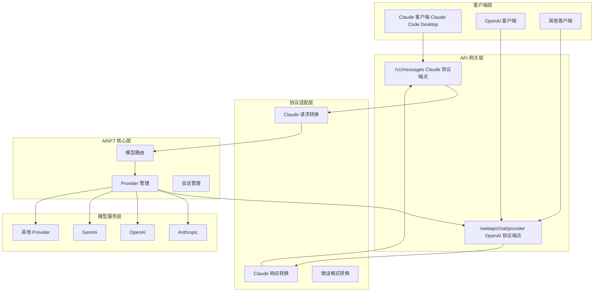
```mermaid
graph TB
    subgraph "客户端层"
        C1[Claude 客户端 Claude Code Desktop]
        C2[OpenAI 客户端]
        C3[其他客户端]
    end

    subgraph "API 网关层"
        R1["/v1/messages" Claude 协议端点]
        R2["/webapi/chat/provider" OpenAI 协议端点]
    end

    subgraph "协议适配层"
        A1[Claude 请求转换]
        A2[Claude 响应转换]
        A3[错误格式转换]
    end

    subgraph "AINFT 核心层"
        L1[模型路由]
        L2[Provider 管理]
        L3[会话管理]
    end

    subgraph "模型服务层"
        M1[Anthropic]
        M2[OpenAI]
        M3[Gemini]
        M4[其他 Provider]
    end

    C1 --> R1
    C2 --> R2
    C3 --> R2
    
    R1 --> A1
    A1 --> L1
    L1 --> L2
    L2 --> R2
    
    R2 --> A2
    A2 --> R1
    
    L2 --> M1
    L2 --> M2
    L2 --> M3
    L2 --> M4
```

### 2.2 模块结构

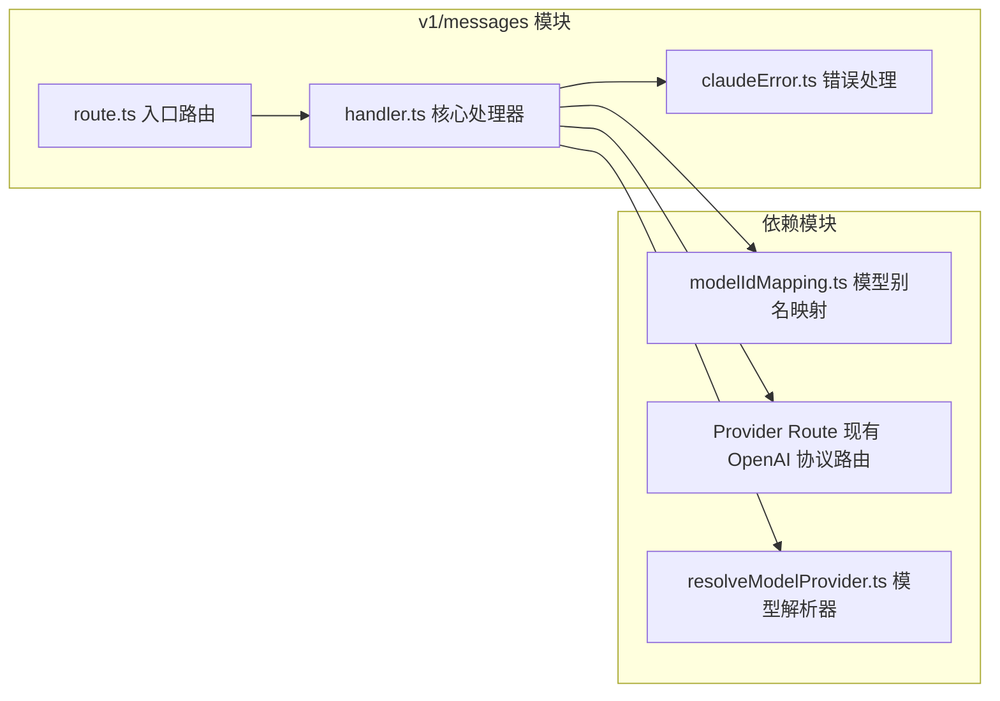
```mermaid
graph LR
    subgraph "v1/messages 模块"
        Route[route.ts 入口路由]
        Handler[handler.ts 核心处理器]
        ClaudeError[claudeError.ts 错误处理]
    end

    subgraph "依赖模块"
        ModelMapping[modelIdMapping.ts 模型别名映射]
        ProviderRoute[Provider Route 现有 OpenAI 协议路由]
        ResolveProvider[resolveModelProvider.ts 模型解析器]
    end

    Route --> Handler
    Handler --> ClaudeError
    Handler --> ModelMapping
    Handler --> ProviderRoute
    Handler --> ResolveProvider
```

## 3. 核心流程

### 3.1 请求处理流程

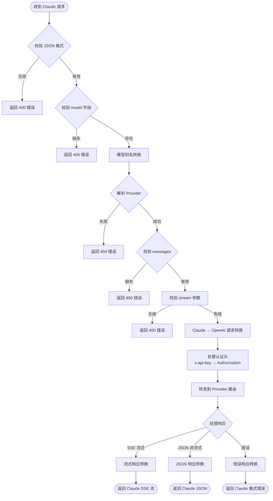
```mermaid
flowchart TD
    Start([收到 Claude 请求]) --> ValidateJSON{校验 JSON 格式}
    ValidateJSON -->|无效| Error400[返回 400 错误]
    ValidateJSON -->|有效| ValidateModel{校验 model 字段}
    
    ValidateModel -->|缺失| Error400Model[返回 400 错误]
    ValidateModel -->|存在| NormalizeModel[模型别名转换]
    
    NormalizeModel --> ResolveProvider{解析 Provider}
    ResolveProvider -->|失败| Error404[返回 404 错误]
    ResolveProvider -->|成功| ValidateMessages{校验 messages}
    
    ValidateMessages -->|缺失| Error400Msg[返回 400 错误]
    ValidateMessages -->|有效| NormalizeStream[校验 stream 参数]
    
    NormalizeStream -->|无效| Error400Stream[返回 400 错误]
    NormalizeStream -->|有效| ConvertRequest[Claude → OpenAI 请求转换]
    
    ConvertRequest --> AuthHeader[处理认证头<br/>x-api-key → Authorization]
    AuthHeader --> ForwardRequest[转发到 Provider 路由]
    
    ForwardRequest --> HandleResponse{处理响应}
    HandleResponse -->|SSE 流式| ConvertStream[流式响应转换]
    HandleResponse -->|JSON 非流式| ConvertJSON[JSON 响应转换]
    HandleResponse -->|错误| ConvertError[错误响应转换]
    
    ConvertStream --> EndStream([返回 Claude SSE 流])
    ConvertJSON --> EndJSON([返回 Claude JSON])
    ConvertError --> EndError([返回 Claude 格式错误])
```

### 3.2 协议转换时序图

#### 3.2.1 非流式请求

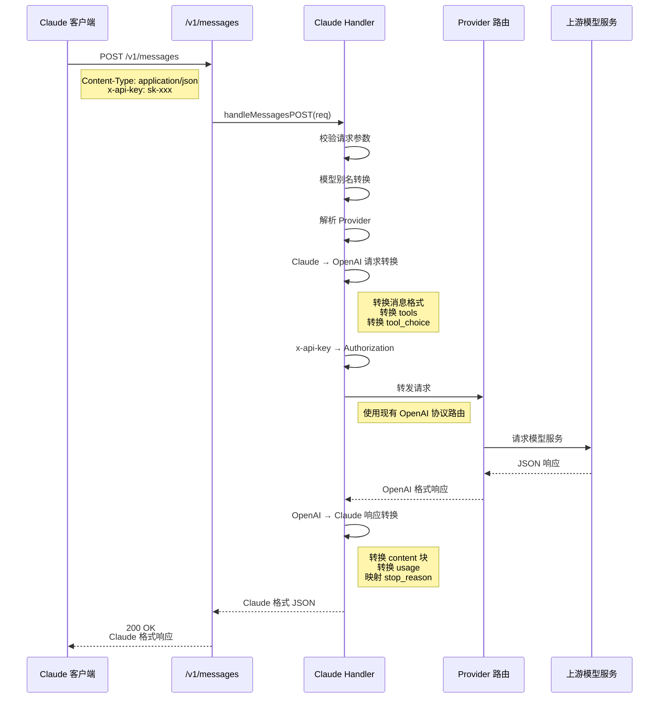
```mermaid
sequenceDiagram
    participant Client as Claude 客户端
    participant Route as /v1/messages
    participant Handler as Claude Handler
    participant Provider as Provider 路由
    participant Upstream as 上游模型服务

    Client->>Route: POST /v1/messages
    Note right of Client: Content-Type: application/json<br/>x-api-key: sk-xxx
    
    Route->>Handler: handleMessagesPOST(req)
    
    Handler->>Handler: 校验请求参数
    Handler->>Handler: 模型别名转换
    Handler->>Handler: 解析 Provider
    Handler->>Handler: Claude → OpenAI 请求转换
    Note right of Handler: 转换消息格式<br/>转换 tools<br/>转换 tool_choice
    
    Handler->>Handler: x-api-key → Authorization
    Handler->>Provider: 转发请求
    Note right of Handler: 使用现有 OpenAI 协议路由
    
    Provider->>Upstream: 请求模型服务
    Upstream-->>Provider: JSON 响应
    
    Provider-->>Handler: OpenAI 格式响应
    Handler->>Handler: OpenAI → Claude 响应转换
    Note right of Handler: 转换 content 块<br/>转换 usage<br/>映射 stop_reason
    
    Handler-->>Route: Claude 格式 JSON
    Route-->>Client: 200 OK<br/>Claude 格式响应
```

#### 3.2.2 流式请求

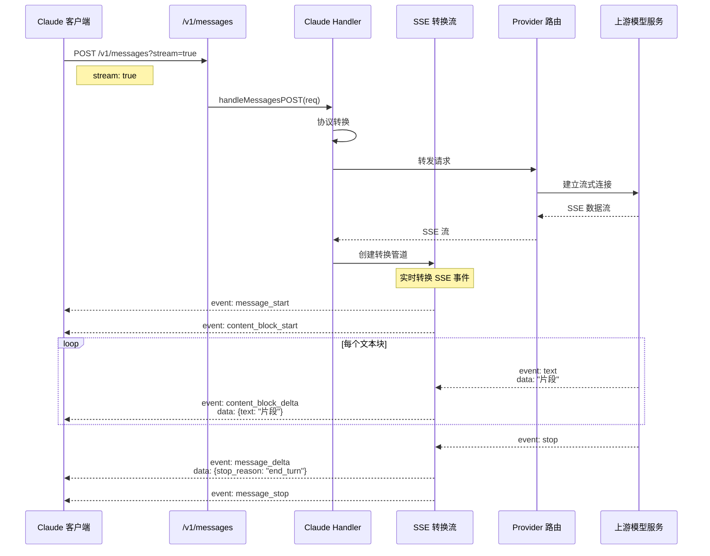
```mermaid
sequenceDiagram
    participant Client as Claude 客户端
    participant Route as /v1/messages
    participant Handler as Claude Handler
    participant Transform as SSE 转换流
    participant Provider as Provider 路由
    participant Upstream as 上游模型服务

    Client->>Route: POST /v1/messages?stream=true
    Note right of Client: stream: true
    
    Route->>Handler: handleMessagesPOST(req)
    Handler->>Handler: 协议转换
    Handler->>Provider: 转发请求
    
    Provider->>Upstream: 建立流式连接
    Upstream-->>Provider: SSE 数据流
    
    Provider-->>Handler: SSE 流
    Handler->>Transform: 创建转换管道
    
    Note over Transform: 实时转换 SSE 事件
    
    Transform-->>Client: event: message_start
    Transform-->>Client: event: content_block_start
    
    loop 每个文本块
        Upstream-->>Transform: event: text<br/>data: "片段"
        Transform-->>Client: event: content_block_delta<br/>data: {text: "片段"}
    end
    
    Upstream-->>Transform: event: stop
    Transform-->>Client: event: message_delta<br/>data: {stop_reason: "end_turn"}
    Transform-->>Client: event: message_stop
```

## 4. 协议映射

### 4.1 请求字段映射

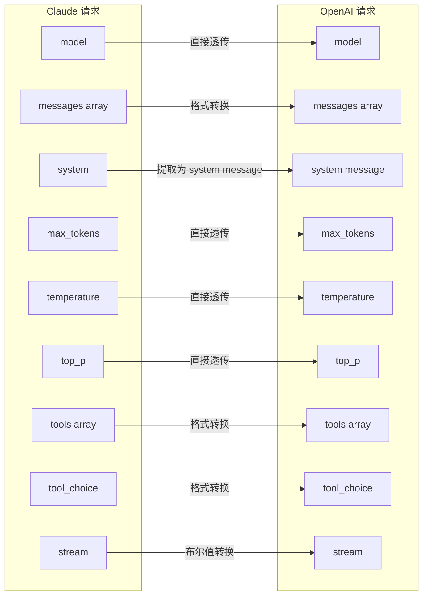
```mermaid
graph LR
    subgraph "Claude 请求"
        C1[model]
        C2[messages array]
        C3[system]
        C4[max_tokens]
        C5[temperature]
        C6[top_p]
        C7[tools array]
        C8[tool_choice]
        C9[stream]
    end

    subgraph "OpenAI 请求"
        O1[model]
        O2[messages array]
        O3[system message]
        O4[max_tokens]
        O5[temperature]
        O6[top_p]
        O7[tools array]
        O8[tool_choice]
        O9[stream]
    end

    C1 -->|直接透传| O1
    C2 -->|格式转换| O2
    C3 -->|提取为 system message| O3
    C4 -->|直接透传| O4
    C5 -->|直接透传| O5
    C6 -->|直接透传| O6
    C7 -->|格式转换| O7
    C8 -->|格式转换| O8
    C9 -->|布尔值转换| O9
```

### 4.2 消息格式转换

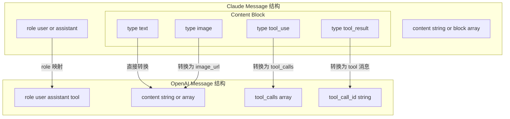
```mermaid
graph TB
    subgraph "Claude Message 结构"
        CM1[role user or assistant]
        CM2[content string or block array]
        
        subgraph "Content Block"
            CB1[type text]
            CB2[type tool_use]
            CB3[type tool_result]
            CB4[type image]
        end
    end

    subgraph "OpenAI Message 结构"
        OM1[role user assistant tool]
        OM2[content string or array]
        OM3[tool_calls array]
        OM4[tool_call_id string]
    end

    CM1 -->|role 映射| OM1
    CB1 -->|直接转换| OM2
    CB2 -->|转换为 tool_calls| OM3
    CB3 -->|转换为 tool 消息| OM4
    CB4 -->|转换为 image_url| OM2
```

### 4.3 响应字段映射

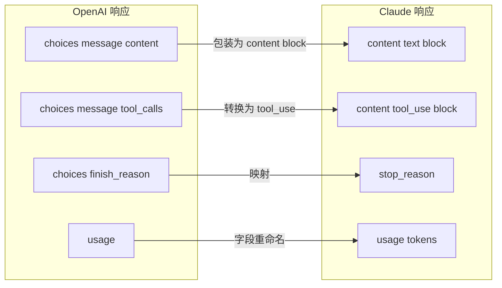
```mermaid
graph LR
    subgraph "OpenAI 响应"
        R1[choices message content]
        R2[choices message tool_calls]
        R3[choices finish_reason]
        R4[usage]
    end

    subgraph "Claude 响应"
        C1[content text block]
        C2[content tool_use block]
        C3[stop_reason]
        C4[usage tokens]
    end

    R1 -->|包装为 content block| C1
    R2 -->|转换为 tool_use| C2
    R3 -->|映射| C3
    R4 -->|字段重命名| C4
```

## 5. 关键组件设计

### 5.1 请求转换器

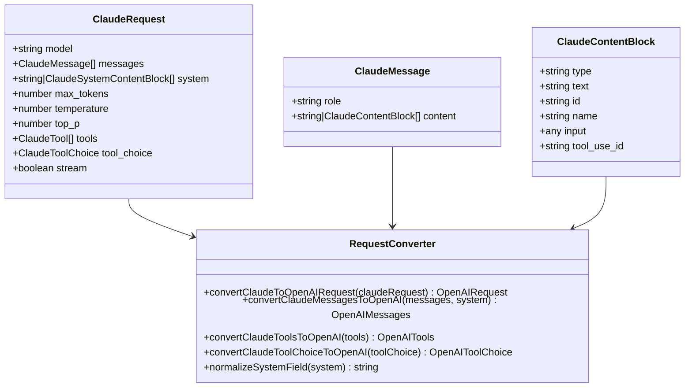
```mermaid
classDiagram
    class ClaudeRequest {
        +string model
        +ClaudeMessage[] messages
        +string|ClaudeSystemContentBlock[] system
        +number max_tokens
        +number temperature
        +number top_p
        +ClaudeTool[] tools
        +ClaudeToolChoice tool_choice
        +boolean stream
    }

    class ClaudeMessage {
        +string role
        +string|ClaudeContentBlock[] content
    }

    class ClaudeContentBlock {
        +string type
        +string text
        +string id
        +string name
        +any input
        +string tool_use_id
    }

    class RequestConverter {
        +convertClaudeToOpenAIRequest(claudeRequest) OpenAIRequest
        +convertClaudeMessagesToOpenAI(messages, system) OpenAIMessages
        +convertClaudeToolsToOpenAI(tools) OpenAITools
        +convertClaudeToolChoiceToOpenAI(toolChoice) OpenAIToolChoice
        +normalizeSystemField(system) string
    }

    ClaudeRequest --> RequestConverter
    ClaudeMessage --> RequestConverter
    ClaudeContentBlock --> RequestConverter
```

### 5.2 响应转换器

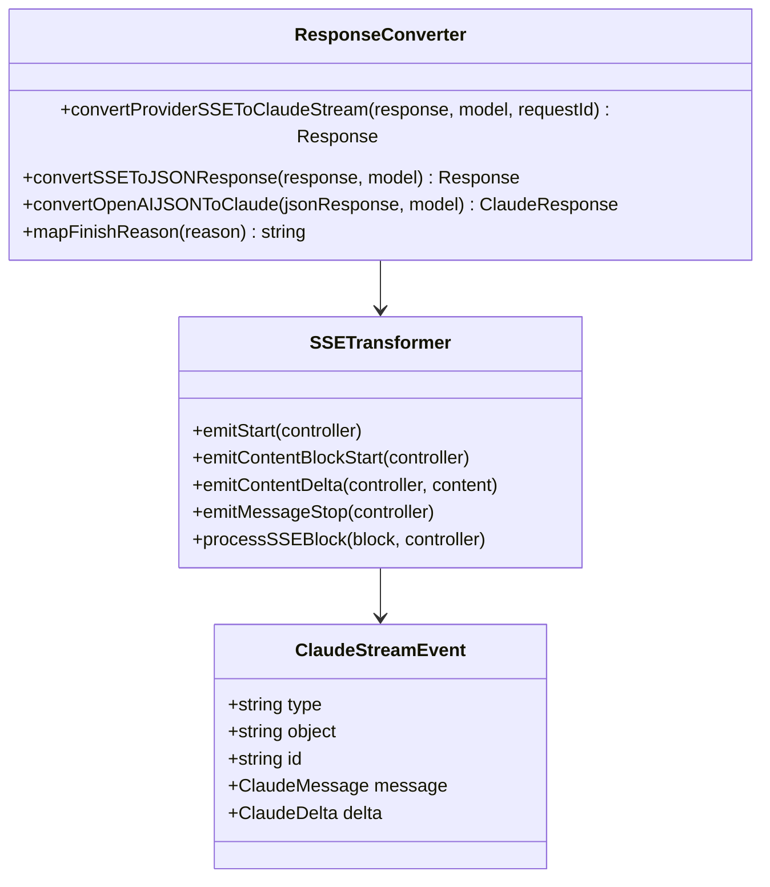
```mermaid
classDiagram
    class ResponseConverter {
        +convertProviderSSEToClaudeStream(response, model, requestId) Response
        +convertSSEToJSONResponse(response, model) Response
        +convertOpenAIJSONToClaude(jsonResponse, model) ClaudeResponse
        +mapFinishReason(reason) string
    }

    class SSETransformer {
        +emitStart(controller)
        +emitContentBlockStart(controller)
        +emitContentDelta(controller, content)
        +emitMessageStop(controller)
        +processSSEBlock(block, controller)
    }

    class ClaudeStreamEvent {
        +string type
        +string object
        +string id
        +ClaudeMessage message
        +ClaudeDelta delta
    }

    ResponseConverter --> SSETransformer
    SSETransformer --> ClaudeStreamEvent
```

### 5.3 错误处理

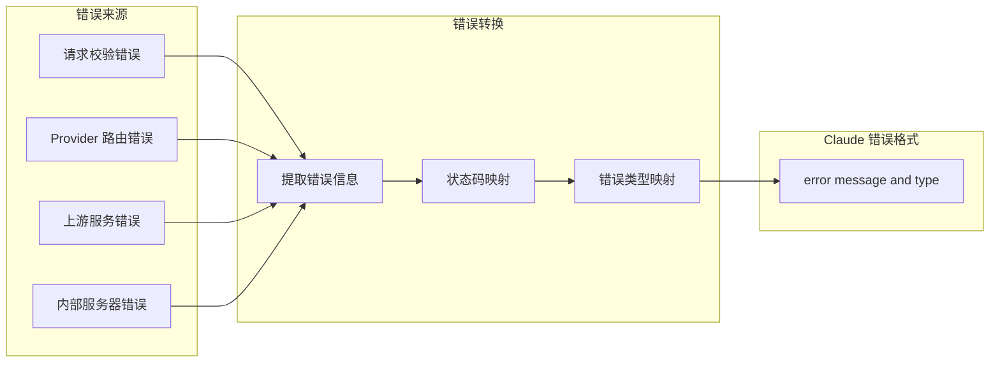
```mermaid
flowchart LR
    subgraph "错误来源"
        E1[请求校验错误]
        E2[Provider 路由错误]
        E3[上游服务错误]
        E4[内部服务器错误]
    end

    subgraph "错误转换"
        T1[提取错误信息]
        T2[状态码映射]
        T3[错误类型映射]
    end

    subgraph "Claude 错误格式"
        C1[error message and type]
    end

    E1 --> T1
    E2 --> T1
    E3 --> T1
    E4 --> T1
    
    T1 --> T2
    T2 --> T3
    T3 --> C1
```

## 6. 认证流程

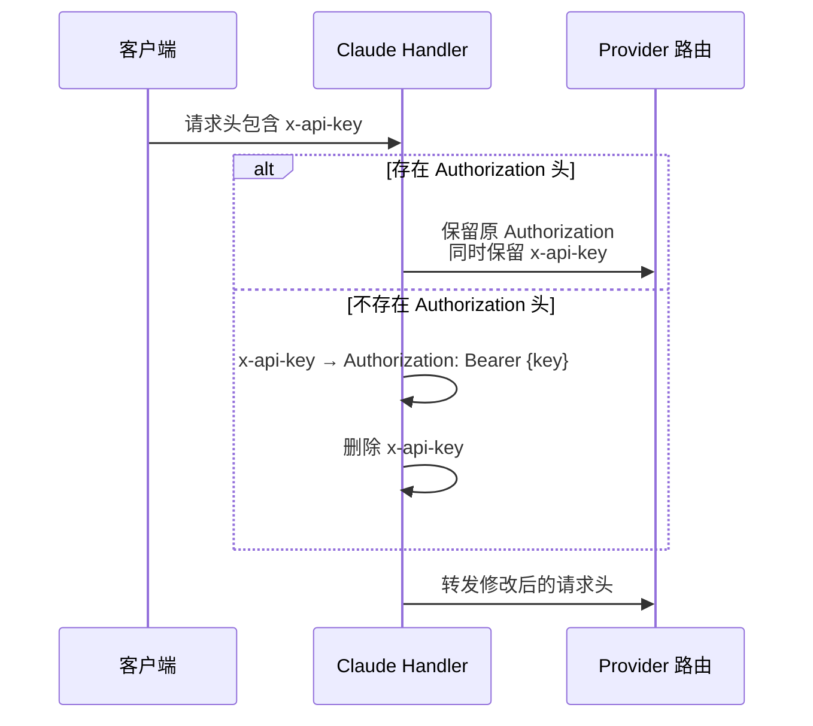
```mermaid
sequenceDiagram
    participant Client as 客户端
    participant Handler as Claude Handler
    participant Provider as Provider 路由

    Client->>Handler: 请求头包含 x-api-key
    
    alt 存在 Authorization 头
        Handler->>Provider: 保留原 Authorization<br/>同时保留 x-api-key
    else 不存在 Authorization 头
        Handler->>Handler: x-api-key → Authorization: Bearer {key}
        Handler->>Handler: 删除 x-api-key
    end
    
    Handler->>Provider: 转发修改后的请求头
```

## 7. 模型别名映射

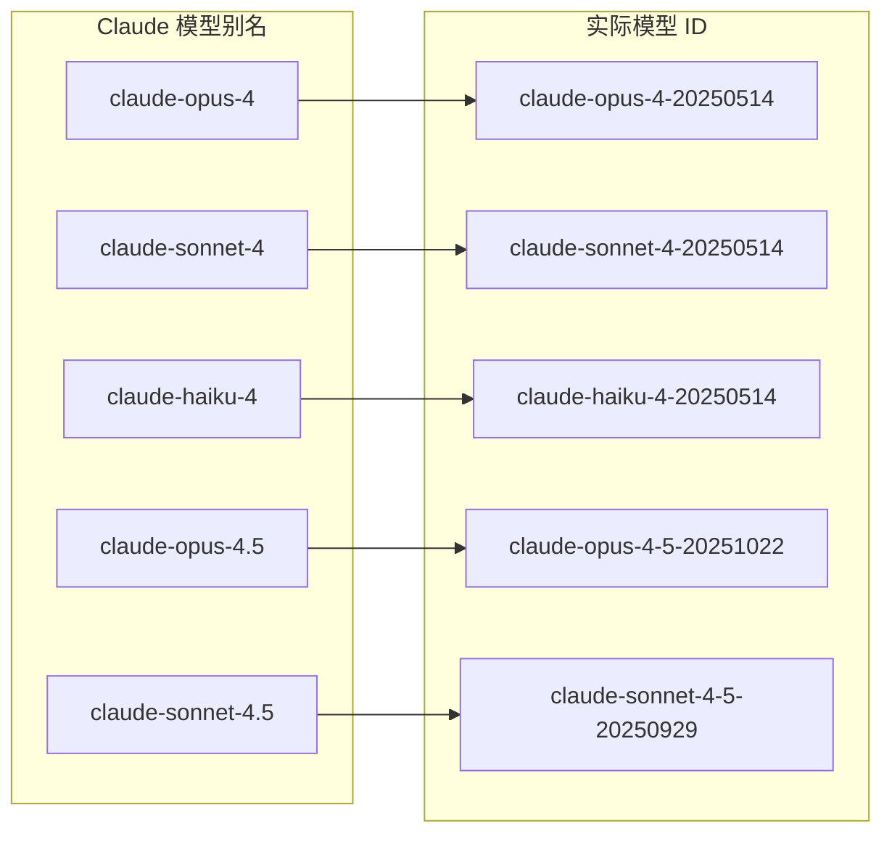
```mermaid
graph LR
    subgraph "Claude 模型别名"
        A1[claude-opus-4]
        A2[claude-sonnet-4]
        A3[claude-haiku-4]
        A4[claude-opus-4.5]
        A5[claude-sonnet-4.5]
    end

    subgraph "实际模型 ID"
        M1[claude-opus-4-20250514]
        M2[claude-sonnet-4-20250514]
        M3[claude-haiku-4-20250514]
        M4[claude-opus-4-5-20251022]
        M5[claude-sonnet-4-5-20250929]
    end

    A1 --> M1
    A2 --> M2
    A3 --> M3
    A4 --> M4
    A5 --> M5
```

## 8. 流式响应状态机

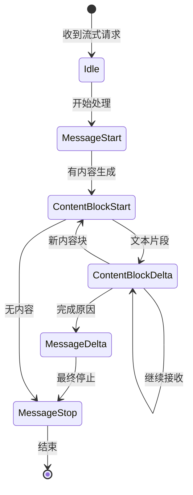
```mermaid
stateDiagram-v2
    [*] --> Idle: 收到流式请求
    Idle --> MessageStart: 开始处理
    
    MessageStart --> ContentBlockStart: 有内容生成
    ContentBlockStart --> ContentBlockDelta: 文本片段
    
    ContentBlockDelta --> ContentBlockDelta: 继续接收
    ContentBlockDelta --> ContentBlockStart: 新内容块
    ContentBlockDelta --> MessageDelta: 完成原因
    
    MessageDelta --> MessageStop: 最终停止
    ContentBlockStart --> MessageStop: 无内容
    
    MessageStop --> [*]: 结束
```

## 9. 部署架构

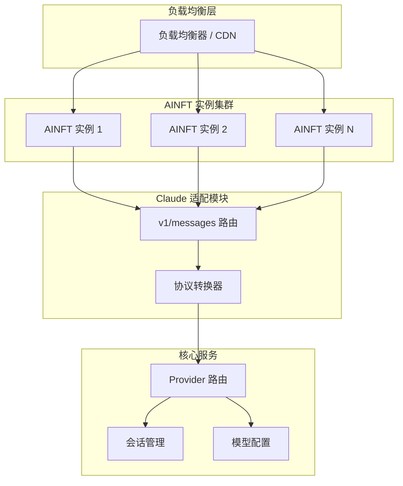
```mermaid
graph TB
    subgraph "负载均衡层"
        LB[负载均衡器 / CDN]
    end

    subgraph "AINFT 实例集群"
        I1[AINFT 实例 1]
        I2[AINFT 实例 2]
        I3[AINFT 实例 N]
    end

    subgraph "Claude 适配模块"
        C1[v1/messages 路由]
        C2[协议转换器]
    end

    subgraph "核心服务"
        S1[Provider 路由]
        S2[会话管理]
        S3[模型配置]
    end

    LB --> I1
    LB --> I2
    LB --> I3

    I1 --> C1
    I2 --> C1
    I3 --> C1

    C1 --> C2
    C2 --> S1
    S1 --> S2
    S1 --> S3
```

## 10. 测试策略

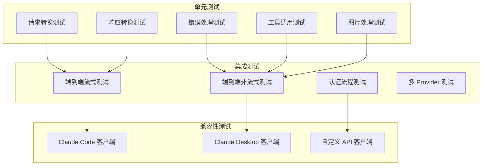
```mermaid
graph TB
    subgraph "单元测试"
        U1[请求转换测试]
        U2[响应转换测试]
        U3[错误处理测试]
        U4[工具调用测试]
        U5[图片处理测试]
    end

    subgraph "集成测试"
        I1[端到端流式测试]
        I2[端到端非流式测试]
        I3[认证流程测试]
        I4[多 Provider 测试]
    end

    subgraph "兼容性测试"
        C1[Claude Code 客户端]
        C2[Claude Desktop 客户端]
        C3[自定义 API 客户端]
    end

    U1 --> I1
    U2 --> I1
    U3 --> I2
    U4 --> I2
    U5 --> I2
    
    I1 --> C1
    I2 --> C2
    I3 --> C3
```

## 11. 注意事项

### 11.1 协议差异处理

| Claude 协议特性 | 处理方式 |
|---------------|---------|
| system 作为独立字段 | 转换为 OpenAI 的 system message |
| content block 数组 | 根据类型分别转换 |
| tool_use / tool_result | 映射为 tool_calls / tool 消息 |
| stop_reason 枚举值 | 建立映射表转换 |
| x-api-key 认证 | 转换为 Authorization: Bearer |

### 11.2 边界情况

1. **空消息处理**: 校验并返回 400 错误
2. **无效 stream 参数**: 支持布尔值、字符串、数字，无效值返回 400
3. **上游 500 错误**: 脱敏处理后返回通用错误信息
4. **SSE 解析失败**: 优雅降级，保持连接
5. **模型别名未找到**: 透传原始模型名，由 Provider 路由处理

## 12. 扩展性设计

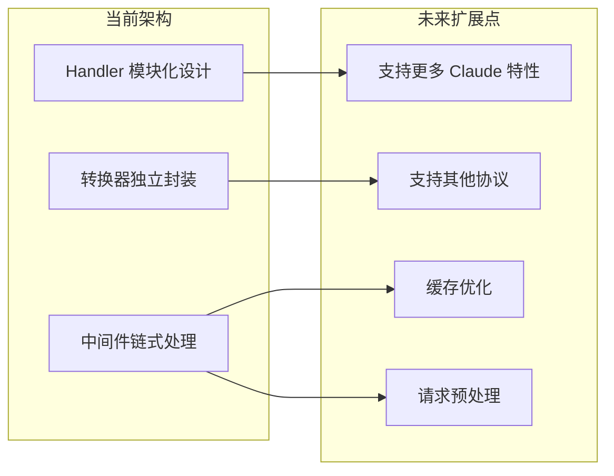
```mermaid
graph LR
    subgraph "未来扩展点"
        E1[支持更多 Claude 特性]
        E2[支持其他协议]
        E3[缓存优化]
        E4[请求预处理]
    end

    subgraph "当前架构"
        C1[Handler 模块化设计]
        C2[转换器独立封装]
        C3[中间件链式处理]
    end

    C1 --> E1
    C2 --> E2
    C3 --> E3
    C3 --> E4
```

---

*文档版本: 1.0*  
*最后更新: 2025-03*
