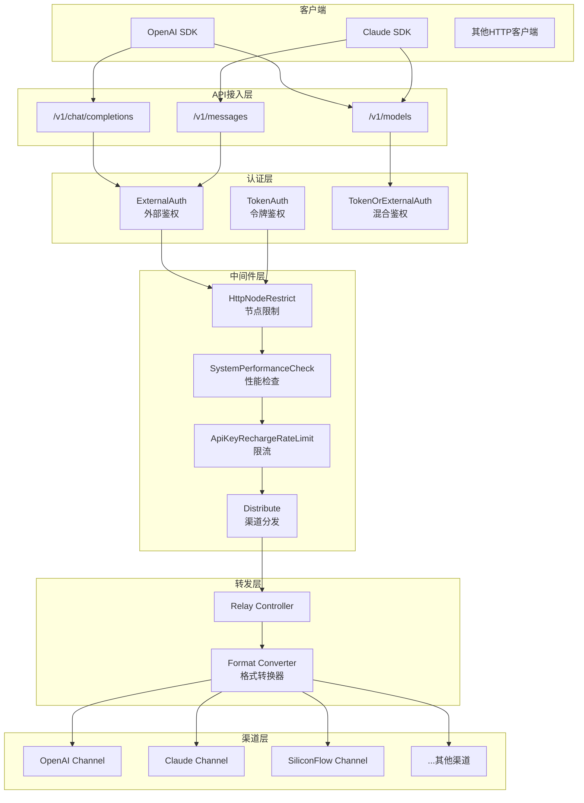
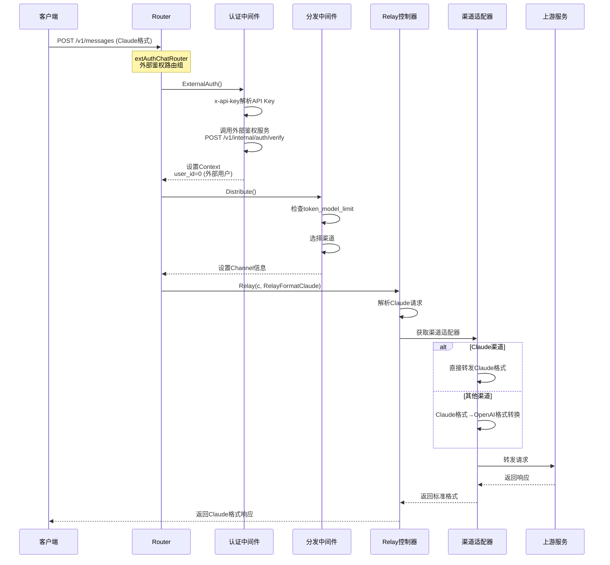
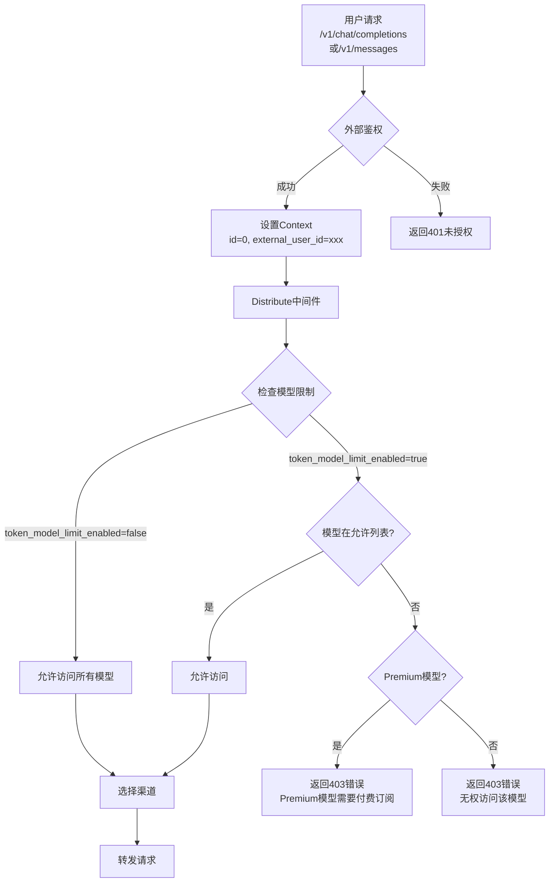
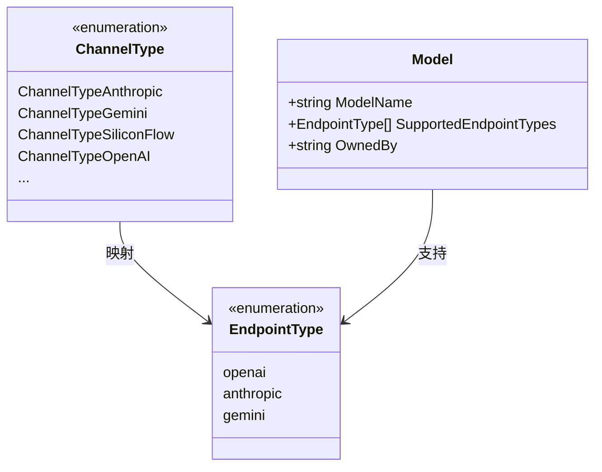
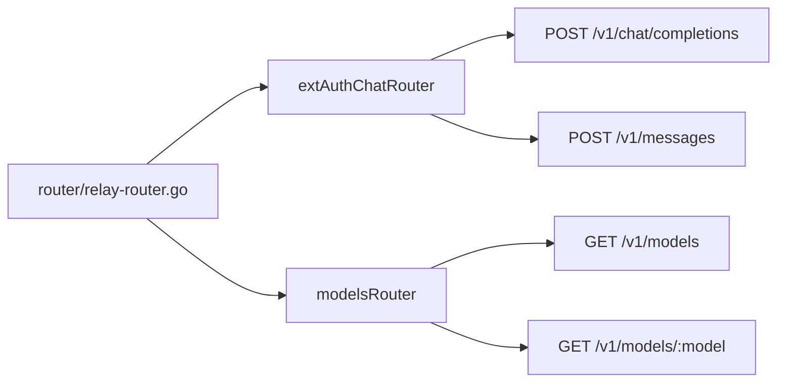
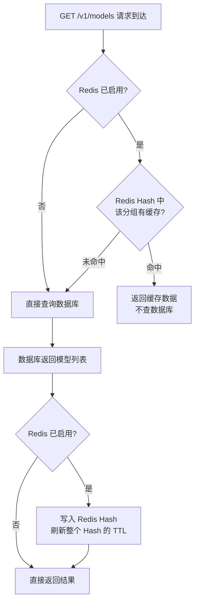

# AINFT API 多格式接入技术方案

## 1. 需求概述

### 1.1 背景

当前AINFT API已支持 `/v1/chat/completions` (OpenAI格式) 和 `/v1/messages` (Claude格式)
的模型调用，但在未付费用户访问控制、模型元数据准确性等方面需要完善。

### 1.2 新需求

| 序号 | 需求                                   | 
|----|--------------------------------------|
| 1  | 未付费用户调用Premium模型时给出合适的报错信息           | 
| 2  | `supported_endpoint_types` 字段根据供应商调整 |
| 3  | `models`接口中 `owned_by` 字段改成正确的provider | 

---

## 2. 系统架构

### 2.1 整体架构图



### 2.2 请求处理流程



---

## 3. 需求详细设计

### 3.1 需求1：未付费用户Premium模型访问控制

#### 3.1.1 业务流程



#### 3.1.2 关键逻辑

| 检查点         | 位置                            | 处理方式                   |
|-------------|-------------------------------|------------------------|
| 外部用户识别      | `middleware/external_auth.go` | `id=0` 表示外部鉴权用户        |
| 模型限制检查      | `middleware/distributor.go`   | 检查 `token_model_limit` |
| Premium模型判断 | 需新增配置                         | 根据模型标签或供应商判断           |
| 错误返回        | `middleware/distributor.go`   | 返回OpenAI格式错误响应         |

#### 3.1.3 错误响应格式

```json
{
  "error": {
    "message": "Access restricted. Deposit required to unlock premium models. ",
    "type": "api_error",
    "code": "access_denied"
  }
}
```

---

### 3.2 需求2：supported_endpoint_types字段调整

#### 3.2.1 当前端点类型定义



#### 3.2.2 端点类型映射关系

| 渠道类型        | 上游原生格式 | 支持的EndpointTypes  | 说明 |
|-------------|-----------|-------------------|------|
| Anthropic   | Anthropic原生格式 | openai, anthropic | 原生支持Claude格式，平台同时提供OpenAI格式转换 |
| Gemini      | Gemini原生格式 | openai, anthropic | 原生支持Gemini格式，平台同时提供OpenAI/Claude格式转换 |
| SiliconFlow | OpenAI兼容格式 | openai, anthropic | **原生仅支持OpenAI格式**，通过平台格式转换层支持Claude格式接入 |
| OpenAI      | OpenAI原生格式 | openai, anthropic | 原生支持OpenAI格式，平台同时提供Claude格式转换 |
| Qwen        | OpenAI兼容格式 | openai, anthropic | **原生仅支持OpenAI格式**（DashScope兼容模式），通过平台格式转换层支持Claude格式接入 |
| OpenRouter  | OpenAI + Anthropic双格式 | openai, anthropic | **原生同时支持OpenAI和Anthropic两种格式**，平台直接对接两种端点，无需额外转换 |

> **关于SiliconFlow的说明**：根据调研，硅基流动API完全兼容OpenAI规范（`https://api.siliconflow.cn/v1`），不直接提供原生Claude格式。平台通过`Format Converter`组件将Claude格式请求转换为OpenAI格式后转发给硅基流动，再将响应转换回Claude格式返回。因此`supported_endpoint_types`包含`anthropic`是合理的，体现了平台的统一接入能力。即使SiliconFlow提供了Gemini模型，事实上我们拿到的接口也是OpenAI格式的。

> **关于Qwen（通义千问/DashScope）的说明**：DashScope提供两类接口——自有DashScope私有格式（`POST /api/v1/services/aigc/text-generation/generation`）和OpenAI兼容模式（`https://dashscope-intl.aliyuncs.com/compatible-mode/v1/chat/completions`）。平台对接时使用OpenAI兼容模式。因此，Claude格式的请求由平台`Format Converter`先转为OpenAI格式再转发，`supported_endpoint_types`包含`anthropic`是平台转换能力的体现，与SiliconFlow的处理逻辑完全一致。

> **关于OpenRouter的说明**：OpenRouter是一个真正的多格式网关，同时原生支持两种接口格式：OpenAI格式（`https://openrouter.ai/api/v1/chat/completions`，主要入口）和Anthropic Messages格式（`https://openrouter.ai/api/v1/messages`，官方文档明确支持，可直接使用Anthropic SDK对接）。OpenRouter内部负责将请求路由到各上游供应商（Anthropic、Google等），对外统一暴露这两种标准格式。因此，`supported_endpoint_types`包含`openai`和`anthropic`，两者均为**上游原生支持**，无需平台额外做格式转换。

> **关于OpenRouter提供Gemini模型时端点映射是否仍然正确的论证**：`supported_endpoint_types`描述的是**平台与OpenRouter之间的接口格式**，而非OpenRouter背后承载的模型类型。即使OpenRouter提供了`google/gemini-2.0-flash`等Gemini模型，我们与OpenRouter通信时使用的依然是OpenAI格式或Anthropic格式——OpenRouter自身负责在内部将请求转换为Gemini原生格式再转发给Google，这个过程对平台完全透明。换言之，**Gemini-native格式被封装在OpenRouter抽象层之后，平台无需感知**。这与直连Google Gemini API的情况截然不同：直连时需要适配Gemini私有格式，因而会有独立的`gemini`端点类型；而经由OpenRouter转发时，始终是OpenAI或Anthropic接口，`supported_endpoint_types = [openai, anthropic]`依然正确。

---

### 3.3 需求3：owned_by字段修正
owned_by 字段读取数据库配置表
配置表是根据
https://docs.google.com/spreadsheets/d/1hVHBRAZhbv6ozB1ee45zU9lp_Ybj3EdlGOISWWKeWEM/edit?gid=1833547878#gid=1833547878
配置的

测试服会多出qwen 和 openrouter 是测试用的

---

## 4. 关键代码位置

### 4.1 路由配置



### 4.2 核心文件

| 功能        | 文件路径                               |
|-----------|------------------------------------|
| 外部鉴权      | `middleware/external_auth.go`      |
| 渠道分发      | `middleware/distributor.go`        |
| 节点限制      | `middleware/http_node_restrict.go` |
| 模型列表      | `controller/model.go`              |
| 定价/供应商    | `model/pricing.go`                 |
| 供应商映射     | `model/pricing_default.go`         |
| 端点类型      | `common/endpoint_type.go`          |
| Claude适配器 | `relay/channel/claude/adaptor.go`  |
| OpenAI适配器 | `relay/channel/openai/adaptor.go`  |

---

## 5. 接口变更

### 5.1 /v1/models 响应格式

```json
{
  "success": true,
  "data": [
    {
      "id": "claude-opus-4-6",
      "object": "model",
      "created": 1626777600,
      "owned_by": "anthropic",
      "supported_endpoint_types": ["anthropic", "openai"]
    },
    {
      "id": "chatgpt-5-2",
      "object": "model",
      "created": 1626777600,
      "owned_by": "openai",
      "supported_endpoint_types": ["anthropic", "openai"]
    },
    {
      "id": "minimax-m2-5",
      "object": "model",
      "created": 1626777600,
      "owned_by": "siliconflow",
      "supported_endpoint_types": ["anthropic", "openai"]
    }
  ],
  "object": "list"
}
```

---

## 6. /v1/models 模型列表缓存方案

### 6.1 背景

`/v1/models` 接口每次请求都需要查询数据库的 `abilities` 表，获取当前用户所在分组下已启用的模型列表。用户量较大时，该查询会对数据库造成持续压力。为此引入 Redis 缓存层，减少数据库访问频率。

### 6.2 缓存存储位置

所有分组的模型列表统一存储在 Redis 的**一个 Hash 结构**中：

- **Key**：`models:groups`（若配置了 `REDIS_KEY_PREFIX`，则为 `{prefix}models:groups`）
- **结构**：Hash，每个分组名作为一个 field，对应的模型列表（JSON 数组）作为 value

例如，系统中有 `default`、`vip`、`pro` 三个分组，则 Redis 中的数据形如：

| Hash Key | Field | Value（示意） |
|---|---|---|
| `models:groups` | `default` | `["gpt-4o","claude-3-5-sonnet",...]` |
| `models:groups` | `vip` | `["gpt-4o","claude-opus-4-6",...]` |
| `models:groups` | `pro` | `["gpt-4o","claude-opus-4-6","o3",...]` |

选用 Hash 结构而非每个分组独立一个 Key，好处是：失效全部缓存时只需删除一个 Key（O(1)），而非遍历扫描所有匹配 Key（O(keyspace)）。

### 6.3 缓存有效期

由环境变量 `SYNC_FREQUENCY` 控制，单位为秒，**默认 60 秒**。

- 该有效期为**兜底机制**，在正常流程中缓存会随管理员操作即时失效（见 6.4 节），通常不会等到 TTL 过期才更新。
- 如需调整，修改环境变量 `SYNC_FREQUENCY` 即可，同时影响用户/Token 等其他缓存的同步频率。

### 6.4 缓存何时被即时清除

管理员在后台对渠道（Channel）或能力（Ability）进行以下操作时，会**立即清除**对应的 Redis 缓存，无需等待 TTL 过期：

| 管理员操作 | 清除范围 |
|---|---|
| 新增渠道 | 清除该渠道所属分组的缓存 |
| 删除渠道 | 清除该渠道所属分组的缓存 |
| 修改渠道（模型/分组/状态等） | 清除该渠道所属分组的缓存 |
| 启用 / 禁用渠道 | 清除**全部分组**的缓存（因无法定位具体分组）|
| 按 Tag 批量启用 / 禁用渠道 | 清除**全部分组**的缓存（因无法定位具体分组）|
| 执行「修复能力表」操作 | 清除**全部分组**的缓存 |

> 新增、删除、修改渠道时可精确知道影响哪些分组，因此只清除对应分组的缓存；按渠道 ID 或 Tag 变更启用状态时，无法在不额外查库的情况下确定影响哪些分组，统一清除全部分组缓存。

### 6.5 缓存命中流程



### 6.6 Redis 不可用时的降级策略

若 Redis 未配置（未设置 `REDIS_CONN_STRING`）或连接不可用，所有缓存逻辑自动跳过，接口行为与引入缓存前完全一致，直接查询数据库返回结果，不影响正常服务。

---

## 7. 测试要点

### 7.1 功能测试

| 测试项      | 测试场景                                  | 预期结果    |
|----------|---------------------------------------|---------|
| Claude接口 | 使用x-api-key访问/v1/messages             | 正常返回    |
| OpenAI接口 | 使用Authorization访问/v1/chat/completions | 正常返回    |
| 未付费用户    | 访问Premium模型                           | 返回错误    |
| 已付费用户    | 访问Premium模型                           | 正常返回    |
| 模型列表     | 检查owned_by字段                          | 与llm.csv一致 |
| 模型列表     | 检查supported_endpoint_types            | 与渠道类型匹配 |

### 7.2 兼容性测试

- Claude 兼容性
- OpenAI 兼容性

### 7.3 /v1/models 压力测试

#### 测试目标

验证引入 Redis 缓存后，`/v1/models` 接口在高并发场景下的性能提升效果，以及缓存失效后的恢复表现。

#### 关注指标

| 指标 | 说明      |
|---|---------|
| QPS | 每秒处理请求数 |
| 平均响应时间 | 应该有明显提升 |


