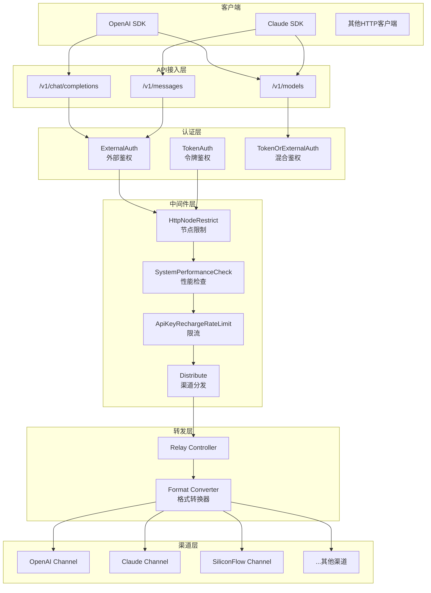
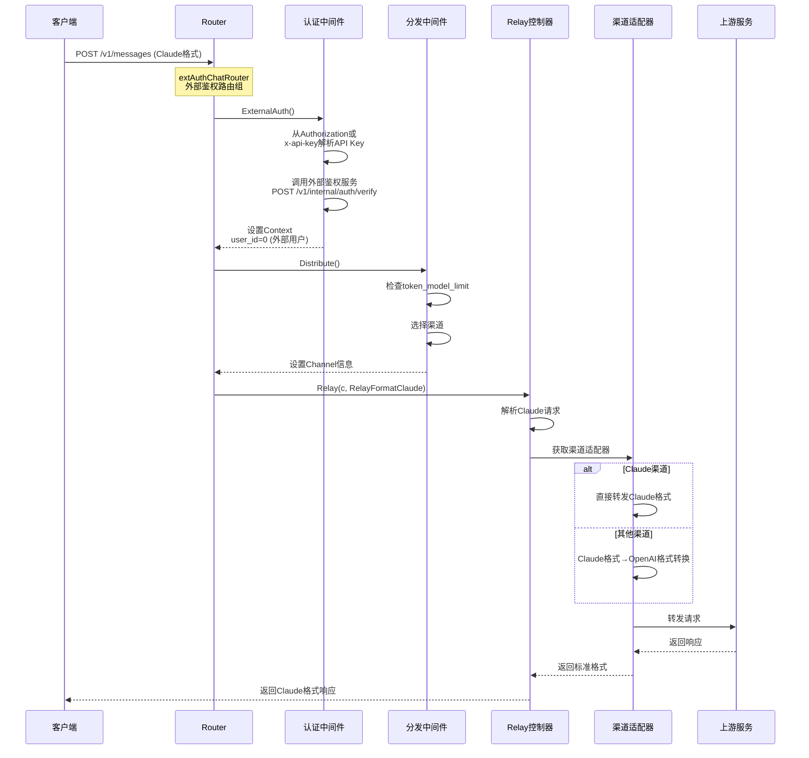
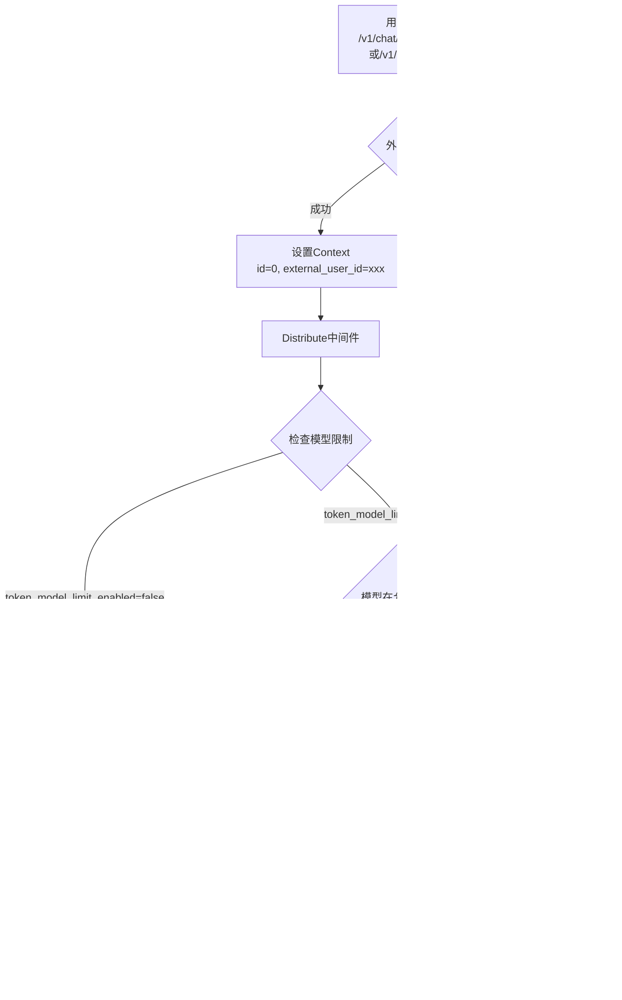
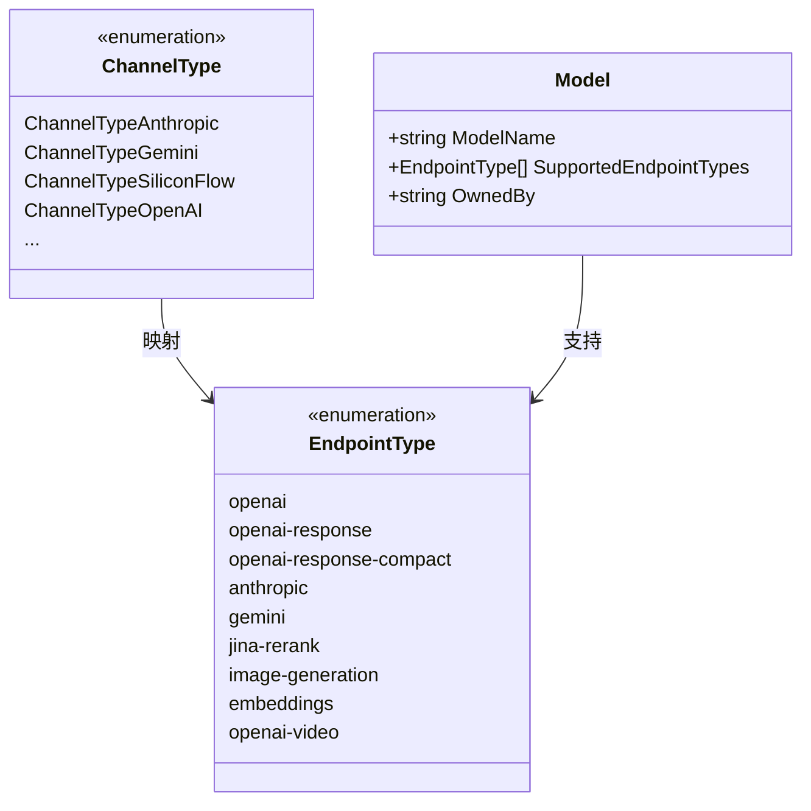
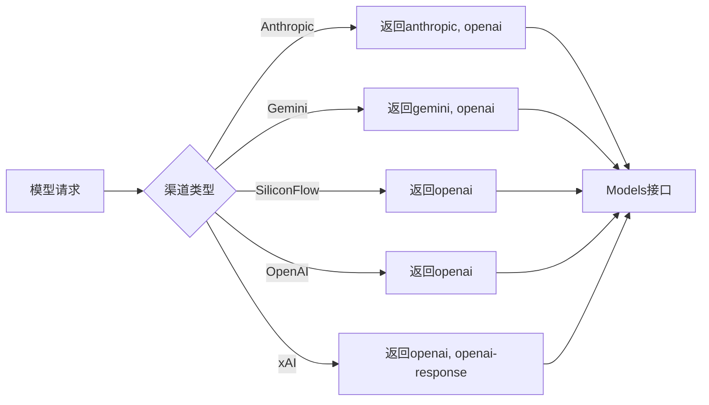
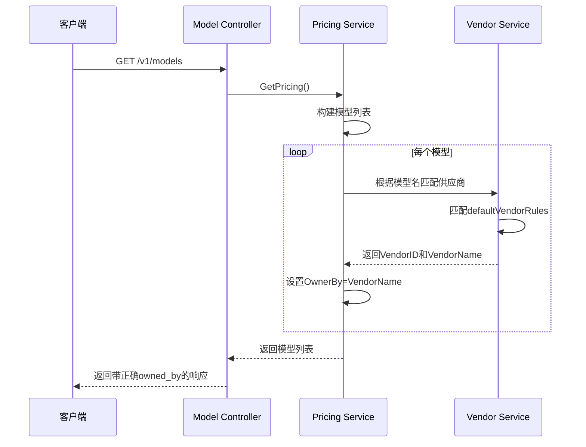
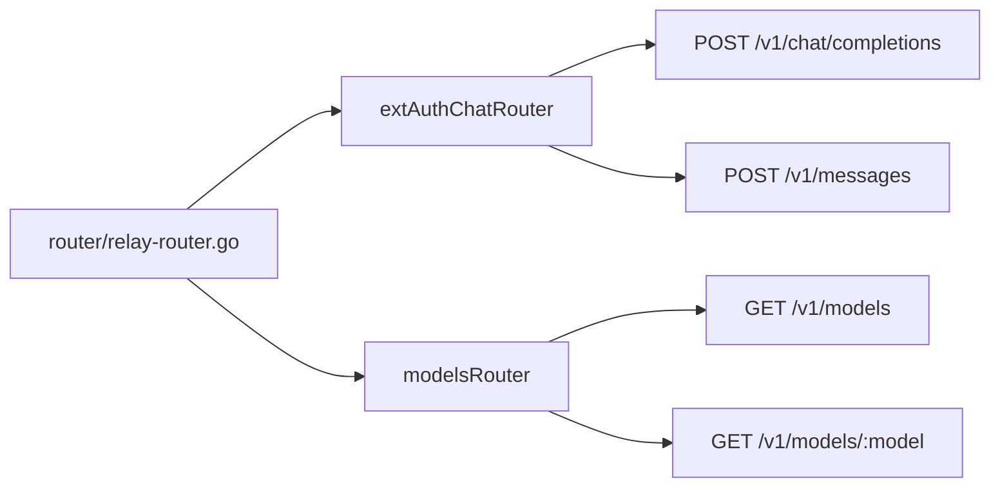

# AINFT API 多格式接入技术方案

## 1. 需求概述

### 1.1 背景
当前AINFT API已支持 `/v1/chat/completions` (OpenAI格式) 和 `/v1/messages` (Claude格式) 的模型调用，但在未付费用户访问控制、模型元数据准确性等方面需要完善。

### 1.2 新需求

| 序号 | 需求 | 优先级 |
|------|------|--------|
| 1 | 未付费用户调用Premium模型时给出合适的报错信息 | 高 |
| 2 | `supported_endpoint_types` 字段根据测试结果调整 | 中 |
| 3 | `models`接口中 `owned_by` 字段改成正确的provider | 中 |

---

## 2. 系统架构

### 2.1 整体架构图



### 2.2 请求处理流程



---

## 3. 需求详细设计

### 3.1 需求1：未付费用户Premium模型访问控制

#### 3.1.1 业务流程



#### 3.1.2 关键逻辑

| 检查点 | 位置 | 处理方式 |
|--------|------|----------|
| 外部用户识别 | `middleware/external_auth.go` | `id=0` 表示外部鉴权用户 |
| 模型限制检查 | `middleware/distributor.go` | 检查 `token_model_limit` |
| Premium模型判断 | 需新增配置 | 根据模型标签或供应商判断 |
| 错误返回 | `middleware/distributor.go` | 返回OpenAI格式错误响应 |

#### 3.1.3 错误响应格式

```json
{
  "error": {
    "message": "Premium模型需要付费订阅，请联系管理员升级账户",
    "type": "insufficient_quota",
    "param": "model",
    "code": "premium_model_forbidden"
  }
}
```

---

### 3.2 需求2：supported_endpoint_types字段调整

#### 3.2.1 当前端点类型定义



#### 3.2.2 端点类型映射关系

| 渠道类型 | 支持的EndpointTypes | 优先级 |
|----------|---------------------|--------|
| Anthropic | anthropic, openai | anthropic优先 |
| Gemini | gemini, openai | gemini优先 |
| SiliconFlow | openai | - |
| OpenAI | openai | - |
| xAI | openai, openai-response | openai优先 |
| Sora | openai-video | - |
| Jina | jina-rerank | - |
| 图片生成模型 | image-generation, openai | image-generation优先 |

#### 3.2.3 调整策略



---

### 3.3 需求3：owned_by字段修正

#### 3.3.1 当前问题

当前`owned_by`字段来源于`adaptor.GetChannelName()`，返回的是渠道名称（如"claude"、"siliconflow"），而非实际的模型供应商。

#### 3.3.2 供应商映射规则

根据`llm.csv`中的定义，模型与供应商的映射关系如下：

| 模型ID模式 | 供应商(owned_by) |
|------------|------------------|
| gpt-* | OpenAI |
| claude-* | Anthropic |
| gemini-* | Google |
| minimax-* | MiniMax |
| kimi-* | Moonshot |
| glm-* | 智谱/Z.ai |
| deepseek-* | DeepSeek |

#### 3.3.3 修正方案



#### 3.3.4 供应商规则配置

```yaml
# 供应商匹配规则 (model/pricing_default.go)
vendor_rules:
  gpt: OpenAI
  dall-e: OpenAI
  whisper: OpenAI
  o1: OpenAI
  o3: OpenAI
  claude: Anthropic
  gemini: Google
  moonshot: Moonshot
  kimi: Moonshot
  chatglm: 智谱
  glm-: 智谱
  qwen: 阿里巴巴
  deepseek: DeepSeek
  abab: MiniMax
  ernie: 百度
  spark: 讯飞
  hunyuan: 腾讯
  command: Cohere
  mistral: Mistral
  grok: xAI
  llama: Meta
```

---

## 4. 关键代码位置

### 4.1 路由配置



### 4.2 核心文件

| 功能 | 文件路径 |
|------|----------|
| 外部鉴权 | `middleware/external_auth.go` |
| 渠道分发 | `middleware/distributor.go` |
| 节点限制 | `middleware/http_node_restrict.go` |
| 模型列表 | `controller/model.go` |
| 定价/供应商 | `model/pricing.go` |
| 供应商映射 | `model/pricing_default.go` |
| 端点类型 | `common/endpoint_type.go` |
| Claude适配器 | `relay/channel/claude/adaptor.go` |
| OpenAI适配器 | `relay/channel/openai/adaptor.go` |

---

## 5. 接口变更

### 5.1 /v1/models 响应格式

```json
{
  "success": true,
  "data": [
    {
      "id": "claude-opus-4-6",
      "object": "model",
      "created": 1626777600,
      "owned_by": "Anthropic",
      "supported_endpoint_types": ["anthropic", "openai"]
    },
    {
      "id": "chatgpt-5-2",
      "object": "model",
      "created": 1626777600,
      "owned_by": "OpenAI",
      "supported_endpoint_types": ["openai"]
    },
    {
      "id": "minimax-m2-5",
      "object": "model",
      "created": 1626777600,
      "owned_by": "MiniMax",
      "supported_endpoint_types": ["openai"]
    }
  ],
  "object": "list"
}
```

### 5.2 错误响应格式

```json
{
  "error": {
    "message": "Premium模型需要付费订阅，请联系管理员升级账户",
    "type": "insufficient_quota",
    "param": "model",
    "code": "premium_model_forbidden"
  }
}
```

---

## 6. 测试要点

### 6.1 功能测试

| 测试项 | 测试场景 | 预期结果 |
|--------|----------|----------|
| Claude接口 | 使用x-api-key访问/v1/messages | 正常返回 |
| OpenAI接口 | 使用Authorization访问/v1/chat/completions | 正常返回 |
| 未付费用户 | 访问Premium模型 | 返回403错误 |
| 已付费用户 | 访问Premium模型 | 正常返回 |
| 模型列表 | 检查owned_by字段 | 与llm.csv一致 |
| 模型列表 | 检查supported_endpoint_types | 与渠道类型匹配 |

### 6.2 兼容性测试

- Claude SDK兼容性
- OpenAI SDK兼容性
- 第三方工具兼容性 (Cursor, Continue等)

---

## 7. 部署注意事项

1. **HTTP节点限制**: 确保`/v1/messages`已加入`HttpNodeAllowedPaths`
2. **外部鉴权**: 确保`EXTERNAL_AUTH_SERVICE_URL`环境变量已配置
3. **供应商数据**: 首次部署时自动创建供应商记录
4. **缓存刷新**: 模型元数据变更后需刷新定价缓存
