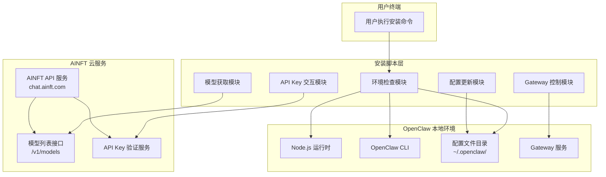
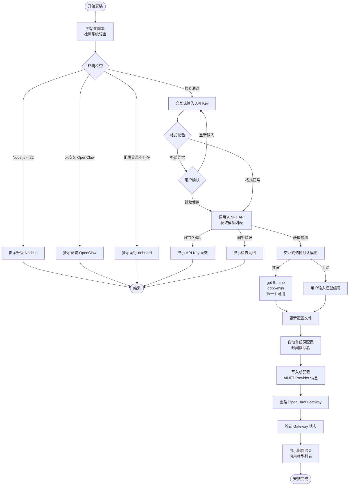
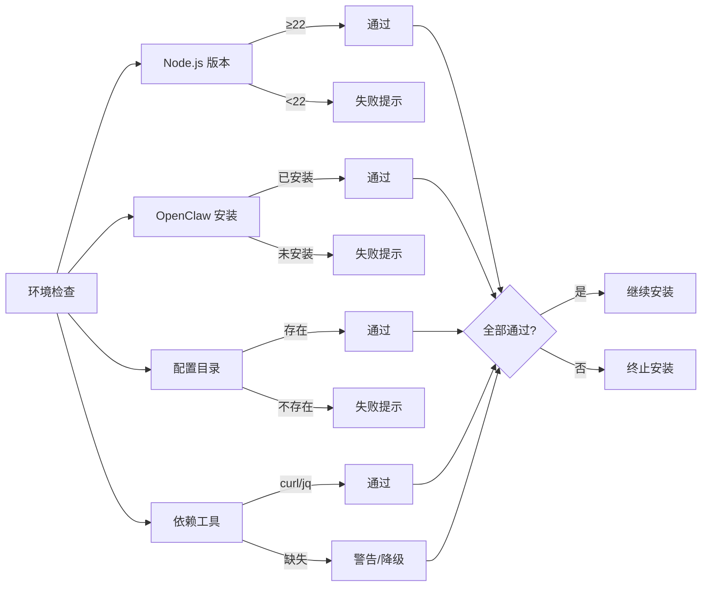
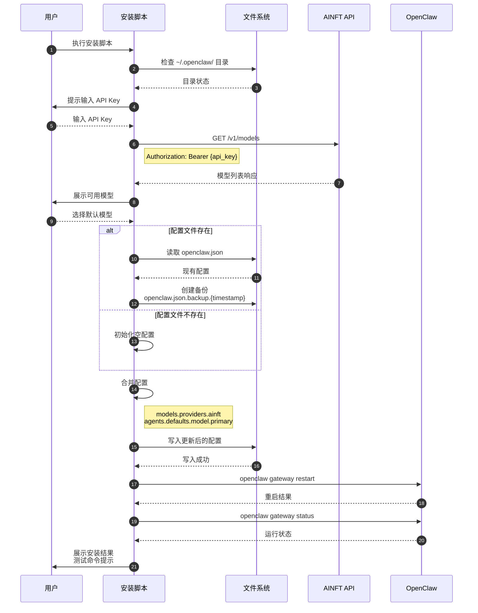
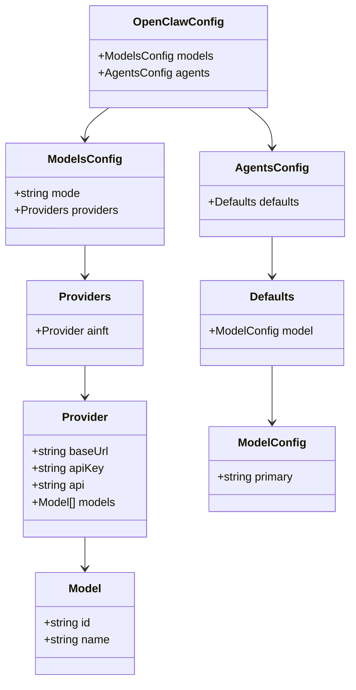
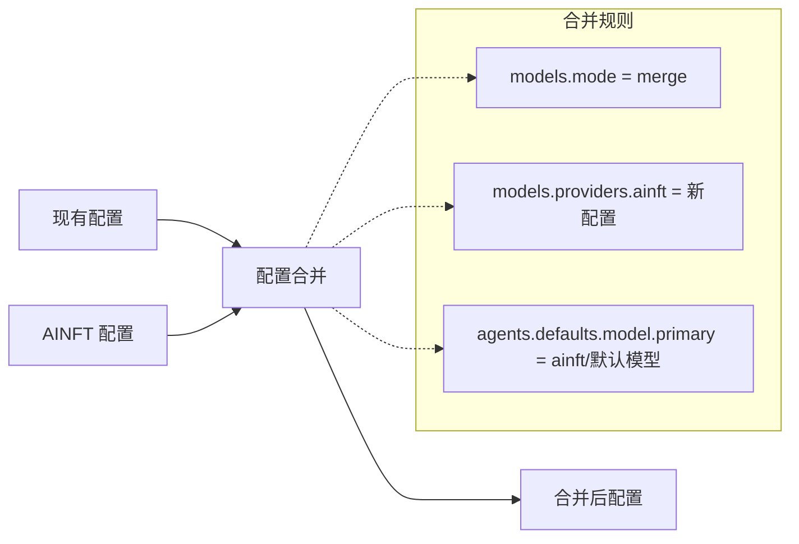
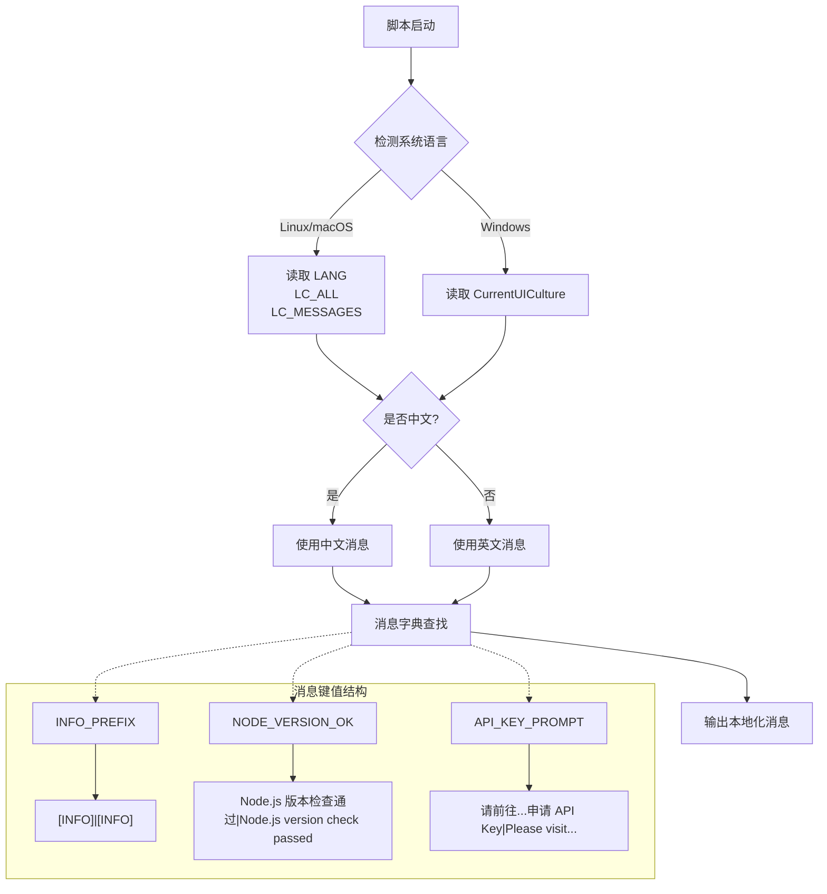
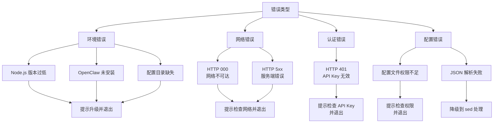
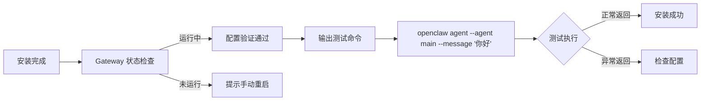
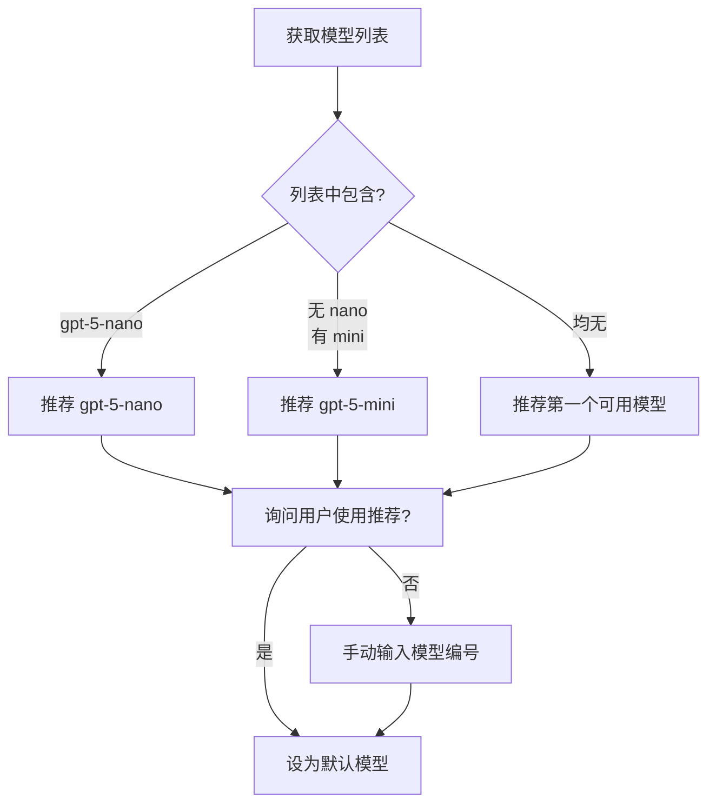

# AINFT Provider 一键安装脚本技术方案

## 1. 系统概述

### 1.1 背景
AINFT Provider 是 OpenClaw 的模型提供商之一，为用户提供便捷的 AI 模型接入能力。为降低用户配置门槛，提供跨平台一键安装脚本，自动完成从环境检查到配置生效的全流程。

### 1.2 目标平台
| 平台 | 脚本类型 | 执行方式 |
|------|----------|----------|
| Linux | Bash | `curl ... \| bash` |
| macOS | Bash | `curl ... \| bash` |
| Windows | PowerShell | `iwr ... \| iex` |

---

## 2. 系统架构

### 2.1 整体架构图



### 2.2 模块职责

| 模块 | 职责 | 依赖 |
|------|------|------|
| 环境检查 | 验证 Node.js 版本、OpenClaw 安装状态、配置目录 | 本地命令行工具 |
| API Key 交互 | 接收并校验用户输入的 API Key 格式 | 用户输入 |
| 模型获取 | 调用 AINFT API 获取可用模型列表 | API Key、网络连接 |
| 配置更新 | 更新 openclaw.json 配置文件，自动备份 | 文件系统权限 |
| Gateway 控制 | 重启 Gateway 使配置生效 | OpenClaw CLI |

---

## 3. 安装流程

### 3.1 主流程图



### 3.2 环境检查详细流程



---

## 4. 配置更新时序

### 4.1 配置更新时序图



---

## 5. 配置结构

### 5.1 OpenClaw 配置模型



### 5.2 配置合并策略



---

## 6. 多语言支持架构

### 6.1 语言检测与消息系统



---

## 7. 错误处理架构

### 7.1 错误分类与处理



---

## 8. 部署与分发

### 8.1 脚本分发架构

```mermaid
graph TB
    subgraph "源码仓库"
        A[scripts/install-ainft-provider.sh]
        B[scripts/install-ainft-provider.ps1]
    end

    subgraph "CDN 分发"
        C[chat.ainft.com/scripts/openclaw/]
        C --> D[install-ainft-provider.sh]
        C --> E[install-ainft-provider.ps1]
    end

    subgraph "用户执行"
        F[Linux/macOS 用户]
        G[Windows 用户]

        F -->|curl \| bash| D
        G -->|iwr \| iex| E
    end

    A -.->|部署| C
    B -.->|部署| C
```

---

## 9. 安全考虑

### 9.1 安全措施

| 措施 | 说明 |
|------|------|
| API Key 格式校验 | 正则匹配 `^[a-zA-Z0-9_-]+$`，异常时二次确认 |
| 配置文件备份 | 自动创建时间戳备份，防止配置丢失 |
| 权限检查 | 依赖系统文件权限保护配置安全 |
| 错误信息脱敏 | 日志中不输出完整 API Key |

---

## 10. 验证与测试

### 10.1 验证流程



---

## 附录：模型推荐策略


