# Google 登录技术方案

## 概述

本文档描述基于 NextAuth.js 框架集成 Google OAuth 登录的技术方案，支持用户使用 Google 账号一键登录应用。

---

## 特点

- ✅ **无需注册**：使用现有 Google 账号直接登录
- ✅ **安全可靠**：基于 OAuth 2.0 标准协议
- ✅ **快速便捷**：一键登录，无需填写表单
- ✅ **自动同步**：自动获取用户头像、昵称、邮箱
- ✅ **跨平台**：支持 Web、移动端

---

## 系统架构

### 整体架构图

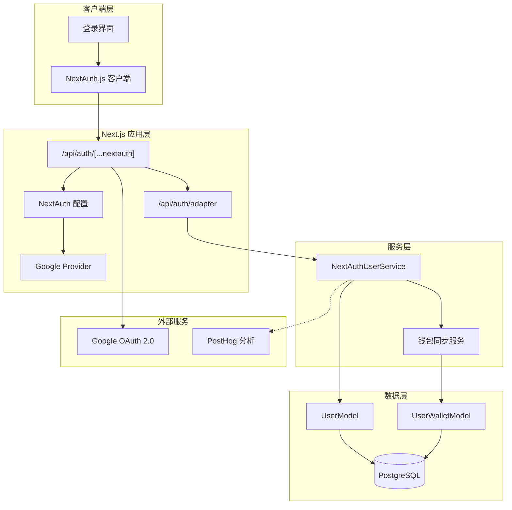

---

## OAuth 登录流程

### 完整时序图

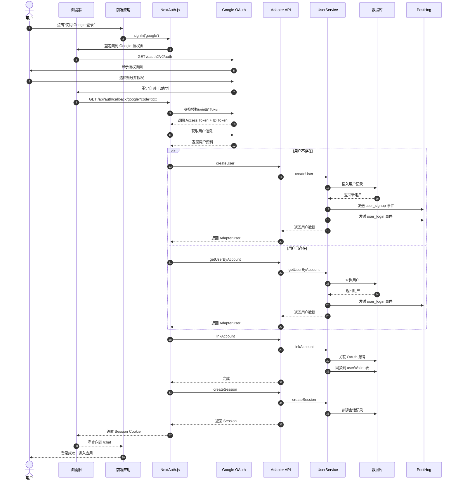

---

## 组件设计

### Provider 架构

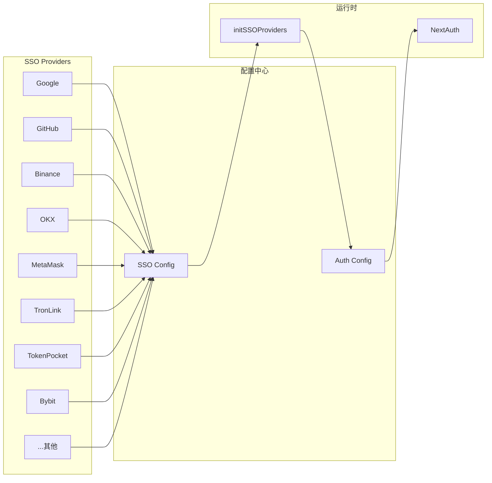

### Google Provider 配置

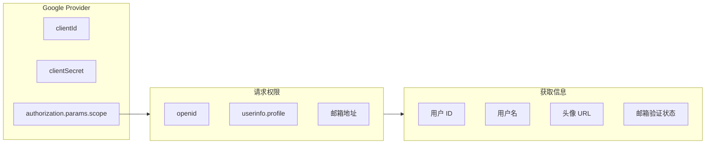

---

## 数据流架构

### Adapter 数据流

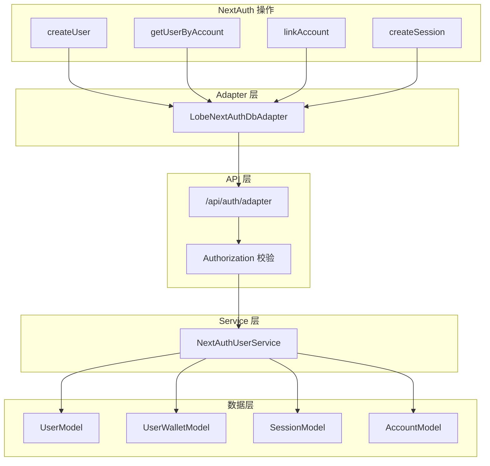

---

## 会话管理

### Session 策略对比

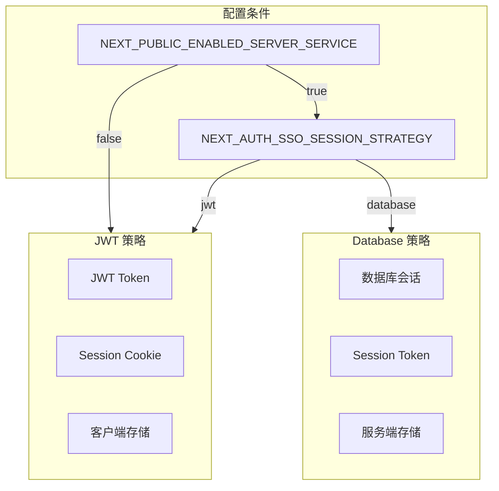

### Session 生命周期

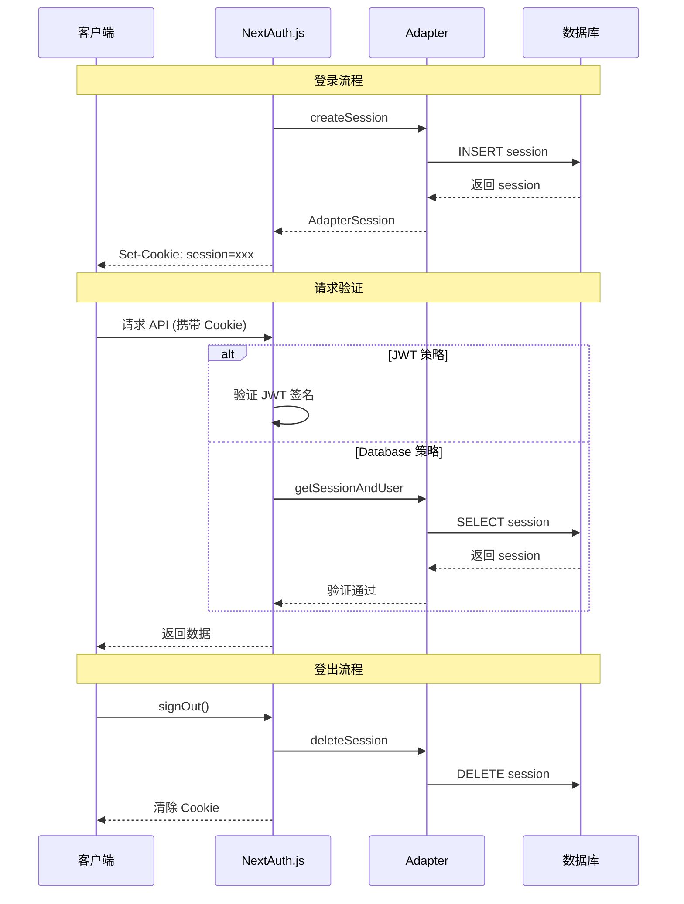

---

## 用户数据处理流程

### 新用户注册流程

### 用户信息映射

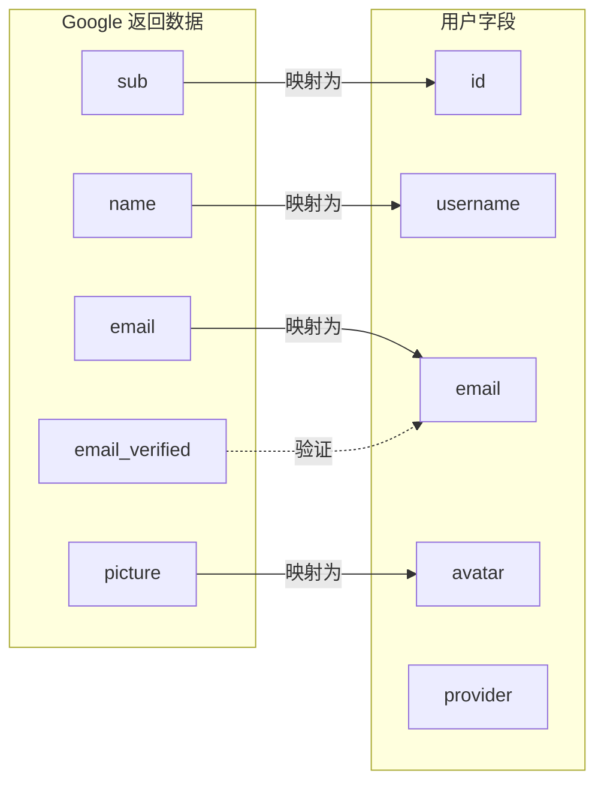

---

## 配置管理

### 环境变量配置

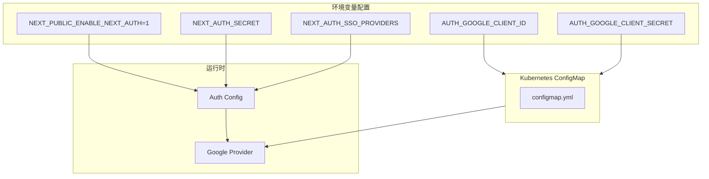

---

## 安全设计

### 安全机制

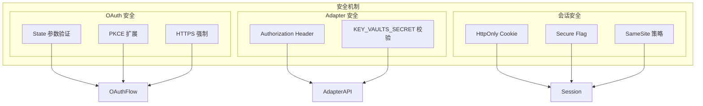

---

## 部署配置

### Kubernetes 配置

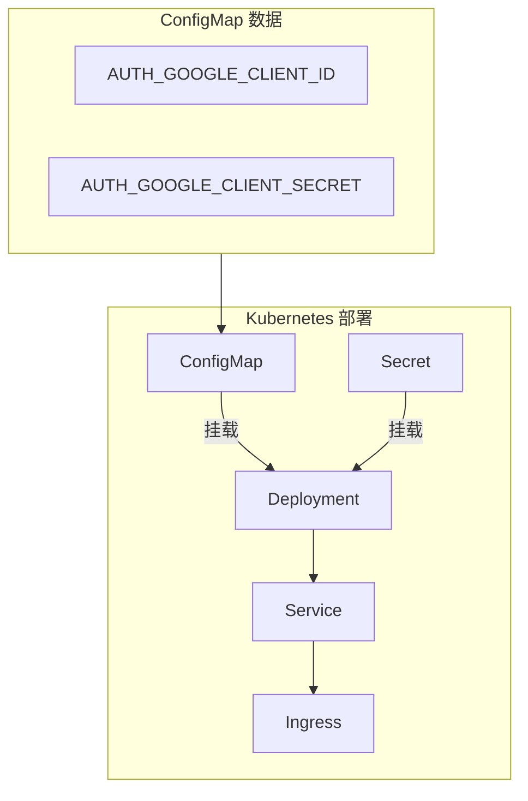

---

## 监控与埋点

### 事件追踪

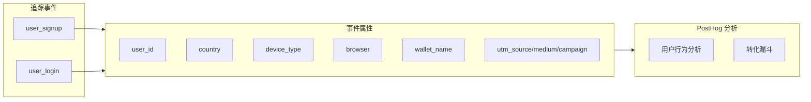

---

## 故障排查

### 常见问题

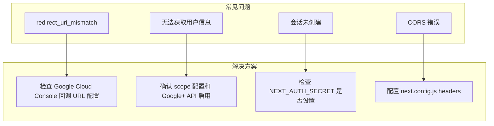

---

## 相关资源

- [Google OAuth 文档](https://developers.google.com/identity/protocols/oauth2)
- [Google Cloud Console](https://console.cloud.google.com/)
- [NextAuth.js Google 提供商](https://next-auth.js.org/providers/google)
- [认证方式概览](../api/RESTful/auth-overview.md)

---

最后更新: 2026-03-17
