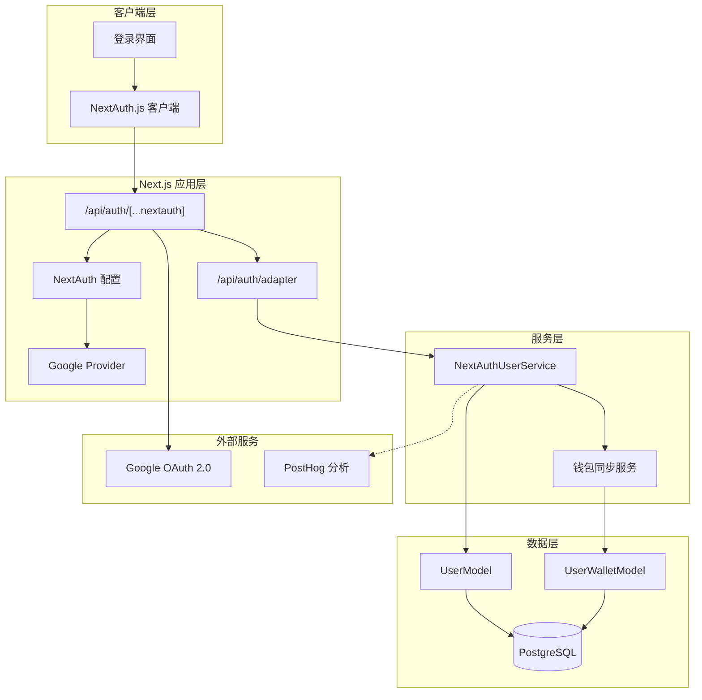
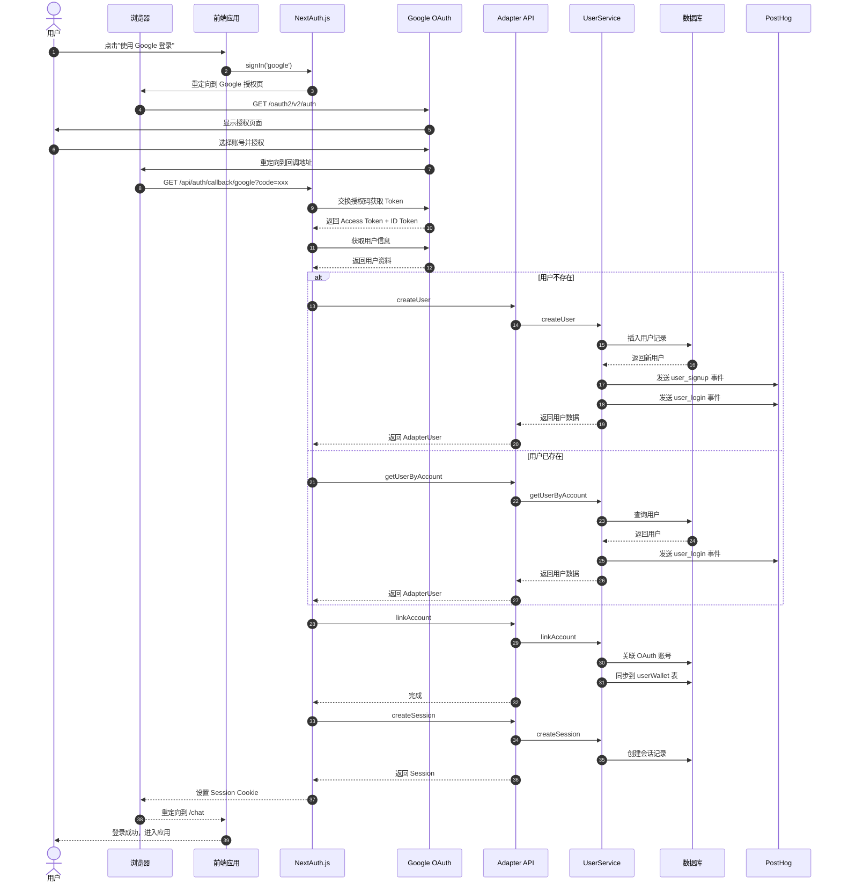
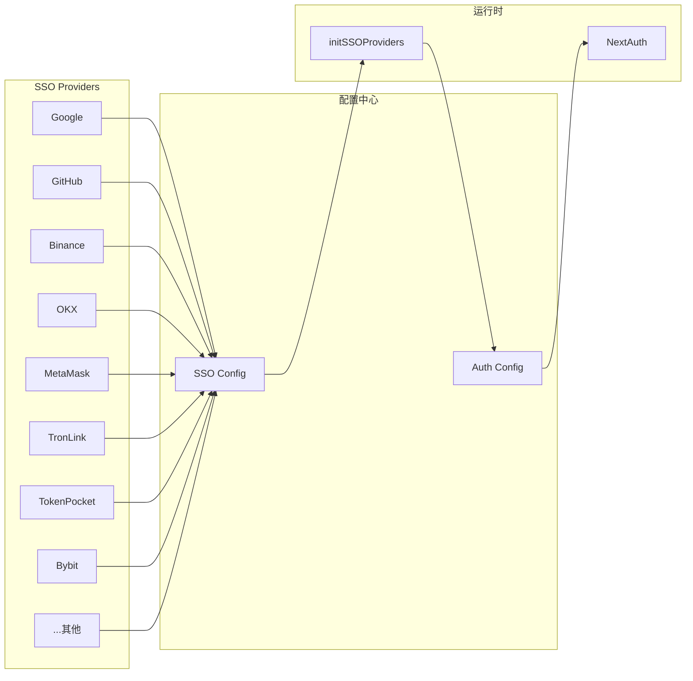
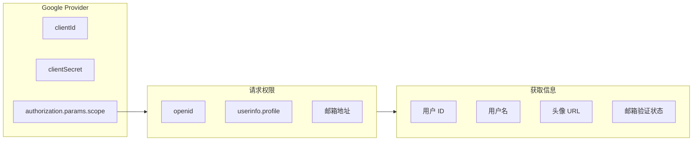
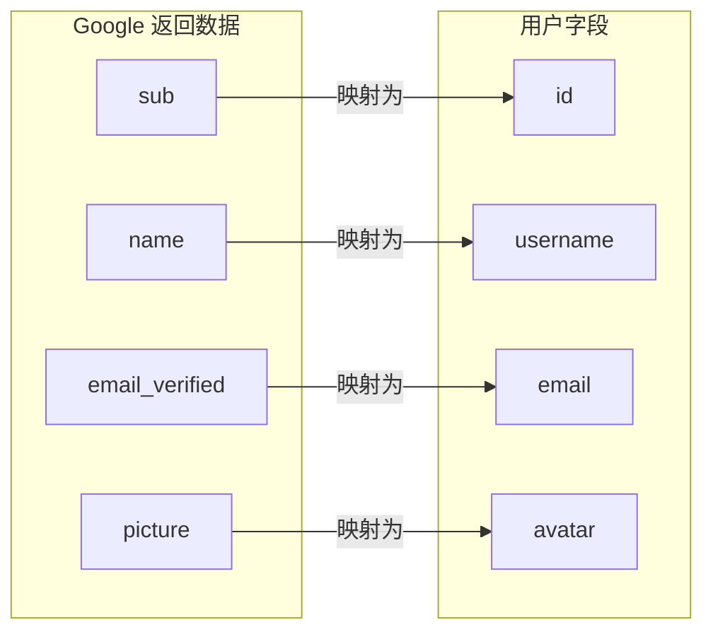
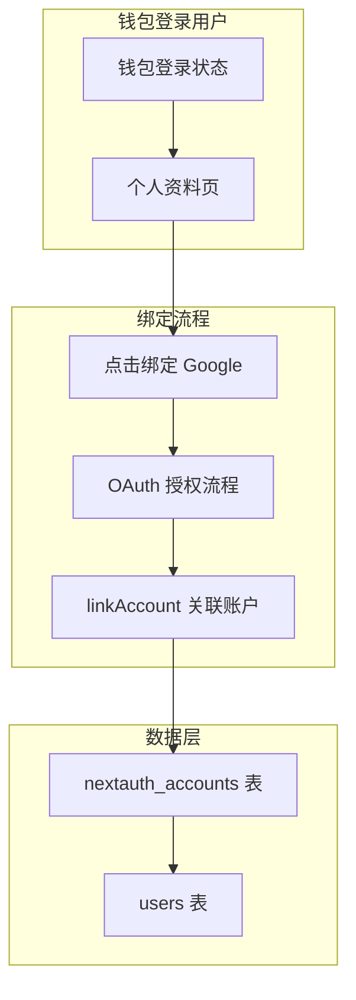
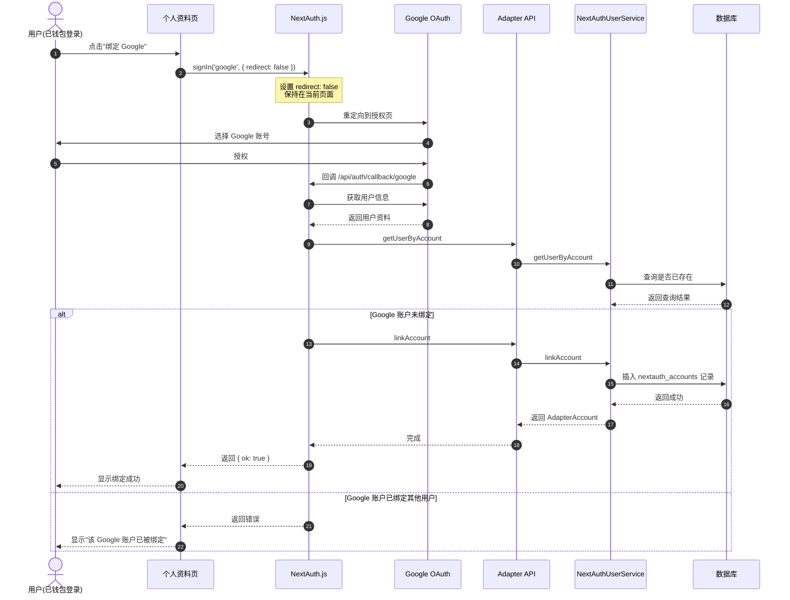
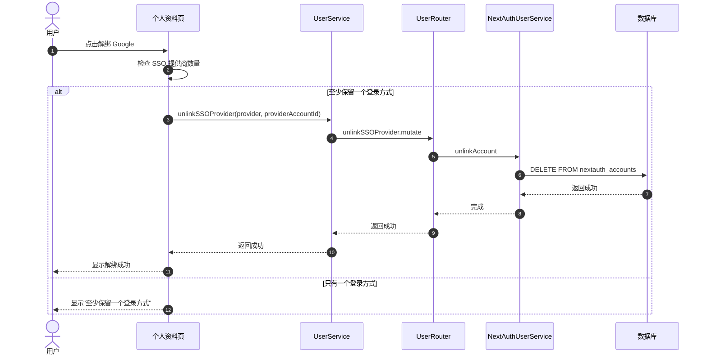
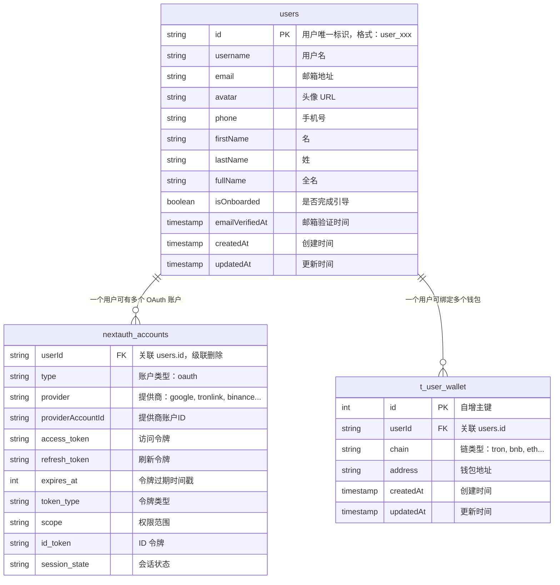

# Google 登录技术方案

## 概述

本文档描述基于 NextAuth.js 框架集成 Google OAuth 登录的技术方案，支持用户使用 Google 账号一键登录应用。

---

## 特点

- ✅ **无需注册**：使用现有 Google 账号直接登录
- ✅ **安全可靠**：基于 OAuth 2.0 标准协议
- ✅ **快速便捷**：一键登录，无需填写表单
- ✅ **自动同步**：自动获取用户头像、昵称、邮箱
- ✅ **跨平台**：支持 Web、移动端
- ✅ **账户绑定**：支持钱包登录用户绑定/解绑 Google 账户

---

## 配置要求

### 1. 创建 Google OAuth 应用

访问 [Google Cloud Console](https://console.cloud.google.com/)：

1. **创建或选择项目**
   - 登录 Google Cloud Console
   - 点击项目选择器，创建新项目或选择现有项目

2. **启用 Google+ API**
   - 转到 **API 和服务** → **库**
   - 搜索 "Google+ API" 或 "Google People API"
   - 点击启用

3. **配置 OAuth 同意屏幕**
   - 转到 **API 和服务** → **OAuth 同意屏幕**
   - 选择用户类型（外部或内部）
   - 填写应用信息：
     - 应用名称
     - 用户支持邮箱
     - 开发者联系信息
   - 添加应用域名和隐私政策链接（生产环境必需）

4. **创建 OAuth 2.0 客户端 ID**
   - 转到 **凭据** → **创建凭据** → **OAuth 2.0 客户端 ID**
   - 选择应用类型：**Web 应用**
   - 填写应用名称
   - 配置授权重定向 URI（见下文）

### 2. 配置回调 URL

在 Google Cloud Console 中添加授权重定向 URI：

```
开发环境：
http://localhost:3000/api/auth/callback/google

测试环境：
https://chat-dev.ainft.com/api/auth/callback/google

生产环境：
https://chat.ainft.com/api/auth/callback/google
```

> ⚠️ **注意**：回调 URL 必须与 NextAuth.js 配置中的 `NEXTAUTH_URL` 一致，包括协议、域名和端口。

### 3. 获取客户端凭据

创建 OAuth 客户端后，获取以下信息：

- **Client ID**: `xxx.apps.googleusercontent.com`
- **Client Secret**: `GOCSPX-xxx`

## 系统架构

### 整体架构图



---

## OAuth 登录流程

### 完整时序图



---

## 组件设计

### Provider 架构



### Google Provider 配置



---


---

## 用户数据处理流程

### 新用户注册流程


### 用户信息映射



---

## 钱包用户绑定/解绑 Google 账户

### 功能概述

支持已使用钱包登录的用户绑定 Google 账户，实现多方式登录。用户可以在个人资料页面管理已绑定的 SSO 提供商。

### 绑定流程架构



### 绑定流程时序图



### 解绑流程时序图



### 数据模型关系

#### 表结构说明

| 表名 | 物理表名 | 说明 |
|------|----------|------|
| `users` | `users` | 用户主表，存储用户基本信息 |
| `nextauth_accounts` | `nextauth_accounts` | NextAuth 账户表，存储 OAuth 提供商关联信息 |
| `userWallet` | `t_user_wallet` | 用户钱包表，存储绑定的区块链钱包地址 |

#### ER 关系图



#### 关联关系详解

**1. users 表与 nextauth_accounts 表**

- **关联字段**: `nextauth_accounts.userId` → `users.id`
- **关联类型**: 一对多（一个用户可有多个 OAuth 账户）
- **级联操作**: `onDelete: 'cascade'` - 删除用户时自动删除关联的 OAuth 账户
- **联合主键**: (`provider`, `providerAccountId`) 确保同一提供商账户只能绑定一个用户

**2. nextauth_accounts 表索引**

| 索引名称 | 类型 | 字段 | 说明 |
|----------|------|------|------|
| `compositePk` | 联合主键 | (`provider`, `providerAccountId`) | 确保同一提供商的同一账户只能绑定一个用户 |


**3. users 表与 t_user_wallet 表**

- **关联字段**: `t_user_wallet.userId` → `users.id`
- **关联类型**: 一对多（一个用户可绑定多个链的钱包）
- **唯一约束**: 
  - `(userId, chain)` - 每个用户在每个链上只能绑定一个地址
  - `(address, chain)` - 同一地址在同一链上只能被一个用户绑定

#### 典型数据示例

**场景：用户通过钱包登录后绑定 Google**

```
users 表:
┌─────────────────┬───────────┬──────────────────┐
│ id              │ username  │ email            │
├─────────────────┼───────────┼──────────────────┤
│ user_abc123     │ john_doe  │ john@gmail.com   │
└─────────────────┴───────────┴──────────────────┘

nextauth_accounts 表（2条记录）:
┌─────────────┬───────────┬─────────────────────────┬─────────────────────────┐
│ userId      │ provider  │ providerAccountId       │ type                    │
├─────────────┼───────────┼─────────────────────────┼─────────────────────────┤
│ user_abc123 │ tronlink  │ tron:TXxxxxx...         │ oauth                   │
│ user_abc123 │ google    │ 123456789               │ oauth                   │
└─────────────┴───────────┴─────────────────────────┴─────────────────────────┘

t_user_wallet 表:
┌────┬─────────────┬───────┬────────────────────────────────────────┐
│ id │ userId      │ chain │ address                                │
├────┼─────────────┼───────┼────────────────────────────────────────┤
│ 1  │ user_abc123 │ tron  │ TXxxxxx...                             │
└────┴─────────────┴───────┴────────────────────────────────────────┘
```


## 相关资源

- [Google OAuth 文档](https://developers.google.com/identity/protocols/oauth2)
- [Google Cloud Console](https://console.cloud.google.com/)
- [NextAuth.js Google 提供商](https://next-auth.js.org/providers/google)
- [认证方式概览](../api/RESTful/auth-overview.md)
- [Wallet 钱包管理接口](../api/tRPC/lambda/wallet.md)

---

最后更新: 2026-03-17
