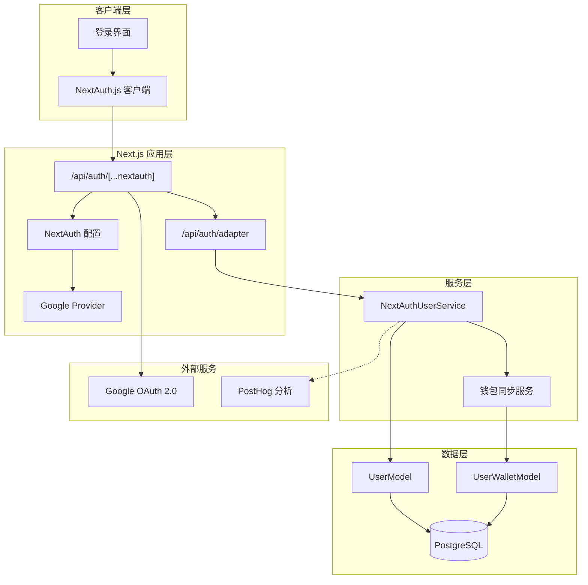
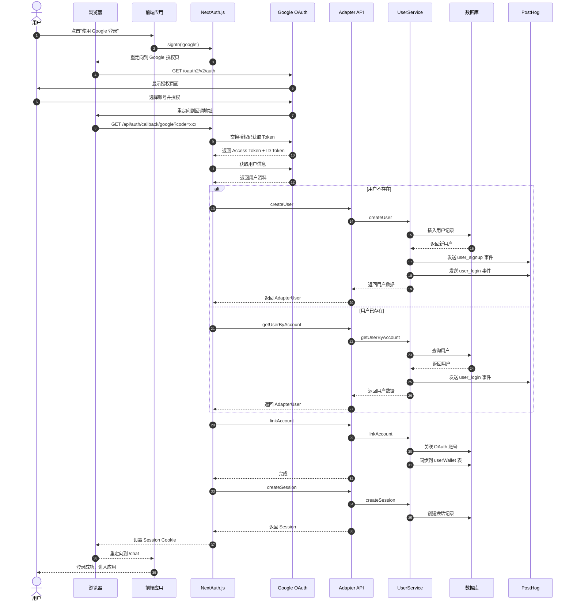
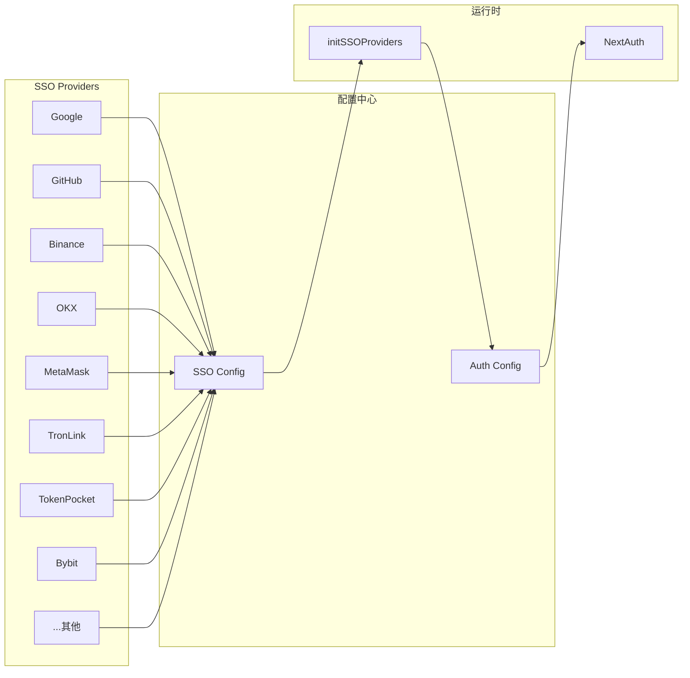
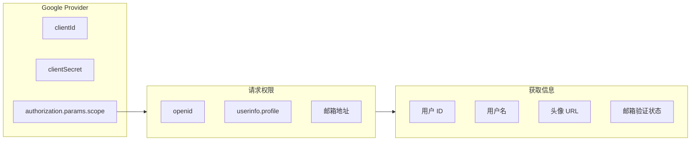
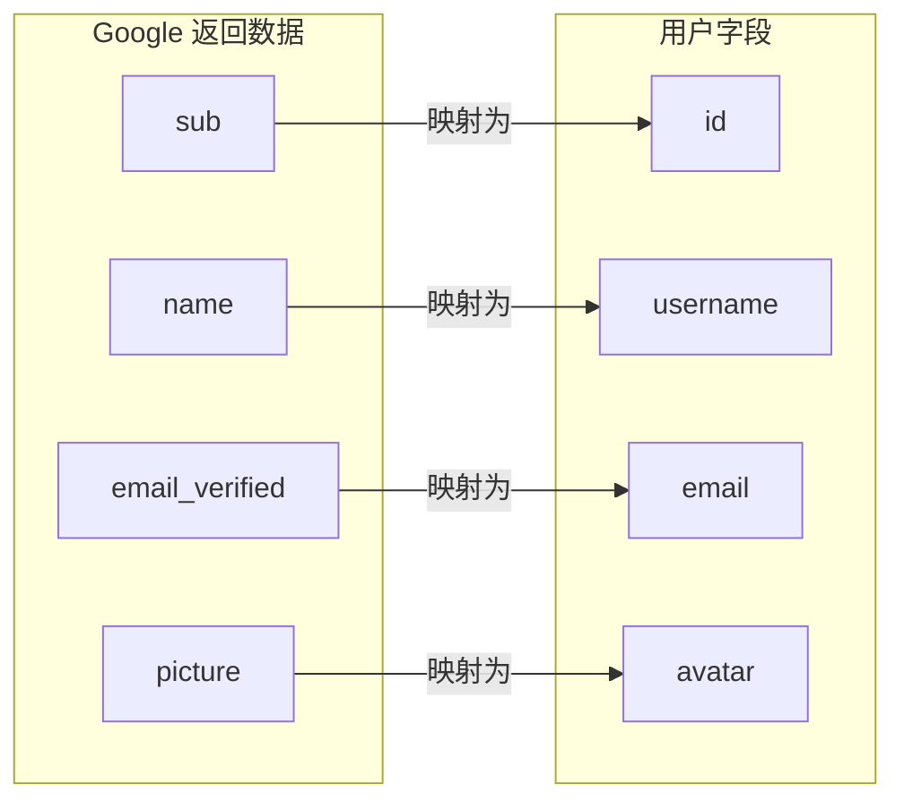
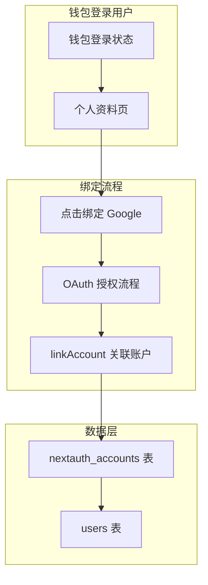
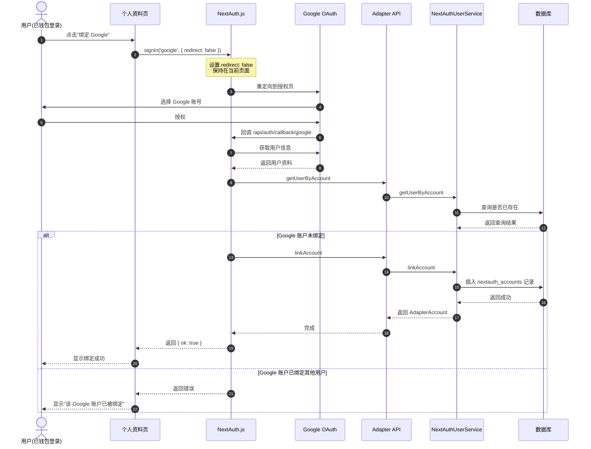
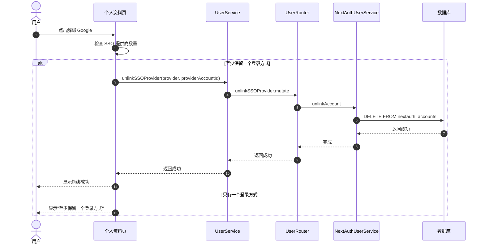
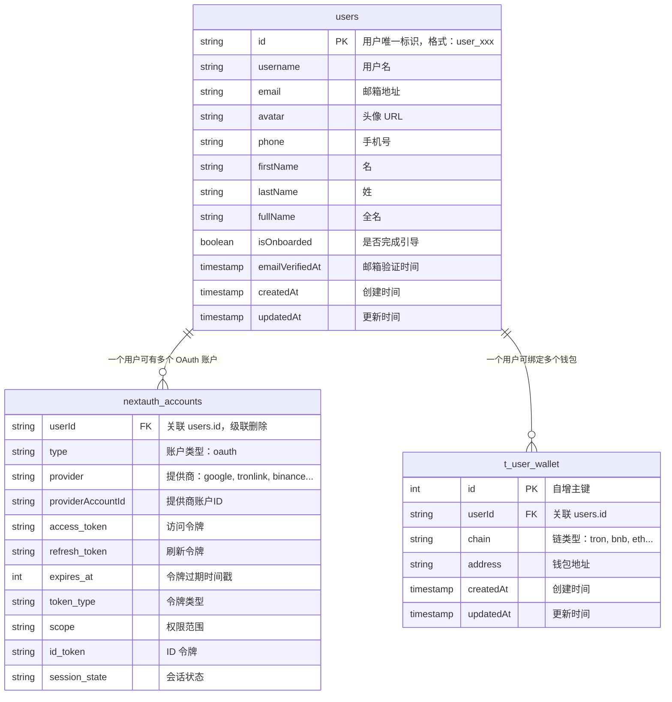
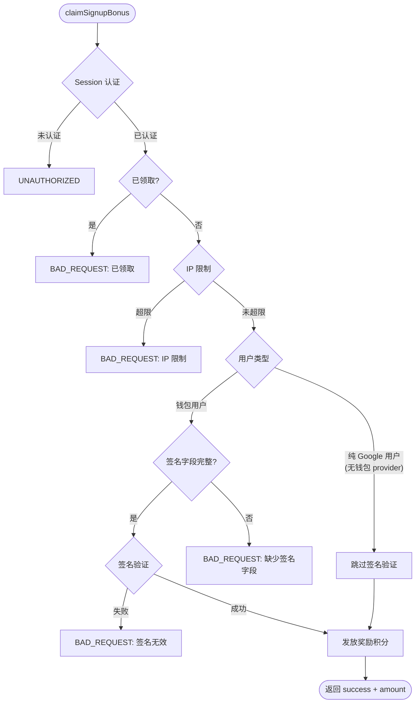

# Google 登录技术方案

## 概述

本文档描述基于 NextAuth.js 框架集成 Google OAuth 登录的技术方案，支持用户使用 Google 账号一键登录应用。

---

## 特点

- ✅ **无需注册**：使用现有 Google 账号直接登录
- ✅ **安全可靠**：基于 OAuth 2.0 标准协议
- ✅ **快速便捷**：一键登录，无需填写表单
- ✅ **自动同步**：自动获取用户头像、昵称、邮箱
- ✅ **跨平台**：支持 Web、移动端
- ✅ **账户绑定**：支持钱包登录用户绑定/解绑 Google 账户

---

## 配置要求

### 1. 创建 Google OAuth 应用

访问 [Google Cloud Console](https://console.cloud.google.com/)：

1. **创建或选择项目**
   - 登录 Google Cloud Console
   - 点击项目选择器，创建新项目或选择现有项目

2. **启用 Google+ API**
   - 转到 **API 和服务** → **库**
   - 搜索 "Google+ API" 或 "Google People API"
   - 点击启用

3. **配置 OAuth 同意屏幕**
   - 转到 **API 和服务** → **OAuth 同意屏幕**
   - 选择用户类型（外部或内部）
   - 填写应用信息：
     - 应用名称
     - 用户支持邮箱
     - 开发者联系信息
   - 添加应用域名和隐私政策链接（生产环境必需）

4. **创建 OAuth 2.0 客户端 ID**
   - 转到 **凭据** → **创建凭据** → **OAuth 2.0 客户端 ID**
   - 选择应用类型：**Web 应用**
   - 填写应用名称
   - 配置授权重定向 URI（见下文）

### 2. 配置回调 URL

在 Google Cloud Console 中添加授权重定向 URI：

```
开发环境：
http://localhost:3000/api/auth/callback/google

测试环境：
https://chat-dev.ainft.com/api/auth/callback/google

生产环境：
https://chat.ainft.com/api/auth/callback/google
```

> ⚠️ **注意**：回调 URL 必须与 NextAuth.js 配置中的 `NEXTAUTH_URL` 一致，包括协议、域名和端口。

### 3. 获取客户端凭据

创建 OAuth 客户端后，获取以下信息：

- **Client ID**: `xxx.apps.googleusercontent.com`
- **Client Secret**: `GOCSPX-xxx`

## 系统架构

### 整体架构图



---

## OAuth 登录流程

### 完整时序图



---

## 组件设计

### Provider 架构



### Google Provider 配置



---


---

## 用户数据处理流程

### 新用户注册流程


### 用户信息映射



---

## 钱包用户绑定/解绑 Google 账户

### 功能概述

支持已使用钱包登录的用户绑定 Google 账户，实现多方式登录。用户可以在个人资料页面管理已绑定的 SSO 提供商。

### 绑定流程架构



### 绑定流程时序图



### 解绑流程时序图



### 数据模型关系

#### 表结构说明

| 表名 | 物理表名 | 说明 |
|------|----------|------|
| `users` | `users` | 用户主表，存储用户基本信息 |
| `nextauth_accounts` | `nextauth_accounts` | NextAuth 账户表，存储 OAuth 提供商关联信息 |
| `userWallet` | `t_user_wallet` | 用户钱包表，存储绑定的区块链钱包地址 |

#### ER 关系图



#### 关联关系详解

**1. users 表与 nextauth_accounts 表**

- **关联字段**: `nextauth_accounts.userId` → `users.id`
- **关联类型**: 一对多（一个用户可有多个 OAuth 账户）
- **级联操作**: `onDelete: 'cascade'` - 删除用户时自动删除关联的 OAuth 账户
- **联合主键**: (`provider`, `providerAccountId`) 确保同一提供商账户只能绑定一个用户

**2. nextauth_accounts 表索引**

| 索引名称 | 类型 | 字段 | 说明 |
|----------|------|------|------|
| `compositePk` | 联合主键 | (`provider`, `providerAccountId`) | 确保同一提供商的同一账户只能绑定一个用户 |


**3. users 表与 t_user_wallet 表**

- **关联字段**: `t_user_wallet.userId` → `users.id`
- **关联类型**: 一对多（一个用户可绑定多个链的钱包）
- **唯一约束**: 
  - `(userId, chain)` - 每个用户在每个链上只能绑定一个地址
  - `(address, chain)` - 同一地址在同一链上只能被一个用户绑定

#### 典型数据示例

**场景：用户通过钱包登录后绑定 Google**

```
users 表:
┌─────────────────┬───────────┬──────────────────┐
│ id              │ username  │ email            │
├─────────────────┼───────────┼──────────────────┤
│ user_abc123     │ john_doe  │ john@gmail.com   │
└─────────────────┴───────────┴──────────────────┘

nextauth_accounts 表（2条记录）:
┌─────────────┬───────────┬─────────────────────────┬─────────────────────────┐
│ userId      │ provider  │ providerAccountId       │ type                    │
├─────────────┼───────────┼─────────────────────────┼─────────────────────────┤
│ user_abc123 │ tronlink  │ tron:TXxxxxx...         │ oauth                   │
│ user_abc123 │ google    │ 123456789               │ oauth                   │
└─────────────┴───────────┴─────────────────────────┴─────────────────────────┘

t_user_wallet 表:
┌────┬─────────────┬───────┬────────────────────────────────────────┐
│ id │ userId      │ chain │ address                                │
├────┼─────────────┼───────┼────────────────────────────────────────┤
│ 1  │ user_abc123 │ tron  │ TXxxxxx...                             │
└────┴─────────────┴───────┴────────────────────────────────────────┘
```


## 关键全局变量与环境变量

### 环境变量配置

Google 登录功能依赖以下环境变量，需要在不同环境的 `.env` 文件中正确配置：

#### 1. 服务端使用的配置变量

| 变量名 | 类型 | 说明                  | 示例值                              |
|--------|------|---------------------|----------------------------------|
| `AUTH_GOOGLE_CLIENT_ID` | 必填 | Google OAuth 客户端 ID | `xxx.apps.googleusercontent.com` |
| `AUTH_GOOGLE_CLIENT_SECRET` | 必填 | Google OAuth 客户端密钥  | `GOCSPX-xxx`                     |
| `NEXT_AUTH_SSO_PROVIDERS` | 必填 | 支持的登录方式             | `...,google`                     |

#### 2. 前端暴露变量

| 变量名  | 说明 | 配置位置 |
|-------|------|----------|
| `NEXT_PUBLIC_AUTH_GOOGLE_CLIENT_ID` | 前端使用的 Google Client ID | `next.config.ts` 自动映射 |
| `NEXT_AUTH_SSO_PROVIDERS` | 必填                   | 支持的登录方式             | `...,google`                     |

## 接口列表

### 1. 获取用户 SSO 提供商列表

获取当前登录用户绑定的所有 SSO 提供商信息（包括 Google、钱包等）。

**接口信息**
- **类型**: tRPC Query
- **路径**: `user.getUserSSOProviders`
- **权限**: 需要登录

**返回数据**
```typescript
interface SSOProvider {
  provider: string;           // 提供商名称: 'google', 'tronlink', 'binance', etc.
  providerAccountId: string;  // 提供商账户唯一标识
  type: string;               // 账户类型: 'oauth'
  email?: string;             // 邮箱地址 
  name?: string;              // 用户名称
  image?: string;             // 头像 URL
}
```


---

### 2. 绑定 Google 账号

为当前已登录用户绑定 Google OAuth 账号。

**接口信息**
- **类型**: tRPC Mutation
- **路径**: `user.linkGoogleAccount`
- **权限**: 需要登录

**请求参数**
```typescript
interface LinkGoogleAccountInput {
  code: string;  // Google OAuth authorization code
}
```

**返回数据**
```typescript
interface LinkGoogleAccountOutput {
  success: boolean;
  account: {
    userId: string;
    provider: 'google';
    providerAccountId: string;  // 格式: google-{email}
    email: string;
    name: string;
    googleId: string;
    image?: string;
  };
}
```

**错误码**
| 错误码 | 说明 |
|--------|------|
| `UNAUTHORIZED` | 用户未登录 |
| `INTERNAL_SERVER_ERROR` | 缺少 Google OAuth 配置 |
| `BAD_REQUEST` | 授权码无效或已过期 |
| `CONFLICT` | 该 Google 账号已被其他用户绑定 |
| `BAD_REQUEST` | 当前用户已绑定 Google 账号 |

---

### 3. 解绑 Google 账号

为当前已登录用户解绑指定的 Google OAuth 账号。

**接口信息**
- **类型**: tRPC Mutation
- **路径**: `user.unlinkGoogleAccount`
- **权限**: 需要登录

**请求参数**
```typescript
interface UnlinkGoogleAccountInput {
  providerAccountId: string;  // Google 用户 ID (格式: google-{email})
}
```

**返回数据**
```typescript
interface UnlinkGoogleAccountOutput {
  success: boolean;
  message: string;
}
```

**错误码**
| 错误码 | 说明 |
|--------|------|
| `UNAUTHORIZED` | 用户未登录 |
| `NOT_FOUND` | 未找到该 Google 账号绑定记录 |
| `BAD_REQUEST` | 必须至少保留一个登录方式 |


---

### 4. Google 登录

使用 NextAuth.js 的 Google Provider 进行登录。

**接口信息**
- **类型**: NextAuth.js 内置
- **路径**: `/api/auth/signin/google`
- **回调地址**: `/api/auth/callback/google`


**登录流程**
```typescript
import { signIn } from 'next-auth/react';
const handleGoogleLogin = () => {
  signIn('google', { callbackUrl: '/chat' });
};
```


## Google 用户领取注册奖励（claimSignupBonus 无签名方案）

### 背景

`user.claimSignupBonus` 接口原设计面向钱包用户，要求提供 TronLink 签名（`address`、`message`、`signature` 等字段）。Google 登录用户无钱包地址，无法完成签名，需要走无签名路径。

### 改动方案

**核心思路**：将签名相关字段改为可选，服务端根据用户身份类型决定是否做签名校验。

#### 1. 输入参数变更

| 字段 | 原来 | 改后 | 说明 |
|------|------|------|------|
| `address` | 必填 | 可选 | Google 用户不传 |
| `chain` | 必填 | 可选 | Google 用户不传 |
| `encryptedToken` | 必填 | 可选 | Google 用户不传 |
| `message` | 必填 | 可选 | Google 用户不传 |
| `signature` | 必填 | 可选 | Google 用户不传 |
| `version` | 可选 | 可选 | 不变 |

改后 TypeScript 类型：

```typescript
{
  address?: string;
  chain?: string;
  encryptedToken?: string;
  message?: string;
  signature?: string;
  version?: string;
}
```

#### 2. 服务端逻辑

```
if (用户是纯 Google 用户，即 nextauth_accounts 中只有 google provider) {
  // 跳过签名验证
  // 直接走奖励发放逻辑
} else {
  // 钱包用户：原有签名校验流程不变
  验证 address / message / signature / encryptedToken
}
```

判断"纯 Google 用户"的依据：查询 `nextauth_accounts` 表，`userId` 对应的记录中不存在 `provider = 'tronlink'`（或其他钱包 provider）的记录，且存在 `provider = 'google'` 的记录。

#### 3. 安全保证

无签名路径并非无保护，保留以下安全机制：

| 机制 | 说明 |
|------|------|
| Session 认证 | 仍需 `x-ainft-chat-auth`，确认用户已登录 |
| 身份绑定校验 | 服务端从 session 取 `userId`，无法伪造 |
| 幂等保护 | 每个用户只能领取一次，重复调用返回错误 |
| IP 限制 | 1 小时内单 IP 最多赠送 5 次，保持不变 |
| 总量限制 | 全局 600,000 次上限，保持不变 |

#### 4. Google 用户调用示例

```bash
# Google 用户无需传签名字段，入参为空对象即可
curl --location 'https://chat-dev.ainft.com/trpc/lambda/user.claimSignupBonus?batch=1' \
  -H 'Content-Type: application/json' \
  -H 'x-ainft-chat-auth: YOUR_AUTH_TOKEN' \
  --data '{
    "0": {
      "json": {}
    }
  }'
```

```typescript
// 前端调用
const result = await trpc.user.claimSignupBonus.mutate({});

if (result.success) {
  console.log(`成功领取 ${result.amount} 积分`);
}
```

#### 5. 错误码补充

在原有错误码基础上新增：

| 错误码 | 说明 |
|--------|------|
| `BAD_REQUEST` | 钱包用户调用时缺少签名字段 |
| `BAD_REQUEST` | 非 Google 用户且未传签名，无法确认身份 |

#### 6. 流程图



---

## 相关资源

- [Google OAuth 文档](https://developers.google.com/identity/protocols/oauth2)
- [Google Cloud Console](https://console.cloud.google.com/)
- [NextAuth.js Google 提供商](https://next-auth.js.org/providers/google)
- [认证方式概览](../api/RESTful/auth-overview.md)
- [Wallet 钱包管理接口](../api/tRPC/lambda/wallet.md)

---

最后更新: 2026-03-20
