# Google 登录技术方案

## 概述

本文档描述基于 NextAuth.js 框架集成 Google OAuth 登录的技术方案，支持用户使用 Google 账号一键登录应用。

---

## 特点

- ✅ **无需注册**：使用现有 Google 账号直接登录
- ✅ **安全可靠**：基于 OAuth 2.0 标准协议
- ✅ **快速便捷**：一键登录，无需填写表单
- ✅ **自动同步**：自动获取用户头像、昵称、邮箱
- ✅ **跨平台**：支持 Web、移动端
- ✅ **账户绑定**：支持钱包登录用户绑定/解绑 Google 账户

---

## 配置要求

### 1. 创建 Google OAuth 应用

访问 [Google Cloud Console](https://console.cloud.google.com/)：

1. **创建或选择项目**
   - 登录 Google Cloud Console
   - 点击项目选择器，创建新项目或选择现有项目

2. **启用 Google+ API**
   - 转到 **API 和服务** → **库**
   - 搜索 "Google+ API" 或 "Google People API"
   - 点击启用

3. **配置 OAuth 同意屏幕**
   - 转到 **API 和服务** → **OAuth 同意屏幕**
   - 选择用户类型（外部或内部）
   - 填写应用信息：
     - 应用名称
     - 用户支持邮箱
     - 开发者联系信息
   - 添加应用域名和隐私政策链接（生产环境必需）

4. **创建 OAuth 2.0 客户端 ID**
   - 转到 **凭据** → **创建凭据** → **OAuth 2.0 客户端 ID**
   - 选择应用类型：**Web 应用**
   - 填写应用名称
   - 配置授权重定向 URI（见下文）

### 2. 配置回调 URL

在 Google Cloud Console 中添加授权重定向 URI：

```
开发环境：
http://localhost:3000/api/auth/callback/google

测试环境：
https://chat-dev.ainft.com/api/auth/callback/google

生产环境：
https://chat.ainft.com/api/auth/callback/google
```

> ⚠️ **注意**：回调 URL 必须与 NextAuth.js 配置中的 `NEXTAUTH_URL` 一致，包括协议、域名和端口。

### 3. 获取客户端凭据

创建 OAuth 客户端后，获取以下信息：

- **Client ID**: `xxx.apps.googleusercontent.com`
- **Client Secret**: `GOCSPX-xxx`

## 系统架构

### 整体架构图

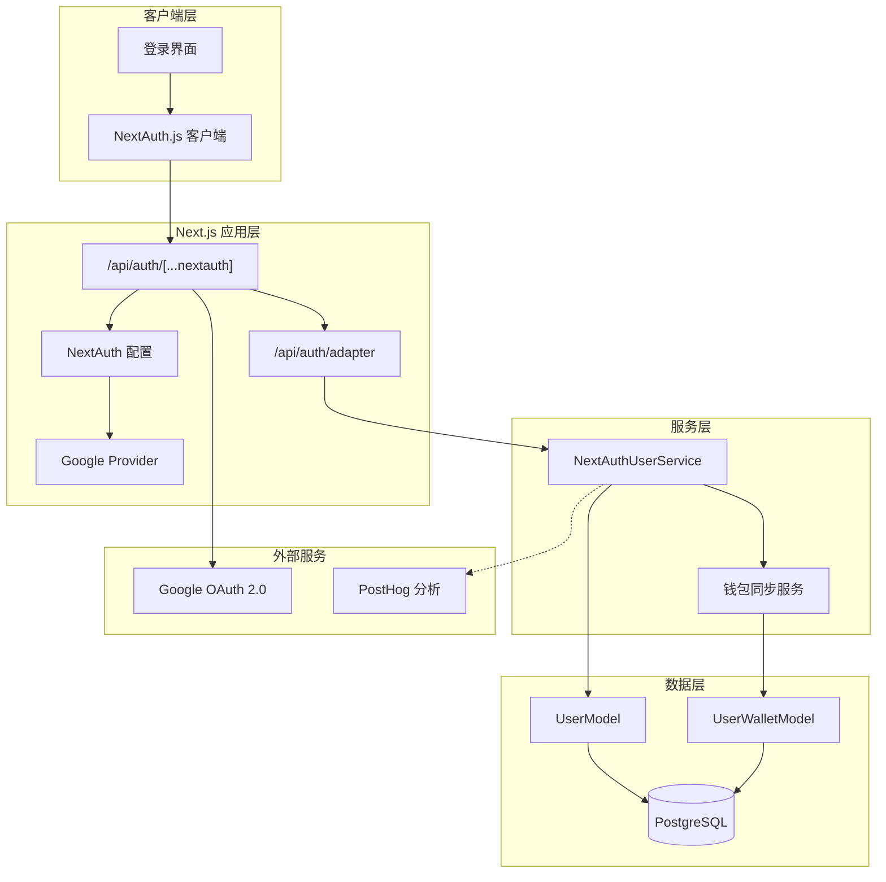
```mermaid
flowchart TB
    subgraph Client["客户端层"]
        UI["登录界面"]
        NextAuthClient["NextAuth.js 客户端"]
    end

    subgraph NextApp["Next.js 应用层"]
        NextAuthAPI["/api/auth/[...nextauth]"]
        AdapterAPI["/api/auth/adapter"]
        AuthConfig["NextAuth 配置"]
        GoogleProvider["Google Provider"]
    end

    subgraph Service["服务层"]
        UserService["NextAuthUserService"]
        WalletService["钱包同步服务"]
    end

    subgraph Data["数据层"]
        UserModel["UserModel"]
        WalletModel["UserWalletModel"]
        DB[("PostgreSQL")]
    end

    subgraph External["外部服务"]
        GoogleOAuth["Google OAuth 2.0"]
        PostHog["PostHog 分析"]
    end

    UI --> NextAuthClient
    NextAuthClient --> NextAuthAPI
    NextAuthAPI --> AuthConfig
    AuthConfig --> GoogleProvider
    NextAuthAPI --> GoogleOAuth
    NextAuthAPI --> AdapterAPI
    AdapterAPI --> UserService
    UserService --> UserModel
    UserService --> WalletService
    WalletService --> WalletModel
    UserModel --> DB
    WalletModel --> DB
    UserService -.-> PostHog
```

---

## OAuth 登录流程

### 完整时序图

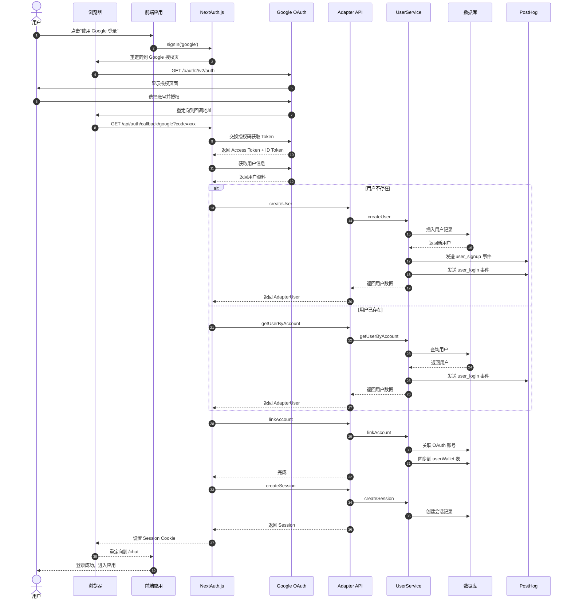
```mermaid
sequenceDiagram
    autonumber
    actor User as 用户
    participant Browser as 浏览器
    participant Frontend as 前端应用
    participant NextAuth as NextAuth.js
    participant Google as Google OAuth
    participant Adapter as Adapter API
    participant Service as UserService
    participant DB as 数据库
    participant PostHog as PostHog

    User->>Frontend: 点击"使用 Google 登录"
    Frontend->>NextAuth: signIn('google')
    NextAuth->>Browser: 重定向到 Google 授权页
    Browser->>Google: GET /oauth2/v2/auth
    Google->>User: 显示授权页面
    User->>Google: 选择账号并授权
    Google->>Browser: 重定向到回调地址
    Browser->>NextAuth: GET /api/auth/callback/google?code=xxx
    NextAuth->>Google: 交换授权码获取 Token
    Google-->>NextAuth: 返回 Access Token + ID Token
    NextAuth->>Google: 获取用户信息
    Google-->>NextAuth: 返回用户资料
    
    alt 用户不存在
        NextAuth->>Adapter: createUser
        Adapter->>Service: createUser
        Service->>DB: 插入用户记录
        DB-->>Service: 返回新用户
        Service->>PostHog: 发送 user_signup 事件
        Service->>PostHog: 发送 user_login 事件
        Service-->>Adapter: 返回用户数据
        Adapter-->>NextAuth: 返回 AdapterUser
    else 用户已存在
        NextAuth->>Adapter: getUserByAccount
        Adapter->>Service: getUserByAccount
        Service->>DB: 查询用户
        DB-->>Service: 返回用户
        Service->>PostHog: 发送 user_login 事件
        Service-->>Adapter: 返回用户数据
        Adapter-->>NextAuth: 返回 AdapterUser
    end

    NextAuth->>Adapter: linkAccount
    Adapter->>Service: linkAccount
    Service->>DB: 关联 OAuth 账号
    Service->>DB: 同步到 userWallet 表
    Adapter-->>NextAuth: 完成

    NextAuth->>Adapter: createSession
    Adapter->>Service: createSession
    Service->>DB: 创建会话记录
    Adapter-->>NextAuth: 返回 Session

    NextAuth-->>Browser: 设置 Session Cookie
    Browser-->>Frontend: 重定向到 /chat
    Frontend-->>User: 登录成功，进入应用
```

---

## 组件设计

### Provider 架构

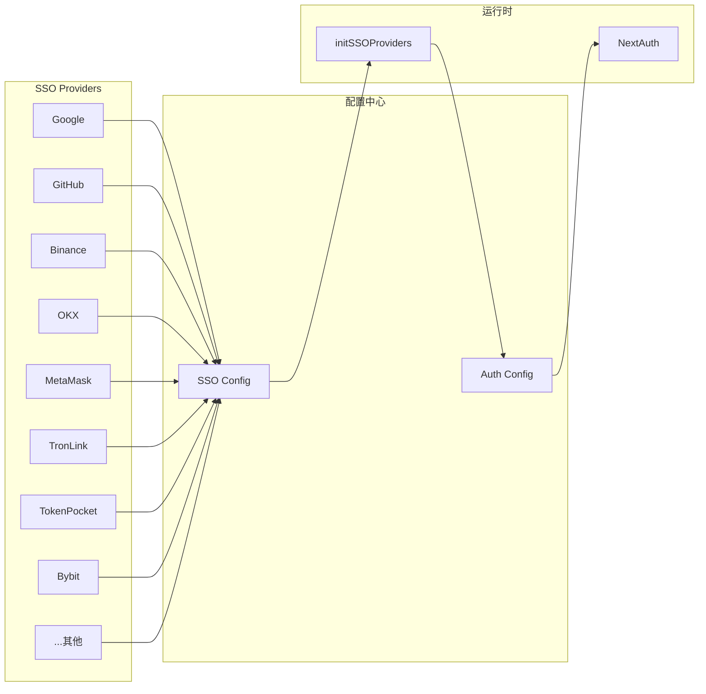
```mermaid
flowchart LR
    subgraph Providers["SSO Providers"]
        direction TB
        Github["GitHub"]
        Google["Google"]
        Binance["Binance"]
        OKX["OKX"]
        MetaMask["MetaMask"]
        TronLink["TronLink"]
        TokenPocket["TokenPocket"]
        Bybit["Bybit"]
        Others["...其他"]
    end

    subgraph Config["配置中心"]
        SSOConfig["SSO Config"]
        AuthConfig["Auth Config"]
    end

    subgraph Runtime["运行时"]
        Init["initSSOProviders"]
        NextAuth["NextAuth"]
    end

    Google --> SSOConfig
    Github --> SSOConfig
    Binance --> SSOConfig
    OKX --> SSOConfig
    MetaMask --> SSOConfig
    TronLink --> SSOConfig
    TokenPocket --> SSOConfig
    Bybit --> SSOConfig
    Others --> SSOConfig
    
    SSOConfig --> Init
    Init --> AuthConfig
    AuthConfig --> NextAuth
```

### Google Provider 配置

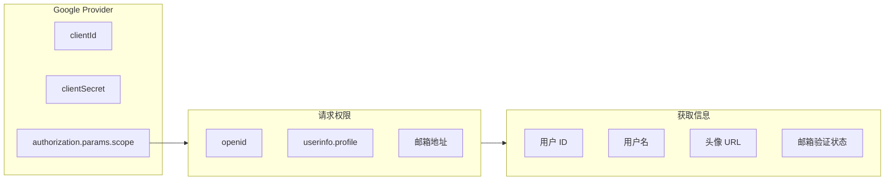
```mermaid
flowchart LR
    subgraph GoogleProvider["Google Provider"]
        direction TB
        ClientID["clientId"]
        ClientSecret["clientSecret"]
        Authorization["authorization.params.scope"]
    end

    subgraph Scopes["请求权限"]
        OpenID["openid"]
        Profile["userinfo.profile"]
        Email["userinfo.email"]
    end

    subgraph UserInfo["获取信息"]
        ID["用户 ID"]
        Name["用户名"]
        Email["邮箱地址"]
        Avatar["头像 URL"]
        Verified["邮箱验证状态"]
    end

    Authorization --> Scopes
    Scopes --> UserInfo
```

---

## 数据流架构

### Adapter 数据流

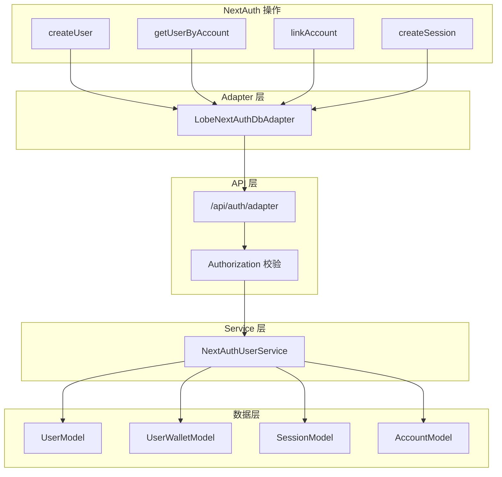
```mermaid
flowchart TB
    subgraph NextAuthActions["NextAuth 操作"]
        CreateUser["createUser"]
        GetUserByAccount["getUserByAccount"]
        LinkAccount["linkAccount"]
        CreateSession["createSession"]
    end

    subgraph AdapterLayer["Adapter 层"]
        LobeAdapter["LobeNextAuthDbAdapter"]
    end

    subgraph APILayer["API 层"]
        AdapterRoute["/api/auth/adapter"]
        AuthCheck["Authorization 校验"]
    end

    subgraph ServiceLayer["Service 层"]
        NextAuthUserService["NextAuthUserService"]
    end

    subgraph DataLayer["数据层"]
        UserModel["UserModel"]
        WalletModel["UserWalletModel"]
        SessionModel["SessionModel"]
        AccountModel["AccountModel"]
    end

    CreateUser --> LobeAdapter
    GetUserByAccount --> LobeAdapter
    LinkAccount --> LobeAdapter
    CreateSession --> LobeAdapter

    LobeAdapter --> AdapterRoute
    AdapterRoute --> AuthCheck
    AuthCheck --> NextAuthUserService

    NextAuthUserService --> UserModel
    NextAuthUserService --> WalletModel
    NextAuthUserService --> SessionModel
    NextAuthUserService --> AccountModel
```

---

## 会话管理

### Session 策略对比

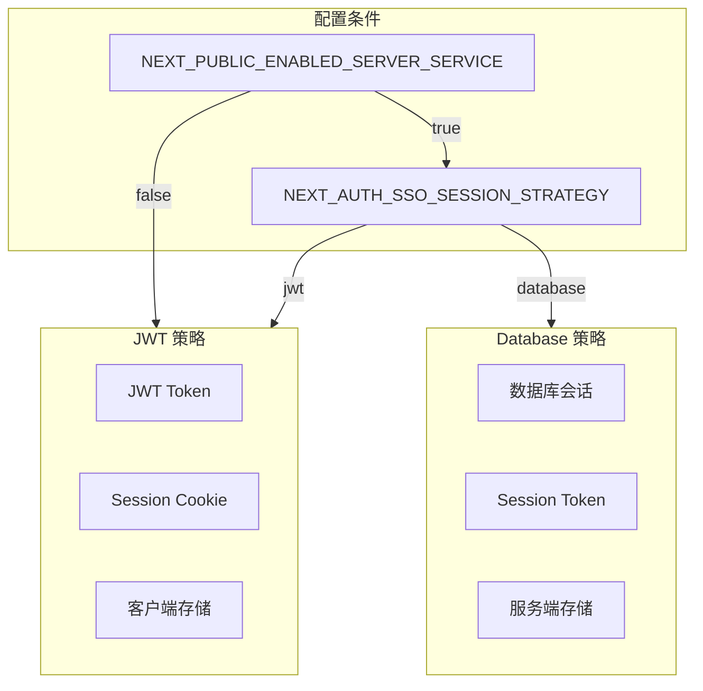
```mermaid
flowchart TB
    subgraph JWTStrategy["JWT 策略"]
        JWT["JWT Token"]
        JWTCookie["Session Cookie"]
        ClientSide["客户端存储"]
    end

    subgraph DatabaseStrategy["Database 策略"]
        DBSession["数据库会话"]
        SessionToken["Session Token"]
        ServerSide["服务端存储"]
    end

    subgraph Config["配置条件"]
        ServerEnabled["NEXT_PUBLIC_ENABLED_SERVER_SERVICE"]
        Strategy["NEXT_AUTH_SSO_SESSION_STRATEGY"]
    end

    ServerEnabled -->|false| JWTStrategy
    ServerEnabled -->|true| Strategy
    Strategy -->|jwt| JWTStrategy
    Strategy -->|database| DatabaseStrategy
```

### Session 生命周期

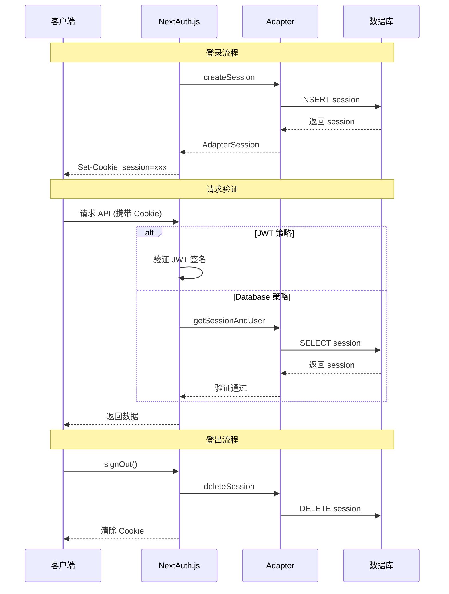
```mermaid
sequenceDiagram
    participant Client as 客户端
    participant NextAuth as NextAuth.js
    participant Adapter as Adapter
    participant DB as 数据库

    Note over Client,DB: 登录流程
    NextAuth->>Adapter: createSession
    Adapter->>DB: INSERT session
    DB-->>Adapter: 返回 session
    Adapter-->>NextAuth: AdapterSession
    NextAuth-->>Client: Set-Cookie: session=xxx

    Note over Client,DB: 请求验证
    Client->>NextAuth: 请求 API (携带 Cookie)
    alt JWT 策略
        NextAuth->>NextAuth: 验证 JWT 签名
    else Database 策略
        NextAuth->>Adapter: getSessionAndUser
        Adapter->>DB: SELECT session
        DB-->>Adapter: 返回 session
        Adapter-->>NextAuth: 验证通过
    end
    NextAuth-->>Client: 返回数据

    Note over Client,DB: 登出流程
    Client->>NextAuth: signOut()
    NextAuth->>Adapter: deleteSession
    Adapter->>DB: DELETE session
    NextAuth-->>Client: 清除 Cookie
```

---

## 用户数据处理流程

### 新用户注册流程

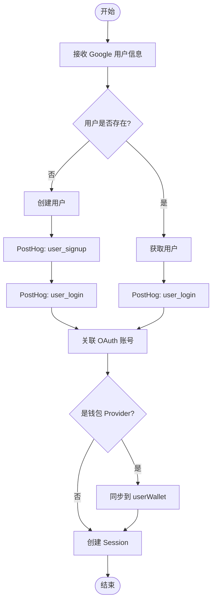
```mermaid
flowchart TB
    Start(["开始"]) --> Receive["接收 Google 用户信息"]
    Receive --> CheckExist{"用户是否存在?"}
    
    CheckExist -->|否| CreateUser["创建用户"]
    CreateUser --> CaptureSignup["PostHog: user_signup"]
    CaptureSignup --> CaptureLogin["PostHog: user_login"]
    CaptureLogin --> LinkAccount["关联 OAuth 账号"]
    
    CheckExist -->|是| GetUser["获取用户"]
    GetUser --> CaptureLogin2["PostHog: user_login"]
    CaptureLogin2 --> LinkAccount
    
    LinkAccount --> SyncWallet{"是钱包 Provider?"}
    SyncWallet -->|是| CreateWallet["同步到 userWallet"]
    SyncWallet -->|否| CreateSession
    CreateWallet --> CreateSession["创建 Session"]
    CreateSession --> EndFlow(["结束"])
```

### 用户信息映射

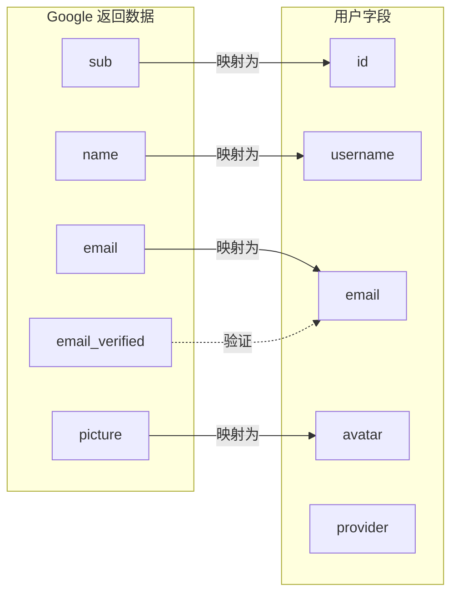
```mermaid
flowchart LR
    subgraph GoogleData["Google 返回数据"]
        GSub["sub"]
        GName["name"]
        GEmail["email"]
        GPicture["picture"]
        GVerified["email_verified"]
    end

    subgraph UserFields["用户字段"]
        UId["id"]
        UUsername["username"]
        UEmail["email"]
        UAvatar["avatar"]
        UProvider["provider"]
    end

    GSub -->|映射为| UId
    GName -->|映射为| UUsername
    GEmail -->|映射为| UEmail
    GPicture -->|映射为| UAvatar
    GVerified -.->|验证| UEmail
```

---

## 钱包用户绑定/解绑 Google 账户

### 功能概述

支持已使用钱包登录的用户绑定 Google 账户，实现多方式登录。用户可以在个人资料页面管理已绑定的 SSO 提供商。

### 绑定流程架构

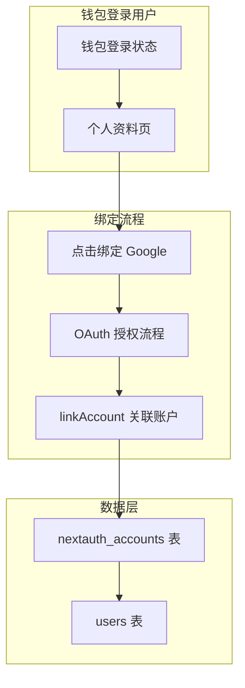
```mermaid
flowchart TB
    subgraph WalletUser["钱包登录用户"]
        direction TB
        WalletLogin["钱包登录状态"]
        ProfilePage["个人资料页"]
    end

    subgraph BindFlow["绑定流程"]
        direction TB
        ClickBind["点击绑定 Google"]
        OAuthFlow["OAuth 授权流程"]
        LinkAccount["linkAccount 关联账户"]
    end

    subgraph DataLayer["数据层"]
        UserTable["users 表"]
        AccountTable["nextauth_accounts 表"]
    end

    WalletLogin --> ProfilePage
    ProfilePage --> ClickBind
    ClickBind --> OAuthFlow
    OAuthFlow --> LinkAccount
    LinkAccount --> AccountTable
    AccountTable --> UserTable
```

### 绑定流程时序图

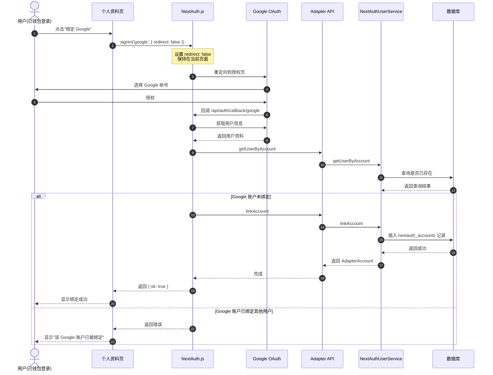
```mermaid
sequenceDiagram
    autonumber
    actor User as 用户(已钱包登录)
    participant Profile as 个人资料页
    participant NextAuth as NextAuth.js
    participant Google as Google OAuth
    participant Adapter as Adapter API
    participant Service as NextAuthUserService
    participant DB as 数据库

    User->>Profile: 点击"绑定 Google"
    Profile->>NextAuth: signIn('google', { redirect: false })
    Note over NextAuth: 设置 redirect: false<br/>保持在当前页面
    
    NextAuth->>Google: 重定向到授权页
    Google->>User: 选择 Google 账号
    User->>Google: 授权
    Google->>NextAuth: 回调 /api/auth/callback/google
    
    NextAuth->>Google: 获取用户信息
    Google-->>NextAuth: 返回用户资料
    
    NextAuth->>Adapter: getUserByAccount
    Adapter->>Service: getUserByAccount
    Service->>DB: 查询是否已存在
    DB-->>Service: 返回查询结果
    
    alt Google 账户未绑定
        NextAuth->>Adapter: linkAccount
        Adapter->>Service: linkAccount
        Service->>DB: 插入 nextauth_accounts 记录
        DB-->>Service: 返回成功
        Service-->>Adapter: 返回 AdapterAccount
        Adapter-->>NextAuth: 完成
        NextAuth-->>Profile: 返回 { ok: true }
        Profile-->>User: 显示绑定成功
    else Google 账户已绑定其他用户
        NextAuth-->>Profile: 返回错误
        Profile-->>User: 显示"该 Google 账户已被绑定"
    end
```

### 解绑流程时序图

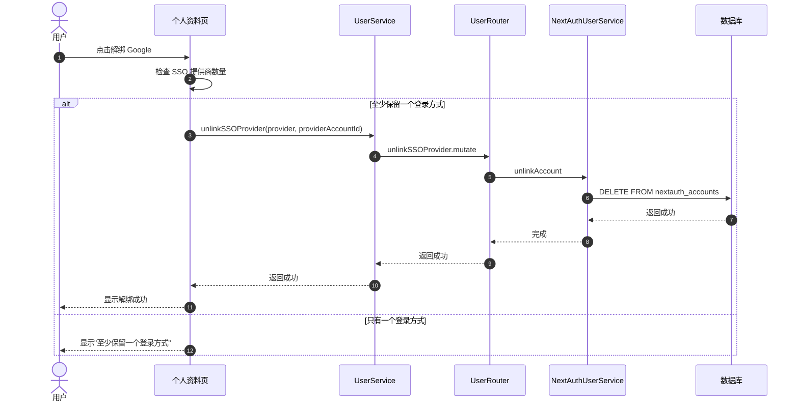
```mermaid
sequenceDiagram
    autonumber
    actor User as 用户
    participant Profile as 个人资料页
    participant UserService as UserService
    participant UserRouter as UserRouter
    participant NextAuthService as NextAuthUserService
    participant DB as 数据库

    User->>Profile: 点击解绑 Google
    Profile->>Profile: 检查 SSO 提供商数量
    
    alt 至少保留一个登录方式
        Profile->>UserService: unlinkSSOProvider(provider, providerAccountId)
        UserService->>UserRouter: unlinkSSOProvider.mutate
        UserRouter->>NextAuthService: unlinkAccount
        NextAuthService->>DB: DELETE FROM nextauth_accounts
        DB-->>NextAuthService: 返回成功
        NextAuthService-->>UserRouter: 完成
        UserRouter-->>UserService: 返回成功
        UserService-->>Profile: 返回成功
        Profile-->>User: 显示解绑成功
    else 只有一个登录方式
        Profile-->>User: 显示"至少保留一个登录方式"
    end
```

### 数据模型关系

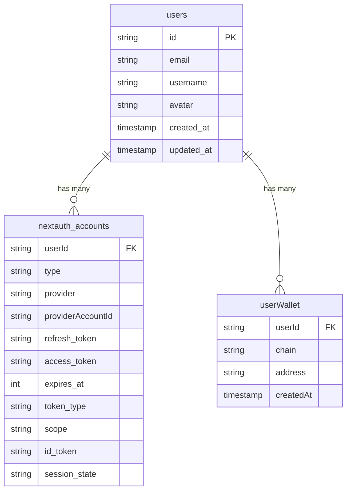
```mermaid
erDiagram
    users {
        string id PK
        string email
        string username
        string avatar
        timestamp created_at
        timestamp updated_at
    }
    
    nextauth_accounts {
        string userId FK
        string type
        string provider
        string providerAccountId
        string refresh_token
        string access_token
        int expires_at
        string token_type
        string scope
        string id_token
        string session_state
    }
    
    userWallet {
        string userId FK
        string chain
        string address
        timestamp createdAt
    }

    users ||--o{ nextauth_accounts : "has many"
    users ||--o{ userWallet : "has many"
```

### 关键接口设计

#### 1. 获取已绑定的 SSO 提供商

**接口**: `user.getUserSSOProviders`

**说明**: 查询当前用户已绑定的所有 SSO 提供商列表（包括钱包和 Google 等 OAuth 提供商）

**返回数据**:
```typescript
Array<{
  provider: string;           // 提供商名称，如 "google", "tronlink"
  providerAccountId: string;  // 提供商账户 ID
  type: string;               // 账户类型，如 "oauth"
  expires_at?: number;        // 过期时间戳
}>
```

#### 2. 解绑 SSO 提供商

**接口**: `user.unlinkSSOProvider`

**输入参数**:
```typescript
{
  provider: string;           // 提供商名称
  providerAccountId: string;  // 提供商账户 ID
}
```

**安全校验**:
- 验证账户是否属于当前用户
- 确保至少保留一个登录方式（防止用户无法登录）

#### 3. 绑定 Google 账户

**接口**: 复用 NextAuth.js 的 `signIn('google')` 方法

**特殊配置**:
```typescript
// 绑定模式下使用 redirect: false，避免页面跳转
await signIn('google', { 
  redirect: false,
  // 可选：传递当前用户 ID 用于关联
  authorization: {
    params: {
      state: JSON.stringify({ bindMode: true, userId: currentUserId })
    }
  }
})
```

### 前端组件架构

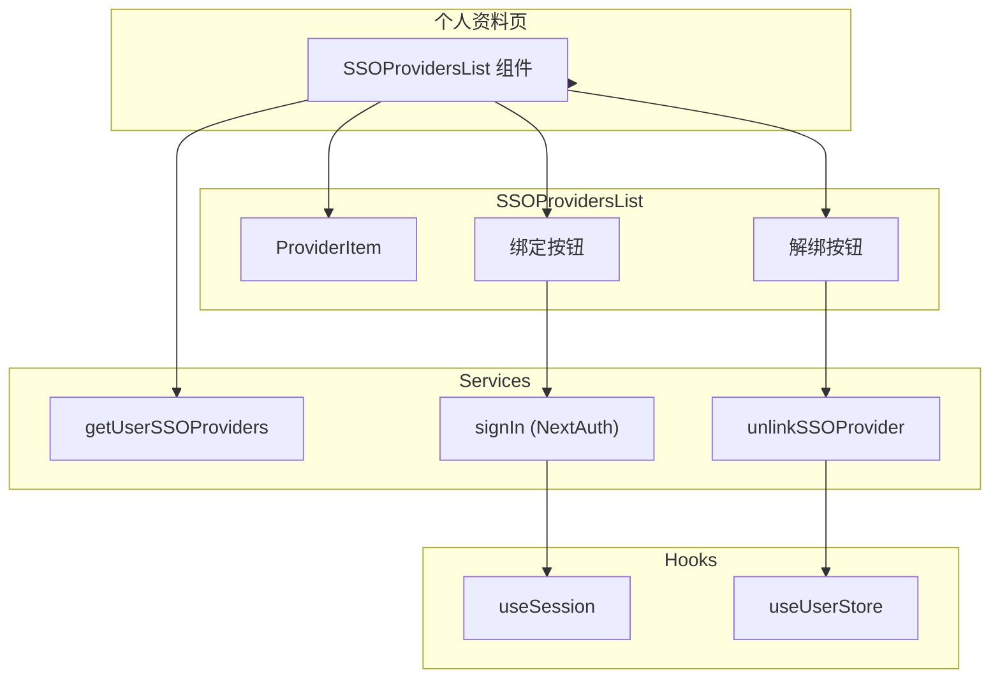
```mermaid
flowchart TB
    subgraph ProfilePage["个人资料页"]
        SSOProvidersList["SSOProvidersList 组件"]
    end

    subgraph SSOProvidersListComponent["SSOProvidersList"]
        ProviderItem["ProviderItem"]
        BindButton["绑定按钮"]
        UnlinkButton["解绑按钮"]
    end

    subgraph Hooks["Hooks"]
        useSession["useSession"]
        useUserStore["useUserStore"]
    end

    subgraph Services["Services"]
        getUserSSOProviders["getUserSSOProviders"]
        unlinkSSOProvider["unlinkSSOProvider"]
        signIn["signIn (NextAuth)"]
    end

    ProfilePage --> SSOProvidersList
    SSOProvidersList --> ProviderItem
    SSOProvidersList --> BindButton
    SSOProvidersList --> UnlinkButton
    
    BindButton --> signIn
    UnlinkButton --> unlinkSSOProvider
    SSOProvidersList --> getUserSSOProviders
    
    signIn --> useSession
    unlinkSSOProvider --> useUserStore
```

### 绑定状态管理

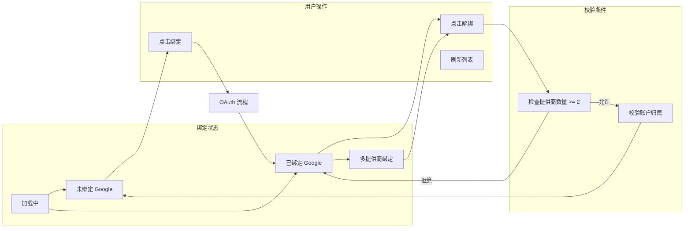
```mermaid
flowchart LR
    subgraph States["绑定状态"]
        Loading["加载中"]
        NoGoogle["未绑定 Google"]
        Bound["已绑定 Google"]
        Multiple["多提供商绑定"]
    end

    subgraph Actions["用户操作"]
        Bind["点击绑定"]
        Unlink["点击解绑"]
        Refresh["刷新列表"]
    end

    subgraph Conditions["校验条件"]
        CheckCount["检查提供商数量 >= 2"]
        CheckAccount["校验账户归属"]
    end

    Loading --> NoGoogle
    Loading --> Bound
    NoGoogle --> Bind
    Bind --> OAuthFlow["OAuth 流程"]
    OAuthFlow --> Bound
    Bound --> Unlink
    Unlink --> CheckCount
    CheckCount -->|允许| CheckAccount
    CheckCount -->|拒绝| Bound
    CheckAccount --> NoGoogle
    
    Bound --> Multiple
    Multiple --> Unlink
```

### 安全考虑

1. **账户归属验证**: 解绑时必须验证 providerAccountId 属于当前用户
2. **最少登录方式**: 至少保留一个 SSO 提供商，防止用户被锁定
3. **重复绑定检查**: 一个 Google 账户只能绑定到一个用户
4. **会话保持**: 绑定过程中保持当前登录会话

---

## 配置管理

### 环境变量配置

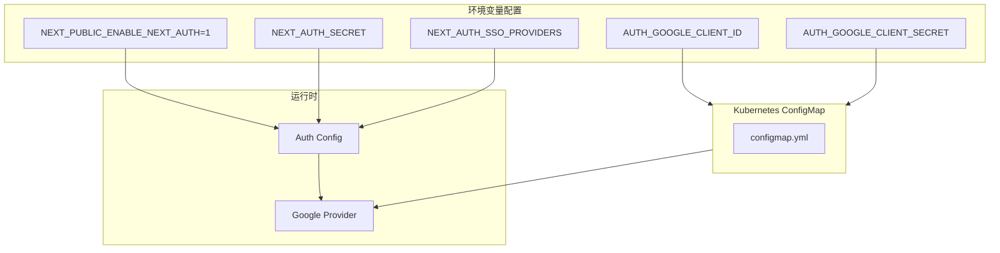
```mermaid
flowchart TB
    subgraph EnvConfig["环境变量配置"]
        EnableAuth["NEXT_PUBLIC_ENABLE_NEXT_AUTH=1"]
        Secret["NEXT_AUTH_SECRET"]
        Providers["NEXT_AUTH_SSO_PROVIDERS"]
        GoogleClientID["AUTH_GOOGLE_CLIENT_ID"]
        GoogleClientSecret["AUTH_GOOGLE_CLIENT_SECRET"]
    end

    subgraph K8sConfig["Kubernetes ConfigMap"]
        ConfigMap["configmap.yml"]
    end

    subgraph Runtime["运行时"]
        AuthConfig["Auth Config"]
        GoogleProvider["Google Provider"]
    end

    EnableAuth --> AuthConfig
    Secret --> AuthConfig
    Providers --> AuthConfig
    GoogleClientID --> K8sConfig
    GoogleClientSecret --> K8sConfig
    K8sConfig --> GoogleProvider
    AuthConfig --> GoogleProvider
```

---

## 安全设计

### 安全机制

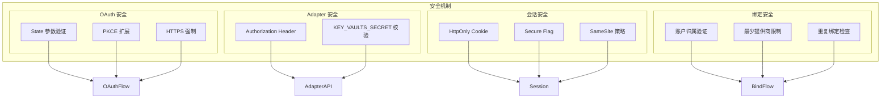
```mermaid
flowchart TB
    subgraph Security["安全机制"]
        direction TB
        
        subgraph OAuthSecurity["OAuth 安全"]
            StateParam["State 参数验证"]
            PKCE["PKCE 扩展"]
            HTTPS["HTTPS 强制"]
        end

        subgraph AdapterSecurity["Adapter 安全"]
            AuthHeader["Authorization Header"]
            KVSecret["KEY_VAULTS_SECRET 校验"]
        end

        subgraph SessionSecurity["会话安全"]
            HttpOnly["HttpOnly Cookie"]
            Secure["Secure Flag"]
            SameSite["SameSite 策略"]
        end
        
        subgraph BindSecurity["绑定安全"]
            AccountOwner["账户归属验证"]
            MinProvider["最少提供商限制"]
            DuplicateCheck["重复绑定检查"]
        end
    end

    StateParam --> OAuthFlow
    PKCE --> OAuthFlow
    HTTPS --> OAuthFlow
    
    AuthHeader --> AdapterAPI
    KVSecret --> AdapterAPI
    
    HttpOnly --> Session
    Secure --> Session
    SameSite --> Session
    
    AccountOwner --> BindFlow
    MinProvider --> BindFlow
    DuplicateCheck --> BindFlow
```

---


## 相关资源

- [Google OAuth 文档](https://developers.google.com/identity/protocols/oauth2)
- [Google Cloud Console](https://console.cloud.google.com/)
- [NextAuth.js Google 提供商](https://next-auth.js.org/providers/google)
- [认证方式概览](../api/RESTful/auth-overview.md)
- [Wallet 钱包管理接口](../api/tRPC/lambda/wallet.md)

---

最后更新: 2026-03-17
