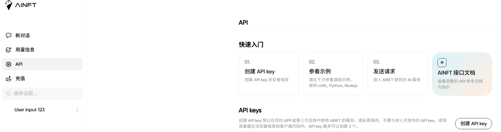
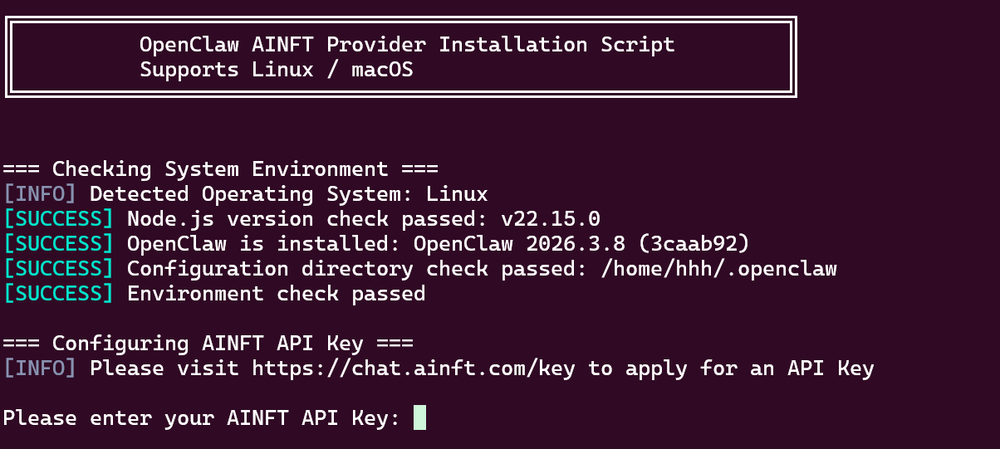
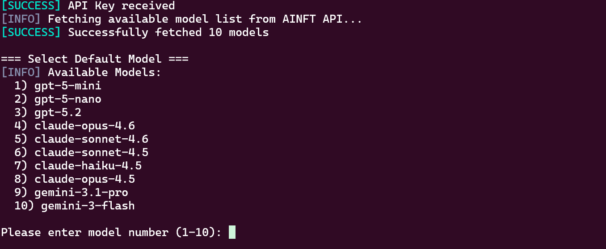
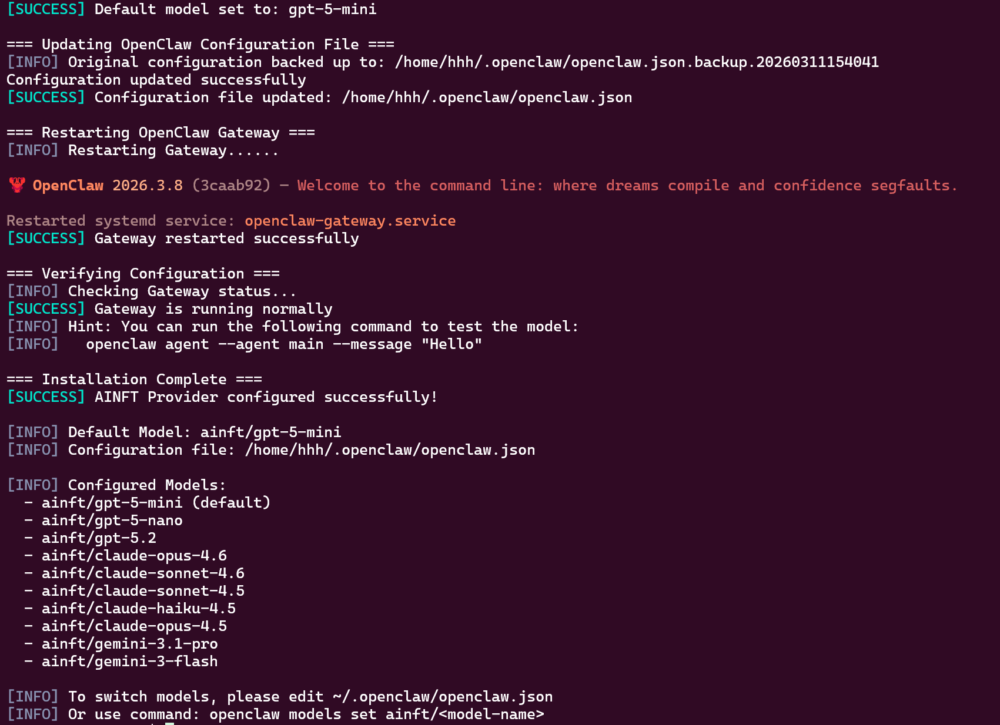

# OpenClaw 接入 AINFT 保姆级教程

本文档详细介绍如何将 OpenClaw 工具配置为使用 AINFT API 进行代理调用。

---

## 快速开始

### 正式环境（暂未发布）

**Linux & macOS:**

```bash
curl https://api.ainft.com/scripts/openclaw/install-ainft-provider.sh | bash
```

**Windows PowerShell:**

```powershell
iwr https://api.ainft.com/scripts/openclaw/install-ainft-provider.ps1 | iex
```

---

### 测试阶段

**Linux & macOS:**

```bash
curl https://raw.githubusercontent.com/RudolphHuang/openclaw_doc/refs/heads/main/scripts/openclaw/install-ainft-provider.sh | bash
```

**Windows PowerShell:**

```powershell
iwr https://raw.githubusercontent.com/RudolphHuang/openclaw_doc/refs/heads/main/scripts/openclaw/install-ainft-provider.ps1 | iex
```

---

## 详细步骤

### 1. 申请 API Key

1. 登录 [AINFT 聊天平台](https://chat.ainft.com/)
2. 进入 [API Key 管理页面](https://chat.ainft.com/key)
3. 点击申请新的 API Key



---

### 2. 运行安装脚本

根据你的操作系统，执行上面的对应命令。脚本会自动：

- 检查环境（Node.js、OpenClaw 等）
- 提示输入 API Key



---

### 3. 选择默认模型

验证 API Key 有效后，脚本会获取可用模型列表并让你选择默认模型：



---

### 4. 完成配置

选择完成后，脚本会自动：

- 备份原有配置
- 更新 OpenClaw 配置文件
- 重启 Gateway



---

## 兼容性测试

| 操作系统 | 状态 |
|---------|------|
| Ubuntu 24.04 | ✅ 通过 |
| Windows 11 PowerShell | ✅ 通过 |
| macOS 15 | 🔄 测试中 |

---

## 常见问题

**Q: 脚本执行失败怎么办？**

A: 请确保：
1. 已安装 Node.js 22 或更高版本
2. 已安装并初始化 OpenClaw（运行过 `openclaw onboard`）
3. 网络连接正常，可以访问 AINFT API

**Q: 如何切换模型？**

A: 使用命令：
```bash
openclaw models set ainft/<模型名称>
```

或手动编辑 `~/.openclaw/openclaw.json` 配置文件。
